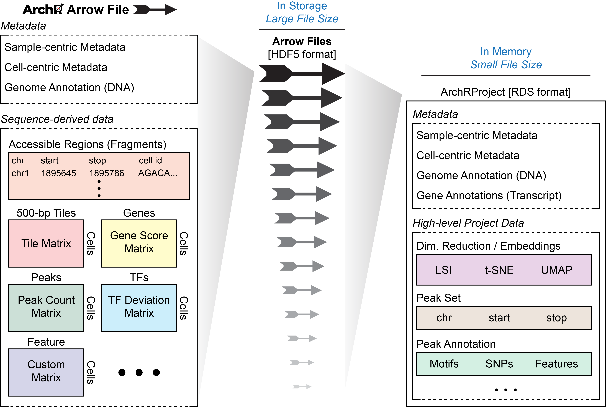
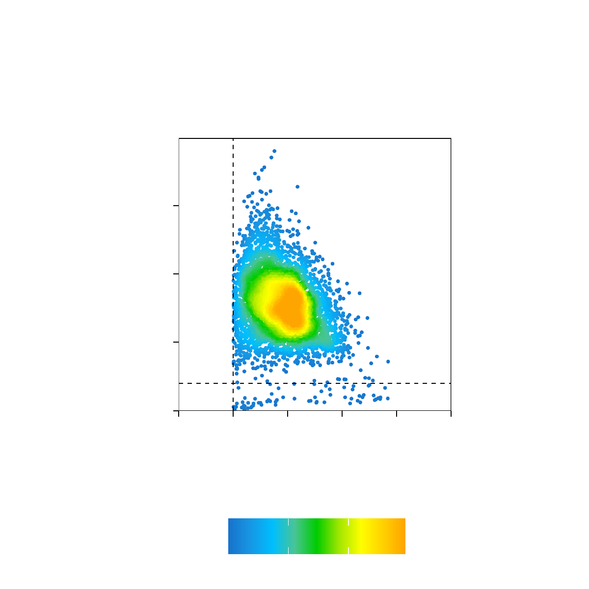
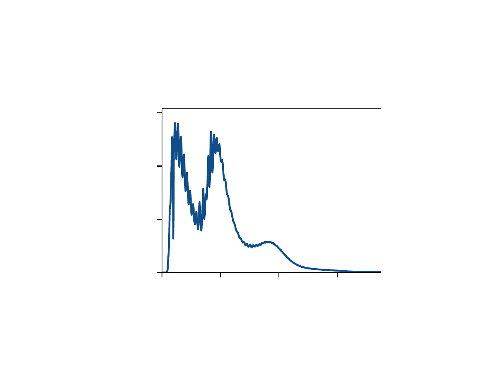
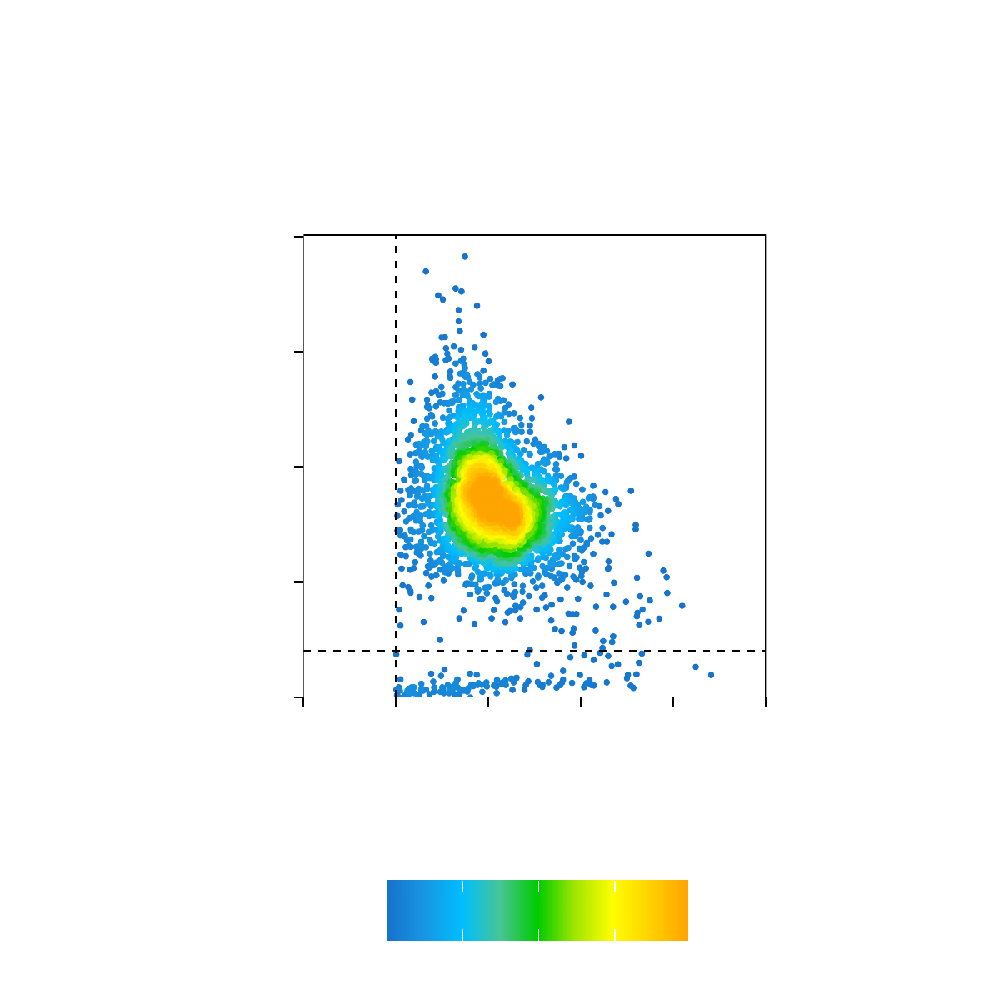
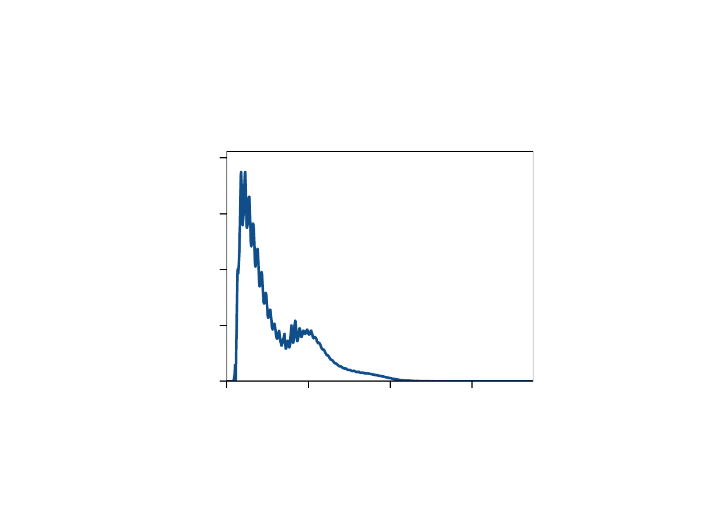
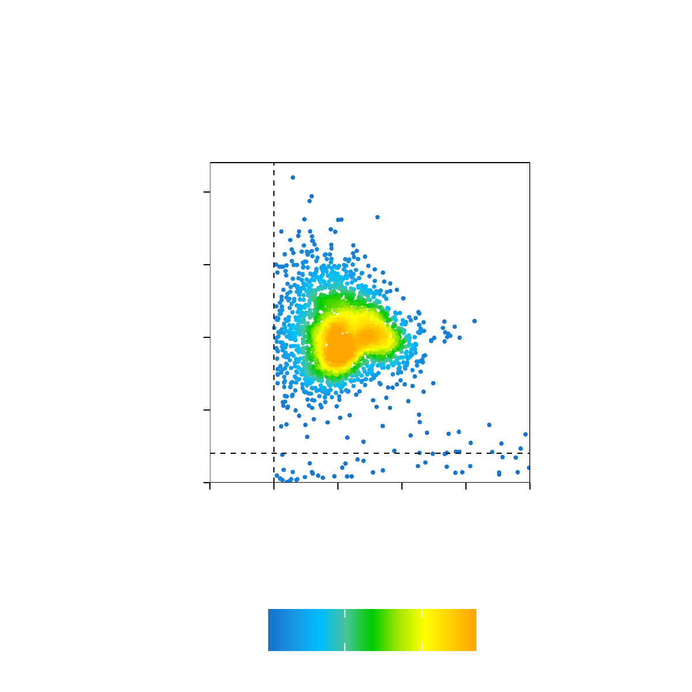

---
output:
  html_document:
    theme: yeti  # many options for theme, this one is my favorite.
params:
  threads: 20
  rdata: ""
  token: ""
  ref: ""
  out: ""
---

```{r, include=FALSE, eval=FALSE}
# params2 <- params
# unlockBinding("params", env = .GlobalEnv)
# #load("Chapter-13-Footprints.Rdata")
# load(params$rdata)
# params <- params2
# rm(params2)
devtools::install_github("GreenleafLab/ArchR", 
  auth_token = params$token, 
  ref = params$ref,
  repos = BiocManager::repositories(),
  dependencies = FALSE
)
library(ArchR)
fn <- unclass(lsf.str(envir = asNamespace("ArchR"), all = TRUE))
fn <- fn[!grepl("\\.", fn)]
fn <- fn[fn!="ArchRProj"]
for (i in seq_along(fn)){
    tryCatch({
        eval(parse(text = paste0(fn[i], "<-ArchR::", fn[i])))
    }, error = function(x) {
    })
}
addArchRThreads(threads = params$threads)
addArchRGenome("hg19")
# fn <- unclass(lsf.str(envir = asNamespace("ArchR"), all = TRUE))
# fn <- fn[fn!="ArchRProj"]
# for (i in seq_along(fn)) {
#     tryCatch({
#         eval(parse(text = paste0(fn[i], "<-ArchR:::", fn[i])))
#     }, error = function(x) {
#     })
# }
set.seed(1)
```

# Getting Started with ArchR

This chapter will introduce you to how to import data into ArchR and how to create ArrowFiles, the base unit of ArchR analysis.

## A Brief Primer on ATAC-seq Terminology

The most fundamental component of any ATAC-seq experiment is a "__fragment__". In ATAC-seq, a fragment refers to a sequenceable DNA molecule created by two transposition events. Each end of that fragment is sequenced using paired-end sequencing. The inferred single-base position of the start and end of the fragment is adjusted based on the insertion offset of Tn5. As reported previously, Tn5 transposase binds to DNA as a homodimer with 9-bp of DNA between the two Tn5 molecules. Because of this, each Tn5 homodimer binding event creates two insertions, separated by 9 bp. Thus, the actual central point of the “accessible” site is in the very center of the Tn5 dimer, not the location of each Tn5 insertion. To account for this, we apply an offset to the individual Tn5 insertions, adjusting plus-stranded insertion events by +4 bp and minus-stranded insertion events by -5 bp. This is consistent with the convention put forth during [the original description of ATAC-seq](https://www.ncbi.nlm.nih.gov/pubmed/24097267). Thus, in ArchR, “__fragments__” refers to a table or genomic ranges object containing the chromosome, offset-adjusted single-base chromosome start position, offset-adjusted single-base chromosome end position, and unique cellular barcode ID corresponding to each sequenced fragment. Similarly, "__insertions__" refer to the offset-adjusted single-base position at the very center of an accessible site.

## Why use ArchR?

There are multiple tools for single-cell ATAC-seq analysis out there so why should you use ArchR? Most importantly, ArchR provides features and enables analyses that other tools do not:

<center>
{width=700px}
</center>

Additionally, ArchR is faster and uses less memory than other available tools due to heavy optimization of the data structures and parallelization methods that form the basis of the ArchR software. When analyzing more than 70,000 cells, some tools require high-performance computing environments, exceeding 128 GB of available memory (OoM = out of memory).

<center>
{width=700px}
</center>

ArchR is designed to be used on a Unix-based laptop. For experiments of moderate size (fewer than 100,000 cells), ArchR is fast enough to perform ad hoc analysis and visualize results in real time, making it possible to interact with the data in a more in-depth and biologically meaningful way. Of course, for higher cell numbers or for users that prefer server-based analysis, ArchR provides fascile export of plots and projects that can be downloaded and used after generation on a server.

__Currently, ArchR is not optimized to run on Windows__. It should work but parallelization in ArchR has not been enabled for Windows so the performance gains mentioned above will not translate. 

## What is an Arrow file / `ArchRProject`?

The base unit of an analytical project in ArchR is called an Arrow file. Each Arrow file stores all of the data associated with an individual sample (i.e. metadata, accessible fragments, and data matrices). Here, an "individual sample" would be the most detailed unit of analysis desired (for ex. a single replicate of a particular condition). During creation and as additional analyses are performed, ArchR updates and edits each Arrow file to contain additional layers of information.
It is worth noting that, to ArchR, an Arrow file is actually just a path to an external file stored on disk. More explicitly, an Arrow file is not an R-language object that is stored in memory but rather an HDF5-format file stored on disk. Because of this, we use an `ArchRProject` object to associate these Arrow files together into a single analytical framework that can be rapidly accessed in R. This `ArchRProject` object is small in size and is stored in memory.

<center>
{width=700px}
</center>

Certain actions can be taken directly on Arrow files while other actions are taken on an `ArchRProject` which in turn updates each associated Arrow file. Because Arrow files are stored as large HDF5-format files, "get-er" functions in ArchR retrieve data by interacting with the `ArchRProject` while "add-er" functions either (i) add data directly to Arrow files, (ii) add data directly to an `ArchRProject`, or (iii) add data to Arrow files by interacting with an `ArchRProject`.

<center>
{width=400px}
</center>

## Input File Types in ArchR

ArchR can utilize multiple input formats of scATAC-seq data which is most frequently in the format of fragment files and BAM files. Fragment files are tabix-sorted text files containing each scATAC-seq fragment and the corresponding cell ID, one fragment per line. BAM files are binarized tabix-sorted files that contain each scATAC-seq fragment, raw sequence, cellular barcode id and other information. The input format used will depend on the pre-processing pipeline used. For example, the 10x Genomics Cell Ranger software returns fragment files while sci-ATAC-seq applications would use BAM files. ArchR uses “scanTabix” to read fragment files and “scanBam” to read BAM files. During this input process, inputs are chunked and each input chunk is converted into a compressed table-based representation of fragments containing each fragment chromosome, offset-adjusted chromosome start position, offset-adjusted chromosome end position, and cellular barcode ID. These chunk-wise fragments are then stored in a temporary HDF5-formatted file to preserve memory usage while maintaining rapid access to each chunk. Finally, all chunks associated with each chromosome are read, organized, and re-written to an Arrow file within a single HDF5 group called “fragments”. This pre-chunking procedure enables ArchR to process extremely large input files efficiently and with low memory usage, enabling full utilization of parallel processing.

## Getting Set Up

The first thing we do is change to our desired our working directory, set the number of threads we would like to use, and load our gene and genome annotations. Depending on the configuration of your local environment, you may need to modify the number of `threads` used below in `addArchRThreads()`. By default ArchR uses half of the total number of `threads` available but you can adjust this manually as you see fit. If you are using Windows, the usable `threads` will automatically be set to 1 because the parallel processing in ArchR is built for Unix-based operating systems.

First, we load the ArchR library. If this fails, you have not properly installed ArchR and should [revisit the installation instructions](https://www.archrproject.com/index.html).
```{r eval=FALSE}
library(ArchR)
```
Next, we set the default number of threads for ArchR functions. This is something you will have to do during each new R session. We recommend setting `threads` to 1/2 to 3/4 of the total available cores. The memory usage in ArchR will often scale with the number of threads used so allowing ArchR to use more threads will also lead to higher memory usage.
```{r eval=FALSE}
addArchRThreads(threads = 16) 
```
> \## Setting default number of Parallel threads to 16.

Then, we set the genome to be used for gene and genome annotations. As above, this is something you will have to do during each new R session. Of course, this genome version must match the genome version that was used for alignment. For the data used in this tutorial, we will use the hg19 reference genome but ArchR natively supports additional genome annotations and custome genome annotations as outlined in the next section.
```{r eval=FALSE}
addArchRGenome("hg19")
```
> \## Setting default genome to Hg19.
## Setting a Genome and GeneAnnotation

ArchR requires gene and genome annotations to do things such as calculate TSS enrichment scores, nucleotide content, and gene activity scores. Because our tutorial dataset uses scATAC-seq data that has already been aligned to the hg19 reference genome, we have set "hg19" as the default genome in the previous section. However, ArchR supports "hg19", "hg38", "mm9", and "mm10" natively and you can create your own genome and gene annotations using the `createGeneAnnotation()` and `createGenomeAnnotation()` functions.

```{r include=FALSE, eval=FALSE}
#JJJ All of these sections lacked an explanation of where the gene annotations are from. I added this information but please check.
```

Providing this information to ArchR is streamlined through the `addArchRGenome()` function. This function tells ArchR that, for all analyses in the current session, it should use the `genomeAnnotation` and `geneAnnotation` associated with the defined `ArchRGenome`. Each of the natively supported genomes are composed of a `BSgenome` object that defines the genomic coordinates and sequence of each chromosome, a `GRanges` object containing a set of blacklisted regions, a `TxDb` object that defines the positions and structures of all genes, and an `OrgDb` object that provides a central gene identifier and contains mappings between this identifier and other kinds of identifiers.

Below are examples of how to load gene and genome annotations for the natively supported genomes as well as information on their `BSgenome` and blacklist components. 

<hr>

The precompiled version of the __hg19__ genome in ArchR uses `BSgenome.Hsapiens.UCSC.hg19`, `TxDb.Hsapiens.UCSC.hg19.knownGene`, `org.Hs.eg.db`, and a blacklist that was merged using `ArchR::mergeGR()` from the [hg19 v2 blacklist regions](https://github.com/Boyle-Lab/Blacklist/blob/master/lists/hg19-blacklist.v2.bed.gz) and from [mitochondrial regions that show high mappability to the hg19 nuclear genome](https://github.com/caleblareau/mitoblacklist/blob/master/peaks/hg19_peaks.narrowPeak) from Caleb Lareau and Jason Buenrostro. To set a global genome default to the precompiled hg19 genome:

```{r eval=FALSE}
addArchRGenome("hg19")
```
> \## Setting default genome to Hg19.

<hr>

The precompiled version of the __hg38__ genome in ArchR uses `BSgenome.Hsapiens.UCSC.hg38`, `TxDb.Hsapiens.UCSC.hg38.knownGene`, `org.Hs.eg.db`, and a blacklist that was merged using `ArchR::mergeGR()` from the [hg38 v2 blacklist regions](https://github.com/Boyle-Lab/Blacklist/blob/master/lists/hg38-blacklist.v2.bed.gz) and from [mitochondrial regions that show high mappability to the hg38 nuclear genome](https://github.com/caleblareau/mitoblacklist/blob/master/peaks/hg38_peaks.narrowPeak) from Caleb Lareau and Jason Buenrostro. To set a global genome default to the precompiled hg38 genome:

```{r eval=FALSE}
addArchRGenome("hg38")
```
> \## Setting default genome to Hg38.

<hr>

The precompiled version of the __mm9__ genome in ArchR uses `BSgenome.Mmusculus.UCSC.mm9`, `TxDb.Mmusculus.UCSC.mm9.knownGene`, `org.Mm.eg.db`, and a blacklist that was merged using `ArchR::mergeGR()` from the [mm9 v1 blacklist regions](http://mitra.stanford.edu/kundaje/akundaje/release/blacklists/mm9-mouse/mm9-blacklist.bed.gz) from Anshul Kundaje and from [mitochondrial regions that show high mappability to the mm9 nuclear genome](https://github.com/caleblareau/mitoblacklist/blob/master/peaks/mm9_peaks.narrowPeak) from Caleb Lareau and Jason Buenrostro. To set a global genome default to the precompiled mm9 genome:

```{r eval=FALSE}
addArchRGenome("mm9")
```
> \## Setting default genome to Mm9.

<hr>

The precompiled version of the __mm10__ genome in ArchR uses `BSgenome.Mmusculus.UCSC.mm10`, `TxDb.Mmusculus.UCSC.mm10.knownGene`, `org.Mm.eg.db`, and a blacklist that was merged using `ArchR::mergeGR()` from the [mm10 v2 blacklist regions](https://github.com/Boyle-Lab/Blacklist/blob/master/lists/mm10-blacklist.v2.bed.gz) and from [mitochondrial regions that show high mappability to the mm10 nuclear genome](https://github.com/caleblareau/mitoblacklist/blob/master/peaks/mm10_peaks.narrowPeak) from Caleb Lareau and Jason Buenrostro. To set a global genome default to the precompiled mm10 genome:

```{r eval=FALSE}
addArchRGenome("mm10")
```
> \## Setting default genome to Mm10.

<hr>

### Creating a Custom `ArchRGenome`

As described above, an `ArchRGenome` consists of a genome annotation and a gene annotation.

To create a __custom genome annotation__, we use `createGenomeAnnotation()`. To do this, you will need the following information:

1. A `BSgenome` object which contains the sequence information for a genome. These are commonly Bioconductor packages (for example, `BSgenome.Hsapiens.UCSC.hg38`) that can be easily found with google.
2. A `GRanges` genomic ranges object containing a set of blacklisted regions that will be used to filter out unwanted regions from downstream analysis. This is not required but is recommended. For information on how blacklists are created, see the [publication on the ENCODE blacklists](https://www.ncbi.nlm.nih.gov/pubmed/31249361).

For example, if we wanted to create a custom genome annotation from Drosophila melanogaster, we would first identify and install and load the relevant `BSgenome` object.
```{r eval=FALSE}
if (!requireNamespace("BSgenome.Dmelanogaster.UCSC.dm6", quietly = TRUE)){
  BiocManager::install("BSgenome.Dmelanogaster.UCSC.dm6")
}
library(BSgenome.Dmelanogaster.UCSC.dm6)
```
> \## Loading required package: BSgenome  
## Loading required package: Biostrings  
## Loading required package: XVector  
## Attaching package: 'Biostrings'  
## The following object is masked from 'package:base': strsplit  

Then we create a genome annotation from this `BSgenome` object.
```{r eval=FALSE}
genomeAnnotation <- createGenomeAnnotation(genome = BSgenome.Dmelanogaster.UCSC.dm6)
```
> \## Getting genome..  
## Getting chromSizes..  
## Getting blacklist..  
## Blacklist not downloaded! Continuing without, be careful for downstream biases..  

Examining this object shows the constituent parts of an ArchR genome annotation.
```{r eval=FALSE}
genomeAnnotation
```
> \## List of length 3  
## names(3): genome chromSizes blacklist  

To create a __custom gene annotation__, we use `createGeneAnnotation()`. To do this, you will need the following information:

1. A `TxDb` object (transcript database) from Bioconductor which contains information for gene/transcript coordinates.
2. An `OrgDb` object (organism database) from Bioconductor which provides a unified framework to map between gene names and various gene identifiers.

Continuing with out example from Drosophila melanogaster, we first install and load the relevant `TxDb` and `OrgDb` objects.
```{r eval=FALSE}
if (!requireNamespace("TxDb.Dmelanogaster.UCSC.dm6.ensGene", quietly = TRUE)){
  BiocManager::install("TxDb.Dmelanogaster.UCSC.dm6.ensGene")
}
if (!requireNamespace("org.Dm.eg.db", quietly = TRUE)){
  BiocManager::install("org.Dm.eg.db")
}
library(TxDb.Dmelanogaster.UCSC.dm6.ensGene)
```
> \## Loading required package: GenomicFeatures  
## Loading required package: AnnotationDbi  
```{r eval=FALSE}
library(org.Dm.eg.db)
```
Then we create the gene annotation object.
```{r eval=FALSE}
geneAnnotation <- createGeneAnnotation(TxDb = TxDb.Dmelanogaster.UCSC.dm6.ensGene, OrgDb = org.Dm.eg.db)
```
> \## Getting Genes..  
## Determined Annotation Style = ENSEMBL  
## Getting Exons..  
## Getting TSS..  

Examining this object shows the constituent parts of an ArchR gene annotation.
```{r eval=FALSE}
geneAnnotation
```
> \## List of length 3  
## names(3): genes exons TSS  

Alternatively, if you dont have a `TxDb` and `OrgDb` object, you can create a `geneAnnotation` object from the following information :

1. A "genes" object - a `GRanges` object containing gene coordinates (start to end). This object must have a symbols column matching the symbols column of the "exons" object described below.
2. An "exons" object - `GRanges` object containing gene exon coordinates. Must have a symbols column matching the symbols column of the "genes" object described above.
3. A `GRanges` object containing standed transcription start site (`TSS`) coordinates.

```{r include=FALSE, eval=FALSE}
#JJJ Is the TSS object used for anything other than TSS scores? If so, shouldnt it have a symbols column as well? Either way, we should add that info to point #3
```

```{r eval=FALSE}
geneAnnotation <- createGeneAnnotation(
  TSS = geneAnnotation$TSS, 
  exons = geneAnnotation$exons, 
  genes = geneAnnotation$genes
)
```

### Using Non-standard Genomes in ArchR

ArchR implements some checks to prevent you from doing things that we consider "out of the norm". One of these checks forces the `seqnames` of your genome annotation to start with "chr". This is true in most applications but there are some genomes (for example Maize) which do not use "chr" as a prefix for the different chromosomes. To perform any ArchR analyses on such a genome, you have to tell ArchR to ignore the chromosome prefixes. To do this, you must run `addArchRChrPrefix(chrPrefix = FALSE)` prior to creating your Arrow files. This will turn off the requirement for "chr" prefixes on seqnames globally in the current R session. Please keep in mind ArchR converts chromosome/seqnames to character by default. Thus, if your `seqnames` are just integers, you will need to supply them as characters i.e. `useSeqnames = c("1", "2", "3")` instead of `useSeqnames = c(1, 2, 3)`. You can always check if chromosome prefixes are required in the current R session using `getArchRChrPrefix()`.

## Creating Arrow Files

For the remainder of this tutorial, we will use data from a downsampled dataset of hematopoietic cells from [Granja* et al. Nature Biotechnology 2019](https://www.ncbi.nlm.nih.gov/pubmed/31792411). This includes data from bone marrow mononuclear cells (BMMC), peripheral blood mononuclear cells (PBMC), and CD34+ hematopoietic stem and progenitor cells from bone marrow (CD34 BMMC).

This data is downloaded as fragment files which contain the start and end genomic coordinates of all aligned sequenced fragments. Fragment files are one of the base file types of the 10x Genomics analytical platform (and other platforms) and can be easily created from any BAM file. See the [10x Genomics website](https://support.10xgenomics.com/single-cell-atac/software/pipelines/latest/output/fragments) for information on making your own fragment files for input to ArchR.

Once we have our fragment files, we provide their paths as a character vector to `createArrowFiles()`. During creation, some basic metadata and matrices are added to each Arrow file including a "TileMatrix" containing insertion counts across genome-wide 500-bp bins (see `addTileMatrix()`) and a "GeneScoreMatrix" that stores predicted gene expression based on weighting insertion counts in tiles nearby a gene promoter (see `addGeneScoreMatrix()`).

The tutorial data can be downloaded using the `getTutorialData()` function. The tutorial data is approximately 0.5 GB in size. If you have already downloaded the tutorial in the current working directory, ArchR will bypass downloading.
```{r eval=FALSE}
library(ArchR)

inputFiles <- getTutorialData("Hematopoiesis")
inputFiles
```
> \##                                       scATAC_BMMC_R1  
##      "HemeFragments/scATAC_BMMC_R1.fragments.tsv.gz"  
##                                  scATAC_CD34_BMMC_R1  
## "HemeFragments/scATAC_CD34_BMMC_R1.fragments.tsv.gz"  
##                                       scATAC_PBMC_R1  
##      "HemeFragments/scATAC_PBMC_R1.fragments.tsv.gz"  

As always, before starting a project we must set the `ArchRGenome` and default `threads` for parallelization.
```{r eval=FALSE}
addArchRGenome("hg19")
```
> \## Setting default genome to Hg19.  
```{r eval=FALSE}
addArchRThreads(threads = 16) 
```
> \## Setting default number of Parallel threads to 16.  

Now we will create our Arrow Files which will take 10-15 minutes. For each sample, this step will:

1. Read accessible fragments from the provided input files.
2. Calculate quality control information for each cell (i.e. TSS enrichment scores and nucleosome info).
3. Filter cells based on quality control parameters.
4. Create a genome-wide TileMatrix using 500-bp bins.
5. Create a GeneScoreMatrix using the custom `geneAnnotation` that was defined when we called `addArchRGenome()`.

```{r eval=FALSE}
ArrowFiles <- createArrowFiles(
  inputFiles = inputFiles,
  sampleNames = names(inputFiles),
  filterTSS = 4, #Dont set this too high because you can always increase later
  filterFrags = 1000, 
  addTileMat = TRUE,
  addGeneScoreMat = TRUE
)
```
> \## Using GeneAnnotation set by addArchRGenome(Hg19)!  
## Using GeneAnnotation set by addArchRGenome(Hg19)!  
## ArchR logging to : ArchRLogs/ArchR-createArrows-dfa159ddbf6e-Date-2020-04-15_Time-09-21-27.log  
## If there is an issue, please report to github with logFile!  
## Cleaning Temporary Files  
## 2020-04-15 09:21:28 : Batch Execution w/ safelapply!, 0 mins elapsed.  
## ArchR logging successful to : ArchRLogs/ArchR-createArrows-dfa159ddbf6e-Date-2020-04-15_Time-09-21-27.log  

We can inspect the `ArrowFiles` object to see that it is actually just a character vector of Arrow file paths.
```{r eval=FALSE}
ArrowFiles
```
> \## "scATAC_BMMC_R1.arrow"      "scATAC_CD34_BMMC_R1.arrow"  
## "scATAC_PBMC_R1.arrow"  

## Per-cell Quality Control

Strict quality control (QC) of scATAC-seq data is essential to remove the contribution of low-quality cells. In ArchR, we consider three characteristics of data:

1. The number of unique nuclear fragments (i.e. not mapping to mitochondrial DNA).
2. The signal-to-background ratio. Low signal-to-background ratio is often attributed to dead or dying cells which have de-chromatinzed DNA which allows for random transposition genome-wide.
3. The fragment size distribution. Due to nucleosomal periodicity, we expect to see depletion of fragments that are the length of DNA wrapped around a nucleosome (approximately 147 bp).

The first metric, __unique nuclear fragments__, is straightforward - cells with very few usable fragments will not provide enough data to make useful interpretations and should therefore be excluded.

The second metric, __signal-to-background ratio__, is calculated as the TSS enrichment score. Traditional bulk ATAC-seq analysis has used this TSS enrichment score as part of a standard workflow for determination of signal-to-background (for example, [the ENCODE project](https://www.encodeproject.org/atac-seq/)). We and others have found the TSS enrichment to be representative across the majority of cell types tested in both bulk ATAC-seq and scATAC-seq. The idea behind the TSS enrichment score metric is that ATAC-seq data is universally enriched at gene TSS regions compared to other genomic regions, due to large protein complexes that bind to promoters. By looking at per-basepair accessibility centered at these TSS regions, we see a local enrichment relative to flanking regions (1900-2000 bp distal in both directions). The ratio between the peak of this enrichment (centered at the TSS) relative to these flanking regions represents the TSS enrichment score.

Traditionally, the per-base-pair accessibility is computed for each bulk ATAC-seq sample and then this profile is used to determine the TSS enrichment score. Performing this operation on a per-cell basis in scATAC-seq is relatively slow and computationally expensive. To accurately approximate the TSS enrichment score per single cell, we count the average accessibility within a 50-bp region centered at each single-base TSS position and divide this by the average accessibility of the TSS flanking positions (+/- 1900 – 2000 bp). This approximation was highly correlated (R > 0.99) with the original method and values were extremely close in magnitude.

The third metric, __fragment size distribution__, is generally less important but always good to manually inspect. Because of the patterned way that DNA wraps around nucleosomes, we expect to see a nucleosomal periodicity in the distribution of fragment sizes in our data. These hills and valleys appear because fragments must span 0, 1, 2, etc. nucleosomes (Tn5 cannot cut DNA that is tightly wrapped around a nucleosome.

By default in ArchR, pass-filter cells are identified as those cells having a TSS enrichment score greater than 4 and more than 1000 unique nuclear fragments. __It is important to note that the actual numeric value of the TSS enrichment score depends on the set of TSSs used__. The default values in ArchR were designed for human data and it may be important to change the default thresholds when running `createArrowFiles()`.

<hr>

Creation of Arrow files will create a folder in the current working directory called "QualityControl" which will contain 2 plots associated with each of your samples. The first plot shows the `log10(unique nuclear fragments)` vs TSS enrichment score and indicates the thresholds used with dotted lines. The second shows the fragment size distribution.

```{r, include=FALSE, eval=FALSE}
ArchR:::.convertToPNG()
system("cp Figures/*.png images/HemeWalkthrough/PNG/")
system("cp Figures/*.pdf images/HemeWalkthrough/PDF/")
```

For our tutorial data, we have three samples as shown below:

For **BMMC**:</br>
{width=330 height=330}
{width=430 height=330}

For **CD34 BMMC**:</br>

{width=330 height=330}
{width=430 height=330}

For **PBMC**:</br>

{width=330 height=330}
{width=430 height=330}

We are now ready to tidy up these Arrow files and then create an `ArchRProject`.

```{r, include=FALSE, eval=FALSE}
save.image(params$out, compress = FALSE)
rm(params)
```


