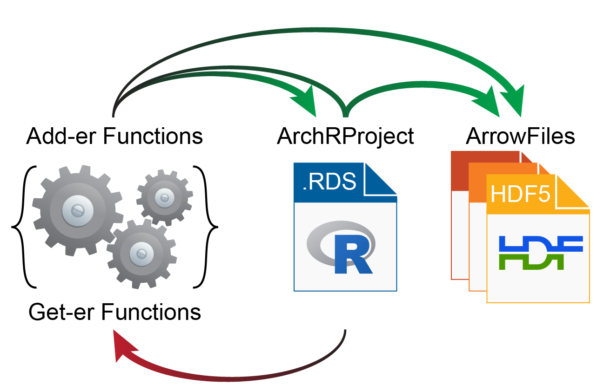

# Getting Started with ArchR

```{r, include=FALSE, eval=FALSE}
setwd("/Volumes/JG_SSD_2/ArchR_Walkthrough/")
save.image("Save-ArchR-Walkthrough-Chapter1-Feb13.Rdata")
```

The following tutorial shows the basics of setting up and interacting with an `ArchRProject` using a gold-standard downsampled dataset of hematopoietic cells [Granja* et al. Nature Biotechnology 2019](https://www.ncbi.nlm.nih.gov/pubmed/31792411). This tutorial and all of the accompanying vignettes assume that you are running ArchR __locally__. __QQQ__ Once all of these steps work for you, feel free to [set up ArchR to work in a cluster environment](articles/Articles/clusterComputing.html). This tutorial does not explain every detail of every step but rather shows you how to perform the most common analyses. Please see the [Vignettes section](articles/index.html) for more details on each major analytical step and all of the major features of ArchR.

## What is an `ArrowFile` / `ArchRProject`?

The base unit of an analytical projHemeect in ArchR is called an `ArrowFile`. Each `ArrowFile` stores all of the data associated with an individual sample (i.e. metadata, accessible fragments, and data matrices). Here, an "individual sample" would be the most detailed unit of analysis desired (for ex. a single replicate of a particular condition). During creation and as additional analyses are performed, ArchR updates and edits each `ArrowFile` to contain additional layers of information.
It is worth noting that, to ArchR, an `ArrowFile` is actually just a path to an external file stored on disk. More explicitly, an `ArrowFile` is not an R-language object that is stored in memory. Because of this, we use an `ArchRProject` object to associate these `ArrowFiles` together into a single analytical framework that can be rapidly accessed in R. This `ArchRProject` object is small in size and is stored in memory.

<center>
{width=700px}
</center>

Certain actions can be taken directly on `ArrowFiles` while other actions are taken on an `ArchRProject` which in turn updates each associated `ArrowFile`. Because `ArrowFiles` are stored as large HDF5-format files, "get-er" functions in ArchR retrieve data by interacting with the `ArchRProject` while "add-er" functions either (i) add data directly to `ArrowFiles`, (ii) add data directly to an `ArchRProject`, or (iii) add data to `ArrowFiles` by interacting with an `ArchRProject`.

<center>
{width=400px}
</center>

## Getting Set Up

The first thing we do is set up our working directory, load our gene and genome annotations, and set the number of threads we would like to use. Depending on the configuration of your local environment, you may need to modify the number of `threads` used below in `addArchRThreads()`. By default ArchR uses half of the total number of `threads` available but you can adjust this manually as you see fit. If you are using windows, the usable `threads` will automatically be set to 1 because the parallel processing in ArchR is build for Unix-based operating systems.

For the purposes of this tutorial, we provide the gene and genome annotations but you can create your own using the `createGeneAnnotation()` and `createGenomeAnnotation()` functions. See the [Gene and Genome Annotations vignette](articles/Articles/annotations.html) for more information.

```{r eval=FALSE}
#Load R Libraries
library(ArchR)

#Create a new folder and set this as the working directory for tutorial analyses
wd <- "ArchR_Walkthrough"
dir.create(wd, showWarnings = FALSE, recursive = TRUE)
setwd(wd)

#Set Genome Annotations to be used
#Since our tutorial data sets are using scATAC-seq data from hg19 we will set that as the default genome.
addArchRGenome("hg19")

#Set Default Threads for ArchR Functions
#The recommendation is to set it around 1/2 to 3/4 of the total available cores.
addArchRThreads(threads = 6) 
```

## Setting a Genome and GeneAnnotation

ArchR requires information about the genome you want to work on to do common things such as TSSEnrichment, Nucleotide Content,
Gene Scores etc. To provide this information we have made this streamlined for human and mouse and provide a solution for other genome builds. </br>

To set a global genome default to hg19 simply add the ArchR genome we have precompiled. This means that for all analysis it will use the genomeAnnotation and geneAnnotation associated with the `ArchRGenome`.

```{r eval=FALSE}
addArchRGenome("hg19")
# Setting default genome to Hg19.
```

To set a global genome default to hg38 simply add the ArchR genome we have precompiled.

```{r eval=FALSE}
addArchRGenome("hg38")
# Setting default genome to Hg38.
```

To set a global genome default to mm9 simply add the ArchR genome we have precompiled.

```{r eval=FALSE}
addArchRGenome("mm9")
# Setting default genome to Mm9.
```

To set a global genome default to mm10 simply add the ArchR genome we have precompiled.

```{r eval=FALSE}
addArchRGenome("mm10")
# Setting default genome to Mm10.
```

To create a custom genome annotation for use instead we can use `createGenomeAnnotation`. To do this, 
you will need the following information : </br>
1. A BSgenome which contains the sequence information for a genome. These are commonly Bioconductor packages that can be easily found with google. </br>
2. A blacklist genomic ranges object that will be used to filter out unwanted regions for downstream analysis. This isnt required but is recommended.

```{r eval=FALSE}
library(BSgenome.Hsapiens.UCSC.hg19)
genomeAnnotation <- createGenomeAnnotation(genome = BSgenome.Hsapiens.UCSC.hg19)
# List of length 3
# names(3): genome chromSizes blacklist
```

To create a custom gene annotation for use instead we can use `createGeneAnnotation`. To do this, 
you will need the following information : </br>
1. A `TxDb` object (transcript database) from Bioconductor which contains information for gene/transcript coordinates. For example, from `txdb <- TxDb.Hsapiens.UCSC.hg38.knownGene`. </br>
2. An `OrgDb` object (organism database) from Bioconductor which contains information for gene/transcript symbols from ids. For example, from `orgdb <- org.Hs.eg.db`. </br>

```{r eval=FALSE}
library(TxDb.Hsapiens.UCSC.hg19.knownGene)
library(org.Hs.eg.db)
txdb <- TxDb.Hsapiens.UCSC.hg19.knownGene
orgdb <- org.Hs.eg.db
geneAnnotation <- createGeneAnnnotation(TxDb = txdb, OrgDb = orgdb)
# List of length 3
# names(3): genes exons TSS
```

or you will need the following information : </br>

1. A `GRanges` object containing gene coordinates (start to end). Must have a symbols column matching the symbols column of `exons`.
2. A `GRanges` object containing gene exon coordinates. Must have a symbols column matching the symbols column of `genes`.
3. A `GRanges` object containing standed transcription start site (`TSS`) coordinates for computing TSS enrichment scores downstream.

```{r eval=FALSE}
geneAnnotation <- createGeneAnnnotation(TSS = geneAnnotation$TSS, exons = geneAnnotation$exons, genes = geneAnnotation$genes)
geneAnnotation
# List of length 3
# names(3): genes exons TSS
```

## Creating Arrow Files

For this tutorial, we will download a collection of fragment files. Fragment files are one of the base file types of the 10x Genomics analytical platform (and other platforms) and can be easily created from any BAM file. See [the ArchR input file types vignette](articles/Articles/inputFiles.html) for information on making your own fragment files for input to ArchR. Once we have our fragment files, we provide their paths as a character vector to `createArrowFiles()`. During creation, some basic metadata and matrices are added to each `ArrowFile` including a "TileMatrix" containing insertion counts across genome-wide 500-bp bins (see `addTileMatrix()`) and a "GeneScoreMatrix" that is determined based on weighting insertion counts in tiles nearby a gene promoter (see `addGeneScoreMatrix()`). These gene activity scores are described in more depth in the [Gene Activity Score vignette](articles/Articles/geneScores.html).

```{r eval=FALSE}
library(ArchR)

#Get Tutorial Data ~0.6GB To Download (if downloaded already ArchR will bypass downloading).
inputFiles <- getTutorialData("Hematopoiesis")
inputFiles
#                                      scATAC_BMMC_R1 
#      "HemeFragments/scATAC_BMMC_R1.fragments.tsv.gz" 
#                                  scATAC_CD34_BMMC_R1 
# "HemeFragments/scATAC_CD34_BMMC_R1.fragments.tsv.gz" 
#                                       scATAC_PBMC_R1 
#      "HemeFragments/scATAC_PBMC_R1.fragments.tsv.gz" 
```

Create Arrow Files (~10-15 minutes) w/ helpful messages displaying progress. </br>
For each sample, this step will: </br>
1. Read accessible fragments from inputFiles. </br>
2. Calculate QC Information for each cell (TSS Enrichment, Nucleosome info). </br>
3. Filter cells based on QC parameters. </br>
4. Create a genome-wide TileMatrix using 500-bp bins. </br>
5. Create a GeneScoreMatrix using the custom geneAnnotation related to when we set `addArchRGenome`. </br>

```{r eval=FALSE}
#Set Genome Annotations to be used to hg19
addArchRGenome("hg19")

#Set Default Threads for ArchR Functions
addArchRThreads(threads = 6) 

ArrowFiles <- createArrowFiles(
  inputFiles = inputFiles,
  sampleNames = names(inputFiles),
  filterTSS = 4, #Dont set this too high because you can always increase later
  filterFrags = 1000, 
  addTileMat = TRUE,
  addGeneScoreMat = TRUE
 )
ArrowFiles
# [1] "scATAC_BMMC_R1.arrow"      "scATAC_CD34_BMMC_R1.arrow"
# [3] "scATAC_PBMC_R1.arrow"
```

Now we can look at the results in a folder "QualityControl" in your current working directory. There are 2 plots associated with each of your samples in this folder : </br>
1. **TSS Enrichment by Log10 Unique Frags** - </br>

For **BMMC** : </br>

{width=500 height=500}

</br>

For **CD34 BMMC** : </br>

{width=500 height=500}

</br>

For **PBMC** : </br>

{width=500 height=500}

</br>

</br>
2. **Fragment Size Distribution** -  </br>

For **BMMC** : </br>

{width=450 height=350}

</br>

For **CD34 BMMC** : </br>

{width=450 height=350}

</br>

For **PBMC** : </br>

{width=450 height=350}


To download the TSS by Frags PDFs for each sample </br>

[Download PDF : scATAC_BMMC_R1-TSS_by_Unique_Frags.pdf](images/HemeWalkthrough/PDF/scATAC_BMMC_R1-TSS_by_Unique_Frags.pdf)</br>
[Download PDF : scATAC_CD34_BMMC_R1-TSS_by_Unique_Frags.pdf](images/HemeWalkthrough/PDF/scATAC_CD34_BMMC_R1-TSS_by_Unique_Frags.pdf)</br>
[Download PDF : scATAC_PBMC_R1-TSS_by_Unique_Frags.pdf](images/HemeWalkthrough/PDF/scATAC_PBMC_R1-TSS_by_Unique_Frags.pdf)</br>

To download the Fragment Sizes PDFs for each sample </br>

[Download PDF : scATAC_BMMC_R1-Fragment_Size_Distribution.pdf](images/HemeWalkthrough/PDF/scATAC_BMMC_R1-Fragment_Size_Distribution.pdf)</br>
[Download PDF : scATAC_CD34_BMMC_R1-Fragment_Size_Distribution.pdf](images/HemeWalkthrough/PDF/scATAC_CD34_BMMC_R1-Fragment_Size_Distribution.pdf)</br>
[Download PDF : scATAC_PBMC_R1-Fragment_Size_Distribution.pdf](images/HemeWalkthrough/PDF/scATAC_PBMC_R1-Fragment_Size_Distribution.pdf)</br>


