---
output:
  html_document:
    theme: yeti  # many options for theme, this one is my favorite.
params:
  threads: 20
  rdata: ""
  token: ""
  ref: ""
  out: ""
---
```{r, include=FALSE}
load("ch1.RData")
```
# Doublet Inference with ArchR

One major source of trouble in single-cell data is the contribution of "doublets" to the analysis. A doublet refers to a single droplet that received a single barcoded bead and more than one nucleus. This causes the reads from more than one cell to appear as a single cell that is effectively the average of the two cells. We remove these computationally and describe this doublet removal process in depth in this chapter.

## How does doublet identification work in ArchR?

Single-cell data generated on essentially any platform is susceptible to the presence of doublets. A doublet refers to a single droplet that received a single barcoded bead and more than one nucleus. This causes the reads from more than one cell to appear as a single cell. For 10x, the percentage of total "cells" that are actually doublets is proportional to the number of cells loaded into the reaction. Even at the lower levels of doublets that result from standard kit use, more than 5% of the data may come from doublets and this exerts substantial effects on clustering. This issue becomes particularly problematic in the context of developmental/trajectory data because doublets look like a mixture between two cell types and this can be confounded with intermediate cell types or cell states.

To predict which "cells" are actually doublets, we synthesize in silico doublets from the data by mixing the reads from thousands of combinations of individual cells. We then project these synthetic doublets into the UMAP embedding and identify their nearest neighbor. By iterating this procedure thousands of times, we can identify "cells" in our data whose signal looks very similar to synthetic doublets.

<center>
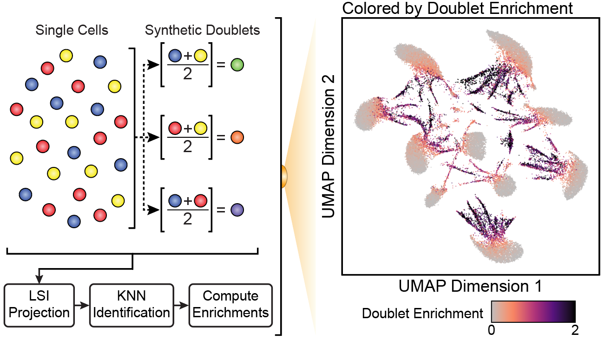{width=700px}
</center>

To develop and validate ArchR's doublet identification, we generated scATAC-seq data from pooled mixtures of 10 genetically distinct cell lines. In scATAC-seq space, these 10 cell lines should form 10 distinct clusters but when we deliberately overload the 10x Genomics scATAC-seq reaction, targetting 25,000 cells per reaction, we end up with many doublets. We know these are doublets because we use [demuxlet](https://github.com/statgen/demuxlet) to identify droplets that contain genotypes from two different cell types.

<center>
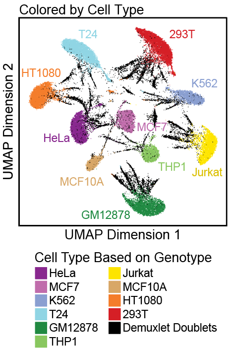{width=350px}
</center>

This "ground truth" overlaps very strongly with the doublet predictions shown above, showing an area under the curve of the receiver opperating characteristic >0.90.

<center>
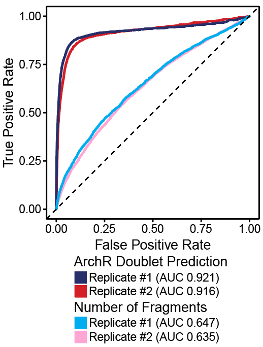{width=350px}
</center>

After we computationally remove these doublets with ArchR, the overall structure of our data changes dramatically and matches our expectation of 10 distinct cell types.

<center>
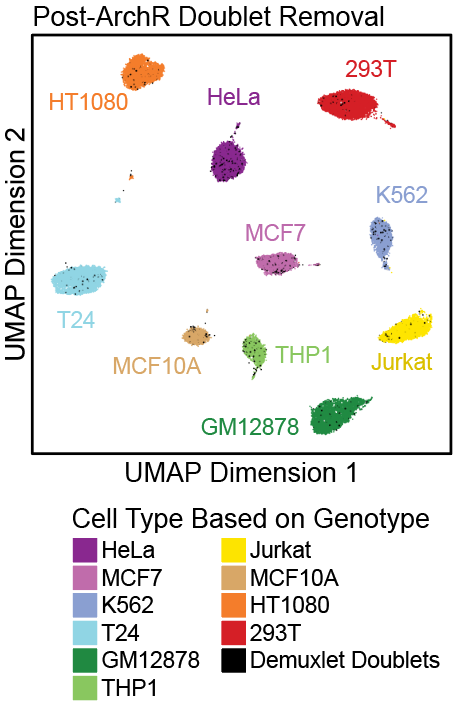{width=350px}
</center>

## Inferring scATAC-seq Doublets with ArchR

By default ArchR uses the doublet parameters described in the ArchR manuscript. This is likely a good place to start but we encourage all users to inspect the pre- and post-doublet removal data to understand how doublet removal is affecting the cells. We show some of the main adjustable features below to illustrate how this can be customized to a given application.

In ArchR, doublet removal is performed in a single step using `addDoubletScores()`. This adds the infered doublet scores to each Arrow file and will take approximately 2-5 minutes per sample of the tutorial data. You can always try `?addDoubletScores` to see further documentation on parameters for doublet identification (or any ArchR function for that matter).

```{r addDoubletScores, collapse=TRUE}
doubScores <- addDoubletScores(
	input = ArrowFiles,
	k = 10, #Refers to how many cells near a "pseudo-doublet" to count.
	knnMethod = "UMAP", #Refers to the embedding to use for nearest neighbor search with doublet projection.
	LSIMethod = 1
)
```
In the above output, ArchR reports the R<sup>2</sup> value for the UMAP projection for each Arrow file. If these R<sup>2</sup> values are much lower (i.e. less than 0.9), this often indicates that the cells within the Arrow file have very little heterogeneity. This makes the accuracy of doublet calling worse because the majority of doublets would be "homotypic" - or a single droplet with two very similar cells. In these cases, we recommend skipping doublet prediction. Alternatively, you can try setting `knnMethod = "LSI"` and `force = TRUE` to perform projection in the LSI subspace; however, you should manually assess the results and make sure this is performing as you would expect.

```{r, include=FALSE}
ArchR:::.convertToPNG()
system("cp Figures/*.png images/HemeWalkthrough/PNG/")
system("cp Figures/*.pdf images/HemeWalkthrough/PDF/")
```

Adding doublet scores will create plots in the "QualityControl" directory. There are 3 plots associated with each of your samples in this folder:

1. **Doublet Enrichments** - These represent the enrichment of simulated doublets nearby each single cell compared to the expected if we assume a uniform distribution.
2. **Doublet Scores** - These represent the significance (`-log10(binomial adjusted p-value)`) of simulated doublets nearby each single cell compared to the expected if we assume a uniform distribution. We have found this value to be less consistent than the doublet enrichments and therefore use doublet enrichments for doublet identification.
3. **Doublet Density** - This represents the density of the simulated doublet projections. This allows you to visualize where the synthetic doublets were located after projection into your 2-dimensional embedding.

```{r include=FALSE, eval=FALSE}
#JJJ These plots are impossible to read. 
```

For **BMMC** : </br>

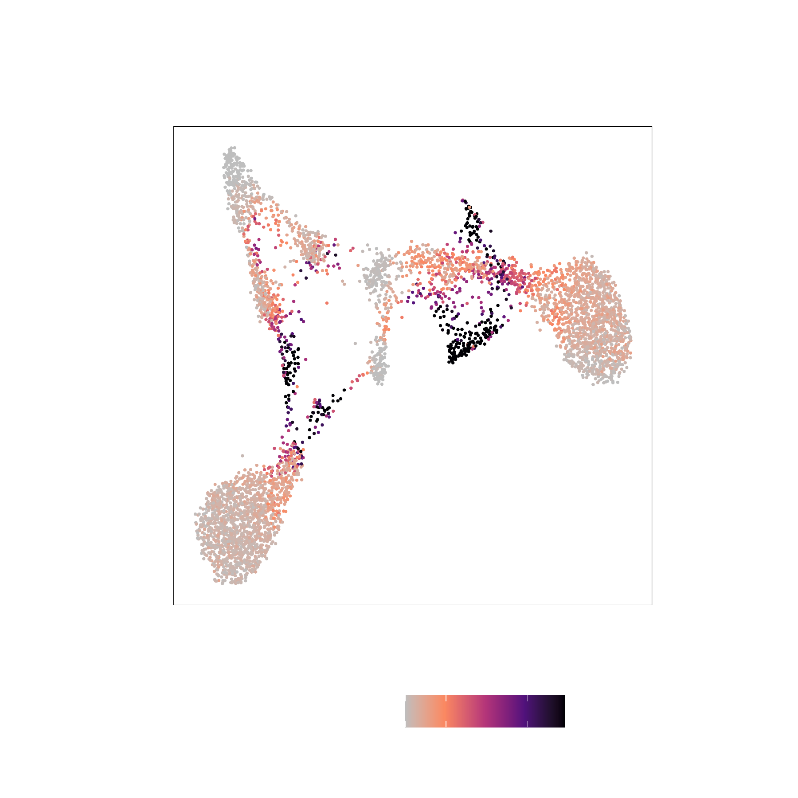{width=250 height=250}
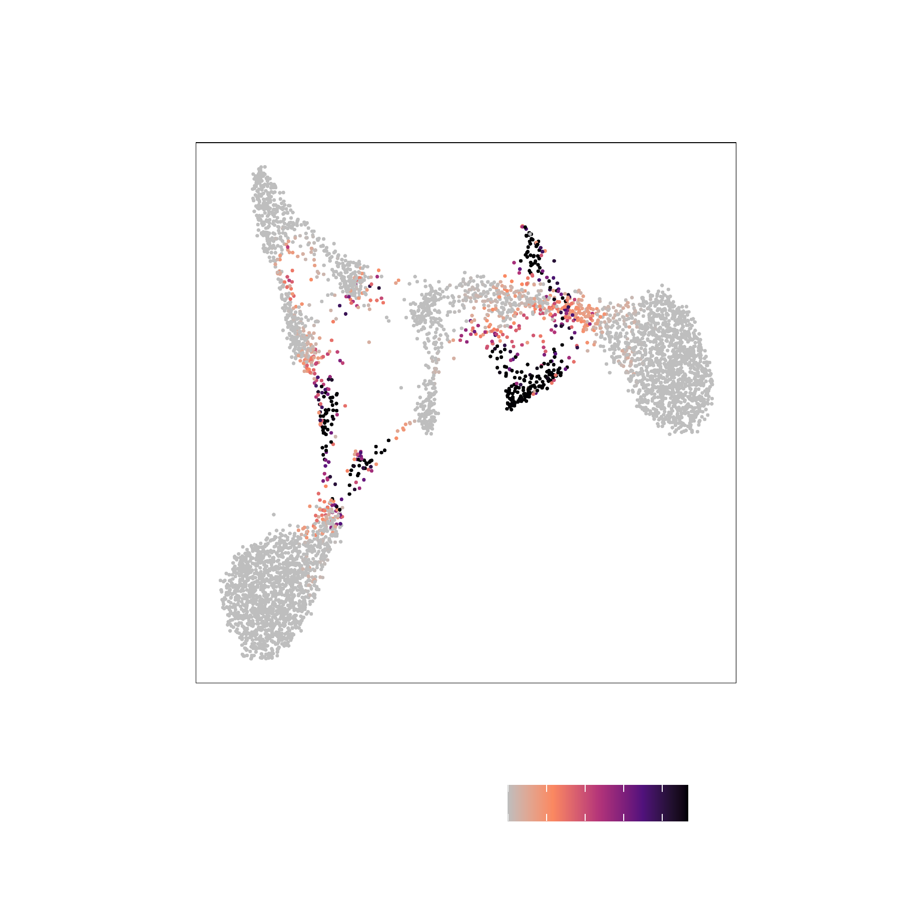{width=250 height=250}
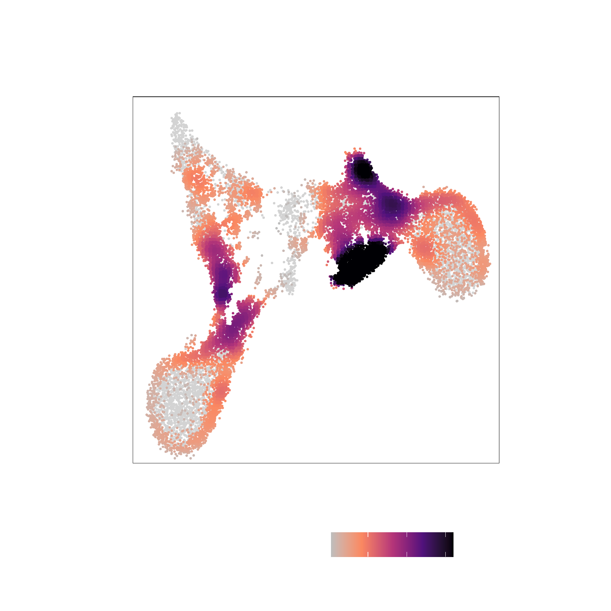{width=250 height=250}

</br>

For **CD34 BMMC** : </br>

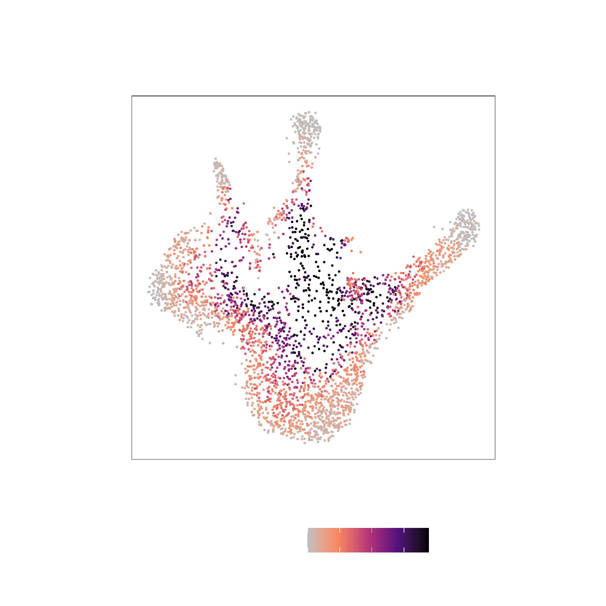{width=250 height=250}
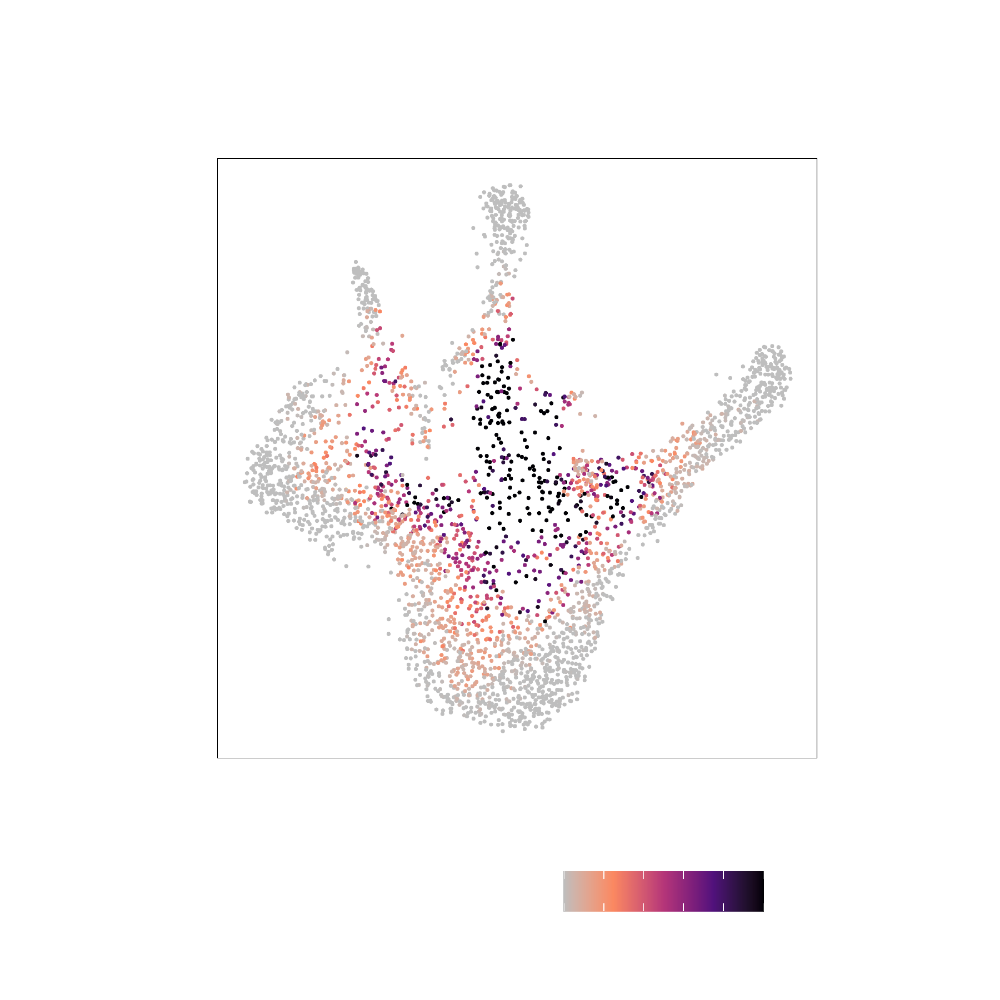{width=250 height=250}
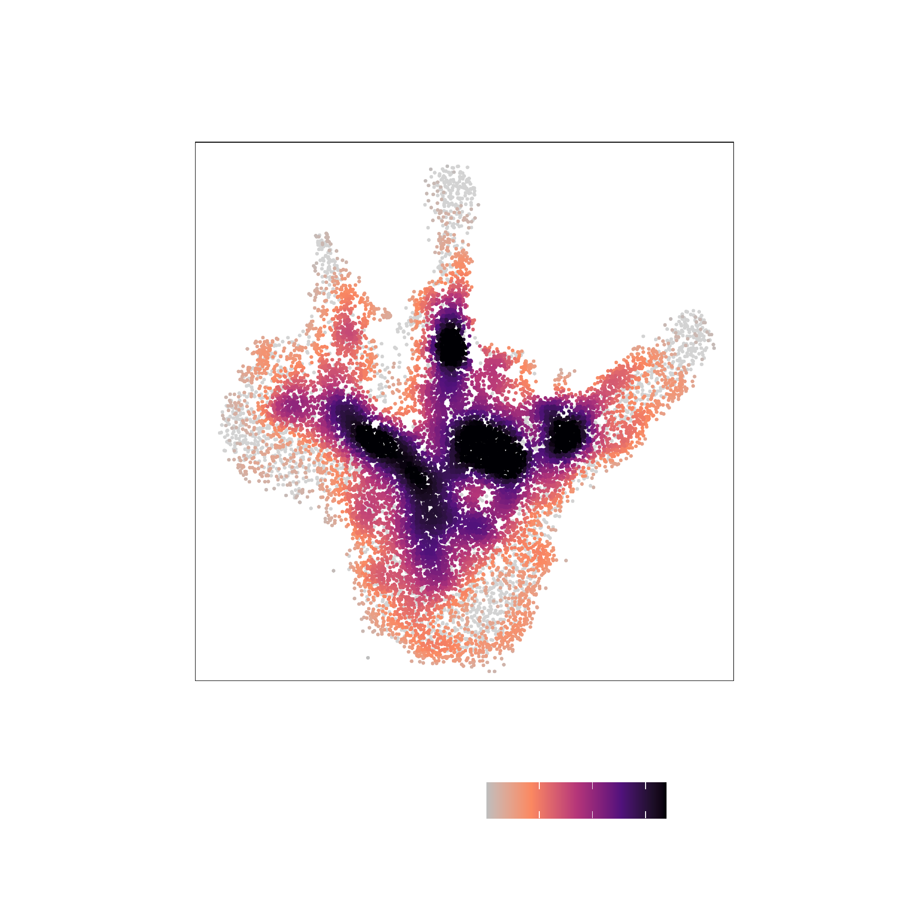{width=250 height=250}

</br>

For **PBMC** : </br>

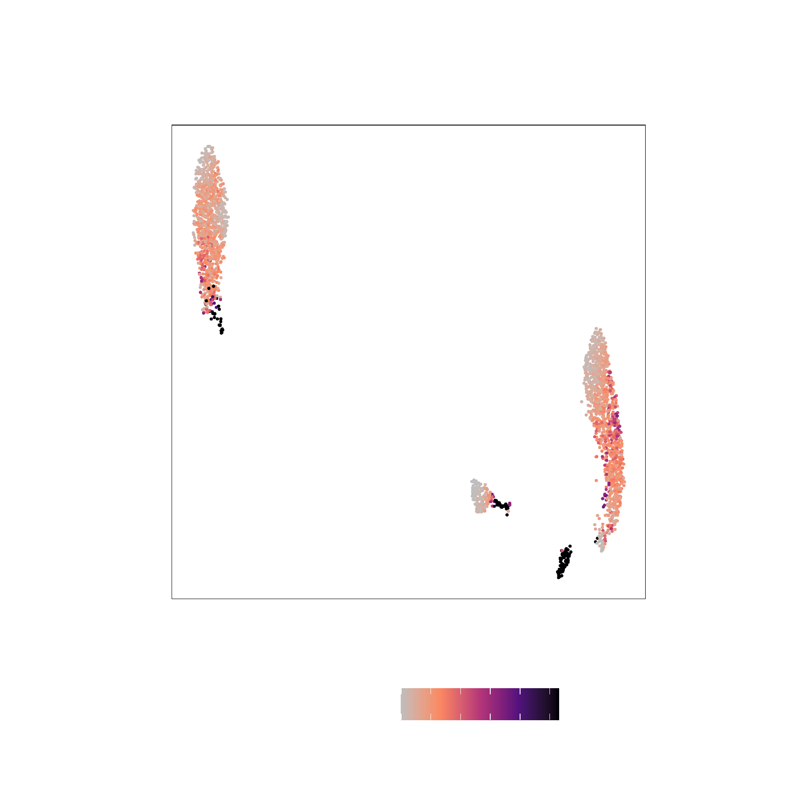{width=250 height=250}
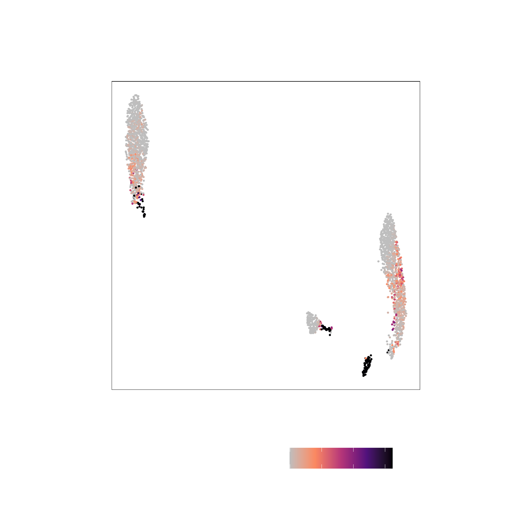{width=250 height=250}
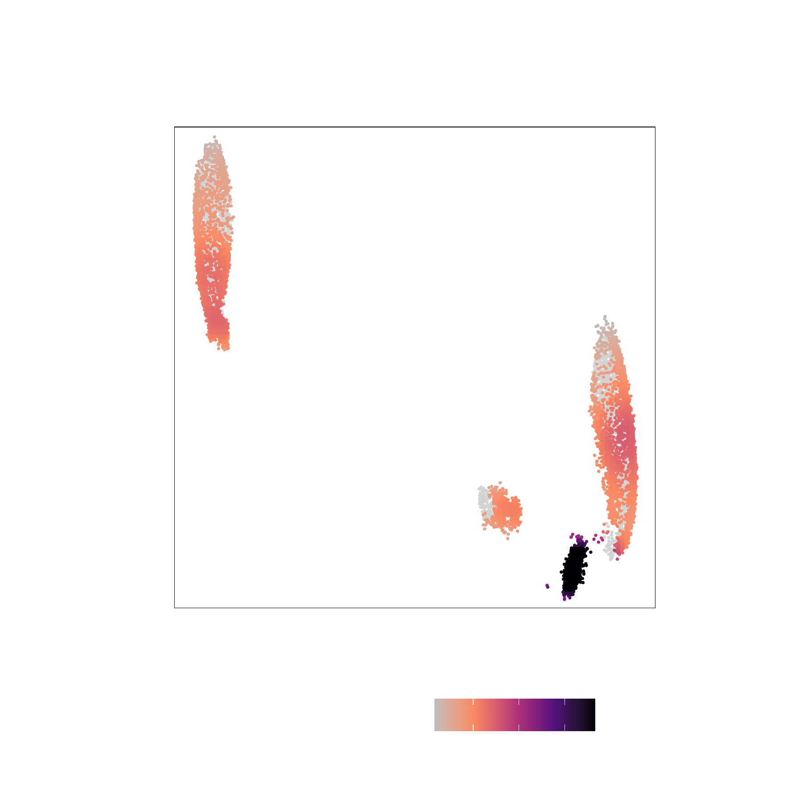{width=250 height=250}

</br>
```{r, include=FALSE}
save.image(file = "ch2.RData")
```