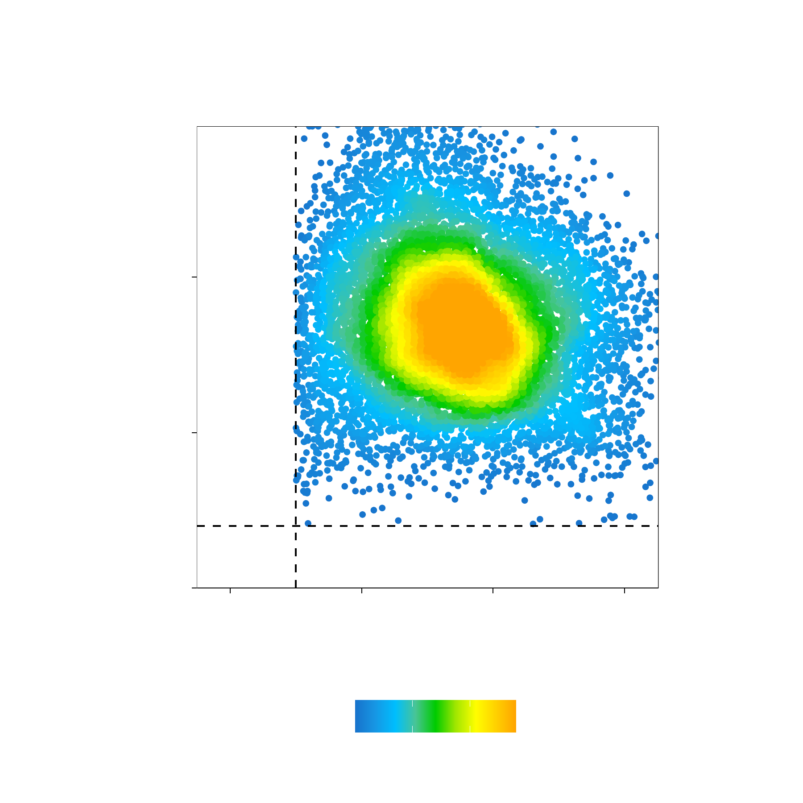
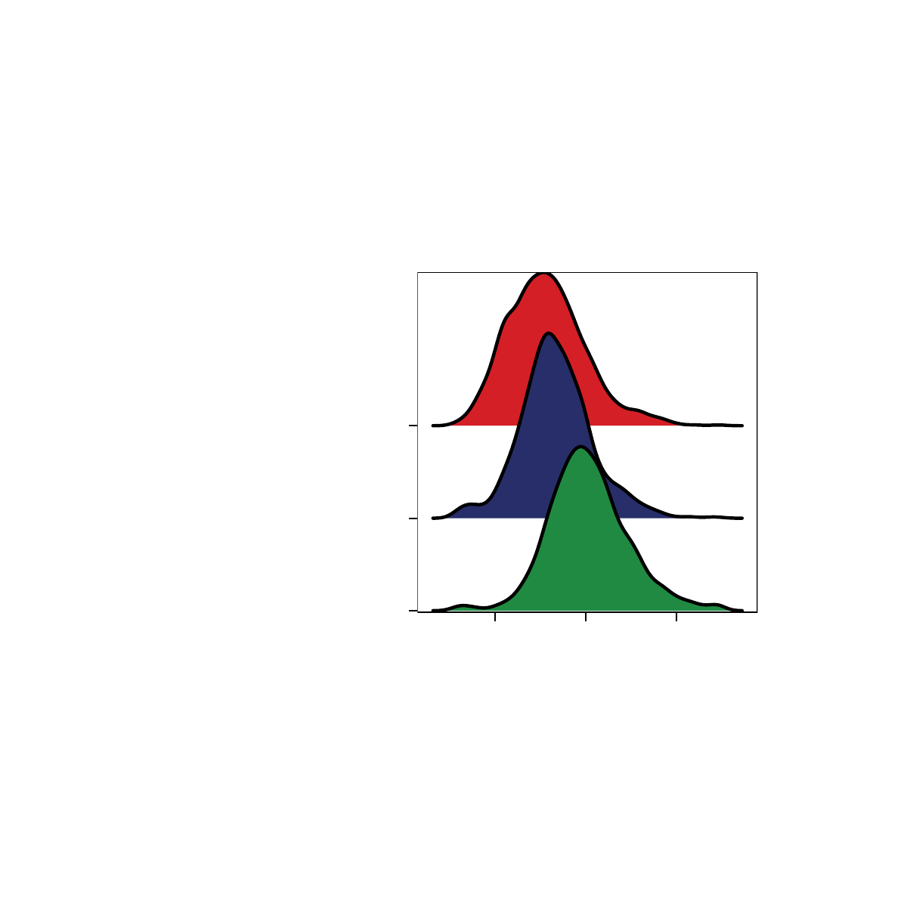
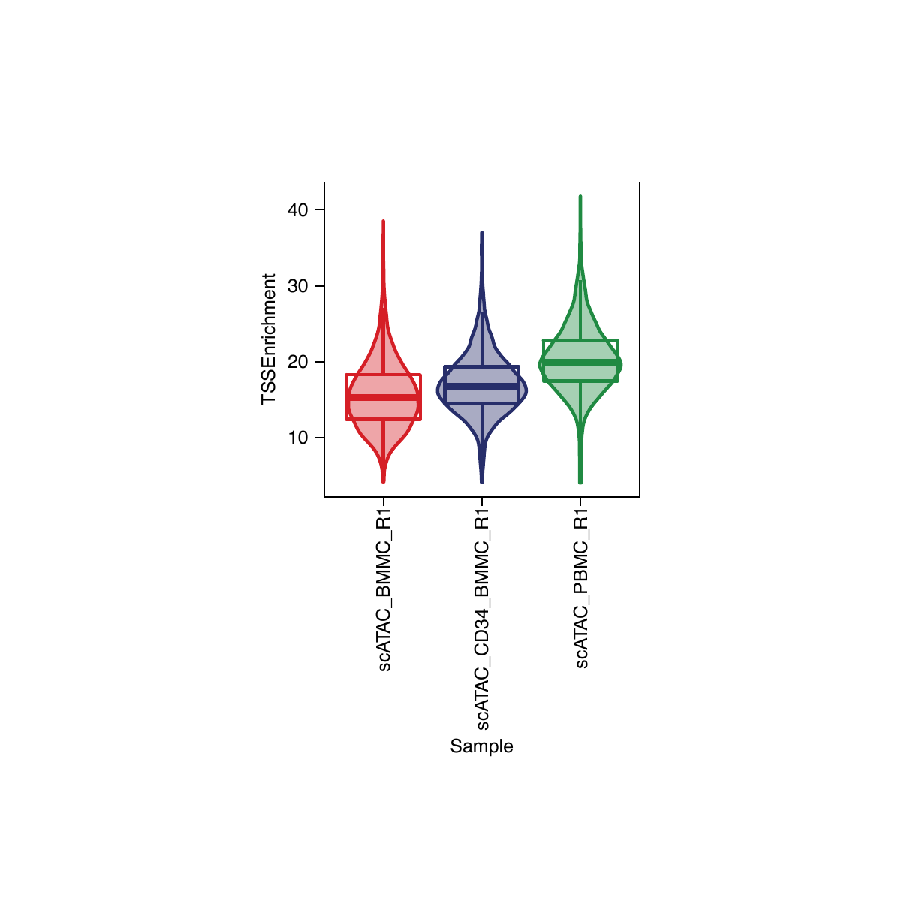
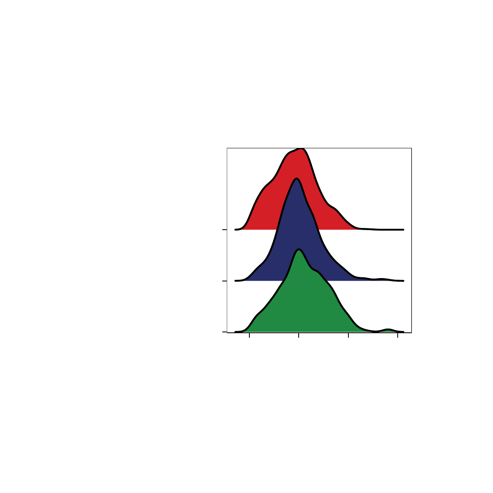
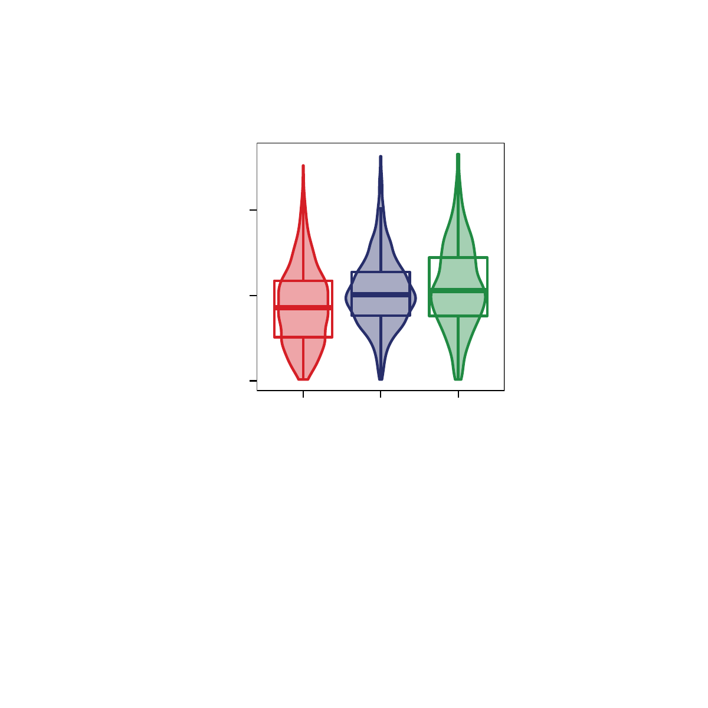
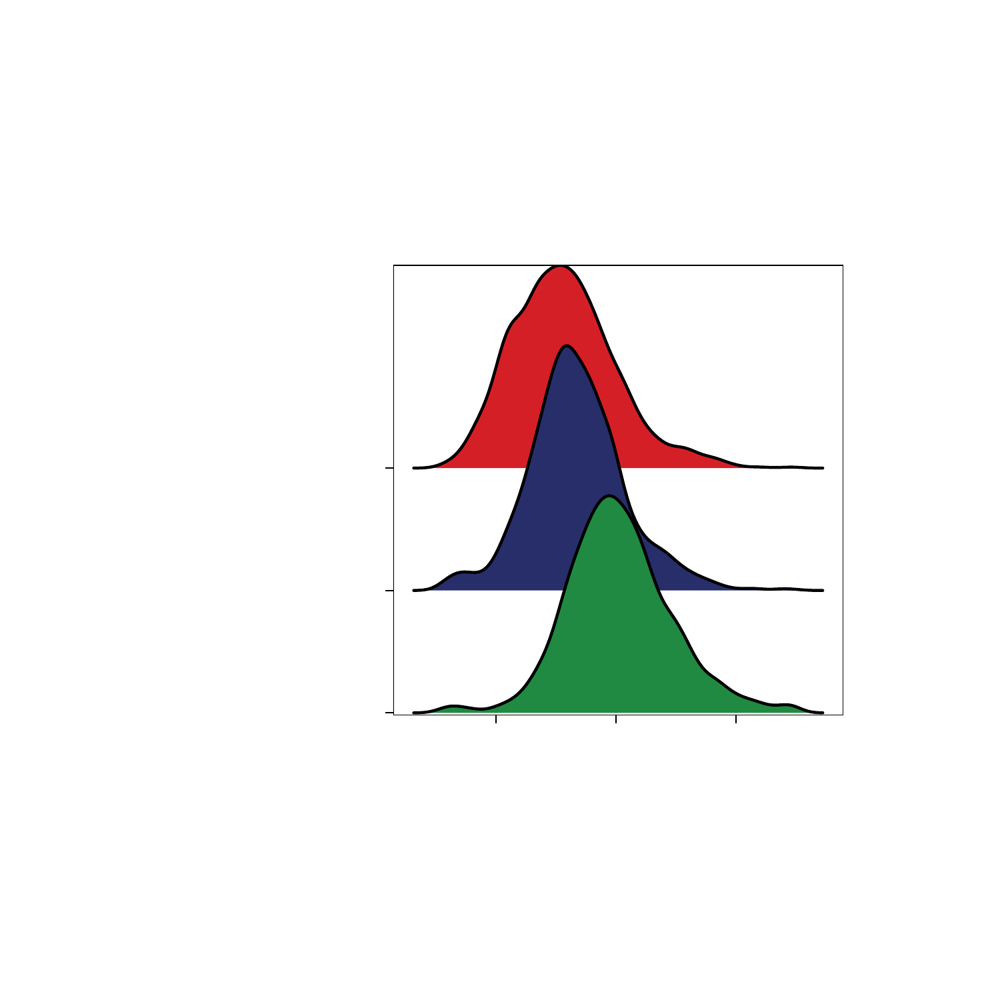
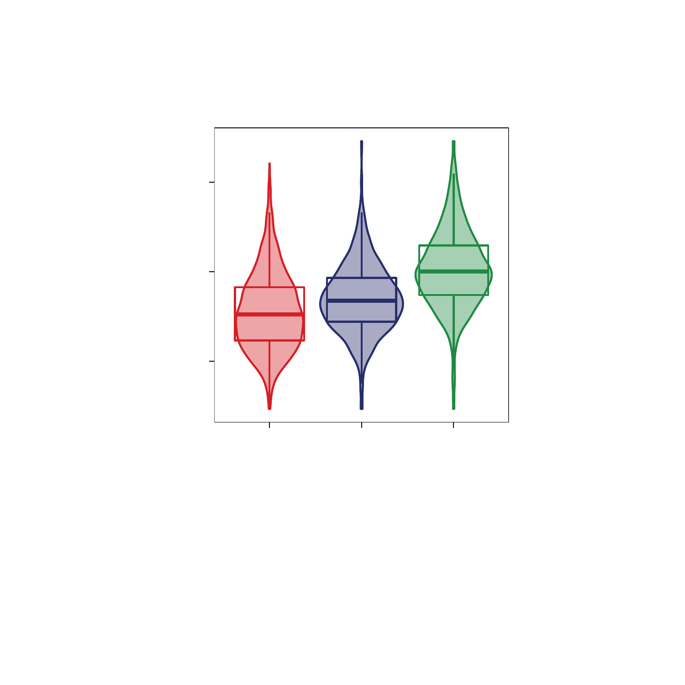

# Creating an ArchRProject

```{r, include=FALSE, eval=FALSE}
setwd("/Volumes/JG_SSD_2/ArchR_Walkthrough/")
save.image("Save-ArchR-Walkthrough-Chapter1-Feb13.Rdata")
```

## Creating An ArchRProject

```{r eval=FALSE}
#Create ArchRProject
#The outputDirectory here describes where all downstream analyses and plots go.
#ArchR will add geneAnnotation and genomeAnnotations related to addArchRGenome("hg19")
#as described above.
projHeme1 <- ArchRProject(
  ArrowFiles = ArrowFiles, 
  outputDirectory = "HemeTutorial",
  copyArrows = TRUE #This is recommened so that if you modify the ArrowFiles you have an original copy for later usage.
)
```

Lets look at our ArchRProject

```{r eval=FALSE}
projHeme
# class: ArchRProject 
# outputDirectory: /Volumes/JG_SSD_2/ArchR_Walkthrough/HemeTutorial 
# samples(3): scATAC_BMMC_R1 scATAC_CD34_BMMC_R1 scATAC_PBMC_R1
# sampleColData names(1): ArrowFiles
# cellColData names(11): DoubletEnrichment DoubletScore ... Sample
#   TSSEnrichment
# numberOfCells(1): 10661
# medianTSS(1): 16.832
# medianFrags(1): 3050
```
We can see from above the specified outputDirectory, sampleNames, sampleColData (column data associated with each sample), cellColData (column data associated with each cell), the number of cells, median TSS enrichment and median number of fragments. Additionally since we already computed doublet enrichment scores
we can see in cellColData a column name "DoubletEnrichment" and "DoubletScore" which are related to the above addition of `addDoubletScores`. </br>

How big is the created ArchRProject in memory in R.

```{r eval=FALSE}
paste0("Memory Size = ", round(object.size(projHeme1) / 10^6, 3), " MB")
#[1] "Memory Size = 37.135 MB"
```

What matrices are available?

```{r eval=FALSE}
getAvailableMatrices(projHeme1)
#[1] "GeneScoreMatrix" "TileMatrix" 
```


## Manipulating An ArchRProject
Now that we have created an ArchRProject, there ample things that one can do to easily access/manipulate the data associated.

Example 1. The `$` accessor, this allows direct access to cellColData

```{r eval=FALSE}
#A. Access cell names associated with each cell
head(projHeme1$cellNames)
# [1] "scATAC_BMMC_R1#TTATGTCAGTGATTAG-1" "scATAC_BMMC_R1#AAGATAGTCACCGCGA-1"
# [3] "scATAC_BMMC_R1#GCATTGAAGATTCCGT-1" "scATAC_BMMC_R1#TATGTTCAGGGTTCCC-1"
# [5] "scATAC_BMMC_R1#TCCATCGGTCCCGTGA-1" "scATAC_BMMC_R1#AGTTACGAGAACGTCG-1"

#B. Access sample names associated with each cell
projHeme1$Sample
# character-Rle of length 10661 with 3 runs
#   Lengths:                  4932                  3275                  2454
#   Values :      "scATAC_BMMC_R1" "scATAC_CD34_BMMC_R1"      "scATAC_PBMC_R1"

#C. Access TSS Enrichment Scores for each cell
quantile(projHeme1$TSSEnrichment)
#    0%    25%    50%    75%   100% 
# 4.027 13.922 16.832 19.937 41.782 
```

Example 2. Subsetting an ArchRProject By Cells

```{r eval=FALSE}
#A. Subsetting like a data.frame numerically
projHeme1[1:100, ] #First 100 cells
# class: ArchRProject 
# outputDirectory: /Volumes/JG_SSD_2/ArchR_Walkthrough/HemeTutorial 
# samples(3): scATAC_BMMC_R1 scATAC_CD34_BMMC_R1 scATAC_PBMC_R1
# sampleColData names(1): ArrowFiles
# cellColData names(11): DoubletEnrichment DoubletScore ... Sample
#   TSSEnrichment
# numberOfCells(1): 100
# medianTSS(1): 10.7725
# medianFrags(1): 10200.5

#B. Subetting like a data.frame with cellNames
projHeme1[projHeme1$cellNames[1:100], ]
# class: ArchRProject 
# outputDirectory: /Volumes/JG_SSD_2/ArchR_Walkthrough/HemeTutorial 
# samples(3): scATAC_BMMC_R1 scATAC_CD34_BMMC_R1 scATAC_PBMC_R1
# sampleColData names(1): ArrowFiles
# cellColData names(11): DoubletEnrichment DoubletScore ... Sample
#   TSSEnrichment
# numberOfCells(1): 100
# medianTSS(1): 10.7725
# medianFrags(1): 10200.5


#C. Subsetting for 1 sample
idxSample <- BiocGenerics::which(projHeme1$Sample %in% "scATAC_BMMC_R1")
cellsSample <- projHeme1$cellNames[idxSample]
projHeme1[cellsSample, ]
# class: ArchRProject 
# outputDirectory: /Volumes/JG_SSD_2/ArchR_Walkthrough/HemeTutorial 
# samples(3): scATAC_BMMC_R1 scATAC_CD34_BMMC_R1 scATAC_PBMC_R1
# sampleColData names(1): ArrowFiles
# cellColData names(11): DoubletEnrichment DoubletScore ... Sample
#   TSSEnrichment
# numberOfCells(1): 4932
# medianTSS(1): 15.254
# medianFrags(1): 2771

#D. Increasing TSS cutoff
idxPass <- which(projHeme1$TSSEnrichment >= 8)
cellsPass <- projHeme1$cellNames[idxPass]
projHeme1[cellsPass, ]
# class: ArchRProject 
# outputDirectory: /Volumes/JG_SSD_2/ArchR_Walkthrough/HemeTutorial 
# samples(3): scATAC_BMMC_R1 scATAC_CD34_BMMC_R1 scATAC_PBMC_R1
# sampleColData names(1): ArrowFiles
# cellColData names(11): DoubletEnrichment DoubletScore ... Sample
#   TSSEnrichment
# numberOfCells(1): 10500
# medianTSS(1): 16.9275
# medianFrags(1): 3042
```

Example 3. Adding data to an ArchRProject

```{r eval=FALSE}
#Add a column removing replicate info
bioNames <- gsub("_R2|_R1|scATAC_","",projHeme1$Sample)
bioNames
# character-Rle of length 10661 with 3 runs
#   Lengths:        4932        3275        2454
#   Values :      "BMMC" "CD34_BMMC"      "PBMC"
projHeme1$bioNames <- bioNames

#Add a column with partial info
bioNames <- bioNames[1:10]
cellNames <- projHeme1$cellNames[1:10]
projHeme1 <- addCellColData(ArchRProj = projHeme1, data = paste0(bioNames), cells = cellNames, name = "bioNames2")

#Lets compare the results
getCellColData(projHeme1, select = c("bioNames", "bioNames2"))
# DataFrame with 10661 rows and 2 columns
#                                      bioNames   bioNames2
#                                   <character> <character>
# scATAC_BMMC_R1#TTATGTCAGTGATTAG-1        BMMC        BMMC
# scATAC_BMMC_R1#AAGATAGTCACCGCGA-1        BMMC        BMMC
# scATAC_BMMC_R1#GCATTGAAGATTCCGT-1        BMMC        BMMC
# scATAC_BMMC_R1#TATGTTCAGGGTTCCC-1        BMMC        BMMC
# scATAC_BMMC_R1#TCCATCGGTCCCGTGA-1        BMMC        BMMC
# ...                                       ...         ...
# scATAC_PBMC_R1#GCTGCGAAGATCCGAG-1        PBMC          NA
# scATAC_PBMC_R1#GCAGCTGGTGGCCTTG-1        PBMC          NA
# scATAC_PBMC_R1#GCAGATTGTACGCAAG-1        PBMC          NA
# scATAC_PBMC_R1#TTCGTTACATTGAACC-1        PBMC          NA
# scATAC_PBMC_R1#CGCTATCGTGAGGTCA-1        PBMC          NA
```

Example 4. Log10 Unique Fragments

```{r eval=FALSE}
df <- getCellColData(projHeme1, select = "nFrags")
df
# DataFrame with 10661 rows and 1 column
#                                      nFrags
#                                   <numeric>
# scATAC_BMMC_R1#TTATGTCAGTGATTAG-1     26189
# scATAC_BMMC_R1#AAGATAGTCACCGCGA-1     20648
# scATAC_BMMC_R1#GCATTGAAGATTCCGT-1     18991
# scATAC_BMMC_R1#TATGTTCAGGGTTCCC-1     18296
# scATAC_BMMC_R1#TCCATCGGTCCCGTGA-1     17458
# ...                                     ...
# scATAC_PBMC_R1#GCTGCGAAGATCCGAG-1      1038
# scATAC_PBMC_R1#GCAGCTGGTGGCCTTG-1      1037
# scATAC_PBMC_R1#GCAGATTGTACGCAAG-1      1033
# scATAC_PBMC_R1#TTCGTTACATTGAACC-1      1033
# scATAC_PBMC_R1#CGCTATCGTGAGGTCA-1      1002

df <- getCellColData(projHeme1, select = c("log10(nFrags)", "nFrags - 1"))
df
# DataFrame with 10661 rows and 2 columns
#                                      log10(nFrags) nFrags - 1
#                                          <numeric>  <numeric>
# scATAC_BMMC_R1#TTATGTCAGTGATTAG-1  4.4181189156542      26188
# scATAC_BMMC_R1#AAGATAGTCACCGCGA-1 4.31487799153581      20647
# scATAC_BMMC_R1#GCATTGAAGATTCCGT-1 4.27854783377585      18990
# scATAC_BMMC_R1#TATGTTCAGGGTTCCC-1 4.26235615159869      18295
# scATAC_BMMC_R1#TCCATCGGTCCCGTGA-1 4.24199448915678      17457
# ...                                            ...        ...
# scATAC_PBMC_R1#GCTGCGAAGATCCGAG-1 3.01619735351244       1037
# scATAC_PBMC_R1#GCAGCTGGTGGCCTTG-1 3.01577875638904       1036
# scATAC_PBMC_R1#GCAGATTGTACGCAAG-1 3.01410032151962       1032
# scATAC_PBMC_R1#TTCGTTACATTGAACC-1 3.01410032151962       1032
# scATAC_PBMC_R1#CGCTATCGTGAGGTCA-1 3.00086772153123       1001
```

Example 5. Log10 Unique Frags vs TSSEnrichment

```{r eval=FALSE}
df <- getCellColData(projHeme1, select = c("log10(nFrags)", "TSSEnrichment"))
df
# DataFrame with 10661 rows and 2 columns
#                                      log10(nFrags) TSSEnrichment
#                                          <numeric>     <numeric>
# scATAC_BMMC_R1#TTATGTCAGTGATTAG-1  4.4181189156542         7.149
# scATAC_BMMC_R1#AAGATAGTCACCGCGA-1 4.31487799153581         7.911
# scATAC_BMMC_R1#GCATTGAAGATTCCGT-1 4.27854783377585         4.505
# scATAC_BMMC_R1#TATGTTCAGGGTTCCC-1 4.26235615159869         6.946
# scATAC_BMMC_R1#TCCATCGGTCCCGTGA-1 4.24199448915678         4.799
# ...                                            ...           ...
# scATAC_PBMC_R1#GCTGCGAAGATCCGAG-1 3.01619735351244        24.356
# scATAC_PBMC_R1#GCAGCTGGTGGCCTTG-1 3.01577875638904        22.537
# scATAC_PBMC_R1#GCAGATTGTACGCAAG-1 3.01410032151962        20.146
# scATAC_PBMC_R1#TTCGTTACATTGAACC-1 3.01410032151962        30.198
# scATAC_PBMC_R1#CGCTATCGTGAGGTCA-1 3.00086772153123        21.485
```

Now lets plot the number of unique nuclear fragments (log10) by TSS enrichment. This type of plot is
key in identifying high quality cells. We can further adjust our cutoffs based on this plot if need be.

```{r eval=FALSE}
p <- ggPoint(
	x = df[,1], 
	y = df[,2], 
	colorDensity = TRUE,
	continuousSet = "sambaNight",
	xlabel = "Log10 Unique Fragments",
	ylabel = "TSS Enrichment",
	xlim = c(log10(500), quantile(df[,1], probs = 0.99)),
	ylim = c(0, quantile(df[,2], probs = 0.99))
) + geom_hline(yintercept = 4, lty = "dashed") + geom_vline(xintercept = 3, lty = "dashed")

p
```

{width=500 height=500}

To save a nice looking pdf we use plotPDF which removes white pages and tries to make the plots
nice looking.

```{r eval=FALSE}
plotPDF(p, name = "TSS-vs-Frags.pdf", ArchRProj = projHeme1, addDOC = FALSE)
```

[Download PDF : TSS-vs-Frags.pdf](images/HemeWalkthrough/PDF/TSS-vs-Frags.pdf)

## Plotting Sample Statistics from an ArchRProject

Example 1. Make a Ridge Plot for each sample for the TSS Enrichment scores.

```{r eval=FALSE}
p1 <- plotGroups(
	ArchRProj = projHeme1, 
	groupBy = "Sample", 
	colorBy = "cellColData", 
    name = "TSSEnrichment",
    plotAs = "ridges"
   )
p1
```

{width=500 height=500}


Example 2. Make a Violin Plot for each sample for the TSS Enrichment scores.

```{r eval=FALSE}
p2 <- plotGroups(
	ArchRProj = projHeme1, 
	groupBy = "Sample", 
	colorBy = "cellColData", 
    name = "TSSEnrichment",
    plotAs = "violin",
    alpha = 0.4,
    addBoxPlot = TRUE
   )
p2
```

{width=500 height=500}

Example 3. Make a Ridge Plot for each sample for the log10 unique nuclear fragments.

```{r eval=FALSE}
p3 <- plotGroups(
	ArchRProj = projHeme1, 
	groupBy = "Sample", 
	colorBy = "cellColData", 
    name = "log10(nFrags)",
    plotAs = "ridges"
   )
p3
```

{width=500 height=500}

Example 4. Make a Violin Plot for each sample for the log10 unique nuclear fragments.

```{r eval=FALSE}
p4 <- plotGroups(
	ArchRProj = projHeme1, 
	groupBy = "Sample", 
	colorBy = "cellColData", 
    name = "log10(nFrags)",
    plotAs = "violin",
    alpha = 0.4,
    addBoxPlot = TRUE
   )
p4
```

{width=500 height=500}

To save a nice looking pdf we use plotPDF which removes white pages and tries to make the plots
nice looking.

```{r eval=FALSE}
plotPDF(p1,p2,p3,p4, name = "QC-Sample-Statistics.pdf", ArchRProj = projHeme1, addDOC = FALSE, width = 4, height = 4)
```

[Download PDF : QC-Sample-Statistics.pdf](images/HemeWalkthrough/PDF/QC-Sample-Statistics.pdf)

## Plotting Sample Fragment Size Distribution and TSS Enrichment Profiles.

ArchR can compute fragment size distributions after ArrowFile creation for all samples swiftly.

```{r eval=FALSE}
p1 <- plotFragmentSizes(ArchRProj = projHeme1)
p1
```

{width=500 height=500}

ArchR can compute TSS enrichment profiles after ArrowFile creation for all samples swiftly.

```{r eval=FALSE}
p2 <- plotTSSEnrichment(ArchRProj = projHeme1)
p2
```

{width=500 height=500}

To save a nice looking pdf we use plotPDF which removes white pages and tries to make the plots
nice looking.

```{r eval=FALSE}
plotPDF(p1,p2, name = "QC-Sample-FragSizes-TSSProfile.pdf", ArchRProj = projHeme1, addDOC = FALSE, width = 5, height = 5)
```

[Download PDF : QC-Sample-FragSizes-TSSProfile.pdf](images/HemeWalkthrough/PDF/QC-Sample-FragSizes-TSSProfile.pdf)

## Filtering Doublets from an ArchRProject

```{r eval=FALSE}
#Remove doublets as normal
#If you feel there are more doublets try increasing filterRatio like below
projHeme2 <- filterDoublets(projHeme1)
# Filtering 410 cells from ArchRProject!
# 	scATAC_BMMC_R1 : 243 of 4932 (4.9%)
# 	scATAC_CD34_BMMC_R1 : 107 of 3275 (3.3%)
# 	scATAC_PBMC_R1 : 60 of 2454 (2.4%)

#Lets see the project now
projHeme2
# class: ArchRProject 
# outputDirectory: /Volumes/JG_SSD_2/ArchR_Walkthrough/HemeTutorial 
# samples(3): scATAC_BMMC_R1 scATAC_CD34_BMMC_R1 scATAC_PBMC_R1
# sampleColData names(1): ArrowFiles
# cellColData names(11): DoubletEnrichment DoubletScore ... Sample
#   TSSEnrichment
# numberOfCells(1): 10251
# medianTSS(1): 16.851
# medianFrags(1): 2994
```

If you want to filter more cells from the ArchR Project try a higher filterRatio.
To see additional arguments try ?filterDoublets

```{r eval=FALSE}
projHemeTmp <- filterDoublets(projHeme1, filterRatio = 1.5)
# Filtering 614 cells from ArchRProject!
# 	scATAC_BMMC_R1 : 364 of 4932 (7.4%)
# 	scATAC_CD34_BMMC_R1 : 160 of 3275 (4.9%)
# 	scATAC_PBMC_R1 : 90 of 2454 (3.7%)
rm(projHemeTmp)
```

We can now save our original projHeme1 using `saveArchRProject` from ArchR.

```{r eval=FALSE}
saveArchRProject(projHeme1, copyArrows = FALSE)
```

