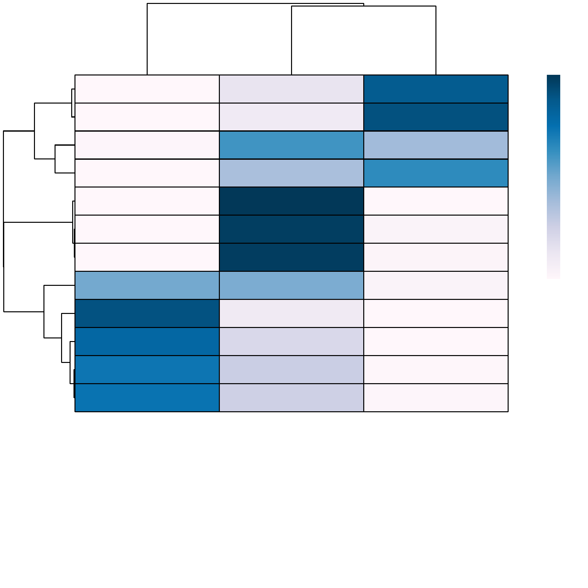

---
output:
  html_document:
    theme: yeti  # many options for theme, this one is my favorite.
params:
  threads: 20
  rdata: ""
  token: ""
  ref: ""
  out: ""
---

```{r, include=FALSE, eval=FALSE}
params2 <- params
unlockBinding("params", env = .GlobalEnv)
#load("Chapter-13-Footprints.Rdata")
load(params$rdata)
params <- params2
rm(params2)
devtools::install_github("GreenleafLab/ArchR", 
  auth_token = params$token, 
  ref = params$ref,
  repos = BiocManager::repositories(),
  dependencies = FALSE
)
library(ArchR)
fn <- unclass(lsf.str(envir = asNamespace("ArchR"), all = TRUE))
fn <- fn[!grepl("\\.", fn)]
fn <- fn[fn!="ArchRProj"]
for (i in seq_along(fn)){
    tryCatch({
        eval(parse(text = paste0(fn[i], "<-ArchR::", fn[i])))
    }, error = function(x) {
    })
}
addArchRThreads(threads = params$threads)
addArchRGenome("hg19")
# fn <- unclass(lsf.str(envir = asNamespace("ArchR"), all = TRUE))
# fn <- fn[fn!="ArchRProj"]
# for (i in seq_along(fn)) {
#     tryCatch({
#         eval(parse(text = paste0(fn[i], "<-ArchR:::", fn[i])))
#     }, error = function(x) {
#     })
# }
set.seed(1)
```

# Clustering with ArchR

Most single-cell clustering methods focus on computing nearest neighbor graphs in reduced dimensions and then identifying "communities" or clusters of cells. These approaches work extremely well and are a standard practice in scRNA-seq. For this reason, ArchR uses existing state-of-the-art clustering methods from scRNA-seq packages for clustering.

## Clustering using Seurat's `FindClusters()` function

We have had the most success using the graph clustering approach implemented by [Seurat](https://github.com/satijalab/seurat). In ArchR, clustering is performed using the `addClusters()` function which permits additional clustering parameters to be passed to the `Seurat::FindClusters()` function.

```{r eval=FALSE}
projHeme2 <- addClusters(
	input = projHeme2,
    reducedDims = "IterativeLSI",
    method = "Seurat",
    name = "Clusters",
    resolution = 0.8
)
```
>\>\> ArchR logging to : ArchRLogs/ArchR-addClusters-ee735fb26d4a-Date-2020-04-15_Time-09-46-59.log  
>\>\> If there is an issue, please report to github with logFile!  
>\>\> 2020-04-15 09:47:08 : Running Seurats FindClusters (Stuart et al. Cell 2019), 0.142 mins elapsed.  
>\>\> Computing nearest neighbor graph  
>\>\> Computing SNN  
>\>\> Modularity Optimizer version 1.3.0 by Ludo Waltman and Nees Jan van Eck  
>\>\>   
>\>\> Number of nodes: 10251  
>\>\> Number of edges: 496637  
>\>\>   
>\>\> Running Louvain algorithm...  
>\>\> Maximum modularity in 10 random starts: 0.8554  
>\>\> Number of communities: 12  
>\>\> Elapsed time: 1 seconds  
>\>\> 2020-04-15 09:47:29 : Testing Outlier Clusters, 0.483 mins elapsed.  
>\>\> 2020-04-15 09:47:29 : Assigning Cluster Names to 12 Clusters, 0.483 mins elapsed.  

To access these clusters we can use the `$` accessor

```{r eval=FALSE}
head(projHeme2$Clusters)
```
>\>\> [1] "C3"  "C8"  "C4"  "C3"  "C11" "C3"  
```{r eval=FALSE}
table(projHeme2$Clusters)
```
>\>\>   C1  C10  C11  C12   C2   C3   C4   C5   C6   C7   C8   C9  
>\>\> 1547  879  793 1650 1085  439  351  320  387  851 1271  678  

To better understand which samples reside in which clusters, we can create a cluster confusion matrix across each sample. JJJ

```{r eval=FALSE}
cM <- confusionMatrix(paste0(projHeme2$Clusters), paste0(projHeme2$Sample))
cM
```
>\>\> 12 x 3 sparse Matrix of class "dgCMatrix"  
>\>\>     scATAC_BMMC_R1 scATAC_CD34_BMMC_R1 scATAC_PBMC_R1  
>\>\> C3             251                   6            182  
>\>\> C8            1219                   .             52  
>\>\> C4             351                   .              .  
>\>\> C11            251                 541              1  
>\>\> C1            1508                   9             30  
>\>\> C12            172                1478              .  
>\>\> C10            194                 677              8  
>\>\> C9             117                   1            560  
>\>\> C7             301                   .            550  
>\>\> C5             161                 150              9  
>\>\> C2              82                   1           1002  
>\>\> C6              82                 305              .  

An example of plotting this confusion matrix as a heatmap

```{r eval=FALSE}
library(pheatmap)
cM <- cM / Matrix::rowSums(cM)
p <- pheatmap::pheatmap(
    mat = as.matrix(cM), 
    color = paletteContinuous("whiteBlue"), 
    border_color = "black"
)
p
```

```{r, include=FALSE, eval=FALSE}
plotPDF(p, name = "ConfusionMatrix", ArchRProj = projHeme2, addDOC = FALSE)
ArchR:::.convertToPNG(ArchRProj = projHeme2)
system("cp Figures/*.png images/HemeWalkthrough/PNG/")
system("cp Figures/*.pdf images/HemeWalkthrough/PDF/")
```

{width=500 height=500}

```{r include=FALSE, eval=FALSE,echo=FALSE}
#JJJ This is confusing. Expand on this - 
```
Determining the appropriate cluster parameters is useful once you have computed a 2-dimensional embedding. This is because you should be adjusting both the clustering and embedding parameters to where they both agree. 

### Clustering using `scran`

Additionally, ArchR allows for the identification of clusters with [scran](https://bioconductor.org/packages/release/bioc/html/scran.html) by changing the `method` parameter in `addClusters()`.

```{r eval=FALSE}
projHeme2 <- addClusters(
    input = projHeme2,
    reducedDims = "IterativeLSI",
    method = "scran",
    name = "ScranClusters",
    k = 15
)
```
>\>\> ArchR logging to : ArchRLogs/ArchR-addClusters-ee735ec9887a-Date-2020-04-15_Time-09-47-32.log  
>\>\> If there is an issue, please report to github with logFile!  
>\>\> 2020-04-15 09:47:39 : Running Scran SNN Graph (Lun et al. F1000Res. 2016), 0.103 mins elapsed.  
>\>\> 2020-04-15 09:47:49 : Identifying Clusters (Lun et al. F1000Res. 2016), 0.27 mins elapsed.  
>\>\> 2020-04-15 09:50:31 : Testing Outlier Clusters, 2.98 mins elapsed.  
>\>\> 2020-04-15 09:50:31 : Assigning Cluster Names to 9 Clusters, 2.98 mins elapsed.  

## Session Information  

```{r eval=FALSE}
Sys.Date()
```
>\>\> [1] "2020-04-15"

```{r eval=FALSE}
sessionInfo()
```

```{r, include=FALSE, eval=FALSE}
save.image(params$out, compress = FALSE)
```