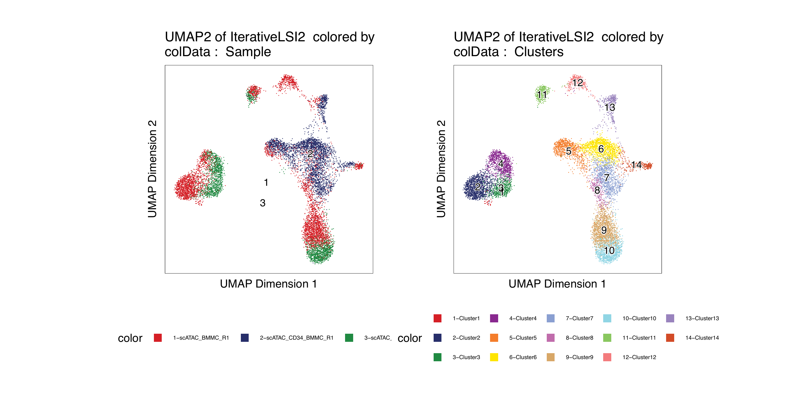
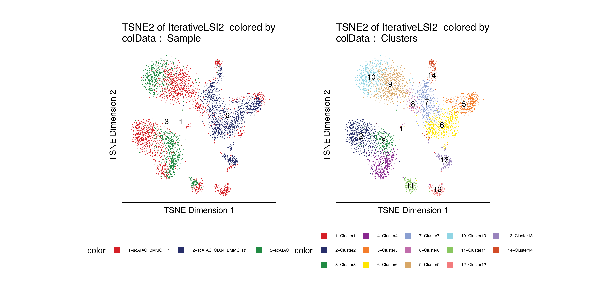

---
output:
  html_document:
    theme: yeti  # many options for theme, this one is my favorite.
params:
  threads: 20
  rdata: ""
  token: ""
  ref: ""
  out: ""
---

```{r, include=FALSE, eval=FALSE}
params2 <- params
unlockBinding("params", env = .GlobalEnv)
#load("Chapter-13-Footprints.Rdata")
load(params$rdata)
params <- params2
rm(params2)
devtools::install_github("GreenleafLab/ArchR", 
  auth_token = params$token, 
  ref = params$ref,
  repos = BiocManager::repositories(),
  dependencies = FALSE
)
library(ArchR)
fn <- unclass(lsf.str(envir = asNamespace("ArchR"), all = TRUE))
fn <- fn[!grepl("\\.", fn)]
fn <- fn[fn!="ArchRProj"]
for (i in seq_along(fn)){
    tryCatch({
        eval(parse(text = paste0(fn[i], "<-ArchR::", fn[i])))
    }, error = function(x) {
    })
}
addArchRThreads(threads = params$threads)
addArchRGenome("hg19")
# fn <- unclass(lsf.str(envir = asNamespace("ArchR"), all = TRUE))
# fn <- fn[fn!="ArchRProj"]
# for (i in seq_along(fn)) {
#     tryCatch({
#         eval(parse(text = paste0(fn[i], "<-ArchR:::", fn[i])))
#     }, error = function(x) {
#     })
# }
set.seed(1)
```

# Single Cell Embeddings

In ArchR, _embeddings_, such as Uniform Manifold Approximation and Projection (UMAP) or t-distributed stochastic neighbor embedding (t-SNE), are used to visualize single cells in reduced dimension space. These embeddings each have distinct advantages and disadvantages. We call these "embeddings" because they are strictly used to visualize the clusters and are not used to identify clusters which is done using LSI as mentioned in previous chapters. The primary difference between UMAP and t-SNE is the interpretatino of the distance between cells or clusters. t-SNE is designed to preserve the _local_ structure in the data while UMAP is designed to preserve _both the local and most of the global_ structure in the data. In theory, this means that the distance between two clusters is not informative in t-SNE but is informative in UMAP. For example, t-SNE does not allow you to say that Cluster A is more similar to Cluster B than it is to Cluster C based on  the observation that Cluster A is located closer to Cluster B than Cluster C on the t-SNE. UMAP, on the other hand, is designed to permit this type of comparison, though it is worth noting that UMAP is a new enough method that this is still being flushed out in the literature.

It is important to note that neither t-SNE nor UMAP are _deterministic_. Moreover, tweaking the input parameters will lead to different results. In the context of t-SNE and UMAP, you can effectively make the algorithm deterministic by using the same random `seed`. However, the remaining input parameters still have drastic effects on the resulting embedding. Because of this, it is important to understand the various input parameters and to tweak these to best meet the needs of your own data. ArchR implements a default set of input parameters that work for most applications but there is really no single set of parameters that will produce the desired results for datasets that vary greatly in cell number, complexity, and quality.

```{r include=FALSE, eval=FALSE,echo=FALSE}
#RRR JJJ would be nice to show the mouse atlas UMAP vs t-SNE to illustrate when t-SNE may be better than UMAP here
```

## UMAP

```{r eval=FALSE}
projHeme2 <- addUMAP(
    ArchRProj = projHeme2, 
    reducedDims = "IterativeLSI", 
    name = "UMAP", 
    nNeighbors = 30, 
    minDist = 0.5, 
    metric = "cosine"
)
```
> \## 09:50:55 UMAP embedding parameters a = 0.583 b = 1.334  
## 09:50:56 Read 10251 rows and found 30 numeric columns  
## 09:50:56 Using Annoy for neighbor search, n_neighbors = 30  
## 09:50:57 Building Annoy index with metric = cosine, n_trees = 50  
## 0%   10   20   30   40   50   60   70   80   90   100%  
## [----|----|----|----|----|----|----|----|----|----|  
## **************************************************|  
## 09:50:59 Writing NN index file to temp file /tmp/RtmpXb8qQa/fileefeefe9c02c  
## 09:50:59 Searching Annoy index using 10 threads, search_k = 3000  
## 09:51:00 Annoy recall = 100%  
## 09:51:01 Commencing smooth kNN distance calibration using 10 threads  
## 09:51:03 Initializing from normalized Laplacian + noise  
## 09:51:03 Commencing optimization for 200 epochs, with 467652 positive edges  
## 09:51:14 Optimization finished  

```{r eval=FALSE}
p1 <- plotEmbedding(ArchRProj = projHeme2, colorBy = "cellColData", name = "Sample", embedding = "UMAP")
```
> \## ArchR logging to : ArchRLogs/ArchR-plotEmbedding-efee4e054106-Date-2020-04-15_Time-09-51-17.log  
## If there is an issue, please report to github with logFile!  
## Getting UMAP Embedding  
## ColorBy = cellColData  
## Plotting Embedding  
## 1   
## ArchR logging successful to : ArchRLogs/ArchR-plotEmbedding-efee4e054106-Date-2020-04-15_Time-09-51-17.log  

```{r eval=FALSE}
p2 <- plotEmbedding(ArchRProj = projHeme2, colorBy = "cellColData", name = "Clusters", embedding = "UMAP")
```
> \## ArchR logging to : ArchRLogs/ArchR-plotEmbedding-efee3f232286-Date-2020-04-15_Time-09-51-18.log  
## If there is an issue, please report to github with logFile!  
## Getting UMAP Embedding  
## ColorBy = cellColData  
## Plotting Embedding  
## 1   
## ArchR logging successful to : ArchRLogs/ArchR-plotEmbedding-efee3f232286-Date-2020-04-15_Time-09-51-18.log  

```{r eval=FALSE}
ggAlignPlots(p1, p2, type = "h")
```

```{r, include=FALSE, eval=FALSE}
plotPDF(
    ggAlignPlots(p1, p2, type = "h", draw=FALSE), 
    name = "Plot-UMAP-Sample-Clusters-Combined.pdf", 
    ArchRProj = projHeme2,
    addDOC = FALSE,
    width = 10, 
    height = 5
)
ArchR:::.convertToPNG(ArchRProj = projHeme2)
system("cp Figures/*.png images/HemeWalkthrough/PNG/")
system("cp Figures/*.pdf images/HemeWalkthrough/PDF/")
```

{width=800 height=400}

To save a nice looking pdf we use plotPDF which removes white pages and tries to make the plots
nice looking.

```{r eval=FALSE}
plotPDF(p1,p2, name = "Plot-UMAP-Sample-Clusters.pdf", ArchRProj = projHeme2, addDOC = FALSE, width = 5, height = 5)
```
> \## [1] "plotting ggplot!"  
## [1] "plotting ggplot!"  
## [1] 0  

[Download PDF : Plot-UMAP-Sample-Clusters.pdf](images/HemeWalkthrough/PDF/Plot-UMAP-Sample-Clusters.pdf)

We can also see the results from scran clustering

```{r eval=FALSE}
p1 <- plotEmbedding(ArchRProj = projHeme2, colorBy = "cellColData", name = "Sample", embedding = "UMAP")
```
> \## ArchR logging to : ArchRLogs/ArchR-plotEmbedding-efee6f4b8b88-Date-2020-04-15_Time-09-51-38.log  
## If there is an issue, please report to github with logFile!  
## Getting UMAP Embedding  
## ColorBy = cellColData  
## Plotting Embedding  
## 1  
## ArchR logging successful to : ArchRLogs/ArchR-plotEmbedding-efee6f4b8b88-Date-2020-04-15_Time-09-51-38.log  

```{r eval=FALSE}
p2 <- plotEmbedding(ArchRProj = projHeme2, colorBy = "cellColData", name = "ScranClusters", embedding = "UMAP")
```
> \## ArchR logging to : ArchRLogs/ArchR-plotEmbedding-efee6c73b6da-Date-2020-04-15_Time-09-51-39.log  
## If there is an issue, please report to github with logFile!  
## Getting UMAP Embedding  
## ColorBy = cellColData  
## Plotting Embedding  
## 1   
## ArchR logging successful to : ArchRLogs/ArchR-plotEmbedding-efee6c73b6da-Date-2020-04-15_Time-09-51-39.log  

```{r eval=FALSE}
ggAlignPlots(p1, p2, type = "h")
```

```{r, include=FALSE, eval=FALSE}
plotPDF(
    ggAlignPlots(p1, p2, type = "h", draw=FALSE), 
    name = "Plot-UMAP-Sample-ScranClusters-Combined.pdf", 
    ArchRProj = projHeme2,
    addDOC = FALSE,
    width = 10, 
    height = 5
)
ArchR:::.convertToPNG(ArchRProj = projHeme2)
system("cp Figures/*.png images/HemeWalkthrough/PNG/")
system("cp Figures/*.pdf images/HemeWalkthrough/PDF/")
```

{width=800 height=400}

To save a nice looking pdf we use plotPDF which removes white pages and tries to make the plots
nice looking.

```{r eval=FALSE}
plotPDF(p1,p2, name = "Plot-UMAP-Sample-ScranClusters.pdf", ArchRProj = projHeme2, addDOC = FALSE, width = 5, height = 5)
```
> \## [1] "plotting ggplot!"  
## [1] "plotting ggplot!"  
## [1] 0  

[Download PDF : Plot-UMAP-Sample-ScranClusters.pdf](images/HemeWalkthrough/PDF/Plot-UMAP-Sample-ScranClusters.pdf)


## tSNE

```{r eval=FALSE}
projHeme2 <- addTSNE(
    ArchRProj = projHeme2, 
    reducedDims = "IterativeLSI", 
    name = "TSNE", 
    perplexity = 30
)
```
> \## Read the 10251 x 30 data matrix successfully!  
## OpenMP is working. 9 threads.  
## Using no_dims = 2, perplexity = 30.000000, and theta = 0.500000  
## Computing input similarities...  
## Building tree...  
##  - point 10000 of 10251  
##  - point 10000 of 10251  
## Done in 9.33 seconds (sparsity = 0.013318)!  
## Learning embedding...  
## Iteration 50: error is 96.116599 (50 iterations in 7.59 seconds)  
## Iteration 100: error is 84.202047 (50 iterations in 7.93 seconds)  
## Iteration 150: error is 81.634548 (50 iterations in 6.24 seconds)  
## Iteration 200: error is 80.924221 (50 iterations in 6.33 seconds)  
## Iteration 250: error is 80.681514 (50 iterations in 6.60 seconds)  
## Iteration 300: error is 3.272456 (50 iterations in 5.98 seconds)  
## Iteration 350: error is 3.003011 (50 iterations in 5.69 seconds)  
## Iteration 400: error is 2.860067 (50 iterations in 5.58 seconds)  
## Iteration 450: error is 2.771029 (50 iterations in 5.53 seconds)  
## Iteration 500: error is 2.708926 (50 iterations in 5.58 seconds)  
## Iteration 550: error is 2.662250 (50 iterations in 5.49 seconds)  
## Iteration 600: error is 2.626274 (50 iterations in 5.53 seconds)  
## Iteration 650: error is 2.597377 (50 iterations in 5.48 seconds)  
## Iteration 700: error is 2.573140 (50 iterations in 5.48 seconds)  
## Iteration 750: error is 2.553895 (50 iterations in 5.43 seconds)  
## Iteration 800: error is 2.540270 (50 iterations in 5.46 seconds)  
## Iteration 850: error is 2.531147 (50 iterations in 5.64 seconds)  
## Iteration 900: error is 2.524095 (50 iterations in 5.73 seconds)  
## Iteration 950: error is 2.517901 (50 iterations in 5.63 seconds)  
## Iteration 1000: error is 2.511794 (50 iterations in 5.47 seconds)  
## Fitting performed in 118.39 seconds.  

```{r eval=FALSE}
p1 <- plotEmbedding(ArchRProj = projHeme2, colorBy = "cellColData", name = "Sample", embedding = "TSNE")
```
> \## ArchR logging to : ArchRLogs/ArchR-plotEmbedding-efee11770af1-Date-2020-04-15_Time-09-52-22.log  
## If there is an issue, please report to github with logFile!  
## Getting UMAP Embedding  
## ColorBy = cellColData  
## Plotting Embedding  
## 1   
## ArchR logging successful to : ArchRLogs/ArchR-plotEmbedding-efee11770af1-Date-2020-04-15_Time-09-52-22.log  
```{r eval=FALSE}
p2 <- plotEmbedding(ArchRProj = projHeme2, colorBy = "cellColData", name = "Clusters", embedding = "TSNE")
```
> \## ArchR logging to : ArchRLogs/ArchR-plotEmbedding-efee339a10ad-Date-2020-04-15_Time-09-52-23.log  
## If there is an issue, please report to github with logFile!  
## Getting UMAP Embedding  
## ColorBy = cellColData  
## Plotting Embedding  
## 1   
## ArchR logging successful to : ArchRLogs/ArchR-plotEmbedding-efee339a10ad-Date-2020-04-15_Time-09-52-23.log  
```{r eval=FALSE}
ggAlignPlots(p1, p2, type = "h")
```

```{r, include=FALSE, eval=FALSE}
plotPDF(
    ggAlignPlots(p1, p2, type = "h", draw=FALSE), 
    name = "Plot-TSNE-Sample-Clusters-Combined.pdf", 
    ArchRProj = projHeme2,
    addDOC = FALSE,
    width = 10, 
    height = 5
)
ArchR:::.convertToPNG(ArchRProj = projHeme2)
system("cp Figures/*.png images/HemeWalkthrough/PNG/")
system("cp Figures/*.pdf images/HemeWalkthrough/PDF/")
```

{width=800 height=400}


To save a nice looking pdf we use plotPDF which removes white pages and tries to make the plots
nice looking.

```{r eval=FALSE}
plotPDF(p1,p2, name = "Plot-TSNE-Sample-Clusters.pdf", ArchRProj = projHeme2, addDOC = FALSE, width = 5, height = 5)
```
> \## [1] "plotting ggplot!"  
## [1] "plotting ggplot!"  
## [1] 0  

[Download PDF : Plot-TSNE-Sample-Clusters.pdf](images/HemeWalkthrough/PDF/Plot-TSNE-Sample-Clusters.pdf)

We can also see the results from scran clustering

```{r eval=FALSE}
p1 <- plotEmbedding(ArchRProj = projHeme2, colorBy = "cellColData", name = "Sample", embedding = "TSNE")
```
> \## ArchR logging to : ArchRLogs/ArchR-plotEmbedding-efeeb55d566-Date-2020-04-15_Time-09-52-45.log  
## If there is an issue, please report to github with logFile!  
## Getting UMAP Embedding  
## ColorBy = cellColData  
## Plotting Embedding  
## 1   
## ArchR logging successful to : ArchRLogs/ArchR-plotEmbedding-efeeb55d566-Date-2020-04-15_Time-09-52-45.log  

```{r eval=FALSE}
p2 <- plotEmbedding(ArchRProj = projHeme2, colorBy = "cellColData", name = "ScranClusters", embedding = "TSNE")
```
> \## ArchR logging to : ArchRLogs/ArchR-plotEmbedding-efee4843c8ed-Date-2020-04-15_Time-09-52-46.log  
## If there is an issue, please report to github with logFile!  
## Getting UMAP Embedding  
## ColorBy = cellColData  
## Plotting Embedding  
## 1   
## ArchR logging successful to : ArchRLogs/ArchR-plotEmbedding-efee4843c8ed-Date-2020-04-15_Time-09-52-46.log  

```{r eval=FALSE}
ggAlignPlots(p1, p2, type = "h")
```

```{r, include=FALSE, eval=FALSE}
plotPDF(
    ggAlignPlots(p1, p2, type = "h", draw=FALSE), 
    name = "Plot-tSNE-Sample-ScranClusters-Combined.pdf", 
    ArchRProj = projHeme2,
    addDOC = FALSE,
    width = 10, 
    height = 5
)
ArchR:::.convertToPNG(ArchRProj = projHeme2)
system("cp Figures/*.png images/HemeWalkthrough/PNG/")
system("cp Figures/*.pdf images/HemeWalkthrough/PDF/")
```

{width=800 height=400}

To save a nice looking pdf we use plotPDF which removes white pages and tries to make the plots
nice looking.

```{r eval=FALSE}
plotPDF(p1,p2, name = "Plot-tSNE-Sample-ScranClusters.pdf", ArchRProj = projHeme2, addDOC = FALSE, width = 5, height = 5)
```
> \## [1] "plotting ggplot!"  
## [1] "plotting ggplot!"  
## [1] 0  

[Download PDF : Plot-tSNE-Sample-ScranClusters.pdf](images/HemeWalkthrough/PDF/Plot-tSNE-Sample-ScranClusters.pdf)

## UMAP of previous Reduced Dimensions
```{r include=FALSE, eval=FALSE,echo=FALSE}
#JJJ There is no sense of why you are running this again for IterativeLSI2. It just looks like the same thing one more time. Need to provide context.
#JJJ Also, calling this "previous reduced dimensions" doesnt really make sense because all of the reduced dimensions were calculated previously.
```

```{r eval=FALSE}
projHeme2 <- addUMAP(
    ArchRProj = projHeme2, 
    reducedDims = "IterativeLSI2", 
    name = "UMAP2", 
    nNeighbors = 30, 
    minDist = 0.5, 
    metric = "cosine"
)
```
> \## 09:53:07 UMAP embedding parameters a = 0.583 b = 1.334  
## 09:53:07 Read 10251 rows and found 30 numeric columns  
## 09:53:07 Using Annoy for neighbor search, n_neighbors = 30  
## 09:53:07 Building Annoy index with metric = cosine, n_trees = 50  
## 0%   10   20   30   40   50   60   70   80   90   100%  
## [----|----|----|----|----|----|----|----|----|----|  
## **************************************************|  
## 09:53:10 Writing NN index file to temp file /tmp/RtmpXb8qQa/fileefee233dd970  
## 09:53:10 Searching Annoy index using 10 threads, search_k = 3000  
## 09:53:11 Annoy recall = 100%  
## 09:53:12 Commencing smooth kNN distance calibration using 10 threads  
## 09:53:13 Initializing from normalized Laplacian + noise  
## 09:53:14 Commencing optimization for 200 epochs, with 478078 positive edges  
## 09:53:27 Optimization finished  

```{r eval=FALSE}
p1 <- plotEmbedding(ArchRProj = projHeme2, colorBy = "cellColData", name = "Sample", embedding = "UMAP2")
```
> \## ArchR logging to : ArchRLogs/ArchR-plotEmbedding-efee1a41702a-Date-2020-04-15_Time-09-53-28.log  
## If there is an issue, please report to github with logFile!  
## Getting UMAP Embedding  
## ColorBy = cellColData  
## Plotting Embedding  
## 1   
## ArchR logging successful to : ArchRLogs/ArchR-plotEmbedding-efee1a41702a-Date-2020-04-15_Time-09-53-28.log  

```{r eval=FALSE}
p2 <- plotEmbedding(ArchRProj = projHeme2, colorBy = "cellColData", name = "Clusters", embedding = "UMAP2")
```
> \## ArchR logging to : ArchRLogs/ArchR-plotEmbedding-efee328899a4-Date-2020-04-15_Time-09-53-29.log  
## If there is an issue, please report to github with logFile!  
## Getting UMAP Embedding  
## ColorBy = cellColData  
## Plotting Embedding  
## 1   
## ArchR logging successful to : ArchRLogs/ArchR-plotEmbedding-efee328899a4-Date-2020-04-15_Time-09-53-29.log  

```{r eval=FALSE}
ggAlignPlots(p1, p2, type = "h")
```

```{r, include=FALSE, eval=FALSE}
plotPDF(
    ggAlignPlots(p1, p2, type = "h", draw=FALSE), 
    name = "Plot-UMAP2-Sample-Clusters-Combined.pdf", 
    ArchRProj = projHeme2,
    addDOC = FALSE,
    width = 10, 
    height = 5
)
ArchR:::.convertToPNG(ArchRProj = projHeme2)
system("cp Figures/*.png images/HemeWalkthrough/PNG/")
system("cp Figures/*.pdf images/HemeWalkthrough/PDF/")
```

{width=800 height=400}


```{r eval=FALSE}
projHeme2 <- addUMAP(
    ArchRProj = projHeme2, 
    reducedDims = "Harmony", 
    name = "UMAPHarmony", 
    nNeighbors = 30, 
    minDist = 0.5, 
    metric = "cosine"
)
```
> \## 09:53:44 UMAP embedding parameters a = 0.583 b = 1.334  
## 09:53:44 Read 10251 rows and found 30 numeric columns  
## 09:53:44 Using Annoy for neighbor search, n_neighbors = 30  
## 09:53:44 Building Annoy index with metric = cosine, n_trees = 50  
## 0%   10   20   30   40   50   60   70   80   90   100%  
## [----|----|----|----|----|----|----|----|----|----|  
## **************************************************|  
## 09:53:47 Writing NN index file to temp file /tmp/RtmpXb8qQa/fileefee55b054c6  
## 09:53:47 Searching Annoy index using 10 threads, search_k = 3000  
## 09:53:48 Annoy recall = 100%  
## 09:53:49 Commencing smooth kNN distance calibration using 10 threads  
## 09:53:50 Initializing from normalized Laplacian + noise  
## 09:53:51 Commencing optimization for 200 epochs, with 472754 positive edges  
## 09:54:01 Optimization finished  

```{r eval=FALSE}
p3 <- plotEmbedding(ArchRProj = projHeme2, colorBy = "cellColData", name = "Sample", embedding = "UMAPHarmony")
```
> \## ArchR logging to : ArchRLogs/ArchR-plotEmbedding-efeea6eac67-Date-2020-04-15_Time-09-54-03.log  
## If there is an issue, please report to github with logFile!  
## Getting UMAP Embedding  
## ColorBy = cellColData  
## Plotting Embedding  
## 1   
## ArchR logging successful to : ArchRLogs/ArchR-plotEmbedding-efeea6eac67-Date-2020-04-15_Time-09-54-03.log  

```{r eval=FALSE}
p4 <- plotEmbedding(ArchRProj = projHeme2, colorBy = "cellColData", name = "Clusters", embedding = "UMAPHarmony")
```
> \## ArchR logging to : ArchRLogs/ArchR-plotEmbedding-efee76ae6a66-Date-2020-04-15_Time-09-54-04.log  
## If there is an issue, please report to github with logFile!  
## Getting UMAP Embedding  
## ColorBy = cellColData  
## Plotting Embedding  
## 1   
## ArchR logging successful to : ArchRLogs/ArchR-plotEmbedding-efee76ae6a66-Date-2020-04-15_Time-09-54-04.log  

```{r eval=FALSE}
ggAlignPlots(p3, p4, type = "h")
```

```{r, include=FALSE, eval=FALSE}
plotPDF(
    ggAlignPlots(p3, p4, type = "h", draw=FALSE), 
    name = "Plot-UMAPHarmony-Sample-Clusters-Combined.pdf", 
    ArchRProj = projHeme2,
    addDOC = FALSE,
    width = 10, 
    height = 5
)
ArchR:::.convertToPNG(ArchRProj = projHeme2)
system("cp Figures/*.png images/HemeWalkthrough/PNG/")
system("cp Figures/*.pdf images/HemeWalkthrough/PDF/")
```

{width=800 height=400}


To save a nice looking pdf we use plotPDF which removes white pages and tries to make the plots
nice looking.

```{r eval=FALSE}
plotPDF(p1,p2,p3,p4, name = "Plot-UMAP2Harmony-Sample-Clusters.pdf", ArchRProj = projHeme2, addDOC = FALSE, width = 5, height = 5)
```
> \## [1] "plotting ggplot!"  
## [1] "plotting ggplot!"  
## [1] "plotting ggplot!"  
## [1] "plotting ggplot!"  
## [1] 0  

[Download PDF : Plot-UMAP2Harmony-Sample-Clusters.pdf](images/HemeWalkthrough/PDF/Plot-UMAP2Harmony-Sample-Clusters.pdf)

## tSNE of previous Reduced Dimensions

```{r eval=FALSE}
projHeme2 <- addTSNE(
    ArchRProj = projHeme2, 
    reducedDims = "IterativeLSI2", 
    name = "TSNE2", 
    perplexity = 30
)
```
> \## Read the 10251 x 30 data matrix successfully!  
## OpenMP is working. 9 threads.  
## Using no_dims = 2, perplexity = 30.000000, and theta = 0.500000  
## Computing input similarities...  
## Building tree...  
##  - point 10000 of 10251  
## Done in 9.63 seconds (sparsity = 0.013618)!  
## Learning embedding...  
## Iteration 50: error is 95.772700 (50 iterations in 6.87 seconds)  
## Iteration 100: error is 83.923080 (50 iterations in 7.81 seconds)  
## Iteration 150: error is 81.348909 (50 iterations in 6.31 seconds)  
## Iteration 200: error is 80.912996 (50 iterations in 6.82 seconds)  
## Iteration 250: error is 80.714465 (50 iterations in 7.05 seconds)  
## Iteration 300: error is 3.324795 (50 iterations in 6.23 seconds)  
## Iteration 350: error is 3.087512 (50 iterations in 5.69 seconds)  
## Iteration 400: error is 2.960654 (50 iterations in 5.52 seconds)  
## Iteration 450: error is 2.882221 (50 iterations in 5.44 seconds)  
## Iteration 500: error is 2.826578 (50 iterations in 5.41 seconds)  
## Iteration 550: error is 2.785697 (50 iterations in 5.34 seconds)  
## Iteration 600: error is 2.752606 (50 iterations in 5.40 seconds)  
## Iteration 650: error is 2.725781 (50 iterations in 5.44 seconds)  
## Iteration 700: error is 2.705748 (50 iterations in 5.46 seconds)  
## Iteration 750: error is 2.689941 (50 iterations in 5.48 seconds)  
## Iteration 800: error is 2.678175 (50 iterations in 5.48 seconds)  
## Iteration 850: error is 2.669356 (50 iterations in 5.54 seconds)  
## Iteration 900: error is 2.662153 (50 iterations in 5.68 seconds)  
## Iteration 950: error is 2.654785 (50 iterations in 5.67 seconds)  
## Iteration 1000: error is 2.647983 (50 iterations in 5.61 seconds)  
## Fitting performed in 118.25 seconds.  

```{r eval=FALSE}
p1 <- plotEmbedding(ArchRProj = projHeme2, colorBy = "cellColData", name = "Sample", embedding = "TSNE2")
```
> \## ArchR logging to : ArchRLogs/ArchR-plotEmbedding-efee7100bd0c-Date-2020-04-15_Time-09-54-51.log  
## If there is an issue, please report to github with logFile!  
## Getting UMAP Embedding  
## ColorBy = cellColData  
## Plotting Embedding  
## 1  
## ArchR logging successful to : ArchRLogs/ArchR-plotEmbedding-efee7100bd0c-Date-2020-04-15_Time-09-54-51.log  

```{r eval=FALSE}
p2 <- plotEmbedding(ArchRProj = projHeme2, colorBy = "cellColData", name = "Clusters", embedding = "TSNE2")
```
> \## ArchR logging to : ArchRLogs/ArchR-plotEmbedding-efee65156ac0-Date-2020-04-15_Time-09-54-52.log  
## If there is an issue, please report to github with logFile!  
## Getting UMAP Embedding  
## ColorBy = cellColData  
## Plotting Embedding  
## 1   
## ArchR logging successful to : ArchRLogs/ArchR-plotEmbedding-efee65156ac0-Date-2020-04-15_Time-09-54-52.log  

```{r eval=FALSE}
ggAlignPlots(p1, p2, type = "h")
```

```{r, include=FALSE, eval=FALSE}
plotPDF(
    ggAlignPlots(p1, p2, type = "h", draw=FALSE), 
    name = "Plot-TSNE2-Sample-Clusters-Combined.pdf", 
    ArchRProj = projHeme2,
    addDOC = FALSE,
    width = 10, 
    height = 5
)
ArchR:::.convertToPNG(ArchRProj = projHeme2)
system("cp Figures/*.png images/HemeWalkthrough/PNG/")
system("cp Figures/*.pdf images/HemeWalkthrough/PDF/")
```

{width=800 height=400}


```{r eval=FALSE}
projHeme2 <- addTSNE(
    ArchRProj = projHeme2, 
    reducedDims = "Harmony", 
    name = "TSNEHarmony", 
    perplexity = 30
)
```
> \## Read the 10251 x 30 data matrix successfully!  
## OpenMP is working. 9 threads.  
## Using no_dims = 2, perplexity = 30.000000, and theta = 0.500000  
## Computing input similarities...  
## Building tree...  
##  - point 10000 of 10251  
## Done in 12.20 seconds (sparsity = 0.013705)!  
## Learning embedding...  
## Iteration 50: error is 95.841545 (50 iterations in 9.09 seconds)  
## Iteration 100: error is 86.878252 (50 iterations in 10.44 seconds)  
## Iteration 150: error is 84.458350 (50 iterations in 6.52 seconds)  
## Iteration 200: error is 84.214403 (50 iterations in 6.81 seconds)  
## Iteration 250: error is 84.119663 (50 iterations in 6.93 seconds)  
## Iteration 300: error is 3.435665 (50 iterations in 6.05 seconds)  
## Iteration 350: error is 3.186510 (50 iterations in 5.82 seconds)  
## Iteration 400: error is 3.055847 (50 iterations in 5.83 seconds)  
## Iteration 450: error is 2.971219 (50 iterations in 5.78 seconds)  
## Iteration 500: error is 2.911368 (50 iterations in 5.75 seconds)  
## Iteration 550: error is 2.867716 (50 iterations in 5.70 seconds)  
## Iteration 600: error is 2.833307 (50 iterations in 5.75 seconds)  
## Iteration 650: error is 2.806291 (50 iterations in 5.72 seconds)  
## Iteration 700: error is 2.784594 (50 iterations in 5.68 seconds)  
## Iteration 750: error is 2.767633 (50 iterations in 5.68 seconds)  
## Iteration 800: error is 2.754284 (50 iterations in 5.72 seconds)  
## Iteration 850: error is 2.743628 (50 iterations in 5.71 seconds)  
## Iteration 900: error is 2.735122 (50 iterations in 5.71 seconds)  
## Iteration 950: error is 2.727634 (50 iterations in 5.67 seconds)  
## Iteration 1000: error is 2.721500 (50 iterations in 5.69 seconds)  
## Fitting performed in 126.05 seconds.  

```{r eval=FALSE}
p3 <- plotEmbedding(ArchRProj = projHeme2, colorBy = "cellColData", name = "Sample", embedding = "TSNEHarmony")
```
> \## ArchR logging to : ArchRLogs/ArchR-plotEmbedding-efee50fc7167-Date-2020-04-15_Time-09-55-42.log  
## If there is an issue, please report to github with logFile!  
## Getting UMAP Embedding  
## ColorBy = cellColData  
## Plotting Embedding  
## 1   
## ArchR logging successful to : ArchRLogs/ArchR-plotEmbedding-efee50fc7167-Date-2020-04-15_Time-09-55-42.log  

```{r eval=FALSE}
p4 <- plotEmbedding(ArchRProj = projHeme2, colorBy = "cellColData", name = "Clusters", embedding = "TSNEHarmony")
```
> \## ArchR logging to : ArchRLogs/ArchR-plotEmbedding-efee8ad75d2-Date-2020-04-15_Time-09-55-42.log  
## If there is an issue, please report to github with logFile!  
## Getting UMAP Embedding  
## ColorBy = cellColData  
## Plotting Embedding  
## 1   
## ArchR logging successful to : ArchRLogs/ArchR-plotEmbedding-efee8ad75d2-Date-2020-04-15_Time-09-55-42.log  

```{r eval=FALSE}
ggAlignPlots(p3, p4, type = "h")
```

```{r, include=FALSE, eval=FALSE}
plotPDF(
    ggAlignPlots(p3, p4, type = "h", draw=FALSE), 
    name = "Plot-TSNEHarmony-Sample-Clusters-Combined.pdf", 
    ArchRProj = projHeme2,
    addDOC = FALSE,
    width = 10, 
    height = 5
)
ArchR:::.convertToPNG(ArchRProj = projHeme2)
system("cp Figures/*.png images/HemeWalkthrough/PNG/")
system("cp Figures/*.pdf images/HemeWalkthrough/PDF/")
```

{width=800 height=400}

To save a nice looking pdf we use plotPDF which removes white pages and tries to make the plots
nice looking.

```{r eval=FALSE}
plotPDF(p1,p2,p3,p4, name = "Plot-TSNE2Harmony-Sample-Clusters.pdf", ArchRProj = projHeme2, addDOC = FALSE, width = 5, height = 5)
```
> \## [1] "plotting ggplot!"  
## [1] "plotting ggplot!"  
## [1] "plotting ggplot!"  
## [1] "plotting ggplot!"  
## [1] 0  

[Download PDF : Plot-TSNE2Harmony-Sample-Clusters.pdf](images/HemeWalkthrough/PDF/Plot-TSNE2Harmony-Sample-Clusters.pdf)

```{r, include=FALSE, eval=FALSE}
save.image(params$out, compress = FALSE)
```
