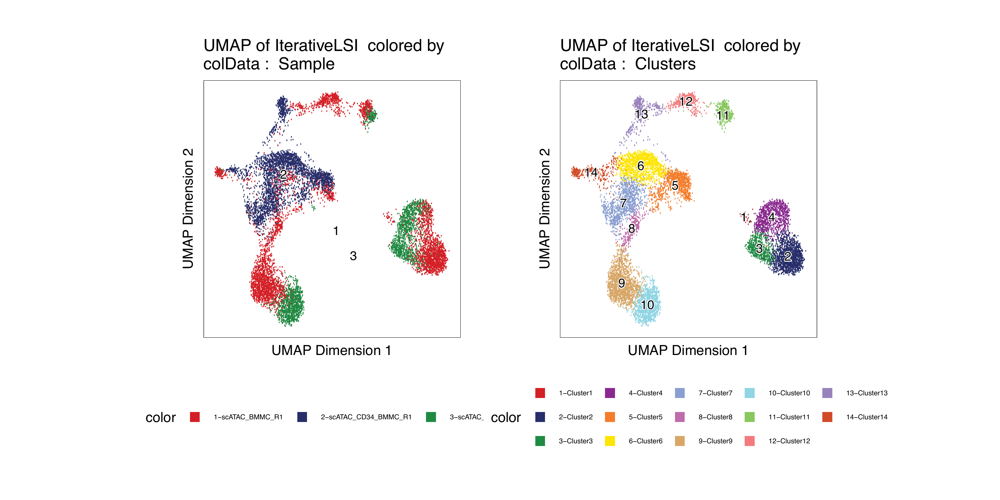
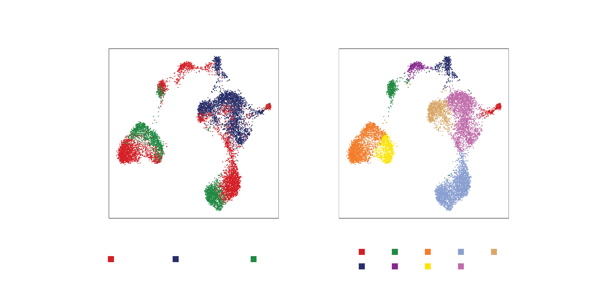
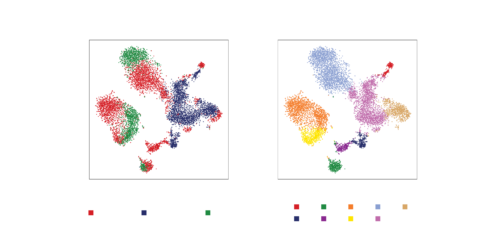
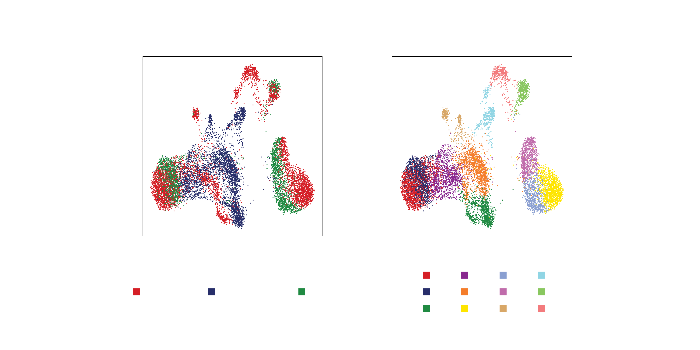
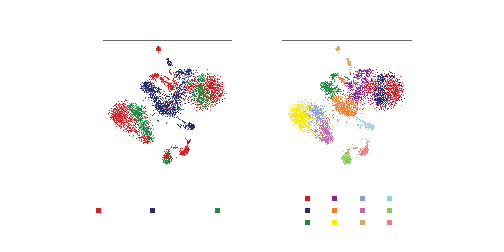

---
output:
  html_document:
    theme: yeti  # many options for theme, this one is my favorite.
params:
  threads: 20
  rdata: ""
  token: ""
  ref: ""
  out: ""
---

```{r, include=FALSE}
load("ch5.RData")
```

# Single-cell Embeddings

In ArchR, _embeddings_, such as Uniform Manifold Approximation and Projection (UMAP) or t-distributed stochastic neighbor embedding (t-SNE), are used to visualize single cells in reduced dimension space. These embeddings each have distinct advantages and disadvantages. We call these "embeddings" because they are strictly used to visualize the clusters and are not used to identify clusters which is done in an LSI sub-space as mentioned in previous chapters. The primary difference between UMAP and t-SNE is the interpretatino of the distance between cells or clusters. t-SNE is designed to preserve the _local_ structure in the data while UMAP is designed to preserve _both the local and most of the global_ structure in the data. In theory, this means that the distance between two clusters is not informative in t-SNE but is informative in UMAP. For example, t-SNE does not allow you to say that Cluster A is more similar to Cluster B than it is to Cluster C based on  the observation that Cluster A is located closer to Cluster B than Cluster C on the t-SNE. UMAP, on the other hand, is designed to permit this type of comparison, though it is worth noting that UMAP is a new enough method that this is still being flushed out in the literature.

It is important to note that neither t-SNE nor UMAP are naturally _deterministic_ (same input always gives exactly the same output). However, t-SNE shows much more randomness across multiple replicates of the same input than does UMAP. Moreover, UMAP as implemented in the `uwot` package is effectively deterministic when using the same random `seed`. The choice of whether to use UMAP or t-SNE is nuanced but in our hands, UMAP works very well for a diverse set of applications and this is our standard choice for scATAC-seq data. UMAP also performs faster than t-SNE. Perhaps most importantly, with UMAP you can create an embedding and project new samples into that embedding and this is not possible with t-SNE because the fitting and prediction of data happens simultaneously.

Regardless of which method you choose, the input parameters can have drastic effects on the resulting embedding. Because of this, it is important to understand the various input parameters and to tweak these to best meet the needs of your own data. ArchR implements a default set of input parameters that work for most applications but there is really no single set of parameters that will produce the desired results for datasets that vary greatly in cell number, complexity, and quality.

```{r include=FALSE, eval=FALSE,echo=FALSE}
#RRR JJJ would be nice to show the mouse atlas UMAP vs t-SNE to illustrate when t-SNE may be better than UMAP here
```

## Uniform Manifold Approximation and Projection (UMAP)

To run UMAP in ArchR we use the `addUMAP()` function:
```{r, collapse=TRUE}
projHeme2 <- addUMAP(
    ArchRProj = projHeme2, 
    reducedDims = "IterativeLSI", 
    name = "UMAP", 
    nNeighbors = 30, 
    minDist = 0.5, 
    metric = "cosine"
)
```

You can list the available `embeddings` objects in an `ArchRProject` using the slot extraction opperator `@`:
```{r include=FALSE, eval=FALSE, becho=FALSE}
#JJJ add an example of accessing with @
#projHeme2@embeddings
```

To plot the UMAP results, we use the `plotEmbedding()` function and pass the name of the UMAP embedding we just generated ("UMAP"). We can tell ArchR how to color the cells by using a combination of `colorBy` which tells ArchR which matrix to use to find the specified metadata column provided to `name`.
```{r}
p1 <- plotEmbedding(ArchRProj = projHeme2, colorBy = "cellColData", name = "Sample", embedding = "UMAP")
```

Instead of coloring by "Sample" as above, we can color by "Clusters" which were identified in a previous chapter.
```{r}
p2 <- plotEmbedding(ArchRProj = projHeme2, colorBy = "cellColData", name = "Clusters", embedding = "UMAP")
```

We can visualize these two plots side by side using the `ggAlignPlots()` function, specifying a horizontal orientation using `type = "h"`.
```{r}
ggAlignPlots(p1, p2, type = "h")
```

```{r, include=FALSE}
plotPDF(
    ggAlignPlots(p1, p2, type = "h", draw=FALSE), 
    name = "Plot-UMAP-Sample-Clusters-Combined.pdf", 
    ArchRProj = projHeme2,
    addDOC = FALSE,
    width = 10, 
    height = 5
)
ArchR:::.convertToPNG(ArchRProj = projHeme2)
system("cp Figures/*.png images/HemeWalkthrough/PNG/")
system("cp Figures/*.pdf images/HemeWalkthrough/PDF/")
```

{width=800 height=400}

To save an editable vectorized version of this plot, we use `plotPDF()`.

```{r, collapse=TRUE}
plotPDF(p1,p2, name = "Plot-UMAP-Sample-Clusters.pdf", ArchRProj = projHeme2, addDOC = FALSE, width = 5, height = 5)
```
[Download PDF : Plot-UMAP-Sample-Clusters.pdf](images/HemeWalkthrough/PDF/Plot-UMAP-Sample-Clusters.pdf)

We can also use `plotEmbedding()` to visualize the results from clustering using `scran`:

```{r, collapse=TRUE}
p1 <- plotEmbedding(ArchRProj = projHeme2, colorBy = "cellColData", name = "Sample", embedding = "UMAP")
```

```{r, collapse=TRUE}
p2 <- plotEmbedding(ArchRProj = projHeme2, colorBy = "cellColData", name = "ScranClusters", embedding = "UMAP")
```

```{r}
ggAlignPlots(p1, p2, type = "h")
```

```{r, include=FALSE}
plotPDF(
    ggAlignPlots(p1, p2, type = "h", draw=FALSE), 
    name = "Plot-UMAP-Sample-ScranClusters-Combined.pdf", 
    ArchRProj = projHeme2,
    addDOC = FALSE,
    width = 10, 
    height = 5
)
ArchR:::.convertToPNG(ArchRProj = projHeme2)
system("cp Figures/*.png images/HemeWalkthrough/PNG/")
system("cp Figures/*.pdf images/HemeWalkthrough/PDF/")
```

{width=800 height=400}

To save an editable vectorized version of this plot, we use `plotPDF()`.

```{r, collapse=TRUE}
plotPDF(p1,p2, name = "Plot-UMAP-Sample-ScranClusters.pdf", ArchRProj = projHeme2, addDOC = FALSE, width = 5, height = 5)
```

[Download PDF : Plot-UMAP-Sample-ScranClusters.pdf](images/HemeWalkthrough/PDF/Plot-UMAP-Sample-ScranClusters.pdf)


## t-Stocastic Neighbor Embedding (t-SNE)

To run t-SNE in ArchR we use the `addTSNE()` function:
```{r, collapse=TRUE}
projHeme2 <- addTSNE(
    ArchRProj = projHeme2, 
    reducedDims = "IterativeLSI", 
    name = "TSNE", 
    perplexity = 30
)
```
Similar to UMAP, we can plot the t-SNE embedding using `plotEmbedding()`. The same parameters apply to `colorBy` and `name` regardless of which type of embedding is being used.
```{r, collapse=TRUE}
p1 <- plotEmbedding(ArchRProj = projHeme2, colorBy = "cellColData", name = "Sample", embedding = "TSNE")
```

```{r, collapse=TRUE}
p2 <- plotEmbedding(ArchRProj = projHeme2, colorBy = "cellColData", name = "Clusters", embedding = "TSNE")
```

```{r eval=FALSE}
ggAlignPlots(p1, p2, type = "h")
```

```{r, include=FALSE}
plotPDF(
    ggAlignPlots(p1, p2, type = "h", draw=FALSE), 
    name = "Plot-TSNE-Sample-Clusters-Combined.pdf", 
    ArchRProj = projHeme2,
    addDOC = FALSE,
    width = 10, 
    height = 5
)
ArchR:::.convertToPNG(ArchRProj = projHeme2)
system("cp Figures/*.png images/HemeWalkthrough/PNG/")
system("cp Figures/*.pdf images/HemeWalkthrough/PDF/")
```

{width=800 height=400}


To save an editable vectorized version of this plot, we use `plotPDF()`.

```{r, collapse=TRUE}
plotPDF(p1,p2, name = "Plot-TSNE-Sample-Clusters.pdf", ArchRProj = projHeme2, addDOC = FALSE, width = 5, height = 5)
```
[Download PDF : Plot-TSNE-Sample-Clusters.pdf](images/HemeWalkthrough/PDF/Plot-TSNE-Sample-Clusters.pdf)

As we did with UMAP, we can compare the clustering results from `Seurat::FindClusters()` with the results of clusering with `scran`:

```{r, collapse=TRUE}
p1 <- plotEmbedding(ArchRProj = projHeme2, colorBy = "cellColData", name = "Sample", embedding = "TSNE")
```

```{r}
p2 <- plotEmbedding(ArchRProj = projHeme2, colorBy = "cellColData", name = "ScranClusters", embedding = "TSNE")
```

```{r}
ggAlignPlots(p1, p2, type = "h")
```

```{r, include=FALSE}
plotPDF(
    ggAlignPlots(p1, p2, type = "h", draw=FALSE), 
    name = "Plot-tSNE-Sample-ScranClusters-Combined.pdf", 
    ArchRProj = projHeme2,
    addDOC = FALSE,
    width = 10, 
    height = 5
)
ArchR:::.convertToPNG(ArchRProj = projHeme2)
system("cp Figures/*.png images/HemeWalkthrough/PNG/")
system("cp Figures/*.pdf images/HemeWalkthrough/PDF/")
```

{width=800 height=400}

To save an editable vectorized version of this plot, we use `plotPDF()`.

```{r, collapse=TRUE}
plotPDF(p1,p2, name = "Plot-tSNE-Sample-ScranClusters.pdf", ArchRProj = projHeme2, addDOC = FALSE, width = 5, height = 5)
```

[Download PDF : Plot-tSNE-Sample-ScranClusters.pdf](images/HemeWalkthrough/PDF/Plot-tSNE-Sample-ScranClusters.pdf)

## Dimensionality Reduction After Harmony

In a previous chapter, we performed batch correction using Harmony via the `addHarmony()` function, creating a `reducedDims` object named "Harmony". We can assess the effects of Harmony by visualizing the embedding using UMAP or t-SNE and comparing this to the embeddings visualized in the previous sections for iterative LSI.

Repeating the UMAP embedding with the same parameters but for the "Harmony" `reducedDims` object:
```{r, collapse=TRUE}
projHeme2 <- addUMAP(
    ArchRProj = projHeme2, 
    reducedDims = "Harmony", 
    name = "UMAPHarmony", 
    nNeighbors = 30, 
    minDist = 0.5, 
    metric = "cosine"
)
```
 
```{r}
p3 <- plotEmbedding(ArchRProj = projHeme2, colorBy = "cellColData", name = "Sample", embedding = "UMAPHarmony")
```

```{r}
p4 <- plotEmbedding(ArchRProj = projHeme2, colorBy = "cellColData", name = "Clusters", embedding = "UMAPHarmony")
```

```{r}
ggAlignPlots(p3, p4, type = "h")
```

```{r, include=FALSE}
plotPDF(
    ggAlignPlots(p3, p4, type = "h", draw=FALSE), 
    name = "Plot-UMAPHarmony-Sample-Clusters-Combined.pdf", 
    ArchRProj = projHeme2,
    addDOC = FALSE,
    width = 10, 
    height = 5
)
ArchR:::.convertToPNG(ArchRProj = projHeme2)
system("cp Figures/*.png images/HemeWalkthrough/PNG/")
system("cp Figures/*.pdf images/HemeWalkthrough/PDF/")
```

{width=800 height=400}


To save an editable vectorized version of this plot, we use `plotPDF()`.

```{r, collapse=TRUE}
plotPDF(p1,p2,p3,p4, name = "Plot-UMAP2Harmony-Sample-Clusters.pdf", ArchRProj = projHeme2, addDOC = FALSE, width = 5, height = 5)
```

[Download PDF : Plot-UMAP2Harmony-Sample-Clusters.pdf](images/HemeWalkthrough/PDF/Plot-UMAP2Harmony-Sample-Clusters.pdf)

And the same for t-SNE:
```{r, collapse=TRUE}
projHeme2 <- addTSNE(
    ArchRProj = projHeme2, 
    reducedDims = "Harmony", 
    name = "TSNEHarmony", 
    perplexity = 30
)
```

```{r, collapse=TRUE}
p3 <- plotEmbedding(ArchRProj = projHeme2, colorBy = "cellColData", name = "Sample", embedding = "TSNEHarmony")
```

```{r, collapse=TRUE}
p4 <- plotEmbedding(ArchRProj = projHeme2, colorBy = "cellColData", name = "Clusters", embedding = "TSNEHarmony")
```

```{r}
ggAlignPlots(p3, p4, type = "h")
```

```{r, include=FALSE}
plotPDF(
    ggAlignPlots(p3, p4, type = "h", draw=FALSE), 
    name = "Plot-TSNEHarmony-Sample-Clusters-Combined.pdf", 
    ArchRProj = projHeme2,
    addDOC = FALSE,
    width = 10, 
    height = 5
)
ArchR:::.convertToPNG(ArchRProj = projHeme2)
system("cp Figures/*.png images/HemeWalkthrough/PNG/")
system("cp Figures/*.pdf images/HemeWalkthrough/PDF/")
```

{width=800 height=400}

To save an editable vectorized version of this plot, we use `plotPDF()`.

```{r, collapse=TRUE}
plotPDF(p1,p2,p3,p4, name = "Plot-TSNE2Harmony-Sample-Clusters.pdf", ArchRProj = projHeme2, addDOC = FALSE, width = 5, height = 5)
```

[Download PDF : Plot-TSNE2Harmony-Sample-Clusters.pdf](images/HemeWalkthrough/PDF/Plot-TSNE2Harmony-Sample-Clusters.pdf)

```{r, include=FALSE, eval=FALSE}
save.image(params$out, compress = FALSE)
```
```{r, include=FALSE}
save.image("ch6.RData")
```
