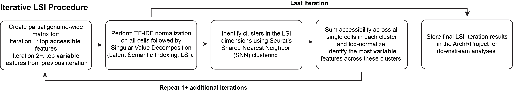
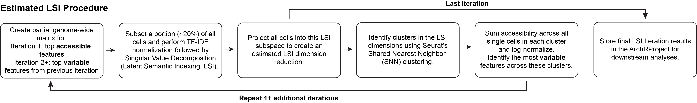

---
output:
  html_document:
    theme: yeti  # many options for theme, this one is my favorite.
params:
  threads: 20
  rdata: ""
  token: ""
  ref: ""
  out: ""
editor_options: 
  markdown: 
    wrap: 72
---

```{r, include=FALSE}
#load the data from the previous chapter as needed
current_chapter = 6
previous_chapter = current_chapter-1
load(file = paste0("./chapter_images/chapter",previous_chapter,".RData"))
```

# Dimensionality Reduction with ArchR

Dimensionality reduction with scATAC-seq is challenging due to the _sparsity_ of the data. In scATAC-seq, a particular site can either be accessible on one allele, both alleles, or no alleles. Even in higher-quality scATAC-seq data, the majority of accessible regions are not transposed and this leads to many loci having 0 accessible alleles. Moreover, when we see (for example) three Tn5 insertions within a single peak region in a single cell, the sparsity of the data prevents us from confidently determining that this site in this cell is actually three times more accessible than another cell that only has one insertion in the same site. For this reason a lot of analytical strategies work on a binarized scATAC-seq data matrix. This binarized matrix still ends up being mostly 0s because transposition is rare. However, it is important to note that a 0 in scATAC-seq could mean "non-accessible" or "not sampled" and these two inferences are very different from a biological standpoint. Because of this, the 1s have information and the 0s do not. This low information content is what makes our scATAC-seq data _sparse_.

If you were to perform a standard dimensionality reduction, like Principal Component Analysis, on this sparse insertion counts matrix and plot the top two principal components, you would not obtain the desired result because the sparsity causes high inter-cell similarity at all of the 0 positions. To get around this issue, we use a layered dimensionality reduction approach. First, we use Latent Semantic Indexing (LSI), an approach from natural language processing that was originally designed to assess document similarity based on word counts. This solution was created for natural language processing because the data is sparse and noisy (many different words and many low frequency words). LSI was first introduced for scATAC-seq by [Cusanovich et al. (Science 2015)](https://www.ncbi.nlm.nih.gov/pubmed/25953818). In the case of scATAC-seq, different samples are the _documents_ and different regions/peaks are the _words_. First, we calculate the term frequency by depth normalization per single cell. These values are then normalized by the inverse document frequency which weights features by how often they occur to identify features that are more "specific" rather than commonly accessible. The resultant term frequency-inverse document frequency (TF-IDF) matrix reflects how important a _word_ (aka region/peak) is to a _document_ (aka sample).  Then, through a technique called singular value decomposition (SVD), the most _valuable_ information across samples is identified and represented in a lower dimensional space. LSI allows you to reduce the dimensionality of the sparse insertion counts matrix from many thousands to tens or hundreds. Then, a more conventional dimensionality reduction technique, such as Uniform Manifold Approximation and Projection (UMAP) or t-distributed stochastic neighbor embedding (t-SNE) can be used to visualize the data. In ArchR, these visualization methods are referred to as _embeddings_.

## ArchR's LSI Implementation

ArchR implements a few different LSI implementations and we have benchmarked many of these methods across multiple different test data sets. ArchR's default LSI implementation is related to the method introduced by Timothy Stuart in [Signac](https://satijalab.org/signac/), which uses a term frequency that has been depth normalized to a constant (10,000) followed by normalization with the inverse document frequency and then log-transforming the resultant matrix (aka `log(TF-IDF)`).

One of the key inputs to LSI dimensionality reduction is the starting matrix. Thus far, the two main strategies in scATAC-seq have been to (1) use peak regions or (2) genome-wide tiles. However, using peak regions for LSI is inherently challenging because we do not have clusters or cluster-specific peaks prior to dimensionality reduction. Moreover, calling peaks on aggregated cells prior to clustering obscures cell type-specific peaks. Moreover, any union peak set will change when new samples are added to an experiment, making this strategy less stable. The second strategy, using genome-wide tiles, mitigates these issues by using a consistent and unbiased feature set (genome-wide tiles). However, a genome-wide tile matrix of all cells by all regions can become prohibitively large. For this reason, most implementations use tiles that are greater than or equal to 5 kilobases in size. This drastically reduces the resolution of the approach because most accessible regions are only a few hundred basepairs long.

Because of the way that Arrow files are designed, ArchR is able to perform LSI very rapidly using genome-wide 500-bp tiles. This solves the problem of resolution and allows for the identification of clusters prior to calling peaks. The challenge is that 500-bp bins generate around 6 million features to be included in the cell by tile matrix. While ArchR is able to read this large amount of data into R by chunking the relevant matrices, we have also implemented an "estimated LSI" approach that performs the initial dimensionality reduction on a subset of the total cells. This estimated LSI approach has two main utilities - (i) it speeds up dimensionality reduction and (ii) as you decrease the number of cells used in the intial dimensionality reduction, this decreases the granularity of the data. This reduction in granularity can be used to your advantage to reduce batch effects in your data. However, it can also obscure true biology so estimated LSI approaches should be used under close manual supervision.

## Iterative Latent Semantic Indexing (LSI)

In scRNA-seq identifying variable genes is a common way to compute dimensionality reduction (such as PCA). This is done because these highly variable genes are more likely to be biologically important and this reduces experimental noise. In scATAC-seq, the data is binary and thus you cannot identify variable peaks for dimensionality reduction. Rather than identifying the most variable peaks, we have tried using the most accessible features as input to LSI; however, the results when running multiple samples have shown high degrees of noise and low reproducibility. To remedy this we introduced the "iterative LSI" approach ([Satpathy\*, Granja\* et al. Nature Biotechnology 2019](https://www.ncbi.nlm.nih.gov/pubmed/31375813) and [Granja\*, Klemm\* and McGinnis\* et al. Nature Biotechnology 2019](https://www.ncbi.nlm.nih.gov/pubmed/31792411)). This approach computes an inital LSI transformation on the most accessible tiles and identifies lower resolution clusters that are not batch confounded. For example, when performed on peripheral blood mononuclear cells, this will identify clusters corresponding to the major cell types (T cells, B cells, and monocytes). Then ArchR computes the average accessibility for each of these clusters across all features. ArchR then identifies the most variable peaks across these clusters and uses these features for LSI again. In this second iteration, the most variable peaks are more similar to the variable genes used in scRNA-seq LSI implementations. The user can set how many iterations of LSI should be performed. We have found this approach to minimize observed batch effects and allow dimensionality reduction operations on a more reasonably sized feature matrix.

<center>

</center>

To perform iterative LSI in ArchR, we use the `addIterativeLSI()` function. The default parameters should cover most cases but we encourage you to explore the available parameters and how they each affect your particular data set. See `?addIterativeLSI` for more details on inputs. The most common parameters to tweak are `iterations`, `varFeatures`, and `resolution`.

For the purposes of this tutorial, we will create a `reducedDims` object called "IterativeLSI".
```{r addLSI1, collapse=TRUE}
projHeme2 <- addIterativeLSI(
	ArchRProj = projHeme2,
	useMatrix = "TileMatrix", 
	name = "IterativeLSI", 
    iterations = 2, 
    clusterParams = list( #See Seurat::FindClusters
    	resolution = c(0.2), 
        sampleCells = 10000, 
        n.start = 10
    ), 
    varFeatures = 25000, 
    dimsToUse = 1:30
)
```

ArchR automatically checks each dimension to determine whether it is highly correlated to the sequencing depth. The `corCutOff` parameter sets the threshold for this correlation before exclusion of a particular dimension. In some cases, the 1st dimension may be correlated to other technical noise not depth related. In general, ArchR defaults are reasonable and dont need to be changed. However, if you think that your results make more sense if you manually exclude the first dimension, that is a reasonable thing to do. Biological intuition is important to adequately evaluate the results of dimensionality reduction and if removing a specific dimensions steers you closer to your expectation than that is fine. In most cases, the exclusion of a specific dimension doesnt have a strong effect because of the way that the iterative LSI method works compared to non-iterative implementations (e.g. in Signac). To manually exclude a specific dimension, you would alter the `dimsToUse` parameter.

If you see downstream that you have subtle batch effects, another option is to add more LSI iterations and to start from a lower intial clustering resolution as shown below. Additionally the number of variable features can be lowered to increase focus on the more variable features.


We will name this `reducedDims` object "IterativeLSI2" for illustrative purposes but we won't use it downstream.

```{r addLSI2, collapse=TRUE}
projHeme2 <- addIterativeLSI(
	ArchRProj = projHeme2,
	useMatrix = "TileMatrix", 
	name = "IterativeLSI2", 
    iterations = 4, 
    clusterParams = list( #See Seurat::FindClusters
    	resolution = c(0.1, 0.2, 0.4), 
        sampleCells = 10000, 
        n.start = 10
    ), 
    varFeatures = 15000, 
    dimsToUse = 1:30
)
```

You can list the available `reducedDims` objects in an `ArchRProject` using the slot extraction opperator `@`:

```{r , collapse=TRUE}
projHeme2@reducedDims
```

## Estimated LSI
For extremely large scATAC-seq datasets, ArchR can estimate the LSI dimensionality reduction with LSI projection. This procedure is similar to the iterative LSI workflow, however the LSI procedure differs. First, a subset of randomly selected “landmark” cells is used for LSI dimensionality reduction. Second, the remaining cells are TF-IDF normalized using the inverse document frequency determined from the landmark cells. Third, these normalized cells are projected into the SVD subspace defined by the landmark cells. This leads to an LSI transformation based on a small set of cells used as landmarks for the projection of the remaining cells. This estimated LSI procedure is efficient with ArchR because, when projecting the new cells into the landmark cells LSI, ArchR iteratively reads in the cells from each sample and LSI projects them without storing them all in memory. This optimization leads to minimal memory usage and further increases the scalability for extremely large datasets. Importantly, the required landmark set size is dependent on the proportion of different cells within the dataset.

<center>

</center>

Estimated LSI is accessed in ArchR via the `addIterativeLSI()` function by setting the `sampleCellsFinal` and `projectCellsPre` parameters. `samplesCellsFinal` designates the size of the landmark cell subset and `projectCellsPre` tells ArchR to use this landmark cell subset for projection of the remaining cells.


## Batch Effect Correction wtih Harmony

Sometimes the iterative LSI approach isnt enough of a correction for strong batch effect differences. For this reason, ArchR implements a commonly used batch effect correction tool called [Harmony](https://github.com/immunogenomics/harmony) which was originally designed for scRNA-seq. We provide a wrapper that will pass a dimensionality reduction object from ArchR directly to the `HarmonyMatrix()` function. Additional arguments can be directly passed to `HarmonyMatrix()` in the function via the additional parameters (`...`) . See `?addHarmony()` for more details. Users should be aware of the caveats of batch correction for their particular application. 

```{r addHarmony, collapse=TRUE}
projHeme2 <- addHarmony(
	ArchRProj = projHeme2,
	reducedDims = "IterativeLSI",
	name = "Harmony",
	groupBy = "Sample"
)
```

This process creates a new `reducedDims` object called "Harmony" in our `projHeme2` object. For downstream functions where you would like to use this new `reducedDims` object, you should make sure to pass it to the `reducedDims` paramter, for example with `addImputeWeights()` or other functions that use a `reducedDims` object. In the context of this tutorial, the data does not really benefit from batch correction so we will continue to use the `IterativeLSI` reducedDims object.


```{r, include=FALSE}
filename <- paste0("./chapter_images/chapter",current_chapter,".RData")
remove(current_chapter)
remove(previous_chapter)
save.image(file =  filename)
```
