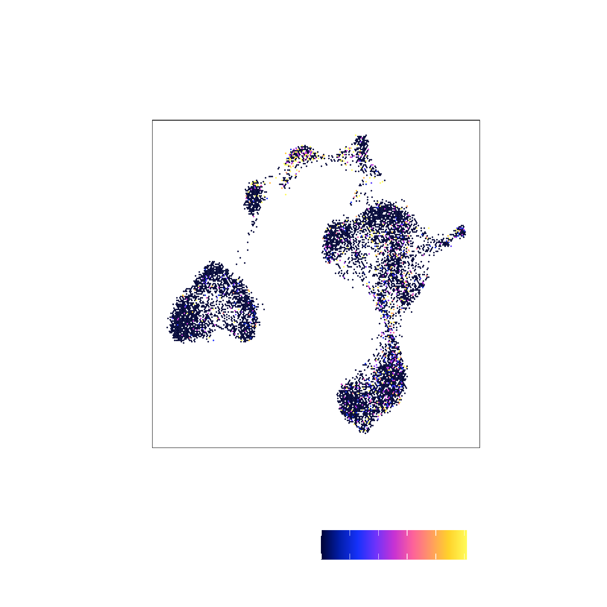
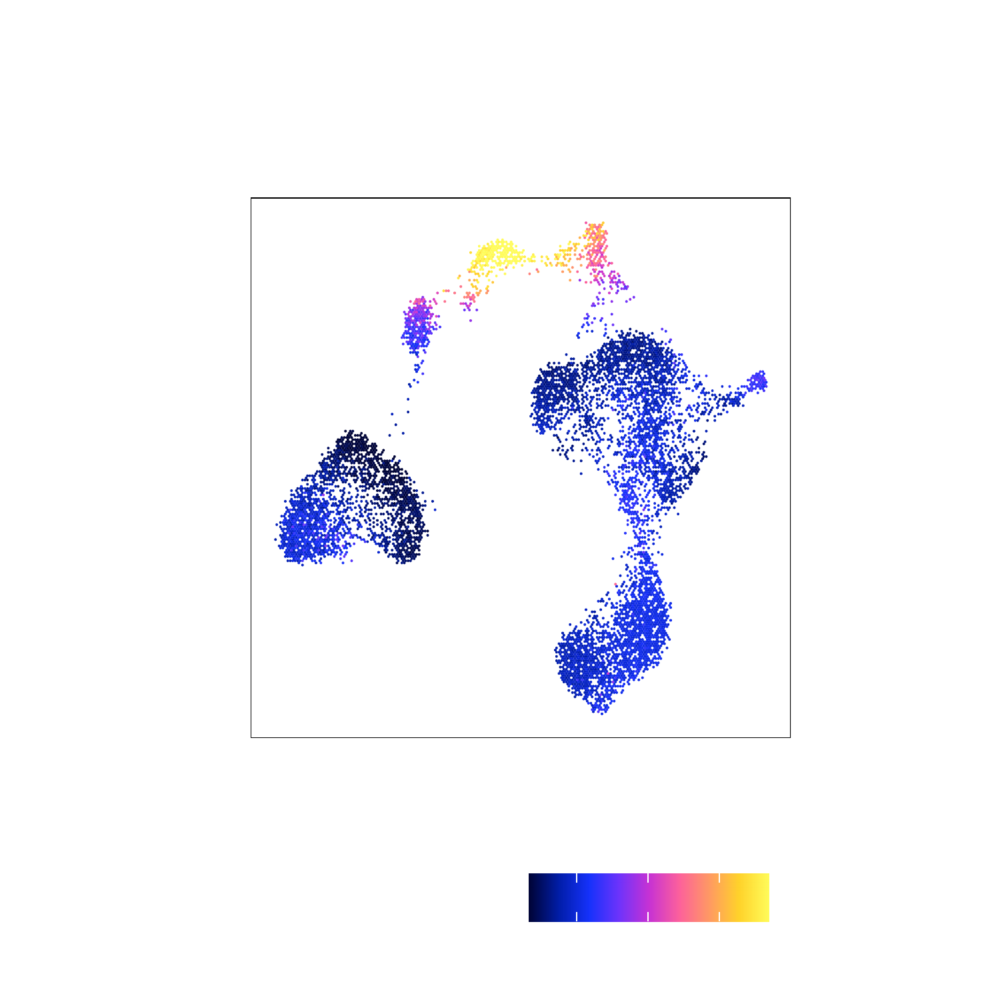

# Marker Genes with scATAC

```{r, include=FALSE}
setwd("/Volumes/JG_SSD_2/ArchR_Walkthrough/")
#load("Save-ArchR-Walkthrough-Chapter1-Feb13.Rdata")
save.image("Save-ArchR-Walkthrough-Feb16-1317.Rdata")
```

## Identification of Marker Genes

Identify Marker Gene through Pairwise Test vs Bias-Matched Background

```{r eval=FALSE}
markersGS <- markerFeatures(
    ArchRProj = projHeme2, 
    useMatrix = "GeneScoreMatrix", 
    groupBy = "Clusters",
    bias = c("TSSEnrichment", "log10(nFrags)"),
    testMethod = "wilcoxon"
)
```

```{r eval=FALSE}
markerList <- getMarkers(markersGS, cutOff = "FDR <= 0.01 & Log2FC >= 1.25")
markerList$Cluster4
# DataFrame with 210 rows and 6 columns
#       seqnames     start           name     idx           Log2FC
#          <Rle>   <array>        <array> <array>        <numeric>
# 14759    chr22  37545962          IL2RB     301 2.09731361787433
# 6856     chr14  99737822         BCL11B     595 1.42193213075962
# 13123     chr2 192038902          STAT4    1064 1.90075014141832
# 12597     chr2  87035519           CD8A     538 1.96747880033344
# 9299     chr17  34207377           CCL5     540 2.65385587389937
# ...        ...       ...            ...     ...              ...
# 1488      chr1 156182779           PMF1    1488 1.35708770978464
# 22735     chrX 101854276 ARMCX5-GPRASP2     518 1.59283344451927
# 19680     chr7  45144641        SNORA5C     318 1.27027443652085
# 1856      chr1 196659182          CFHR4    1856 1.92661384224492
# 17830     chr5 140739703        PCDHGB2     690 2.93899133419389
```

We can then plot this as a heatmap

```{r eval=FALSE}
markerGenes  <- c(
    "CD34", #Early Progenitor
    "GATA1", #Erythroid
    "PAX5", "MS4A1", #B-Cell Trajectory
    "CD14", #Monocytes
    "CD3D", "CD8A", "TBX21", "IL7R" #TCells
  )

heatmapGS <- markerHeatmap(
  seMarker = markersGS, 
  cutOff = "FDR <= 0.01 & Log2FC >= 1.25", 
  labelMarkers = markerGenes,
  transpose = TRUE
)

draw(heatmapGS, heatmap_legend_side = "bot", annotation_legend_side = "bot")
```

{width=800 height=600}

We can then plot this 

```{r eval=FALSE}
plotPDF(heatmapGS, name = "GeneScores-Marker-Heatmap", width = 8, height = 6, ArchRProj = projHeme2, addDOC = FALSE)
```

[Download PDF : GeneScores-Marker-Heatmap.pdf](images/HemeWalkthrough/PDF/GeneScores-Marker-Heatmap.pdf)

## Marker Genes

```{r eval=FALSE}
markerGenes  <- c(
    "CD34", #Early Progenitor
    "GATA1", #Erythroid
    "PAX5", "MS4A1", #B-Cell Trajectory
    "CD14", #Monocytes
    "CD3D", "CD8A", "TBX21", "IL7R" #TCells
  )

p <- plotEmbedding(
    ArchRProj = projHeme2, 
    colorBy = "GeneScoreMatrix", 
    name = markerGenes, 
    embedding = "UMAP",
    quantCut = c(0.01, 0.95),
    imputeWeights = NULL
)
```

To plot a specific gene try

```{r, eval = FALSE}
p$CD14
```
{width=800 height=800}

To plot all genes we can use cowplot

```{r, eval = FALSE}
#Rearrange for grid plotting
p2 <- lapply(p, function(x){
    x + guides(color = FALSE, fill = FALSE) + 
    theme_ArchR(baseSize = 6.5) +
    theme(plot.margin = unit(c(0, 0, 0, 0), "cm")) +
    theme(
        axis.text.x=element_blank(), 
        axis.ticks.x=element_blank(), 
        axis.text.y=element_blank(), 
        axis.ticks.y=element_blank()
    )
})
do.call(cowplot::plot_grid, c(list(ncol = 3),p2))
```

{width=800 height=800}


```{r, include=FALSE, eval = FALSE}
plotPDF(
    do.call(cowplot::plot_grid, c(list(ncol = 3),p2)), 
    name = "Plot-UMAP-Markers-WO-Imputation.pdf", 
    ArchRProj = projHeme2,
    addDOC = FALSE,
    width = 10, 
    height = 10
)
```

To save a nice looking pdf we use plotPDF which removes white pages and tries to make the plots
nice looking.

```{r eval=FALSE}
plotPDF(plotList = p, 
    name = "Plot-UMAP-Marker-Genes-WO-Imputation.pdf", 
    ArchRProj = projHeme2, 
    addDOC = FALSE, width = 5, height = 5)
```

[Download PDF : Plot-UMAP-Marker-Genes-WO-Imputation.pdf](images/HemeWalkthrough/PDF/Plot-UMAP-Marker-Genes-WO-Imputation.pdf)

## Marker Genes Imputation with Magic

```{r eval=FALSE}
projHeme2 <- addImputeWeights(projHeme2)
# 2020-02-15 00:15:35 : Computing Impute Weights Using Magic (Cell 2018), 0 mins elapsed..
# 2020-02-15 00:15:35 : Computing Partial Diffusion Matrix with Magic (1 of 2), 0 mins elapsed..
# 2020-02-15 00:15:37 : Computing Partial Diffusion Matrix with Magic (2 of 2), 0.047 mins elapsed..
# 2020-02-15 00:15:41 : Completed Getting Magic Weights (Size = 0.197 GB)!, 0.112 mins elapsed..
```

Now lets see how this effects our marker gene scores overlayed on our 2-d embedding.

```{r eval=FALSE}
markerGenes  <- c(
    "CD34", #Early Progenitor
    "GATA1", #Erythroid
    "PAX5", "MS4A1", #B-Cell Trajectory
    "CD14", #Monocytes
    "CD3D", "CD8A", "TBX21", "IL7R" #TCells
  )

p <- plotEmbedding(
    ArchRProj = projHeme2, 
    colorBy = "GeneScoreMatrix", 
    name = markerGenes, 
    embedding = "UMAP",
    imputeWeights = getImputeWeights(projHeme2)
)
```

To plot a specific gene try

```{r, eval = FALSE}
p$CD14
```
{width=800 height=800}

To plot all genes we can use cowplot

```{r, eval = FALSE}
#Rearrange for grid plotting
p2 <- lapply(p, function(x){
    x + guides(color = FALSE, fill = FALSE) + 
    theme_ArchR(baseSize = 6.5) +
    theme(plot.margin = unit(c(0, 0, 0, 0), "cm")) +
    theme(
        axis.text.x=element_blank(), 
        axis.ticks.x=element_blank(), 
        axis.text.y=element_blank(), 
        axis.ticks.y=element_blank()
    )
})
do.call(cowplot::plot_grid, c(list(ncol = 3),p2))
```

{width=800 height=800}

```{r, include=FALSE, eval = FALSE}
plotPDF(
    do.call(cowplot::plot_grid, c(list(ncol = 3),p2)), 
    name = "Plot-UMAP-Markers-W-Imputation.pdf", 
    ArchRProj = projHeme2,
    addDOC = FALSE,
    width = 10, 
    height = 10
)
```

To save a nice looking pdf we use plotPDF which removes white pages and tries to make the plots
nice looking.

```{r eval=FALSE}
plotPDF(plotList = p, 
    name = "Plot-UMAP-Marker-Genes-W-Imputation.pdf", 
    ArchRProj = projHeme2, 
    addDOC = FALSE, width = 5, height = 5)
```

[Download PDF : Plot-UMAP-Marker-Genes-W-Imputation.pdf](images/HemeWalkthrough/PDF/Plot-UMAP-Marker-Genes-W-Imputation.pdf)

## Track Plotting with ArchRBrowser

```{r eval=FALSE}
markerGenes  <- c(
    "CD34", #Early Progenitor
    "GATA1", #Erythroid
    "PAX5", "MS4A1", #B-Cell Trajectory
    "CD14", #Monocytes
    "CD3D", "CD8A", "TBX21", "IL7R" #TCells
  )

p <- ArchRBrowserTrack(
    ArchRProj = projHeme2, 
    groupBy = "Clusters", 
    geneSymbol = markerGenes, 
    upstream = 50000,
    downstream = 50000
)
# 2020-02-15 00:23:11 : Adding Bulk Tracks (1 of 9), 0 mins elapsed..
# 2020-02-15 00:23:12 : Adding Gene Tracks (1 of 9), 0.015 mins elapsed..
# 2020-02-15 00:23:12 : Plotting, 0.018 mins elapsed..
# 2020-02-15 00:23:13 : Adding Bulk Tracks (2 of 9), 0.045 mins elapsed..
# 2020-02-15 00:23:14 : Adding Gene Tracks (2 of 9), 0.055 mins elapsed..
# 2020-02-15 00:23:14 : Plotting, 0.058 mins elapsed..
# 2020-02-15 00:23:16 : Adding Bulk Tracks (3 of 9), 0.08 mins elapsed..
# 2020-02-15 00:23:16 : Adding Gene Tracks (3 of 9), 0.09 mins elapsed..
# 2020-02-15 00:23:16 : Plotting, 0.095 mins elapsed..
# 2020-02-15 00:23:18 : Adding Bulk Tracks (4 of 9), 0.12 mins elapsed..
# 2020-02-15 00:23:19 : Adding Gene Tracks (4 of 9), 0.131 mins elapsed..
# 2020-02-15 00:23:19 : Plotting, 0.135 mins elapsed..
# 2020-02-15 00:23:20 : Adding Bulk Tracks (5 of 9), 0.153 mins elapsed..
# 2020-02-15 00:23:21 : Adding Gene Tracks (5 of 9), 0.167 mins elapsed..
# 2020-02-15 00:23:21 : Plotting, 0.171 mins elapsed..
# 2020-02-15 00:23:22 : Adding Bulk Tracks (6 of 9), 0.195 mins elapsed..
# 2020-02-15 00:23:23 : Adding Gene Tracks (6 of 9), 0.206 mins elapsed..
# 2020-02-15 00:23:23 : Plotting, 0.209 mins elapsed..
# 2020-02-15 00:23:25 : Adding Bulk Tracks (7 of 9), 0.234 mins elapsed..
# 2020-02-15 00:23:26 : Adding Gene Tracks (7 of 9), 0.247 mins elapsed..
# 2020-02-15 00:23:26 : Plotting, 0.25 mins elapsed..
# 2020-02-15 00:23:27 : Adding Bulk Tracks (8 of 9), 0.278 mins elapsed..
# 2020-02-15 00:23:28 : Adding Gene Tracks (8 of 9), 0.291 mins elapsed..
# 2020-02-15 00:23:28 : Plotting, 0.294 mins elapsed..
# 2020-02-15 00:23:30 : Adding Bulk Tracks (9 of 9), 0.326 mins elapsed..
# 2020-02-15 00:23:31 : Adding Gene Tracks (9 of 9), 0.338 mins elapsed..
# 2020-02-15 00:23:31 : Plotting, 0.341 mins elapsed..
```

To plot a track we can simply print one from the list

```{r eval=FALSE}
grid::grid.newpage()
grid::grid.draw(p$CD14)
```

{width=500 height=500}

```{r eval=FALSE}
plotPDF(plotList = p, 
    name = "Plot-Tracks-Marker-Genes.pdf", 
    ArchRProj = projHeme2, 
    addDOC = FALSE, width = 5, height = 5)
```

[Download PDF : Plot-Tracks-Marker-Genes.pdf](images/HemeWalkthrough/PDF/Plot-Tracks-Marker-Genes.pdf)


## Launching the ArchRBrowser

```{r eval=FALSE}
ArchRBrowser(projHeme2)
```

{width=800 height=500}
{width=800 height=500}
{width=800 height=500}
{width=800 height=500}
{width=800 height=500}
{width=800 height=500}


We can now save our original projHeme1 using `saveArchRProject` from ArchR.

```{r eval=FALSE}
saveArchRProject(projHeme2)
```


