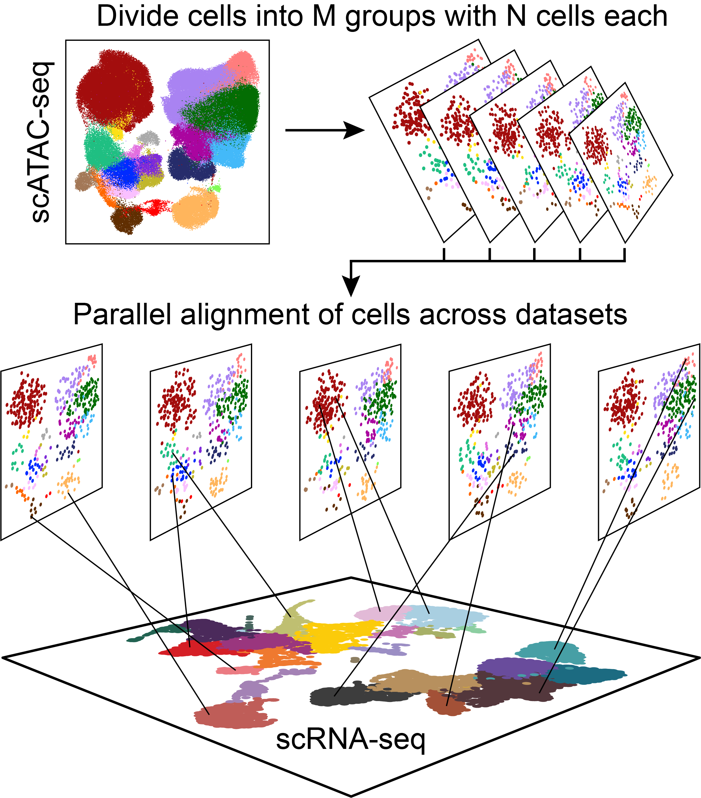

---
output:
  html_document:
    theme: yeti  # many options for theme, this one is my favorite.
params:
  threads: 20
  rdata: ""
  token: ""
  ref: ""
  out: ""
---

```{r, include=FALSE, eval=FALSE}
params2 <- params
unlockBinding("params", env = .GlobalEnv)
#load("Chapter-13-Footprints.Rdata")
load(params$rdata)
params <- params2
rm(params2)
devtools::install_github("GreenleafLab/ArchR", 
  auth_token = params$token, 
  ref = params$ref,
  repos = BiocManager::repositories(),
  dependencies = FALSE
)
library(ArchR)
fn <- unclass(lsf.str(envir = asNamespace("ArchR"), all = TRUE))
fn <- fn[!grepl("\\.", fn)]
fn <- fn[fn!="ArchRProj"]
for (i in seq_along(fn)){
    tryCatch({
        eval(parse(text = paste0(fn[i], "<-ArchR::", fn[i])))
    }, error = function(x) {
    })
}
addArchRThreads(threads = params$threads)
addArchRGenome("hg19")
# fn <- unclass(lsf.str(envir = asNamespace("ArchR"), all = TRUE))
# fn <- fn[fn!="ArchRProj"]
# for (i in seq_along(fn)) {
#     tryCatch({
#         eval(parse(text = paste0(fn[i], "<-ArchR:::", fn[i])))
#     }, error = function(x) {
#     })
# }
set.seed(1)
```

# Defining Cluster Identity with scRNA-seq

In addition to allowing cluster identity assignment with gene scores, ArchR also enables integration with scRNA-seq. This can help with cluster identity assignment because you can directly use clusters called in scRNA-seq space or use the gene expression measurements after integration. The way this integration works is by directly aligning cells from scATAC-seq with cells from scRNA-seq by comparing the scATAC-seq gene score matrix with the scRNA-seq gene expression matrix. Under the hood, this alignment is performed using the `FindTransferAnchors()` function from the `Seurat` package which allows you to align data across two datasets. However, to appropriately scale this procedure for hundreds of thousands of cells ArchR provides a parallelization of this procedure by dividing the total cells into smaller groups of cells and performing separate alignments.

<center>
{width=500px}
</center>

Effectively, for each cell in the scATAC-seq data, this integration process finds the cell in the scRNA-seq data that looks most similar and assigns the gene expression data from that scRNA-seq cell to the scATAC-seq cell. At the end, each cell in scATAC-seq space has been assigned a gene expression signature which can be used for many downstream analyses. This chapter illustrates how to use this information for assigning clusters while later chapters show how to use the linked scRNA-seq data for more complex analyses such as identifying predicted cis-regulatory elements. We believe these integrative analyses will become increasingly relevant as multi-omic single-cell profiling becomes commercially available. In the meantime, using publicly available scRNA-seq data in matched cell types or scRNA-seq data that you have generated on your sample of interest can bolster the scATAC-seq analyses performed in ArchR.

## Cross-platform linkage of scATAC-seq cells with scRNA-seq cells

In order to integrate our tutorial scATAC-seq data with matched scRNA-seq data, we will use scRNA-seq data derived from the same hematopoietic cell types from Granja* et al (2019).

We have stored this scRNA-seq data as a 111 MB `RangedSummarizedExperiment` object. Downloading and examining this object, we see that it has a gene expression counts matrix and associated metadata.
```{r eval=FALSE}
if(!file.exists("scRNA-Hematopoiesis-Granja-2019.rds")){
    download.file(
        url = "https://jeffgranja.s3.amazonaws.com/ArchR/TestData/scRNA-Hematopoiesis-Granja-2019.rds",
        destfile = "scRNA-Hematopoiesis-Granja-2019.rds"
    )
}

seRNA <- readRDS("scRNA-Hematopoiesis-Granja-2019.rds")
seRNA
```
> \## class: RangedSummarizedExperiment   
## dim: 20287 35582   
## metadata(0):  
## assays(1): counts  
## rownames(20287): FAM138A OR4F5 ... S100B PRMT2  
## rowData names(3): gene_name gene_id exonLength  
## colnames(35582): CD34_32_R5:AAACCTGAGTATCGAA-1  
##   CD34_32_R5:AAACCTGAGTCGTTTG-1 ...  
##   BMMC_10x_GREENLEAF_REP2:TTTGTTGCATGTGTCA-1  
##   BMMC_10x_GREENLEAF_REP2:TTTGTTGCATTGAAAG-1  
## colData names(10): Group nUMI_pre ... BioClassification Barcode  

The metadata contains a column called `BioClassification` which contains the cell type classifications for each cell in the scRNA-seq dataset.
```{r eval=FALSE}
colnames(colData(seRNA))
```
> \##  [1] "Group"             "nUMI_pre"          "nUMI"             
##  [4] "nGene"             "initialClusters"   "UMAP1"            
##  [7] "UMAP2"             "Clusters"          "BioClassification"  
## [10] "Barcode"  

Using `table()` we can see how many cells are in each of the scRNA-seq cell type classifications.
```{r eval=FALSE}
table(colData(seRNA)$BioClassification)
```
> \##         01_HSC 02_Early.Eryth  03_Late.Eryth  04_Early.Baso    05_CMP.LMPP   
##           1425           1653            446            111           2260   
##       06_CLP.1         07_GMP    08_GMP.Neut         09_pDC         10_cDC   
##            903           2097           1050            544            325   
## 11_CD14.Mono.1 12_CD14.Mono.2   13_CD16.Mono         14_Unk       15_CLP.2   
##           1800           4222            292            520            377   
##       16_Pre.B           17_B      18_Plasma       19_CD8.N      20_CD4.N1   
##            710           1711             62           1521           2470   
##      21_CD4.N2       22_CD4.M      23_CD8.EM      24_CD8.CM          25_NK   
##           2364           3539            796           2080           2143   
##         26_Unk   
##            161  

There are two types of integration approaches that we can perform. __Unconstrained integration__ is a completely agnostic approach that would take all of the cells in your scATAC-seq experiment and attempt to align them to any of the cells in the scRNA-seq experiment. While this is a feasible preliminary solution, we can improve the quality of our cross-platform alignment by _constraining_ the integration process. To perform a __constrained integration__ we use prior knowledge of the cell types to limit the search space of the alignment. For example, if we knew that Clusters A, B, and C in the scATAC-seq data corresponded to 3 different T cell clusters, and we knew that Clusters X and Y in the scRNA-seq data corresponded to 2 different T cell clusters, we could tell ArchR to specifically try to align cells from scATAC-seq Clusters A, B, and C to cell from scRNA-seq clusters X and Y. We illustrate these two approaches below, first performing an unconstrained integration to acheive preliminary cluster identities and then using this prior knowledge to perform a more refined constrained integration. 

### Unconstrained Integration

To integrate scATAC-seq with scRNA-seq, we use the `addGeneIntegrationMatrix()` function. The first round of integration we perform will be a preliminary __unconstrained__ integration and we will not store this in the Arrow files (`addToArrow = FALSE`). We provide a name for the integration matrix that will be stored in the `ArchRProject` via the `matrixName` parameter. The other key parameters for this function provide column names in `cellColData` where certain information will be stored: `nameCell` will store the cell ID from the matched scRNA-seq cell, `nameGroup` will store the group ID from the scRNA-seq cell, and `nameScore` will store the cross-platform integration score.

```{r eval=FALSE}
projHeme2 <- addGeneIntegrationMatrix(
    ArchRProj = projHeme2, 
    useMatrix = "GeneScoreMatrix",
    matrixName = "GeneIntegrationMatrix",
    reducedDims = "IterativeLSI",
    seRNA = seRNA,
    addToArrow = FALSE,
    groupRNA = "BioClassification",
    nameCell = "predictedCell_Un",
    nameGroup = "predictedGroup_Un",
    nameScore = "predictedScore_Un"
)
```
> \## ArchR logging to : ArchRLogs/ArchR-addGeneIntegrationMatrix-f6635e453cfd-Date-2020-04-15_Time-10-08-55.log  
## If there is an issue, please report to github with logFile!  
## 2020-04-15 10:08:56 : Running Seurat's Integration Stuart* et al 2019, 0.005 mins elapsed.  
## 2020-04-15 10:09:06 : Checking ATAC Input, 0.172 mins elapsed.  
## 2020-04-15 10:09:06 : Checking RNA Input, 0.173 mins elapsed.  
## 2020-04-15 10:09:17 : Creating Integration Blocks, 0.367 mins elapsed.  
## 2020-04-15 10:09:18 : Prepping Interation Data, 0.372 mins elapsed.  
## 2020-04-15 10:09:19 : Computing Integration in 1 Integration Blocks!, 0 mins elapsed.  
## 2020-04-15 10:09:19 : Block (1 of 1) : Computing Integration, 0 mins elapsed.  
## 2020-04-15 10:09:23 : Block (1 of 1) : Identifying Variable Genes, 0.071 mins elapsed.  
## 2020-04-15 10:09:28 : Block (1 of 1) : Getting GeneScoreMatrix, 0.146 mins elapsed.  
## 2020-04-15 10:09:37 : Block (1 of 1) : Imputing GeneScoreMatrix, 0.298 mins elapsed.  
## 2020-04-15 10:09:37 : Computing Impute Weights Using Magic (Cell 2018), 0 mins elapsed.  
## 2020-04-15 10:09:37 : Computing Partial Diffusion Matrix with Magic (1 of 2), 0 mins elapsed.  
## 2020-04-15 10:09:44 : Computing Partial Diffusion Matrix with Magic (2 of 2), 0.122 mins elapsed.  
## 2020-04-15 10:09:51 : Completed Getting Magic Weights!, 0.242 mins elapsed.  
## Getting ImputeWeights  
## Using weights on disk  
## Using weights on disk  
## Getting ImputeWeights  
## 2020-04-15 10:10:17 : Block (1 of 1) : Seurat FindTransferAnchors, 0.968 mins elapsed.  
## 2020-04-15 10:12:00 : Block (1 of 1) : Seurat TransferData Cell Labels, 2.681 mins elapsed.  
## 2020-04-15 10:12:34 : Block (1 of 1) : Completed Integration, 3.243 mins elapsed.  
## 2020-04-15 10:12:34 : Completed Integration with RNA Matrix, 3.256 mins elapsed.  
## ArchR logging successful to : ArchRLogs/ArchR-addGeneIntegrationMatrix-f6635e453cfd-Date-2020-04-15_Time-10-08-55.log  

This unconstrained integration can be used as shown below to perform a more refined constrained integration.

### Constrained Integration

Now that we have our preliminary unconstrained integration, we will identify general cell types to profide a framework to further refine the integration results.

Given that this tutorial data is from hematopoietic cells, we would ideally constrain the integration to associate similar cell types togther. First, we will identify which cell types from the scRNA-seq data are most abundant in each of our scATAC-seq clusters. The goal of this is to identify the cells in both the scATAC-seq and scRNA-seq data that correspond to T cells and NK cells using the unconstrained integration so that we can perform a constrained integration using this information. To do this, we will create a `confusionMatrix` that looks at the intersection of `Clusters` and `predictedGroup_Un` which contains the cell types as identified by scRNA-seq.

```{r eval=FALSE}
cM <- as.matrix(confusionMatrix(projHeme2$Clusters, projHeme2$predictedGroup_Un))
preClust <- colnames(cM)[apply(cM, 1 , which.max)]
cbind(preClust, rownames(cM)) #Assignments
```
> \##       preClust              
##  [1,] "17_B"           "C3"  
##  [2,] "20_CD4.N1"      "C8"  
##  [3,] "16_Pre.B"       "C4"  
##  [4,] "08_GMP.Neut"    "C11"  
##  [5,] "11_CD14.Mono.1" "C1"  
##  [6,] "01_HSC"         "C12"  
##  [7,] "03_Late.Eryth"  "C10"  
##  [8,] "22_CD4.M"       "C9"   
##  [9,] "25_NK"          "C7"   
## [10,] "09_pDC"         "C5"   
## [11,] "12_CD14.Mono.2" "C2"   
## [12,] "15_CLP.2"       "C6"  

The above list shows which scRNA-seq cell type is most abundant in each of the 12 scATAC-seq clusters.

First, lets look at the cell type labels from our scRNA-seq data that were used in our unconstrained integration:
```{r eval=FALSE}
unique(unique(projHeme2$predictedGroup_Un))
```
> \##  [1] "05_CMP.LMPP"    "08_GMP.Neut"    "01_HSC"         "06_CLP.1"
##  [5] "15_CLP.2"       "02_Early.Eryth" "07_GMP"         "09_pDC"
##  [9] "04_Early.Baso"  "03_Late.Eryth"  "17_B"           "12_CD14.Mono.2"
## [13] "16_Pre.B"       "10_cDC"         "11_CD14.Mono.1" "25_NK"
## [17] "21_CD4.N2"      "22_CD4.M"       "23_CD8.EM"      "19_CD8.N"
## [21] "24_CD8.CM"      "26_Unk"         "20_CD4.N1"      "14_Unk"
## [25] "13_CD16.Mono"   "18_Plasma"

From the above list, we can see that the clusters in the scRNA-seq data that correspond to T cells and NK cells are Clusters 19-25. We will create a string-based representation of these clusters to use in the downstream constrained integration.
```{r eval=FALSE}
#From scRNA
cTNK <- paste0(paste0(19:25), collapse="|")
cTNK
```
> \## [1] "19|20|21|22|23|24|25"  

We can then take all of the other clusters and create a string-based representation of all "Non-T cell, Non-NK cell" clusters (i.e. Cluster 1 - 18).
```{r eval=FALSE}
cNonTNK <- paste0(c(paste0("0", 1:9), 10:13, 15:18), collapse="|")
cNonTNK
```
> \## [1] "01|02|03|04|05|06|07|08|09|10|11|12|13|15|16|17|18"

These string-based representations are pattern matching strings that we will use with `grep` to extract the scATAC-seq clusters that correspond to these scRNA-seq cell types. The `|` in the string acts as an `or` statement so we end up searching for any row in the `preClust` column of our confusion matrix that matches one of the scRNA-seq cluster numbers provided in the pattern match string.

For T cells and NK cells, this identifies scATAC-seq clusters C7, C8, and C9:
```{r eval=FALSE}
#Assign scATAC to these categories
clustTNK <- rownames(cM)[grep(cTNK, preClust)]
clustTNK
```
> \## [1] "C8" "C9" "C7"  

For Non-T cells and Non-NK cells, this identifies the remaining scATAC-seq clusters:
```{r eval=FALSE}
clustNonTNK <- rownames(cM)[grep(cNonTNK, preClust)]
clustNonTNK
```
> \## [1] "C3"  "C4"  "C11" "C1"  "C12" "C10" "C5"  "C2"  "C6"  

We then perform a similar opperation to identify the scRNA-seq cells that correspond to these same cell types.
First, we identify the T cell and NK cells in the scRNA-seq data
```{r eval=FALSE}
#RNA get cells in these categories
rnaTNK <- colnames(seRNA)[grep(cTNK, colData(seRNA)$BioClassification)]
head(rnaTNK)
```
> \## [1] "PBMC_10x_GREENLEAF_REP1:AAACCCAGTCGTCATA-1"  
## [2] "PBMC_10x_GREENLEAF_REP1:AAACCCATCCGATGTA-1"  
## [3] "PBMC_10x_GREENLEAF_REP1:AAACCCATCTCAACGA-1"  
## [4] "PBMC_10x_GREENLEAF_REP1:AAACCCATCTCTCGAC-1"  
## [5] "PBMC_10x_GREENLEAF_REP1:AAACGAACAATCGTCA-1"  
## [6] "PBMC_10x_GREENLEAF_REP1:AAACGAACACGATTCA-1"  

Then, we identify the Non-T cell Non-NK cell cells in the scRNA-seq data.
```{r eval=FALSE}
rnaNonTNK <- colnames(seRNA)[grep(cNonTNK, colData(seRNA)$BioClassification)]
head(rnaNonTNK)
```
> \## [1] "CD34_32_R5:AAACCTGAGTATCGAA-1" "CD34_32_R5:AAACCTGAGTCGTTTG-1"  
## [3] "CD34_32_R5:AAACCTGGTTCCACAA-1" "CD34_32_R5:AAACGGGAGCTTCGCG-1"  
## [5] "CD34_32_R5:AAACGGGAGGGAGTAA-1" "CD34_32_R5:AAACGGGAGTTACGGG-1"  

To prepare for this constrained integration, we create a nested list. This is a `SimpleList` of multiple `SimpleList` objects, one for each group that we would like to constrain. In this example, we have two groups: one group called `TNK` that identifies the T cells and NK cells across the two platforms, and a second group called `NonTNK` that identifies the Non-T cell Non-NK cell cells across the two platforms. Each of these `SimpleList` objects has two vectors of cell IDs, one called `ATAC` and one called `RNA` as shown below: 
```{r eval=FALSE}
groupList <- SimpleList(
    TNK = SimpleList(
        ATAC = projHeme2$cellNames[projHeme2$Clusters %in% clustTNK],
        RNA = rnaTNK
    ),
    NonTNK = SimpleList(
        ATAC = projHeme2$cellNames[projHeme2$Clusters %in% clustNonTNK],
        RNA = rnaNonTNK
    )    
)

We pass this list to the `groupList` parameter of the `addGeneIntegrationMatrix()` function to constrain our integration. Note that, in this case, we are still not adding these results to the Arrow files (`addToArrow = FALSE`). We recommend checking the results of the integration thoroughly against your expectations prior to saving the results in the Arrow files. We illustrate this process in the next section of the book.
#~5 minutes
projHeme2 <- addGeneIntegrationMatrix(
    ArchRProj = projHeme2, 
    useMatrix = "GeneScoreMatrix",
    matrixName = "GeneIntegrationMatrix",
    reducedDims = "IterativeLSI",
    seRNA = seRNA,
    addToArrow = FALSE, 
    groupList = groupList,
    groupRNA = "BioClassification",
    nameCell = "predictedCell_Co",
    nameGroup = "predictedGroup_Co",
    nameScore = "predictedScore_Co"
)
```
> \## ArchR logging to : ArchRLogs/ArchR-addGeneIntegrationMatrix-f663618b2629-Date-2020-04-15_Time-10-12-35.log  
## If there is an issue, please report to github with logFile!  
## 2020-04-15 10:12:36 : Running Seurat's Integration Stuart* et al 2019, 0.014 mins elapsed.  
## 2020-04-15 10:12:36 : Checking ATAC Input, 0.027 mins elapsed.  
## 2020-04-15 10:12:36 : Checking RNA Input, 0.027 mins elapsed.  
## 2020-04-15 10:12:48 : Creating Integration Blocks, 0.218 mins elapsed.  
## 2020-04-15 10:12:48 : Prepping Interation Data, 0.222 mins elapsed.  
## 2020-04-15 10:12:49 : Computing Integration in 2 Integration Blocks!, 0 mins elapsed.  
## 2020-04-15 10:15:24 : Completed Integration with RNA Matrix, 2.574 mins elapsed.  
## ArchR logging successful to : ArchRLogs/ArchR-addGeneIntegrationMatrix-f663618b2629-Date-2020-04-15_Time-10-12-35.log  

### Comparing Unconstrained and Constrained Integrations

To compare our unconstrained and constrained integrations, we will color the cells in our scATAC-seq data based on the scRNA-seq cell type identified through integration. To do this, we will create a color palette using the built-in ArchR function `paletteDiscrete()`.
```{r eval=FALSE}
pal <- paletteDiscrete(values = colData(seRNA)$BioClassification)
```
> \## Length of unique values greater than palette, interpolating..

In ArchR, a palette is essentially a named vector where the values are hex codes corresponding to the color to be associated with the names.
```{r eval=FALSE}
pal
```
> \##         01_HSC 02_Early.Eryth  03_Late.Eryth  04_Early.Baso    05_CMP.LMPP   
##      "#D51F26"      "#502A59"      "#235D55"      "#3D6E57"      "#8D2B8B"   
##       06_CLP.1         07_GMP    08_GMP.Neut         09_pDC         10_cDC   
##      "#DE6C3E"      "#F9B712"      "#D8CE42"      "#8E9ACD"      "#B774B1"   
## 11_CD14.Mono.1 12_CD14.Mono.2   13_CD16.Mono         14_Unk       15_CLP.2   
##      "#D69FC8"      "#C7C8DE"      "#8FD3D4"      "#89C86E"      "#CC9672"   
##       16_Pre.B           17_B      18_Plasma       19_CD8.N      20_CD4.N1   
##      "#CF7E96"      "#A27AA4"      "#CD4F32"      "#6B977E"      "#518AA3"   
##      21_CD4.N2       22_CD4.M      23_CD8.EM      24_CD8.CM          25_NK   
##      "#5A5297"      "#0F707D"      "#5E2E32"      "#A95A3C"      "#B28D5C"   
##         26_Unk   
##      "#3D3D3D"  

We can now visualize the integration by overlaying the scRNA-seq cell types on our scATAC-seq data based on the unconstrained integration.
```{r eval=FALSE}
p1 <- plotEmbedding(
    projHeme2, 
    colorBy = "cellColData", 
    name = "predictedGroup_Un", 
    pal = pal
)
```
> \## ArchR logging to : ArchRLogs/ArchR-plotEmbedding-f66351b51d5d-Date-2020-04-15_Time-10-15-31.log  
## If there is an issue, please report to github with logFile!  
## Getting UMAP Embedding  
## ColorBy = cellColData  
## Plotting Embedding  
## 1   
## ArchR logging successful to : ArchRLogs/ArchR-plotEmbedding-f66351b51d5d-Date-2020-04-15_Time-10-15-31.log  

```{r eval=FALSE}
p1
```

```{r, include=FALSE, eval=FALSE}
plotPDF(p1, name = "Plot-UMAP-RNA-Integration.pdf", ArchRProj = projHeme2, addDOC = FALSE, width = 5, height = 5)
ArchR:::.convertToPNG(ArchRProj = projHeme2)
system("cp Figures/*.png images/HemeWalkthrough/PNG/")
system("cp Figures/*.pdf images/HemeWalkthrough/PDF/")
```

{width=600 height=600}


Similarly, we can visualize the integration by overlaying the scRNA-seq cell types on our scATAC-seq data based on the constrained integration.
```{r eval=FALSE}
p2 <- plotEmbedding(
    projHeme2, 
    colorBy = "cellColData", 
    name = "predictedGroup_Co", 
    pal = pal
)
```
> \## ArchR logging to : ArchRLogs/ArchR-plotEmbedding-f6632ef266a4-Date-2020-04-15_Time-10-15-49.log  
## If there is an issue, please report to github with logFile!  
## Getting UMAP Embedding  
## ColorBy = cellColData  
## Plotting Embedding  
## 1   
## ArchR logging successful to : ArchRLogs/ArchR-plotEmbedding-f6632ef266a4-Date-2020-04-15_Time-10-15-49.log  

```{r eval=FALSE}
p2
```

The differences between these the unconstrained and constrained integration is very subtle in this example, largely because the cell types of interest are already very distinct. However, you should notice differences, especially in the T cell clusters (Clusters 17-22).

```{r, include=FALSE, eval=FALSE}
plotPDF(p1,p2, name = "Plot-UMAP-RNA-Integration.pdf", ArchRProj = projHeme2, addDOC = FALSE, width = 5, height = 5)
ArchR:::.convertToPNG(ArchRProj = projHeme2)
system("cp Figures/*.png images/HemeWalkthrough/PNG/")
system("cp Figures/*.pdf images/HemeWalkthrough/PDF/")
```

{width=600 height=600}

To save an editable vectorized version of this plot, we use the `plotPDF()` function.

```{r eval=FALSE}
plotPDF(p1,p2, name = "Plot-UMAP-RNA-Integration.pdf", ArchRProj = projHeme2, addDOC = FALSE, width = 5, height = 5)
```
> \## [1] "plotting ggplot!"  
## [1] "plotting ggplot!"  
## [1] 0  


We can now save our `projHeme2` using the `saveArchRProject()` function.

```{r eval=FALSE}
saveArchRProject(ArchRProj = projHeme2, outputDirectory = "Save-ProjHeme2", load = FALSE)
```
> \## Copying ArchRProject to new outputDirectory : /oak/stanford/groups/howchang/users/jgranja/ArchRTutorial/ArchRBook/BookOutput4/Save-ProjHeme2  
## Copying Arrow Files...  
## Copying Arrow Files (1 of 3)  
## Copying Arrow Files (2 of 3)  
## Copying Arrow Files (3 of 3)  
## Getting ImputeWeights  
## Dropping ImputeWeights...  
## Copying Other Files...  
## Copying Other Files (1 of 4): Embeddings  
## Copying Other Files (2 of 4): IterativeLSI  
## Copying Other Files (3 of 4): IterativeLSI2  
## Copying Other Files (4 of 4): Plots  
## Saving ArchRProject...  


## Adding Pseudo-scRNA-seq profiles for each scATAC-seq cell

Now that we are satisfied with the results of our scATAC-seq and scRNA-seq integration, we can re-run the integration with `addToArrow = TRUE` to add the linked gene expression data to each of the Arrow files. As described previously, we pass the `groupList` to constrain the integration and column names to `nameCell`, `nameGroup`, and `nameScore` for each of the metadata columns we will add to `cellColData`. Here, we create `projHeme3` which will be carried forward in the tutorial.

```{r eval=FALSE}
#~5 minutes
projHeme3 <- addGeneIntegrationMatrix(
    ArchRProj = projHeme2, 
    useMatrix = "GeneScoreMatrix",
    matrixName = "GeneIntegrationMatrix",
    reducedDims = "IterativeLSI",
    seRNA = seRNA,
    addToArrow = TRUE,
    force= TRUE,
    groupList = groupList,
    groupRNA = "BioClassification",
    nameCell = "predictedCell",
    nameGroup = "predictedGroup",
    nameScore = "predictedScore"
)
```
> \## ArchR logging to : ArchRLogs/ArchR-addGeneIntegrationMatrix-f66317d3557e-Date-2020-04-15_Time-10-16-26.log  
## If there is an issue, please report to github with logFile!  
## 2020-04-15 10:16:26 : Running Seurat's Integration Stuart* et al 2019, 0.009 mins elapsed.  
## 2020-04-15 10:16:27 : Checking ATAC Input, 0.021 mins elapsed.  
## 2020-04-15 10:16:27 : Checking RNA Input, 0.021 mins elapsed.  
## 2020-04-15 10:16:38 : Creating Integration Blocks, 0.211 mins elapsed.  
## 2020-04-15 10:16:39 : Prepping Interation Data, 0.215 mins elapsed.  
## 2020-04-15 10:16:39 : Computing Integration in 2 Integration Blocks!, 0 mins elapsed.  
## 2020-04-15 10:19:30 : Transferring Data to ArrowFiles, 2.843 mins elapsed.  
## 2020-04-15 10:20:47 : Completed Integration with RNA Matrix, 4.133 mins elapsed.  
## ArchR logging successful to : ArchRLogs/ArchR-addGeneIntegrationMatrix-f66317d3557e-Date-2020-04-15_Time-10-16-26.log  

Now, when we check which matrices are available using `getAvailableMatrices()`, we see that the `GeneIntegrationMatrix` has been added to the Arrow files.

```{r eval=FALSE}
getAvailableMatrices(projHeme3)
```
> \## [1] "GeneIntegrationMatrix" "GeneScoreMatrix"       "TileMatrix"  

With this new `GeneIntegrationMatrix` we can compare the linked gene expression with the inferred gene expression obtained through gene scores.

First, lets make sure we have added impute weights to our project:
```{r eval=FALSE}
projHeme3 <- addImputeWeights(projHeme3)
```
> \## 2020-04-15 10:20:49 : Computing Impute Weights Using Magic (Cell 2018), 0 mins elapsed.  
## 2020-04-15 10:20:59 : Completed Getting Magic Weights!, 0.176 mins elapsed.  

Now, lets make some UMAP plots overlayed with the __gene expression__ values from our `GeneIntegrationMatrix`.
```{r eval=FALSE}
markerGenes  <- c(
    "CD34", #Early Progenitor
    "GATA1", #Erythroid
    "PAX5", "MS4A1", #B-Cell Trajectory
    "CD14", #Monocytes
    "CD3D", "CD8A", "TBX21", "IL7R" #TCells
  )

p1 <- plotEmbedding(
    ArchRProj = projHeme3, 
    colorBy = "GeneIntegrationMatrix", 
    name = markerGenes, 
    continuousSet = "horizonExtra",
    embedding = "UMAP",
    imputeWeights = getImputeWeights(projHeme3)
)
```
> \## Getting ImputeWeights  
## ArchR logging to : ArchRLogs/ArchR-plotEmbedding-f66370e499ac-Date-2020-04-15_Time-10-20-59.log  
## If there is an issue, please report to github with logFile!  
## Getting UMAP Embedding  
## ColorBy = GeneIntegrationMatrix  
## Getting Matrix Values...  
## Getting Matrix Values...  
##   
## Imputing Matrix  
## Using weights on disk  
## Using weights on disk  
## Plotting Embedding  
## 1 2 3 4 5 6 7 8 9   
## ArchR logging successful to : ArchRLogs/ArchR-plotEmbedding-f66370e499ac-Date-2020-04-15_Time-10-20-59.log  

We can make the same UMAP plots but overlay them with the __gene score__ values from our `GeneScoreMatrix`
```{r eval=FALSE}
p2 <- plotEmbedding(
    ArchRProj = projHeme3, 
    colorBy = "GeneScoreMatrix", 
    continuousSet = "horizonExtra",
    name = markerGenes, 
    embedding = "UMAP",
    imputeWeights = getImputeWeights(projHeme3)
)
```
> \## Getting ImputeWeights  
## ArchR logging to : ArchRLogs/ArchR-plotEmbedding-f6632d4259ce-Date-2020-04-15_Time-10-21-15.log  
## If there is an issue, please report to github with logFile!  
## Getting UMAP Embedding  
## ColorBy = GeneScoreMatrix  
## Getting Matrix Values...  
## Getting Matrix Values...  
##   
## Imputing Matrix  
## Using weights on disk  
## Using weights on disk  
## Plotting Embedding  
## 1 2 3 4 5 6 7 8 9   
## ArchR logging successful to : ArchRLogs/ArchR-plotEmbedding-f6632d4259ce-Date-2020-04-15_Time-10-21-15.log  

To plot all marker genes we can use cowplot

```{r, eval=FALSE}
p1c <- lapply(p1, function(x){
    x + guides(color = FALSE, fill = FALSE) + 
    theme_ArchR(baseSize = 6.5) +
    theme(plot.margin = unit(c(0, 0, 0, 0), "cm")) +
    theme(
        axis.text.x=element_blank(), 
        axis.ticks.x=element_blank(), 
        axis.text.y=element_blank(), 
        axis.ticks.y=element_blank()
    )
})

p2c <- lapply(p2, function(x){
    x + guides(color = FALSE, fill = FALSE) + 
    theme_ArchR(baseSize = 6.5) +
    theme(plot.margin = unit(c(0, 0, 0, 0), "cm")) +
    theme(
        axis.text.x=element_blank(), 
        axis.ticks.x=element_blank(), 
        axis.text.y=element_blank(), 
        axis.ticks.y=element_blank()
    )
})

do.call(cowplot::plot_grid, c(list(ncol = 3), p1c))
```

```{r, include=FALSE, eval=FALSE}
plotPDF(
    do.call(cowplot::plot_grid, c(list(ncol = 3),p1c)), 
    do.call(cowplot::plot_grid, c(list(ncol = 3),p2c)), 
    name = "Plot-UMAP-Markers-RNA-W-Imputation.pdf", 
    ArchRProj = projHeme3,
    addDOC = FALSE,
    width = 10, 
    height = 10
)
ArchR:::.convertToPNG(ArchRProj = projHeme2)
system("cp Figures/*.png images/HemeWalkthrough/PNG/")
system("cp Figures/*.pdf images/HemeWalkthrough/PDF/")
```

{width=800 height=800}

```{r, eval=FALSE}
do.call(cowplot::plot_grid, c(list(ncol = 3), p2c))
```

{width=800 height=800}

As expected, the results from these two methods for inferring gene expression are similar but not identical. 

To save an editable vectorized version of this plot, we use the `plotPDF()` function.

```{r eval=FALSE}
plotPDF(plotList = p1, 
    name = "Plot-UMAP-Marker-Genes-RNA-W-Imputation.pdf", 
    ArchRProj = projHeme3, 
    addDOC = FALSE, width = 5, height = 5)
```
> \## [1] "plotting ggplot!"  
## [1] "plotting ggplot!"  
## [1] "plotting ggplot!"   
## [1] "plotting ggplot!"  
## [1] "plotting ggplot!"  
## [1] "plotting ggplot!"  
## [1] "plotting ggplot!"  
## [1] "plotting ggplot!"  
## [1] "plotting ggplot!"  
## [1] 0  

## Labeling scATAC-seq clusters with scRNA-seq information

Now that we are confident in the alignment of our scATAC-seq and scRNA-seq, we can label our scATAC-seq clusters with the cell types from our scRNA-seq data.

```{r include=FALSE, eval=FALSE,echo=FALSE}
#JJJ This entire section had include = FALSE. I've changed it to include=TRUE but we will need to re-visit to make sure the proper plots and outputs are present
```

First, we will create a confusion matrix between our scATAC-seq clusters and the `predictedGroup` obtained from our integration analysis.
```{r eval=FALSE}
cM <- confusionMatrix(projHeme3$Clusters, projHeme3$predictedGroup)
labelOld <- rownames(cM)
labelOld
#  [1] "Cluster11" "Cluster2"  "Cluster12" "Cluster1"  "Cluster8"  "Cluster4" 
#  [7] "Cluster9"  "Cluster5"  "Cluster7"  "Cluster14" "Cluster3"  "Cluster10"
# [13] "Cluster6"  "Cluster13"
```

Then, for each of our scATAC-seq clusters, we identify the cell type from `predictedGroup` which best defines that cluster.
```{r eval=FALSE}
labelNew <- colnames(cM)[apply(cM, 1, which.max)]
labelNew
```

Next we need to reclassify these new cluster labels to make a simpler categorization system. For each scRNA-seq cluster, we will re-define its label to something easier to interpret.
```{r eval=FALSE}
remapClust <- c(
    "01_HSC" = "Progenitor",
    "02_Early.Eryth" = "Erythroid",
    "03_Late.Eryth" = "Erythroid",
    "04_Early.Baso" = "Basophil",
    "05_CMP.LMPP" = "Progenitor",
    "06_CLP.1" = "CLP",
    "07_GMP" = "GMP",
    "08_GMP.Neut" = "GMP",
    "09_pDC" = "pDC",
    "10_cDC" = "cDC",
    "11_CD14.Mono.1" = "Mono",
    "12_CD14.Mono.2" = "Mono",
    "13_CD16.Mono" = "Mono",
    "15_CLP.2" = "CLP",
    "16_Pre.B" = "PreB",
    "17_B" = "B",
    "18_Plasma" = "Plasma",
    "19_CD8.N" = "CD8.N",
    "20_CD4.N1" = "CD4.N",
    "21_CD4.N2" = "CD4.N",
    "22_CD4.M" = "CD4.M",
    "23_CD8.EM" = "CD8.EM",
    "24_CD8.CM" = "CD8.CM",
    "25_NK" = "NK"
)
remapClust <- remapClust[names(remapClust) %in% labelNew]
```

Then, using the `mapLabels()` function, we will convert our labels to this new simpler system.
```{r eval=FALSE}
labelNew2 <- mapLabels(labelNew, oldLabels = names(remapClust), newLabels = remapClust)
labelNew2
#  [1] "GMP"        "B"          "PreB"       "CD4.N"      "Mono"      
#  [6] "Erythroid"  "Progenitor" "CD4.M"      "pDC"        "NK"        
# [11] "CLP"        "Mono"
```

Combining `labelsOld` and `labelsNew2`, we now can use the `mapLabels()` function again to create new cluster labels in `cellColData`. 
```{r eval=FALSE}
projHeme3$Clusters2 <- mapLabels(projHeme3$Clusters, newLabels = labelNew2, oldLabels = labelOld)
```

With these new labels in hand, we can plot a UMAP with the new cluster identities overlayed.
```{r eval=FALSE}
p1 <- plotEmbedding(projHeme3, colorBy = "cellColData", name = "Clusters2")
p1
```

```{r, include=FALSE, eval=FALSE}
plotPDF(p1, name = "Plot-UMAP-Remap-Clusters.pdf", ArchRProj = projHeme2, addDOC = FALSE, width = 5, height = 5)
ArchR:::.convertToPNG(ArchRProj = projHeme2)
system("cp Figures/*.png images/HemeWalkthrough/PNG/")
system("cp Figures/*.pdf images/HemeWalkthrough/PDF/")
```
> \## [1] "plotting ggplot!"  
## [1] 0  

{width=500 height=500}

This paradigm can be extremely helpful when analyzing scATAC-seq data from a cellular system where scRNA-seq data already exists. As mentioned previously, this integration of scATAC-seq with scRNA-seq also provides a beautiful framework for more complex gene regulation analyses that will be described in later chapters.

To save an editable vectorized version of this plot, we use the `plotPDF()` function.

```{r eval=FALSE}
plotPDF(p1, name = "Plot-UMAP-Remap-Clusters.pdf", ArchRProj = projHeme2, addDOC = FALSE, width = 5, height = 5)
```

```{r include=FALSE, eval=FALSE,echo=FALSE}
#JJJ This was moved here from the MACS2 chapter
```

We can now save our original projHeme3 using `saveArchRProject` from ArchR.

```{r eval=FALSE}
saveArchRProject(ArchRProj = projHeme3, outputDirectory = "Save-ProjHeme3", load = FALSE)
```
> \## Copying ArchRProject to new outputDirectory : /oak/stanford/groups/howchang/users/jgranja/ArchRTutorial/ArchRBook/BookOutput4/Save-ProjHeme3  
## Copying Arrow Files...  
## Copying Arrow Files (1 of 3)  
## Copying Arrow Files (2 of 3)  
## Copying Arrow Files (3 of 3)  
## Getting ImputeWeights  
## Dropping ImputeWeights...  
## Copying Other Files...  
## Copying Other Files (1 of 4): Embeddings  
## Copying Other Files (2 of 4): IterativeLSI  
## Copying Other Files (3 of 4): IterativeLSI2  
## Copying Other Files (4 of 4): Plots  
## Saving ArchRProject...  


```{r, include=FALSE, eval=FALSE}
save.image(params$out, compress = FALSE)
```


