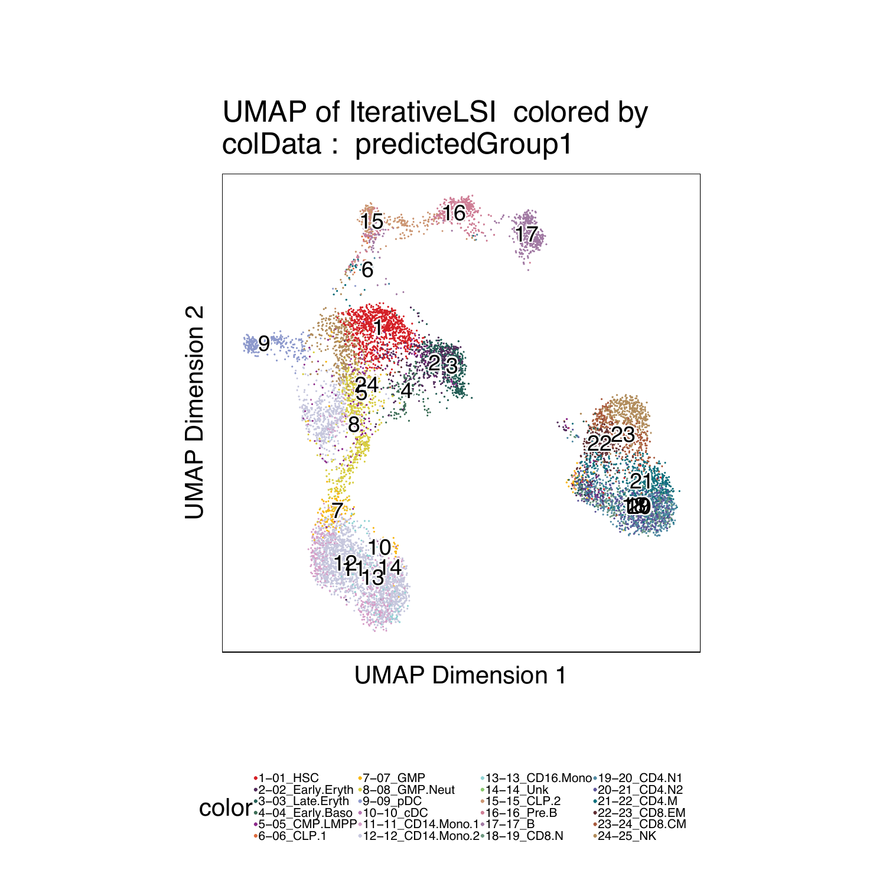
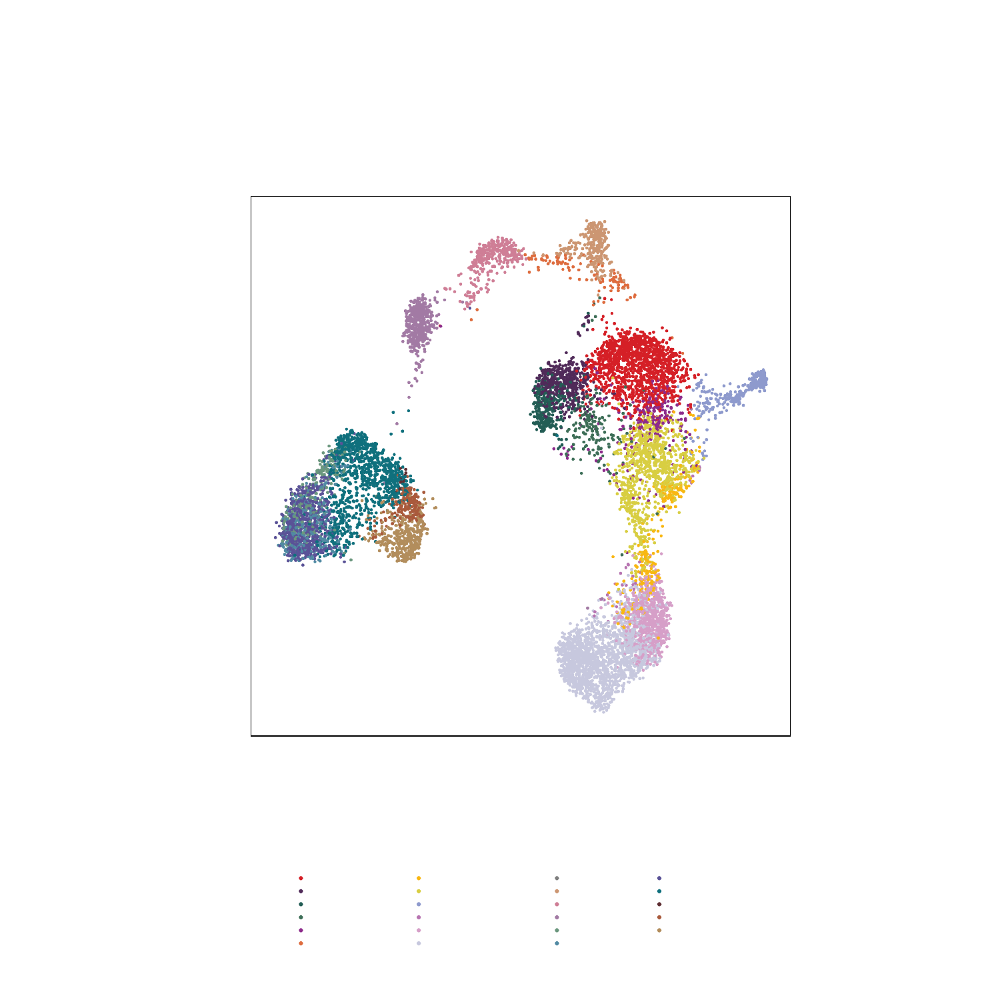
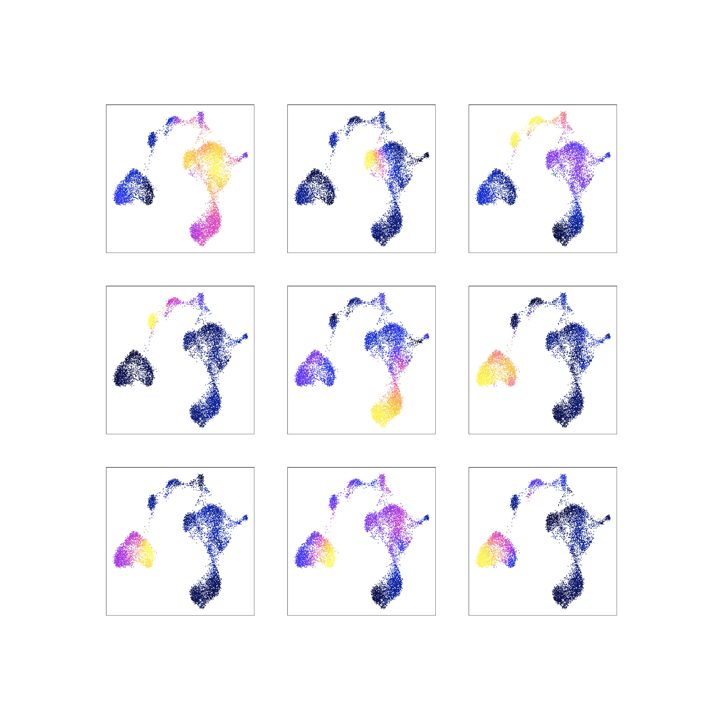
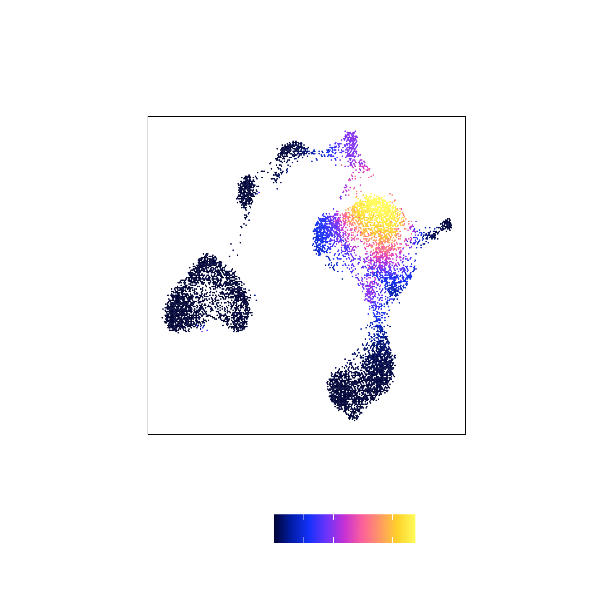

---
output:
  html_document:
    theme: yeti  # many options for theme, this one is my favorite.
params:
  threads: 20
  rdata: ""
  token: ""
  ref: ""
  out: ""
---

```{r, include=FALSE, eval=FALSE}
params2 <- params
unlockBinding("params", env = .GlobalEnv)
#load("Chapter-13-Footprints.Rdata")
load(params$rdata)
params <- params2
rm(params2)
devtools::install_github("GreenleafLab/ArchR", 
  auth_token = params$token, 
  ref = params$ref,
  repos = BiocManager::repositories(),
  dependencies = FALSE
)
library(ArchR)
fn <- unclass(lsf.str(envir = asNamespace("ArchR"), all = TRUE))
fn <- fn[!grepl("\\.", fn)]
fn <- fn[fn!="ArchRProj"]
for (i in seq_along(fn)){
    tryCatch({
        eval(parse(text = paste0(fn[i], "<-ArchR::", fn[i])))
    }, error = function(x) {
    })
}
addArchRThreads(threads = params$threads)
addArchRGenome("hg19")
# fn <- unclass(lsf.str(envir = asNamespace("ArchR"), all = TRUE))
# fn <- fn[fn!="ArchRProj"]
# for (i in seq_along(fn)) {
#     tryCatch({
#         eval(parse(text = paste0(fn[i], "<-ArchR:::", fn[i])))
#     }, error = function(x) {
#     })
# }
set.seed(1)
```

# Labeling Clusters with scRNA

## Labeling scATAC cells with scRNA clusters

First we need to download scRNA data for hematopoiesis from Granja* et al (2019).

```{r eval=FALSE}
#111 MB Download
if(!file.exists("scRNA-Hematopoiesis-Granja-2019.rds")){
    download.file(
        url = "https://jeffgranja.s3.amazonaws.com/ArchR/TestData/scRNA-Hematopoiesis-Granja-2019.rds",
        destfile = "scRNA-Hematopoiesis-Granja-2019.rds"
    )
}

seRNA <- readRDS("scRNA-Hematopoiesis-Granja-2019.rds")
seRNA
```
> \## class: RangedSummarizedExperiment   
## dim: 20287 35582   
## metadata(0):  
## assays(1): counts  
## rownames(20287): FAM138A OR4F5 ... S100B PRMT2  
## rowData names(3): gene_name gene_id exonLength  
## colnames(35582): CD34_32_R5:AAACCTGAGTATCGAA-1  
##   CD34_32_R5:AAACCTGAGTCGTTTG-1 ...  
##   BMMC_10x_GREENLEAF_REP2:TTTGTTGCATGTGTCA-1  
##   BMMC_10x_GREENLEAF_REP2:TTTGTTGCATTGAAAG-1  
## colData names(10): Group nUMI_pre ... BioClassification Barcode  

```{r eval=FALSE}
colnames(colData(seRNA))
```
> \##  [1] "Group"             "nUMI_pre"          "nUMI"             
##  [4] "nGene"             "initialClusters"   "UMAP1"            
##  [7] "UMAP2"             "Clusters"          "BioClassification"  
## [10] "Barcode"  

```{r eval=FALSE}
table(colData(seRNA)$BioClassification)
```
> \##         01_HSC 02_Early.Eryth  03_Late.Eryth  04_Early.Baso    05_CMP.LMPP   
##           1425           1653            446            111           2260   
##       06_CLP.1         07_GMP    08_GMP.Neut         09_pDC         10_cDC   
##            903           2097           1050            544            325   
## 11_CD14.Mono.1 12_CD14.Mono.2   13_CD16.Mono         14_Unk       15_CLP.2   
##           1800           4222            292            520            377   
##       16_Pre.B           17_B      18_Plasma       19_CD8.N      20_CD4.N1   
##            710           1711             62           1521           2470   
##      21_CD4.N2       22_CD4.M      23_CD8.EM      24_CD8.CM          25_NK   
##           2364           3539            796           2080           2143   
##         26_Unk   
##            161  

Unconstrained Integration (not-recommended)

```{r eval=FALSE}
#~5 minutes
projHeme2 <- addGeneIntegrationMatrix(
    ArchRProj = projHeme2, 
    useMatrix = "GeneScoreMatrix",
    matrixName = "GeneIntegrationMatrix",
    reducedDims = "IterativeLSI",
    seRNA = seRNA,
    addToArrow = FALSE,
    groupRNA = "BioClassification",
    nameCell = "predictedCell_Un", #Name of column where cell from scRNA is matched to each cell
    nameGroup = "predictedGroup_Un", #Name of column where group from scRNA is matched to each cell
    nameScore = "predictedScore_Un" #Name of column where prediction score from scRNA
)
```
> \## ArchR logging to : ArchRLogs/ArchR-addGeneIntegrationMatrix-f6635e453cfd-Date-2020-04-15_Time-10-08-55.log  
## If there is an issue, please report to github with logFile!  
## 2020-04-15 10:08:56 : Running Seurat's Integration Stuart* et al 2019, 0.005 mins elapsed.  
## 2020-04-15 10:09:06 : Checking ATAC Input, 0.172 mins elapsed.  
## 2020-04-15 10:09:06 : Checking RNA Input, 0.173 mins elapsed.  
## 2020-04-15 10:09:17 : Creating Integration Blocks, 0.367 mins elapsed.  
## 2020-04-15 10:09:18 : Prepping Interation Data, 0.372 mins elapsed.  
## 2020-04-15 10:09:19 : Computing Integration in 1 Integration Blocks!, 0 mins elapsed.  
## 2020-04-15 10:09:19 : Block (1 of 1) : Computing Integration, 0 mins elapsed.  
## 2020-04-15 10:09:23 : Block (1 of 1) : Identifying Variable Genes, 0.071 mins elapsed.  
## 2020-04-15 10:09:28 : Block (1 of 1) : Getting GeneScoreMatrix, 0.146 mins elapsed.  
## 2020-04-15 10:09:37 : Block (1 of 1) : Imputing GeneScoreMatrix, 0.298 mins elapsed.  
## 2020-04-15 10:09:37 : Computing Impute Weights Using Magic (Cell 2018), 0 mins elapsed.  
## 2020-04-15 10:09:37 : Computing Partial Diffusion Matrix with Magic (1 of 2), 0 mins elapsed.  
## 2020-04-15 10:09:44 : Computing Partial Diffusion Matrix with Magic (2 of 2), 0.122 mins elapsed.  
## 2020-04-15 10:09:51 : Completed Getting Magic Weights!, 0.242 mins elapsed.  
## Getting ImputeWeights  
## Using weights on disk  
## Using weights on disk  
## Getting ImputeWeights  
## 2020-04-15 10:10:17 : Block (1 of 1) : Seurat FindTransferAnchors, 0.968 mins elapsed.  
## 2020-04-15 10:12:00 : Block (1 of 1) : Seurat TransferData Cell Labels, 2.681 mins elapsed.  
## 2020-04-15 10:12:34 : Block (1 of 1) : Completed Integration, 3.243 mins elapsed.  
## 2020-04-15 10:12:34 : Completed Integration with RNA Matrix, 3.256 mins elapsed.  
## ArchR logging successful to : ArchRLogs/ArchR-addGeneIntegrationMatrix-f6635e453cfd-Date-2020-04-15_Time-10-08-55.log  

Constrained Integration (recommended)

```{r eval=FALSE}

#We can use the unconstrained fits to help identify which are T/NK Cells
cM <- as.matrix(confusionMatrix(projHeme2$Clusters, projHeme2$predictedGroup_Un))
preClust <- colnames(cM)[apply(cM, 1 , which.max)]
cbind(preClust, rownames(cM)) #Assignments
```
> \##       preClust              
##  [1,] "17_B"           "C3"  
##  [2,] "20_CD4.N1"      "C8"  
##  [3,] "16_Pre.B"       "C4"  
##  [4,] "08_GMP.Neut"    "C11"  
##  [5,] "11_CD14.Mono.1" "C1"  
##  [6,] "01_HSC"         "C12"  
##  [7,] "03_Late.Eryth"  "C10"  
##  [8,] "22_CD4.M"       "C9"   
##  [9,] "25_NK"          "C7"   
## [10,] "09_pDC"         "C5"   
## [11,] "12_CD14.Mono.2" "C2"   
## [12,] "15_CLP.2"       "C6"  

```{r eval=FALSE}
#From scRNA
cTNK <- paste0(paste0(19:25), collapse="|")
cTNK
```
> \## [1] "19|20|21|22|23|24|25"  

```{r eval=FALSE}
cNonTNK <- paste0(c(paste0("0", 1:9), 10:13, 15:18), collapse="|")
cNonTNK
```
> \## [1] "01|02|03|04|05|06|07|08|09|10|11|12|13|15|16|17|18"

```{r eval=FALSE}
#Assign scATAC to these categories
clustTNK <- rownames(cM)[grep(cTNK, preClust)]
clustTNK
```
> \## [1] "C8" "C9" "C7"  

```{r eval=FALSE}
clustNonTNK <- rownames(cM)[grep(cNonTNK, preClust)]
clustNonTNK
```
> \## [1] "C3"  "C4"  "C11" "C1"  "C12" "C10" "C5"  "C2"  "C6"  

```{r eval=FALSE}
#RNA get cells in these categories
rnaTNK <- colnames(seRNA)[grep(cTNK, colData(seRNA)$BioClassification)]
head(rnaTNK)
```
> \## [1] "PBMC_10x_GREENLEAF_REP1:AAACCCAGTCGTCATA-1"  
## [2] "PBMC_10x_GREENLEAF_REP1:AAACCCATCCGATGTA-1"  
## [3] "PBMC_10x_GREENLEAF_REP1:AAACCCATCTCAACGA-1"  
## [4] "PBMC_10x_GREENLEAF_REP1:AAACCCATCTCTCGAC-1"  
## [5] "PBMC_10x_GREENLEAF_REP1:AAACGAACAATCGTCA-1"  
## [6] "PBMC_10x_GREENLEAF_REP1:AAACGAACACGATTCA-1"  

```{r eval=FALSE}
rnaNonTNK <- colnames(seRNA)[grep(cNonTNK, colData(seRNA)$BioClassification)]
head(rnaNonTNK)
```
> \## [1] "CD34_32_R5:AAACCTGAGTATCGAA-1" "CD34_32_R5:AAACCTGAGTCGTTTG-1"  
## [3] "CD34_32_R5:AAACCTGGTTCCACAA-1" "CD34_32_R5:AAACGGGAGCTTCGCG-1"  
## [5] "CD34_32_R5:AAACGGGAGGGAGTAA-1" "CD34_32_R5:AAACGGGAGTTACGGG-1"  

```{r eval=FALSE}
groupList <- SimpleList(
    TNK = SimpleList(
        ATAC = projHeme2$cellNames[projHeme2$Clusters %in% clustTNK],
        RNA = rnaTNK
    ),
    NonTNK = SimpleList(
        ATAC = projHeme2$cellNames[projHeme2$Clusters %in% clustNonTNK],
        RNA = rnaNonTNK
    )    
)

#~5 minutes
projHeme2 <- addGeneIntegrationMatrix(
    ArchRProj = projHeme2, 
    useMatrix = "GeneScoreMatrix",
    matrixName = "GeneIntegrationMatrix",
    reducedDims = "IterativeLSI",
    seRNA = seRNA,
    addToArrow = FALSE, 
    groupList = groupList, #Constrain List
    groupRNA = "BioClassification",
    nameCell = "predictedCell_Co", #Name of column where cell from scRNA is matched to each cell
    nameGroup = "predictedGroup_Co", #Name of column where group from scRNA is matched to each cell
    nameScore = "predictedScore_Co" #Name of column where prediction score from scRNA
)
```
> \## ArchR logging to : ArchRLogs/ArchR-addGeneIntegrationMatrix-f663618b2629-Date-2020-04-15_Time-10-12-35.log  
## If there is an issue, please report to github with logFile!  
## 2020-04-15 10:12:36 : Running Seurat's Integration Stuart* et al 2019, 0.014 mins elapsed.  
## 2020-04-15 10:12:36 : Checking ATAC Input, 0.027 mins elapsed.  
## 2020-04-15 10:12:36 : Checking RNA Input, 0.027 mins elapsed.  
## 2020-04-15 10:12:48 : Creating Integration Blocks, 0.218 mins elapsed.  
## 2020-04-15 10:12:48 : Prepping Interation Data, 0.222 mins elapsed.  
## 2020-04-15 10:12:49 : Computing Integration in 2 Integration Blocks!, 0 mins elapsed.  
## 2020-04-15 10:15:24 : Completed Integration with RNA Matrix, 2.574 mins elapsed.  
## ArchR logging successful to : ArchRLogs/ArchR-addGeneIntegrationMatrix-f663618b2629-Date-2020-04-15_Time-10-12-35.log  

Compare results

```{r eval=FALSE}
pal <- paletteDiscrete(values = colData(seRNA)$BioClassification)
```
> \## Length of unique values greater than palette, interpolating..
```{r eval=FALSE}
pal
```
> \##         01_HSC 02_Early.Eryth  03_Late.Eryth  04_Early.Baso    05_CMP.LMPP   
##      "#D51F26"      "#502A59"      "#235D55"      "#3D6E57"      "#8D2B8B"   
##       06_CLP.1         07_GMP    08_GMP.Neut         09_pDC         10_cDC   
##      "#DE6C3E"      "#F9B712"      "#D8CE42"      "#8E9ACD"      "#B774B1"   
## 11_CD14.Mono.1 12_CD14.Mono.2   13_CD16.Mono         14_Unk       15_CLP.2   
##      "#D69FC8"      "#C7C8DE"      "#8FD3D4"      "#89C86E"      "#CC9672"   
##       16_Pre.B           17_B      18_Plasma       19_CD8.N      20_CD4.N1   
##      "#CF7E96"      "#A27AA4"      "#CD4F32"      "#6B977E"      "#518AA3"   
##      21_CD4.N2       22_CD4.M      23_CD8.EM      24_CD8.CM          25_NK   
##      "#5A5297"      "#0F707D"      "#5E2E32"      "#A95A3C"      "#B28D5C"   
##         26_Unk   
##      "#3D3D3D"  

```{r eval=FALSE}
p1 <- plotEmbedding(
    projHeme2, 
    colorBy = "cellColData", 
    name = "predictedGroup_Un", 
    pal = pal
)
```
> \## ArchR logging to : ArchRLogs/ArchR-plotEmbedding-f66351b51d5d-Date-2020-04-15_Time-10-15-31.log  
## If there is an issue, please report to github with logFile!  
## Getting UMAP Embedding  
## ColorBy = cellColData  
## Plotting Embedding  
## 1   
## ArchR logging successful to : ArchRLogs/ArchR-plotEmbedding-f66351b51d5d-Date-2020-04-15_Time-10-15-31.log  

```{r eval=FALSE}
p1
```

```{r, include=FALSE, eval=FALSE}
plotPDF(p1, name = "Plot-UMAP-RNA-Integration.pdf", ArchRProj = projHeme2, addDOC = FALSE, width = 5, height = 5)
ArchR:::.convertToPNG(ArchRProj = projHeme2)
system("cp Figures/*.png images/HemeWalkthrough/PNG/")
system("cp Figures/*.pdf images/HemeWalkthrough/PDF/")
```

{width=600 height=600}

```{r eval=FALSE}
p2 <- plotEmbedding(
    projHeme2, 
    colorBy = "cellColData", 
    name = "predictedGroup_Co", 
    pal = pal
)
```
> \## ArchR logging to : ArchRLogs/ArchR-plotEmbedding-f6632ef266a4-Date-2020-04-15_Time-10-15-49.log  
## If there is an issue, please report to github with logFile!  
## Getting UMAP Embedding  
## ColorBy = cellColData  
## Plotting Embedding  
## 1   
## ArchR logging successful to : ArchRLogs/ArchR-plotEmbedding-f6632ef266a4-Date-2020-04-15_Time-10-15-49.log  

```{r eval=FALSE}
p2
```

```{r, include=FALSE, eval=FALSE}
plotPDF(p1,p2, name = "Plot-UMAP-RNA-Integration.pdf", ArchRProj = projHeme2, addDOC = FALSE, width = 5, height = 5)
ArchR:::.convertToPNG(ArchRProj = projHeme2)
system("cp Figures/*.png images/HemeWalkthrough/PNG/")
system("cp Figures/*.pdf images/HemeWalkthrough/PDF/")
```

{width=600 height=600}

To save a nice looking pdf we use plotPDF which removes white pages and tries to make the plots
nice looking.

```{r eval=FALSE}
plotPDF(p1,p2, name = "Plot-UMAP-RNA-Integration.pdf", ArchRProj = projHeme2, addDOC = FALSE, width = 5, height = 5)
```
> \## [1] "plotting ggplot!"  
## [1] "plotting ggplot!"  
## [1] 0  

## Adding Pseudo-scRNA profiles for each scATAC cell

We can save our original projHeme2 using `saveArchRProject` from ArchR.

```{r eval=FALSE}
saveArchRProject(ArchRProj = projHeme2, outputDirectory = "Save-ProjHeme2", load = FALSE)
```
> \## Copying ArchRProject to new outputDirectory : /oak/stanford/groups/howchang/users/jgranja/ArchRTutorial/ArchRBook/BookOutput4/Save-ProjHeme2  
## Copying Arrow Files...  
## Copying Arrow Files (1 of 3)  
## Copying Arrow Files (2 of 3)  
## Copying Arrow Files (3 of 3)  
## Getting ImputeWeights  
## Dropping ImputeWeights...  
## Copying Other Files...  
## Copying Other Files (1 of 4): Embeddings  
## Copying Other Files (2 of 4): IterativeLSI  
## Copying Other Files (3 of 4): IterativeLSI2  
## Copying Other Files (4 of 4): Plots  
## Saving ArchRProject...  

Once you are satisfied with the results you can re-run with adding the gene
expression to the Arrow Files

```{r eval=FALSE}
groupList <- SimpleList(
    TNK = SimpleList(
        ATAC = projHeme2$cellNames[projHeme2$Clusters %in% clustTNK],
        RNA = rnaTNK
    ),
    NonTNK = SimpleList(
        ATAC = projHeme2$cellNames[projHeme2$Clusters %in% clustNonTNK],
        RNA = rnaNonTNK
    )    
)
groupList
```
> \## List of length 2  
## names(2): TNK NonTNK  

```{r eval=FALSE}
#~5 minutes
projHeme3 <- addGeneIntegrationMatrix(
    ArchRProj = projHeme2, 
    useMatrix = "GeneScoreMatrix",
    matrixName = "GeneIntegrationMatrix",
    reducedDims = "IterativeLSI",
    seRNA = seRNA,
    addToArrow = TRUE, #Now we add gene expression to Arrow Files 
    force= TRUE,
    groupList = groupList, #Constrain List
    groupRNA = "BioClassification",
    nameCell = "predictedCell", #Name of column where cell from scRNA is matched to each cell
    nameGroup = "predictedGroup", #Name of column where group from scRNA is matched to each cell
    nameScore = "predictedScore" #Name of column where prediction score from scRNA
)
```
> \## ArchR logging to : ArchRLogs/ArchR-addGeneIntegrationMatrix-f66317d3557e-Date-2020-04-15_Time-10-16-26.log  
## If there is an issue, please report to github with logFile!  
## 2020-04-15 10:16:26 : Running Seurat's Integration Stuart* et al 2019, 0.009 mins elapsed.  
## 2020-04-15 10:16:27 : Checking ATAC Input, 0.021 mins elapsed.  
## 2020-04-15 10:16:27 : Checking RNA Input, 0.021 mins elapsed.  
## 2020-04-15 10:16:38 : Creating Integration Blocks, 0.211 mins elapsed.  
## 2020-04-15 10:16:39 : Prepping Interation Data, 0.215 mins elapsed.  
## 2020-04-15 10:16:39 : Computing Integration in 2 Integration Blocks!, 0 mins elapsed.  
## 2020-04-15 10:19:30 : Transferring Data to ArrowFiles, 2.843 mins elapsed.  
## 2020-04-15 10:20:47 : Completed Integration with RNA Matrix, 4.133 mins elapsed.  
## ArchR logging successful to : ArchRLogs/ArchR-addGeneIntegrationMatrix-f66317d3557e-Date-2020-04-15_Time-10-16-26.log  

What matrices are available?

```{r eval=FALSE}
getAvailableMatrices(projHeme3)
```
> \## [1] "GeneIntegrationMatrix" "GeneScoreMatrix"       "TileMatrix"  

Now lets see how this effects our marker gene scores overlayed on our 2-d embedding.

```{r eval=FALSE}
projHeme3 <- addImputeWeights(projHeme3)
```
> \## 2020-04-15 10:20:49 : Computing Impute Weights Using Magic (Cell 2018), 0 mins elapsed.  
## 2020-04-15 10:20:59 : Completed Getting Magic Weights!, 0.176 mins elapsed.  

```{r eval=FALSE}
markerGenes  <- c(
    "CD34", #Early Progenitor
    "GATA1", #Erythroid
    "PAX5", "MS4A1", #B-Cell Trajectory
    "CD14", #Monocytes
    "CD3D", "CD8A", "TBX21", "IL7R" #TCells
  )

p1 <- plotEmbedding(
    ArchRProj = projHeme3, 
    colorBy = "GeneIntegrationMatrix", 
    name = markerGenes, 
    continuousSet = "horizonExtra",
    embedding = "UMAP",
    imputeWeights = getImputeWeights(projHeme3)
)
```
> \## Getting ImputeWeights  
## ArchR logging to : ArchRLogs/ArchR-plotEmbedding-f66370e499ac-Date-2020-04-15_Time-10-20-59.log  
## If there is an issue, please report to github with logFile!  
## Getting UMAP Embedding  
## ColorBy = GeneIntegrationMatrix  
## Getting Matrix Values...  
## Getting Matrix Values...  
##   
## Imputing Matrix  
## Using weights on disk  
## Using weights on disk  
## Plotting Embedding  
## 1 2 3 4 5 6 7 8 9   
## ArchR logging successful to : ArchRLogs/ArchR-plotEmbedding-f66370e499ac-Date-2020-04-15_Time-10-20-59.log  

```{r eval=FALSE}
p2 <- plotEmbedding(
    ArchRProj = projHeme3, 
    colorBy = "GeneScoreMatrix", 
    continuousSet = "horizonExtra",
    name = markerGenes, 
    embedding = "UMAP",
    imputeWeights = getImputeWeights(projHeme3)
)
```
> \## Getting ImputeWeights  
## ArchR logging to : ArchRLogs/ArchR-plotEmbedding-f6632d4259ce-Date-2020-04-15_Time-10-21-15.log  
## If there is an issue, please report to github with logFile!  
## Getting UMAP Embedding  
## ColorBy = GeneScoreMatrix  
## Getting Matrix Values...  
## Getting Matrix Values...  
##   
## Imputing Matrix  
## Using weights on disk  
## Using weights on disk  
## Plotting Embedding  
## 1 2 3 4 5 6 7 8 9   
## ArchR logging successful to : ArchRLogs/ArchR-plotEmbedding-f6632d4259ce-Date-2020-04-15_Time-10-21-15.log  

To plot all marker genes we can use cowplot

```{r, eval=FALSE}
#Rearrange for grid plotting
p1c <- lapply(p1, function(x){
    x + guides(color = FALSE, fill = FALSE) + 
    theme_ArchR(baseSize = 6.5) +
    theme(plot.margin = unit(c(0, 0, 0, 0), "cm")) +
    theme(
        axis.text.x=element_blank(), 
        axis.ticks.x=element_blank(), 
        axis.text.y=element_blank(), 
        axis.ticks.y=element_blank()
    )
})

#Rearrange for grid plotting
p2c <- lapply(p2, function(x){
    x + guides(color = FALSE, fill = FALSE) + 
    theme_ArchR(baseSize = 6.5) +
    theme(plot.margin = unit(c(0, 0, 0, 0), "cm")) +
    theme(
        axis.text.x=element_blank(), 
        axis.ticks.x=element_blank(), 
        axis.text.y=element_blank(), 
        axis.ticks.y=element_blank()
    )
})

do.call(cowplot::plot_grid, c(list(ncol = 3), p1c))
```

```{r, include=FALSE, eval=FALSE}
plotPDF(
    do.call(cowplot::plot_grid, c(list(ncol = 3),p1c)), 
    do.call(cowplot::plot_grid, c(list(ncol = 3),p2c)), 
    name = "Plot-UMAP-Markers-RNA-W-Imputation.pdf", 
    ArchRProj = projHeme3,
    addDOC = FALSE,
    width = 10, 
    height = 10
)
ArchR:::.convertToPNG(ArchRProj = projHeme2)
system("cp Figures/*.png images/HemeWalkthrough/PNG/")
system("cp Figures/*.pdf images/HemeWalkthrough/PDF/")
```

{width=800 height=800}

```{r, eval=FALSE}
do.call(cowplot::plot_grid, c(list(ncol = 3), p2c))
```

{width=800 height=800}


To save a nice looking pdf we use plotPDF which removes white pages and tries to make the plots
nice looking.

```{r eval=FALSE}
plotPDF(plotList = p1, 
    name = "Plot-UMAP-Marker-Genes-RNA-W-Imputation.pdf", 
    ArchRProj = projHeme3, 
    addDOC = FALSE, width = 5, height = 5)
```
> \## [1] "plotting ggplot!"  
## [1] "plotting ggplot!"  
## [1] "plotting ggplot!"   
## [1] "plotting ggplot!"  
## [1] "plotting ggplot!"  
## [1] "plotting ggplot!"  
## [1] "plotting ggplot!"  
## [1] "plotting ggplot!"  
## [1] "plotting ggplot!"  
## [1] 0  

## Labeling scATAC clusters with scRNA

Now that we have pretty good scRNA and scATAC correspondence we can label our clusters with scRNA

```{r, include=FALSE, eval=FALSE}

#Fist we create a confusion matrix
cM <- confusionMatrix(projHeme3$Clusters, projHeme3$predictedGroup)
labelOld <- rownames(cM)
labelOld
#  [1] "Cluster11" "Cluster2"  "Cluster12" "Cluster1"  "Cluster8"  "Cluster4" 
#  [7] "Cluster9"  "Cluster5"  "Cluster7"  "Cluster14" "Cluster3"  "Cluster10"
# [13] "Cluster6"  "Cluster13"

labelNew <- colnames(cM)[apply(cM, 1, which.max)]
labelNew

#Next we need to reclassify these clusters to make a simpler hierarchy
remapClust <- c(
    "01_HSC" = "Progenitor",
    "02_Early.Eryth" = "Erythroid",
    "03_Late.Eryth" = "Erythroid",
    "04_Early.Baso" = "Basophil",
    "05_CMP.LMPP" = "Progenitor",
    "06_CLP.1" = "CLP",
    "07_GMP" = "GMP",
    "08_GMP.Neut" = "GMP",
    "09_pDC" = "pDC",
    "10_cDC" = "cDC",
    "11_CD14.Mono.1" = "Mono",
    "12_CD14.Mono.2" = "Mono",
    "13_CD16.Mono" = "Mono",
    "15_CLP.2" = "CLP",
    "16_Pre.B" = "PreB",
    "17_B" = "B",
    "18_Plasma" = "Plasma",
    "19_CD8.N" = "CD8.N",
    "20_CD4.N1" = "CD4.N",
    "21_CD4.N2" = "CD4.N",
    "22_CD4.M" = "CD4.M",
    "23_CD8.EM" = "CD8.EM",
    "24_CD8.CM" = "CD8.CM",
    "25_NK" = "NK"
)
remapClust <- remapClust[names(remapClust) %in% labelNew]
labelNew2 <- mapLabels(labelNew, oldLabels = names(remapClust), newLabels = remapClust)
labelNew2
#  [1] "GMP"        "B"          "PreB"       "CD4.N"      "Mono"      
#  [6] "Erythroid"  "Progenitor" "CD4.M"      "pDC"        "NK"        
# [11] "CLP"        "Mono"

projHeme3$Clusters2 <- mapLabels(projHeme3$Clusters, newLabels = labelNew2, oldLabels = labelOld)

p1 <- plotEmbedding(projHeme3, colorBy = "cellColData", name = "Clusters2")
p1
```

```{r, include=FALSE, eval=FALSE}
plotPDF(p1, name = "Plot-UMAP-Remap-Clusters.pdf", ArchRProj = projHeme2, addDOC = FALSE, width = 5, height = 5)
ArchR:::.convertToPNG(ArchRProj = projHeme2)
system("cp Figures/*.png images/HemeWalkthrough/PNG/")
system("cp Figures/*.pdf images/HemeWalkthrough/PDF/")
```
> \## [1] "plotting ggplot!"  
## [1] 0  

{width=500 height=500}

To save a nice looking pdf we use plotPDF which removes white pages and tries to make the plots
nice looking.

```{r eval=FALSE}
plotPDF(p1, name = "Plot-UMAP-Remap-Clusters.pdf", ArchRProj = projHeme2, addDOC = FALSE, width = 5, height = 5)
```

```{r, include=FALSE, eval=FALSE}
save.image(params$out, compress = FALSE)
```


