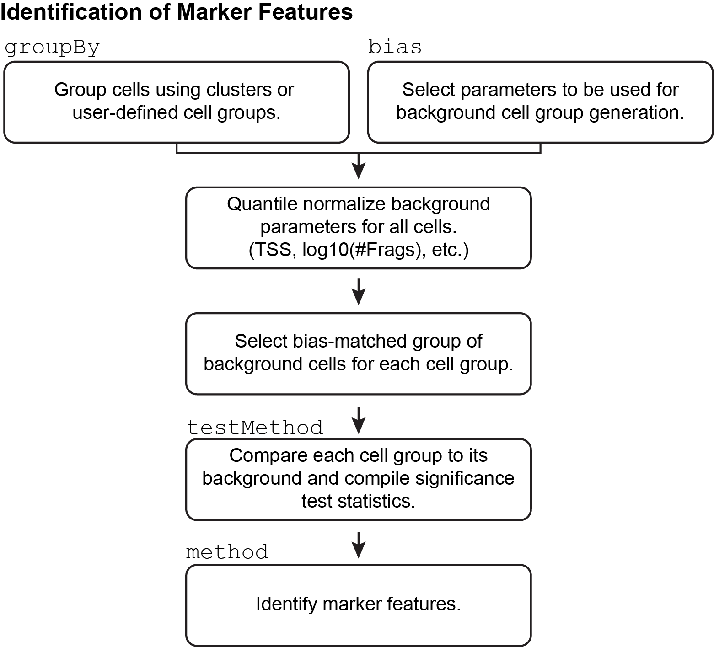
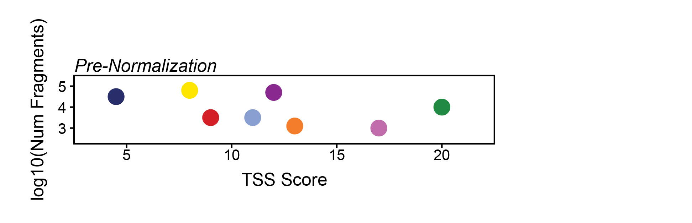
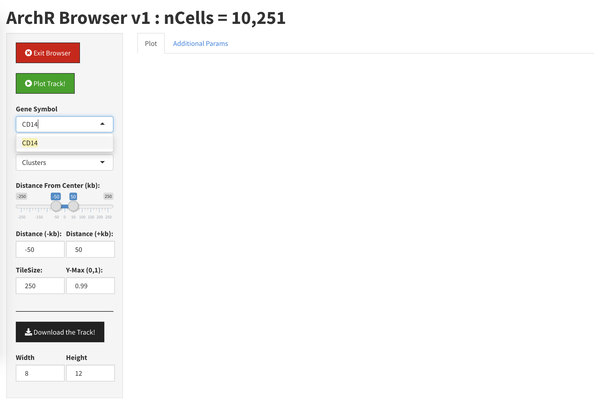
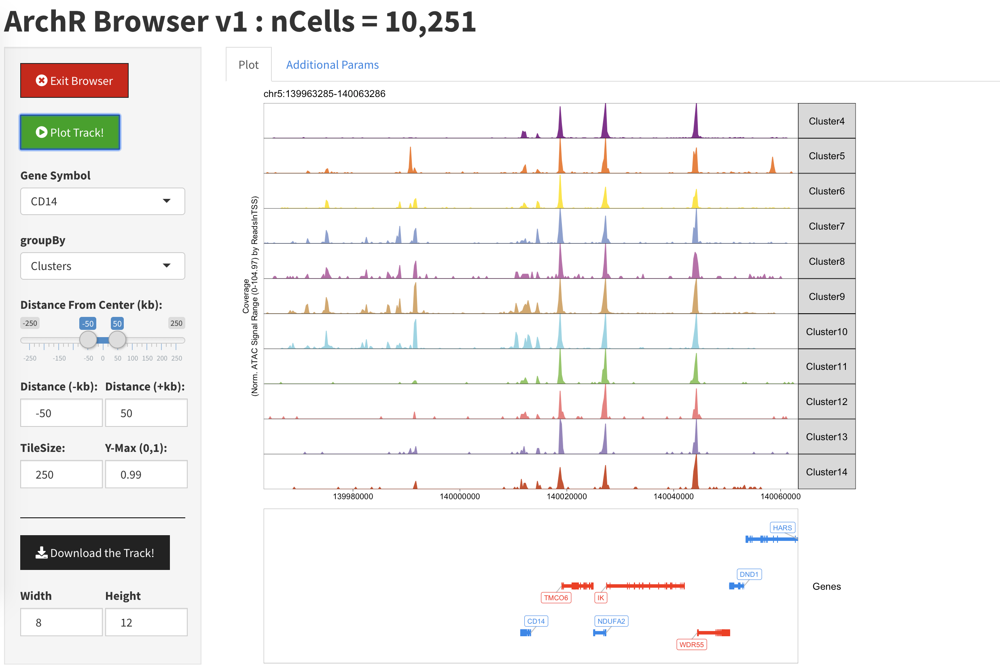

---
output:
  html_document:
    theme: yeti  # many options for theme, this one is my favorite.
params:
  threads: 20
  rdata: ""
  token: ""
  ref: ""
  out: ""
editor_options: 
  markdown: 
    wrap: 72
---

```{r, include=FALSE}
#load the data from the previous chapter as needed
current_chapter = 9
previous_chapter = current_chapter-1
load(file = paste0("./chapter_images/chapter",previous_chapter,".RData"))
```

# Gene Scores and Marker Genes with ArchR

While ArchR is able to robustly call clusters, it is not possible to know _a priori_ which cell type is represented by each cluster. This task is often left to manual annotation because every application is different. There are, of course, new tools that help to do this annotation but these have largely been designed with scRNA-seq in mind.

To do this cell type annotation when we only have scATAC-seq data available, we use prior knowledge of cell type-specific marker genes and we estimate gene expression for these genes from our chromatin accessibility data by uing _gene scores_. A gene score is essentially a prediction of how highly expressed a gene will be based on the accessibility of regulatory elements in the vicinity of the gene. To create these gene scores, ArchR allows for the use of complex user-supplied custom distance-weighted accessibility models. In addition to gene scores, we can also use _module scores_ which allow you to group multiple features (e.g. genes or peaks) together to create more refined cell group definitions.

## Calculating Gene Scores in ArchR

In our publication, we tested over 50 different gene score models and identified a class of models that consistently outperformed the rest across a variety of test conditions. This class of model, which is implemented as the default in ArchR, has three major components:

1. Accessibility within the entire gene body contributes to the gene score.
2. An exponential weighting function that accounts for the activity of putative distal regulatory elements in a distance-dependent fashion.
3. Imposed gene boundaries that minimizes the contribution of unrelated regulatory elements to the gene score.

So how does ArchR calculate gene scores? For each chromosome, ArchR creates a tile matrix using a user-defined tile size that is not pre-computed (default is 500 bp), overlaps these tiles with the user-defined gene window (default is 100 kb on either side of the gene), and then computes the distance from each tile (start or end) to the gene body (with optional extensions upstream or downstream) or gene start. We have found that the best predictor of gene expression is the local accessibility of the gene region which includes the promoter and gene body. As mentioned above, to properly account for distal accessibility for a given gene, ArchR identifies the subset of tiles that are within the gene window and do not cross another gene region. This filtering allows for inclusion of distal regulatory elements that could improve the accuracy of predicting gene expression values but excludes regulatory elements more likely to be associated with another gene (for ex. the promoter of a nearby gene). The distance from each tile to the gene is then converted to a distance weight using a user-defined accessibility model (default is e(-abs(distance)/5000) + e-1). When the gene body is included in the gene region (where the distance-based weight is the maximum weight possible), we found that extremely large genes can bias the overall gene scores. In these cases, the total gene scores can vary substantially due to the inclusion of insertions in both introns and exons. To help adjust for these large differences in gene size, ArchR applies a separate weight for the inverse of the gene size (1 / gene size) and scales this inverse weight linearly from 1 to a user-defined hard maximum (default of 5). Smaller genes thus receive larger relative weights, partially normalizing this length effect. The corresponding distance and gene size weights are then multiplied by the number of Tn5 insertions within each tile and summed across all tiles within the gene window, while still accounting for nearby gene regions as described above. This summed accessibility is a “gene score” and is depth normalized across all genes to a user-defined constant (default of 10,000). Computed gene scores are then stored in the corresponding Arrow file for downstream analyses.

To illustrate what the default ArchR gene score model looks like, we provide this toy example showing the weighting applied across the entire gene region:

<center>
{width=500px}
</center>

Gene scores are calculated for each Arrow file at the time of creation if the parameter `addGeneScoreMat` is set to `TRUE` - this is the default behavior. If you wish to change any of the default parameters for gene score calculation during Arrow file creation, you can use the `GeneScoreMatParams` parameter. By default, gene scores are depth normalized based on the `scaleTo` parameter. If you do not wish to add gene scores to your Arrow file at the time of creation, gene scores can be added to Arrow files at any time by using the `addGeneScoreMatrix()` function. Gene scores are stored in a matrix within each Arrow file called "GeneScoreMatrix". Once caluclated, gene scores can be used for many different analyses. For example, individual cells of an embedding can be colored by their gene scores to help with the identification of various cell types. We illustrate the application of gene scores throughout the rest of this chapter.

It is important to note that not all genes behave well with gene scores. In particular, genes that reside in very gene-dense areas can be problematic. Thus, it is always best to sanity check all gene score analyses by looking at sequencing tracks which is described in a later chapter.

## Identification of Marker Features

In addition to using prior knowledge of relevant marker genes for annotation of clusters, ArchR enables unbiased identification of marker features for any given cell groupings (for example, clusters). These features can be anything - peaks, genes (based on gene scores), or transcription factor motifs (based on chromVAR deviations). ArchR does this using the `getMarkerFeatures()` function which can take as input any matrix via the `useMatrix` parameter and it identifies features unique to the groups indicated by the `groupBy` parameter. If the `useMatrix` parameter is set to "GeneScoreMatrix", then the function will identify the genes that appear to be uniquely active in each cell type. This provides an unbiased way of seeing which genes are predicted to be active in each cluster and can aid in cluster annotation.

As mentioned above, the same `getMarkerFeatures()` function can be used with any matrix stored in the Arrow files to identify features that are specific to certain cell groups. This is accomplished via the `useMatrix` parameter. For example, `useMatrix = "TileMatrix"` would identify genomic regions that are highly specific to a certain cell group and `useMatrix = "PeakMatrix"` would identify peaks that are highly specific to a certain cell group. Examples of how to use the `getMarkerFeatures()` function on other feature types are provided in later chapters.

### How does marker feature identification happen?

This process of marker feature identification hinges on the selection of a group of bias-matched background cells for each cell group. Across all features, each cell group is compared to its own background group of cells to determine if the given cell group has significantly higher accessibility.

<center>
{width=500px}
</center>

The selection of these background cell groups is critical to the success of this process and is performed across the multi-dimensional space provided by the user via the `bias` argument to `getMarkerFeatures()`. For each cell in the cell group, ArchR finds the nearest neighbor cell across the provided multi-dimensional space that is not a member of the given cell group and adds it to the background group of cells. In this way, ArchR creates a group of bias-matched cells that is as similar as possible to the given cell group, thus enabling a more robust determination of significance even if the group of cells is small.

The way ArchR does this is by taking all of the dimensions provided via the `bias` parameter and quantile normalizing their values to distribute the variance of each dimension across the same relative scale. Taking a toy example, if the parameters `TSS` and `log10(Num Fragments)` were provided to `bias`, the pre-quantile normalized values might look like this:

<center>
{width=500px}
</center>

Here, the relative variance across the y-axis is very small compared to the variance across the x-axis. If we normalize these axes so that their values range from 0 to 1 instead, we make the relative variance much more equal. Importantly, we also change the nearest neighbors dramatically as indicated to the right of this plot.

<center>
{width=500px}
</center>

ArchR normalizes all of the dimensions and uses euclidean distance in this normalized multidimensional space to find the nearest neighbors.

## Identifying Marker Genes

To identify marker genes based on gene scores, we call the `getMarkerFeatures()` function with `useMatrix = "GeneScoreMatrix"`. We specify that we want to know the cluster-specific features with `groupBy = "Clusters"` which tells ArchR to use the "Clusters" column in `cellColData` to stratify cell groups.

```{r, collapse=TRUE}
markersGS <- getMarkerFeatures(
    ArchRProj = projHeme2, 
    useMatrix = "GeneScoreMatrix", 
    groupBy = "Clusters",
    bias = c("TSSEnrichment", "log10(nFrags)"),
    testMethod = "wilcoxon"
)
```

This function returns a `SummarizedExperiment` object containing relevant information on the marker features identified. This type of return value is common in ArchR and is one of the key ways that ArchR enables downstream data analysis. `SummarizedExperiment` objects are similar to a matrix where rows represent features of interest (i.e. genes) and columns represent samples. A `SummarizedExperiment` object contains one or more assays, each represented by a matrix-like object of numeric data, and metadata that applies to the rows or columns of the assays matrices. It is beyond the scope of this tutorial to dive into `SummarizedExperiment` objects but check out the [bioconductor page](https://bioconductor.org/packages/release/bioc/html/SummarizedExperiment.html) if you need more information.

We can get a list of `DataFrame` objects, one for each of our clusters, containing the relevant marker features using the `getMarkers()` function:

```{r, collapse=TRUE}
markerList <- getMarkers(markersGS, cutOff = "FDR <= 0.01 & Log2FC >= 1.25")
markerList$C6
```

To visualize all of the marker features simultaneously, we can create a heatmap using the `markerHeatmap()` function, optionally supplying some marker genes to label on the heatmap via the `labelMarkers` parameter.
```{r, collapse=TRUE}
markerGenes  <- c(
    "CD34", #Early Progenitor
    "GATA1", #Erythroid
    "PAX5", "MS4A1", "EBF1", "MME", #B-Cell Trajectory
    "CD14", "CEBPB", "MPO", #Monocytes
    "IRF8", 
    "CD3D", "CD8A", "TBX21", "IL7R" #TCells
  )

heatmapGS <- markerHeatmap(
  seMarker = markersGS, 
  cutOff = "FDR <= 0.01 & Log2FC >= 1.25", 
  labelMarkers = markerGenes,
  transpose = TRUE
)
```

To plot this heatmap, we can use the `ComplexHeatmap::draw()` function because the `heatmapGS` object is actually a list of heatmaps:
```{r, collapse = TRUE}
ComplexHeatmap::draw(heatmapGS, heatmap_legend_side = "bot", annotation_legend_side = "bot")
```

Many heatmaps in ArchR utilize the `ComplexHeatmap` package which provides a very versatile and flexible framework for plotting heatmaps. If you need to change something about how the heatmap looks when plotted, you should consult the documentation for `ComplexHeatmap`. For example, if you want to change the order in which the heatmap rows are plotted, you can edit the `row_order` slot of the heatmap object and re-plot it:

```{r, collapse = TRUE}
heatmapGS@row_order <- c(10,11,12,3,4,5,1,2,6,8,7,9)
ComplexHeatmap::draw(heatmapGS, heatmap_legend_side = "bot", annotation_legend_side = "bot")

```


To save an editable vectorized version of this plot, we use `plotPDF()`.

```{r, collapse=TRUE}
plotPDF(heatmapGS, name = "GeneScores-Marker-Heatmap", width = 8, height = 6, ArchRProj = projHeme2, addDOC = FALSE)
```


## Visualizing Marker Genes on an Embedding

As mentioned previously, we can overlay per-cell gene scores on our UMAP embedding. This is accomplished using the `colorBy` and `name` parameters in the `plotEmbedding()` function.
```{r, collapse=TRUE}
markerGenes  <- c(
    "CD34",  #Early Progenitor
    "GATA1", #Erythroid
    "PAX5", "MS4A1", "MME", #B-Cell Trajectory
    "CD14", "MPO", #Monocytes
    "CD3D", "CD8A"#TCells
  )

p <- plotEmbedding(
    ArchRProj = projHeme2, 
    colorBy = "GeneScoreMatrix", 
    name = markerGenes, 
    embedding = "UMAP",
    quantCut = c(0.01, 0.95),
    imputeWeights = NULL
)
```

To plot a specific gene, we can subset this plot list:
```{r, collapse = TRUE}
p$CD14
```

To plot all genes we can use `cowplot` to arrange the various marker genes into a single plot.

```{r, collapse=TRUE}
p2 <- lapply(p, function(x){
    x + guides(color = FALSE, fill = FALSE) + 
    theme_ArchR(baseSize = 6.5) +
    theme(plot.margin = unit(c(0, 0, 0, 0), "cm")) +
    theme(
        axis.text.x=element_blank(), 
        axis.ticks.x=element_blank(), 
        axis.text.y=element_blank(), 
        axis.ticks.y=element_blank()
    )
})
do.call(cowplot::plot_grid, c(list(ncol = 3),p2))
```

To save an editable vectorized version of this plot, we use the `plotPDF()` function.

```{r, collapse=TRUE}
plotPDF(plotList = p, 
    name = "Plot-UMAP-Marker-Genes-WO-Imputation.pdf", 
    ArchRProj = projHeme2, 
    addDOC = FALSE, width = 5, height = 5)
```


## Marker Genes Imputation with MAGIC

In the previous section, you may have noticed that some of the gene score plots appear quite variable. This is because of the sparsity of scATAC-seq data. We can use [MAGIC](https://github.com/KrishnaswamyLab/MAGIC) to impute gene scores by smoothing signal across nearby cells. In our hands, this greatly improves the visual interpretation of gene scores. ArchR doesnt actually use the code in MAGIC to do this (you do not need to install the `Rmagic` package) but instead we have reimplemented the workflow within ArchR. We use the `addImputeWeights()` function to add impute weights to our `ArchRProject`.

```{r, collapse=TRUE}
projHeme2 <- addImputeWeights(projHeme2)
```

These impute weights can then be passed to `plotEmbedding()` when plotting gene scores overlayed on the UMAP embedding.
```{r, collapse=TRUE}
markerGenes  <- c(
    "CD34",  #Early Progenitor
    "GATA1", #Erythroid
    "PAX5", "MS4A1", "MME", #B-Cell Trajectory
    "CD14", "MPO", #Monocytes
    "CD3D", "CD8A"#TCells
  )

p <- plotEmbedding(
    ArchRProj = projHeme2, 
    colorBy = "GeneScoreMatrix", 
    name = markerGenes, 
    embedding = "UMAP",
    imputeWeights = getImputeWeights(projHeme2)
)
```

As before, we can subset this plot list to select a specific gene.
```{r, collapse=TRUE}
p$CD14
```

Or we can plot all the marker genes at once using `cowplot`.

```{r, collapse=TRUE}
#Rearrange for grid plotting
p2 <- lapply(p, function(x){
    x + guides(color = FALSE, fill = FALSE) + 
    theme_ArchR(baseSize = 6.5) +
    theme(plot.margin = unit(c(0, 0, 0, 0), "cm")) +
    theme(
        axis.text.x=element_blank(), 
        axis.ticks.x=element_blank(), 
        axis.text.y=element_blank(), 
        axis.ticks.y=element_blank()
    )
})
do.call(cowplot::plot_grid, c(list(ncol = 3),p2))
```


To save an editable vectorized version of this plot, we use the `plotPDF()` function.

```{r, collapse=TRUE}
plotPDF(plotList = p, 
    name = "Plot-UMAP-Marker-Genes-W-Imputation.pdf", 
    ArchRProj = projHeme2, 
    addDOC = FALSE, width = 5, height = 5)
```


## Module Scores

The reliability of gene scores derived from chromatin accessibility is highly dependent on the particular gene being queried. For example, genes that exist in highly gene-dense regions of the genome can be harder to accurately represent with gene scores because the surrounding peaks may not be acting to regulate its gene expression. For this reason, it's often best to use gene scores from multiple different genes to (for example) assign cluster identities. To facilitate this, ArchR enables the use of "modules" which are user-defined groups of features where the signal from each individual feature is combined using equal weights into a single module score. The per-cell values for each user-defined module are stored as a new column in the `cellColData` of the given `ArchRProject`.

Module scores are added using the `addModuleScore()` function. The key parameters for this function are `features` and `name`. `features` is a named list of character vectors containing gene names while `name` is the broad title that will be given to each column added to `cellColData`

```{r, collapse=TRUE}
features <- list(
  BScore = c("MS4A1", "CD79A", "CD74"),
  TScore = c("CD3D", "CD8A", "GZMB", "CCR7", "LEF1")
)
projHeme2 <- addModuleScore(projHeme2,
    useMatrix = "GeneScoreMatrix",
    name = "Module",
    features = features)
```

In this example, two columns will be added to `cellColData` named "Module.BScore" and "Module.TScore". This is because the column name is derived as `name.featureName`. If your feature list is unnamed, then the columns in `cellColData` will be numbered instead (i.e. "Module1" and "Module2" if `name="Module"` as above). The "BScore" module contains 3 gene markers of B cells (MS4A1, CD79A, and CD74) while the "TScore" module contains 5 gene markers for T cells (CD3D, CD8A, GZMB, CCR7, and LEF1).

We can then plot these modules on an embedding.

```{r, collapse=TRUE}
p1 <- plotEmbedding(projHeme2,
    embedding = "UMAP",
    colorBy = "cellColData",
    name="Module.BScore",
    imputeWeights = getImputeWeights(projHeme2))

p2 <- plotEmbedding(projHeme2,
    embedding = "UMAP",
    colorBy = "cellColData",
    name="Module.TScore",
    imputeWeights = getImputeWeights(projHeme2))

plotPDF(ggAlignPlots(p1,p2,draw=F,type="h"))
```

Module scores can be calculated from any matrix present within your `ArchRProject`.

## Track Plotting with ArchRBrowser

In addition to plotting gene scores per cell as a UMAP overlay, we can browse the local chromatin accessibility at these marker genes on a per cluster basis with genome browser tracks. To do this, we use the `plotBrowserTrack()` function which will create a list of plots, one for each of the genes specified by `markerGenes`. This function will plot a single track for each group in the `groupBy` parameter.

It is worth noting that the `plotBrowserTrack()` function plots "pseudobulk" level data from the single-cell ATAC-seq data by grouping many individual cells together. The cells selected are random and the number of cells selected and the cell groupings that can be displayed are based on the `maxCells` and `minCells` parameters respectively. As such, to ensure reproducibility of the functionality of the `plotBrowserTrack()` function, you should make sure to set a consistent seed for random number generation prior to plotting.


```{r, collapse=TRUE}
set.seed(1)

markerGenes  <- c(
    "CD34", #Early Progenitor
    "GATA1", #Erythroid
    "PAX5", "MS4A1", #B-Cell Trajectory
    "CD14", #Monocytes
    "CD3D", "CD8A", "TBX21", "IL7R" #TCells
  )

p <- plotBrowserTrack(
    ArchRProj = projHeme2, 
    groupBy = "Clusters", 
    geneSymbol = markerGenes, 
    upstream = 50000,
    downstream = 50000
)
```

Here, the output of `plotBrowserTrack()` is a list of plots. To plot a track of a specific gene, we can select one from the list.

```{r, collapse=TRUE}
grid::grid.newpage()
grid::grid.draw(p$CD14)
```


We can save a multi-page PDF with a single page for each gene locus in our plot list using the `plotPDF()` function.

```{r, collapse=TRUE}
plotPDF(plotList = p, 
    name = "Plot-Tracks-Marker-Genes.pdf", 
    ArchRProj = projHeme2, 
    addDOC = FALSE, width = 5, height = 5)
```


The `plotBrowserTrack()` function is highly versatile and therefore has a lot of different parameter options so you should explore all of those capabilities in the [function documentation](https://www.archrproject.com/reference/plotBrowserTrack.html). There are multiple different types of plot elements that can be plotted and these are controlled using the `plotSummary` parameter. Those options include:

1. `bulkTrack` - A pseudobulk representation of the ATAC-seq signal in the given region
2. `scTrack` - The per-cell integration signal scATAC-seq signal. Each row represents an individual cell. The number of cells plotted per cell grouping is controlled by the `scCellsMax` parameter
3. `featureTrack` - Regions to be shown as blocks below the tracks (i.e peak regions, or SNPs, or some other feature
4. `geneTrack` - Line diagrams of genes with introns and exons shown. We've adopted the convention of plotting "plus-stranded" genes (those that point left-to-right with the TSS on the left) in red and "minus-stranded" genes (those that point right-to-left with the TSS on the right) in blue.
5. `loopTrack` - Arcs showing links between a peak and a gene, for example from co-accessibility or peak-to-gene linkage analysis. The actual loops plotted is controlled by the `loops` parameter.

For example, instead of providing a set of genes to plot via `geneSymbol`, you could provide a set of regions to plot as a `GRanges` object to the `region` parameter.

You can also change which regions are shown as "features" by manipulating the `features` paramter. The default is to show the `peakSet` of your `ArchRProject` but you can provide a `GRanges` (for a single feature track) or a __named__ `GRangesList` (for multiple feature tracks). If you provide a `GRangesList`, its best to provide a named list because the names will be used to label the individual feature tracks on the plot.

By default, the pseudobulk ATAC-seq tracks will be normalized based on `ReadsInTSS` (from `cellColData`) but this can be changed via the `normMethod` parameter if desired. Lastly, you can highlight specific regions in the plots using the `hightlight` and `highlightFill` paramters. There are tons of ways to use the `plotBrowserTrack()` function, far more than can be adequately reviewed in this manual so take the time to explore.

## Launching the Interactive ArchRBrowser

One challenge inherent to scATAC-seq data analysis is genome-track level visualizations of chromatin accessibility observed within groups of cells. Traditionally, track visualization requires grouping the scATAC-seq fragments, creating a genome coverage bigwig, and normalizing this track for quantitative visualization. Typically, end-users use a genome browser such as the [WashU Epigenome Browser](https://epigenomegateway.wustl.edu/), the [UCSC Genome Browser](http://genome.ucsc.edu/), or the [IGV browser](http://software.broadinstitute.org/software/igv/) to visualize these sequencing tracks. This process involves using multiple software and any change to the cellular groups or addition of more samples requires re-generation of bigwig files etc., which can become quite cumbersome.

For this reason, ArchR has a Shiny-based interactive genome browser that can be launched with a single line of code `ArchRBrowser(ArchRProj)`. The data storage strategy implemented in Arrow files allows this interactive browser to dynamically change the cell groupings, resolution, and normalization, enabling real-time track-level visualizations. The ArchR Genome Browser also allows for export of high-quality vectorized images in PDF format for publication or distribution. Additionally, the browser accepts user-supplied input files such as a `GenomicRanges` object to display features, via the `features` parameter, or genomic interaction files that define co-accessibility, peak-to-gene linkages, or loops from chromatin conformation data via the `loops` parameter. For `loops`, the expected format is a `GRanges` object whose start position represents the center position of one loop anchor and whose end position represents the center position of the other loop anchor. 

To launch our local interactive genome browser, we use the `ArchRBrowser()` function. If you are working in RStudio, you will want to click the "Show in new window" button to get a full-screen view.
```{r, eval=FALSE}
ArchRBrowser(projHeme2)
```

<!-- The plots below are manually generated and might need to be updated manually if the ArchRBrowser changes -->

When we start, we see a screen that looks like this:
{width=800 height=500}

By selecting a gene via the "Gene Symbol" box, we can begin browsing. You may need to click the "Plot Track" button to force your browser session to update.
{width=800 height=500}

Once we have plotted a gene locus, we see a single track representing each of the clusters in our data.
{width=800 height=500}

If we click the "Additional Parameters" tab, we can specify which clusters to display and which to hide.
{width=800 height=500}

By unclicking the check boes next to Clusters 1, 2, and 3, we will remove them from the plot.
{width=800 height=500}

When we return to the "Plot" tab, we should see an updated plot with Clusters 1, 2, and 3 removed. Again, you may need to click the "Plot Track" button to force your browser session to update.
{width=800 height=500}

At any point, we can export a vectorized PDF of the current track view using the "Download the Track" button. Don't forget to hit the "Exit Browser" button when you are done, otherwise your R terminal won't be responsive.

```{r, include=FALSE}
filename <- paste0("./chapter_images/chapter",current_chapter,".RData")
remove(current_chapter)
remove(previous_chapter)
save.image(file =  filename)
```

