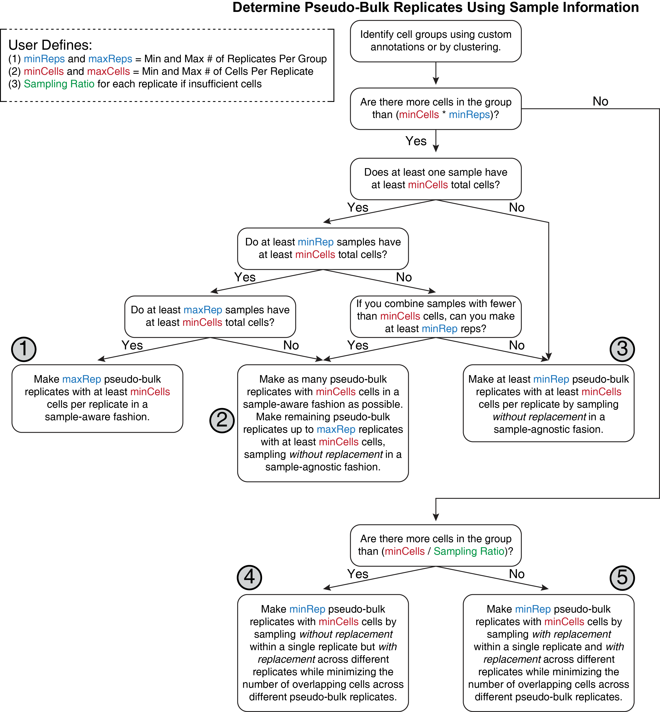

---
output:
  html_document:
    theme: yeti  # many options for theme, this one is my favorite.
params:
  threads: 20
  rdata: ""
  token: ""
  ref: ""
  out: ""
---

```{r, include=FALSE, eval=FALSE}
params2 <- params
unlockBinding("params", env = .GlobalEnv)
#load("Chapter-13-Footprints.Rdata")
load(params$rdata)
params <- params2
rm(params2)
devtools::install_github("GreenleafLab/ArchR", 
  auth_token = params$token, 
  ref = params$ref,
  repos = BiocManager::repositories(),
  dependencies = FALSE
)
library(ArchR)
fn <- unclass(lsf.str(envir = asNamespace("ArchR"), all = TRUE))
fn <- fn[!grepl("\\.", fn)]
fn <- fn[fn!="ArchRProj"]
for (i in seq_along(fn)){
    tryCatch({
        eval(parse(text = paste0(fn[i], "<-ArchR::", fn[i])))
    }, error = function(x) {
    })
}
addArchRThreads(threads = params$threads)
addArchRGenome("hg19")
# fn <- unclass(lsf.str(envir = asNamespace("ArchR"), all = TRUE))
# fn <- fn[fn!="ArchRProj"]
# for (i in seq_along(fn)) {
#     tryCatch({
#         eval(parse(text = paste0(fn[i], "<-ArchR:::", fn[i])))
#     }, error = function(x) {
#     })
# }
set.seed(1)
```

# Pseudo-bulk Replicates in ArchR

Because scATAC-seq data is essentially binary - meaning any individual locus is either accessible or not accessible - we often find ourselves in the situation where we want to perform analyses that are just not possible on a single cell. Moreover, many of the analyses we would like to perform require replicates to obtain measurements of statistical significance. In single-cell data we get around these problems by creating _pseudo-bulk replicates_. The term _pseudo-bulk_ refers to a grouping of single cells where the data from each single cell is combined into a single pseudo-sample that resembles a bulk ATAC-seq experiment. ArchR makes multiple such pseudo-bulk samples for each desired cell grouping, hence the term _pseudo-bulk replicates_. The underlying assumption in this process is that the single cells that are being grouped together are sufficiently similar that we do not care to understand the differences between them. These cell groupings are almost always derived from individual clusters or supersets of clusters that correspond to known cell types. This chapter describes the process by which ArchR generates these pseudo-bulk replicates.

## How Does ArchR Make Pseudo-bulk Replicates?

To create pseudo-bulk replicates, ArchR employs a tiered priority approach. The user specifies (i) the minimum and maximum number of replicates desired, (ii) the minimum and maximum number of cells per replicate, and (iii) the sampling ratio to use if a particular grouping lacks sufficient cells to make the desired replicates. For example, a sampling ratio of 0.8 means that cells can be sampled without replacement up to 80% of the total number of cells for each replicate (this will result in sampling with replacement across replicates). In this case, multiple replicates may contain some of the same cells but this is a necessary sacrifice if you would like to generate pseudo-bulk replicates from a cell group that lacks sufficient cells.

We process for pseudo-bulk replicate generation can be described by a decision tree as shown below.

<center>
{width=1000px}
</center>

We outline some of the key considerations of this process in words here. First, the user identifies the cell groups to be used - this is often the clusters called by ArchR. Then for each cell grouping, ArchR attempts to create the desired pseudo-bulk replicates. The ideal pseudo-bulk replicate would consist of a sufficient number of cells __from a single sample__. This maintains sample diversity and biological variation between the replicates. This is what ArchR strives to obtain, but in reality there are 5 possible outcomes in this process, ranked below by preference in ArchR:

1) Enough different samples (at least the max # replicates) each have more than the minimum number of cells to create pseudo-bulk replicates in a sample-aware fashion, combining only cells from the same sample into a single replicate.
2) Some samples each have more than the minimum number of cells to create pseudo-bulk replicates in a sample-aware fashion. The remaing required replicates are created by combining cells _without replacement_ from __samples that are not already represented in the sample-aware pseudobulks__.
3) No samples have more than the minimum number of cells to create a sample-aware pseudo-bulk replicate but there are more cells than `minCells * minReps`. All required replicates are created by combining cells _without replacement_ from __in a sample-agnostic fashion__.
4) The total number of cells within a cell grouping is less than the minimum number of cells multiplied by the minimum number of replicates __but greater than the minimum number of cells divided by the sampling ratio__. Create the minimum number of replicates by sampling __without__ replacement within a single replicate but __with__ replacement across replicates while minimizing the number of cells present in multiple pseudo-bulk replicates.
5) The total number of cells within a cell grouping is less than the minimum number of cells divided by the sampling ratio. This means that we must make replicates by sampling with replacement within a single replicate and across different replicates. This is the worst case scenario and users should be cautious about using these pseudo-bulk replicates downstream. This can be controled in various other ArchR functions using the `minCells` parameter.

To illustrate this process, we will use the following example data set:

```
Sample  Cluster1  Cluster2  Cluster3  Cluster4  Cluster5
A     800     600     900     100     75
B     1000    50      400     150     25
C     600     900     100     200     50
D     1200    500     50      50      25
E     900     100     50      150     50
F     700     200     100     100     25
```

And we will set `minRep = 3`, `maxRep = 5`, `minCells = 300`, `maxCells = 1000`, and `sampleRatio = 0.8`.

### Cluster1
For Cluster1, we have 6 samples (more than `maxRep`) that all have more than `minCells` cells (300 cells). This illustrates Option#1 above and we will make 5 pseudo-bulk replicates in a sample aware fashion like so:

```
Rep1 = 800 cells from SampleA
Rep2 = 1000 cells from SampleB
Rep3 = 1000 cells from SampleD
Rep4 = 900 cells from SampleE
Rep5 = 700 cells from SampleF
```

```{r include=FALSE, eval=FALSE,echo=FALSE}
#JJJ Is this true? would SampleC be left out and SampleF used because it has more cells?
```

There are two things to note about these replicates: (i) SampleC was left out because we had more than enough samples to make `maxRep` sample-aware pseudo-bulk replicates and SampleC had the fewest number of cells. (ii) Only 1000 cells were used from SampleD because this is the `maxCells` value.

### Cluster2
For Cluster2, we have 3 samples that all have more than `minCells` cells and a few additional samples that do not. This illustrates Option#2 above and we will make the following pseudo-bulk replicates:

```
Rep1 = 600 cells from SampleA
Rep2 = 900 cells from SampleC
Rep3 = 500 cells from SampleD
Rep4 = 350 cells [50 cells from SampleB + 100 from SampleE + 200 from SampleF]
```
In this example, Rep4 gets created in a samaple agnostic fashion by sampling without replacement.

### Cluster3
For Cluster3, we only have 2 samples that have more than `minCells` cells which is less than the required `minReps`. However, if we combine the cells from the remaining samples, we can make one additional replicate with more than `minCells`. This gives us a total of 3 pseudo-bulk replicates and represents the situation illustrated by Option#3 above. We will make the following replicates:

```
Rep1 = 900 cells from SampleA
Rep2 = 400 cells from SampleB
Rep3 = 250 cells [100 cells from SampleC + 50 from SampleD + 50 from SampleE + 50 from SampleF]
```
Similar to Cluster2 above, Cluster3 Rep3 is created in a sample agnostic fashion by sampling without replacement across multiple samples.

### Cluster4
For Cluster4, the total number of cells is 750 which is less than `minCells * minReps` (900 cells). In this case, we do not have sufficient cells to make `minReps` with at least `minCells` without some form of sampling with replacement. However, the total cells is still greater than `minCells / sampleRatio` (375 cells) which means that we only have to sample with replacement across different pseudo-bulk replicates, not within a single replicate. This represents the situation illustrated in Option#4 above and we will therefore make the following replicates:

```
Rep1 = 300 cells [250 unique cells + 25 cells overlapping Rep2 + 25 cells overlapping Rep3]
Rep2 = 300 cells [250 unique cells + 25 cells overlapping Rep1 + 25 cells overlapping Rep3]
Rep3 = 300 cells [250 unique cells + 25 cells overlapping Rep1 + 25 cells overlapping Rep2]
```
In this case, ArchR will minimize the number of cells that overlap between any two pseudo-bulk replicates.

### Cluster5
For Cluster5, the total number of cells is 250 which is less than `minCells * minReps` (900 cells) and less than `minCells / sampleRatio` (375 cells). This means that we we will have to sample with replacement within each sample and across different replicates to make pseudo-bulk replicates. This represents the least desirable situation illustrated in Option#5 above and we should therefore be cautious in using these pseudo-bulk replicates in downstream analyses. We will therefore make the following replicates:
```
Rep1 = 300 cells [250 unique cells + 25 cells overlapping Rep2 + 25 cells overlapping Rep3]
Rep2 = 300 cells [250 unique cells + 25 cells overlapping Rep1 + 25 cells overlapping Rep3]
Rep3 = 300 cells [250 unique cells + 25 cells overlapping Rep1 + 25 cells overlapping Rep2]
```

## Making Pseudo-bulk Replicates

In ArchR, pseudo-bulk replicates are made using the `addGroupCoverages()` function. The key parameter here is `groupBy` which defines the groups for which pseudo-bulk replicates should be made. Here, we are using `Clusters2` which was defined by labeling our clusters with cell types defined by scRNA-seq data in a previous chapter.

```{r include=FALSE, eval=FALSE,echo=FALSE}
#JJJ This was moved here from the MACS2 chapter
```

```{r eval=FALSE}
#Create Group Coverage Files that can be used for downstream analysis (~5-10 minutes)
projHeme4 <- addGroupCoverages(ArchRProj = projHeme3, groupBy = "Clusters2")
```
> \## ArchR logging to : ArchRLogs/ArchR-addGroupCoverages-faba40cd6ba1-Date-2020-04-15_Time-10-23-14.log  
## If there is an issue, please report to github with logFile!  
## B CellGroups N = 2CD4.M CellGroups N = 2CD4.N CellGroups N = 2CLP CellGroups N = 2Erythroid CellGroups N = 2GMP CellGroups N = 2Mono CellGroups N = 2NK CellGroups N = 2pDC CellGroups N = 2PreB CellGroups N = 2Progenitor CellGroups N = 2  
## B CellGroups N = 2CD4.M CellGroups N = 2CD4.N CellGroups N = 2CLP CellGroups N = 2Erythroid CellGroups N = 2GMP CellGroups N = 2Mono CellGroups N = 2NK CellGroups N = 2pDC CellGroups N = 2PreB CellGroups N = 2Progenitor CellGroups N = 2  
## B CellGroups N = 2CD4.M CellGroups N = 2CD4.N CellGroups N = 2CLP CellGroups N = 2Erythroid CellGroups N = 2GMP CellGroups N = 2Mono CellGroups N = 2NK CellGroups N = 2pDC CellGroups N = 2PreB CellGroups N = 2Progenitor CellGroups N = 2  
## B CellGroups N = 2CD4.M CellGroups N = 2CD4.N CellGroups N = 2CLP CellGroups N = 2Erythroid CellGroups N = 2GMP CellGroups N = 2Mono CellGroups N = 2NK CellGroups N = 2pDC CellGroups N = 2PreB CellGroups N = 2Progenitor CellGroups N = 2  
## B CellGroups N = 2CD4.M CellGroups N = 2CD4.N CellGroups N = 2CLP CellGroups N = 2Erythroid CellGroups N = 2GMP CellGroups N = 2Mono CellGroups N = 2NK CellGroups N = 2pDC CellGroups N = 2PreB CellGroups N = 2Progenitor CellGroups N = 2  
## B CellGroups N = 2CD4.M CellGroups N = 2CD4.N CellGroups N = 2CLP CellGroups N = 2Erythroid CellGroups N = 2GMP CellGroups N = 2Mono CellGroups N = 2NK CellGroups N = 2pDC CellGroups N = 2PreB CellGroups N = 2Progenitor CellGroups N = 2  
## B CellGroups N = 2CD4.M CellGroups N = 2CD4.N CellGroups N = 2CLP CellGroups N = 2Erythroid CellGroups N = 2GMP CellGroups N = 2Mono CellGroups N = 2NK CellGroups N = 2pDC CellGroups N = 2PreB CellGroups N = 2Progenitor CellGroups N = 2  
## B CellGroups N = 2CD4.M CellGroups N = 2CD4.N CellGroups N = 2CLP CellGroups N = 2Erythroid CellGroups N = 2GMP CellGroups N = 2Mono CellGroups N = 2NK CellGroups N = 2pDC CellGroups N = 2PreB CellGroups N = 2Progenitor CellGroups N = 2  
## B CellGroups N = 2CD4.M CellGroups N = 2CD4.N CellGroups N = 2CLP CellGroups N = 2Erythroid CellGroups N = 2GMP CellGroups N = 2Mono CellGroups N = 2NK CellGroups N = 2pDC CellGroups N = 2PreB CellGroups N = 2Progenitor CellGroups N = 2  
## B CellGroups N = 2CD4.M CellGroups N = 2CD4.N CellGroups N = 2CLP CellGroups N = 2Erythroid CellGroups N = 2GMP CellGroups N = 2Mono CellGroups N = 2NK CellGroups N = 2pDC CellGroups N = 2PreB CellGroups N = 2Progenitor CellGroups N = 2  
## B CellGroups N = 2CD4.M CellGroups N = 2CD4.N CellGroups N = 2CLP CellGroups N = 2Erythroid CellGroups N = 2GMP CellGroups N = 2Mono CellGroups N = 2NK CellGroups N = 2pDC CellGroups N = 2PreB CellGroups N = 2Progenitor CellGroups N = 2  
## 2020-04-15 10:23:17 : Creating Coverage Files!, 0.046 mins elapsed.  
## 2020-04-15 10:23:17 : Batch Execution w/ safelapply!, 0.046 mins elapsed.  
## 2020-04-15 10:24:14 : Adding Kmer Bias to Coverage Files!, 0.996 mins elapsed.  
##  
## Completed Kmer Bias Calculation  
## Adding Kmer Bias (1 of 22)  
## Adding Kmer Bias (2 of 22)  
## Adding Kmer Bias (3 of 22)  
## Adding Kmer Bias (4 of 22)  
## Adding Kmer Bias (5 of 22)  
## Adding Kmer Bias (6 of 22)  
## Adding Kmer Bias (7 of 22)  
## Adding Kmer Bias (8 of 22)  
## Adding Kmer Bias (9 of 22)  
## Adding Kmer Bias (10 of 22)  
## Adding Kmer Bias (11 of 22)  
## Adding Kmer Bias (12 of 22)  
## Adding Kmer Bias (13 of 22)  
## Adding Kmer Bias (14 of 22)  
## Adding Kmer Bias (15 of 22)  
## Adding Kmer Bias (16 of 22)  
## Adding Kmer Bias (17 of 22)  
## Adding Kmer Bias (18 of 22)  
## Adding Kmer Bias (19 of 22)  
## Adding Kmer Bias (20 of 22)  
## Adding Kmer Bias (21 of 22)  
## Adding Kmer Bias (22 of 22)  
## 2020-04-15 10:25:16 : Finished Creation of Coverage Files!, 2.022 mins elapsed.   
## ArchR logging successful to : ArchRLogs/ArchR-addGroupCoverages-faba40cd6ba1-Date-2020-04-15_Time-10-23-14.log  

With these pseudo-bulk replicates generated, we can now call peaks in our data. As mentioned previously, we do not want to call peaks on the merged set of all single cells so having these more granular cell groups defined, either through clustering or otherwise, provides the ideal starting point for peak calling.