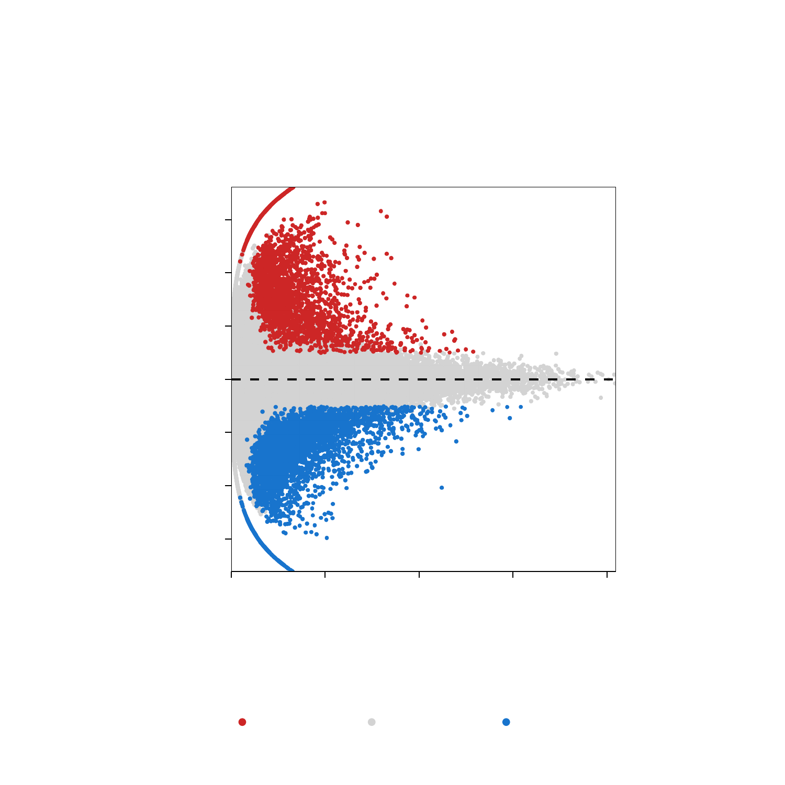
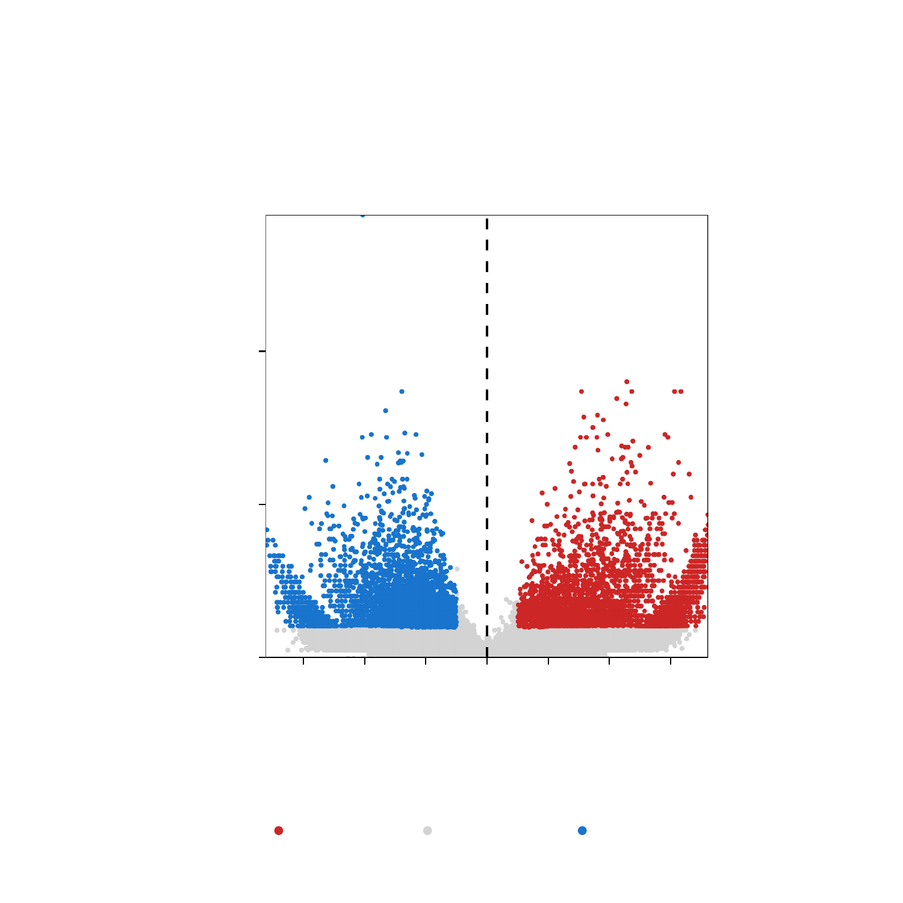

---
output:
  html_document:
    theme: yeti  # many options for theme, this one is my favorite.
params:
  threads: 20
  rdata: ""
  token: ""
  ref: ""
  out: ""
---

```{r, include=FALSE, eval=FALSE}
params2 <- params
unlockBinding("params", env = .GlobalEnv)
#load("Chapter-13-Footprints.Rdata")
load(params$rdata)
params <- params2
rm(params2)
devtools::install_github("GreenleafLab/ArchR", 
  auth_token = params$token, 
  ref = params$ref,
  repos = BiocManager::repositories(),
  dependencies = FALSE
)
library(ArchR)
fn <- unclass(lsf.str(envir = asNamespace("ArchR"), all = TRUE))
fn <- fn[!grepl("\\.", fn)]
fn <- fn[fn!="ArchRProj"]
for (i in seq_along(fn)){
    tryCatch({
        eval(parse(text = paste0(fn[i], "<-ArchR::", fn[i])))
    }, error = function(x) {
    })
}
addArchRThreads(threads = params$threads)
addArchRGenome("hg19")
# fn <- unclass(lsf.str(envir = asNamespace("ArchR"), all = TRUE))
# fn <- fn[fn!="ArchRProj"]
# for (i in seq_along(fn)) {
#     tryCatch({
#         eval(parse(text = paste0(fn[i], "<-ArchR:::", fn[i])))
#     }, error = function(x) {
#     })
# }
set.seed(1)
```

# Identifying Marker Peaks with ArchR

## Identifying Marker Peaks with ArchR

Often times, we are interested to know which peaks are unique to an individual cluster or a small group of clusters. We can do this in an unsupervised fashion in ArchR:

```{r eval=FALSE}
addArchRThreads(8)
```
> \## Setting default number of Parallel threads to 8.

```{r eval=FALSE}
#Our scRNA labels
table(projHeme5$Clusters2)
```
> \##  
##          B      CD4.M      CD4.N        CLP  Erythroid        GMP       Mono   
##        439        678       1271        387        879        793       2632   
##         NK        pDC       PreB Progenitor   
##        851        320        351       1650  

```{r eval=FALSE}
#Identify Marker Peaks while controling for TSS and Depth Biases
markersPeaks <- getMarkerFeatures(
	ArchRProj = projHeme5, 
	useMatrix = "PeakMatrix", 
	groupBy = "Clusters2",
  bias = c("TSSEnrichment", "log10(nFrags)"),
  testMethod = "wilcoxon"
)
```
> \## ArchR logging to : ArchRLogs/ArchR-getMarkerFeatures-ff9f78e54080-Date-2020-04-15_Time-10-31-43.log  
## If there is an issue, please report to github with logFile!  
## MatrixClass = Sparse.Integer.Matrix  
## 2020-04-15 10:31:44 : Matching Known Biases, 0.011 mins elapsed.  
##  
## ###########  
## 2020-04-15 10:33:02 : Completed Pairwise Tests, 1.301 mins elapsed.  
## ###########  
## ArchR logging successful to : ArchRLogs/ArchR-getMarkerFeatures-ff9f78e54080-Date-2020-04-15_Time-10-31-43.log  

```{r eval=FALSE}
markersPeaks
```
> \## class: SummarizedExperiment   
## dim: 144009 11   
## metadata(2): MatchInfo Params   
## assays(6): Log2FC Mean ... AUC MeanBGD  
## rownames(144009): 1 2 ... 144008 144009  
## rowData names(4): seqnames idx start end  
## colnames(11): B CD4.M ... PreB Progenitor  
## colData names(0):  

We can get the peak regions for each marker as `DataFrame` or `GRanges`.

```{r eval=FALSE}
#DataFrame
markerList <- getMarkers(markersPeaks, cutOff = "FDR <= 0.01 & Log2FC >= 1")
markerList
```
> \## List of length 11  
## names(11): B CD4.M CD4.N CLP Erythroid GMP Mono NK pDC PreB Progenitor

```{r eval=FALSE}
markerList$Erythroid
```
> \## DataFrame with 2267 rows and 7 columns  
##        seqnames     idx     start       end           Log2FC  
##           <Rle> <array>   <array>   <array>        <numeric>  
## 6915       chr1    6915 110407005 110407505 6.13156087199941  
## 89187     chr22    1265  30129827  30130327 4.31793618061602  
## 2715       chr1    2715  27869127  27869627 8.81830883930008  
## 9273       chr1    9273 164681433 164681933 4.09761463117515  
## 46278     chr15    2875  74902688  74903188 5.94807465189627  
## ...         ...     ...       ...       ...              ...  
## 124072     chr7    2640  47608032  47608532 1.57044726023651  
## 13738      chr1   13738 248018421 248018921 2.18899218987721  
## 90192     chr22    2270  39632393  39632893 2.09633755722991  
## 30353     chr12    2227  47600919  47601419 1.98865307113263  
## 51935     chr16    3926  70729551  70730051 2.33056750082649  
##                         FDR          MeanDiff  
##                   <numeric>         <numeric>  
## 6915    8.5785377923846e-15 0.908051252811916  
## 89187  1.00297518036045e-13   1.0458579648286  
## 2715   3.96321274318867e-12 0.908093680025248  
## 9273   3.96321274318867e-12 0.743482307090926  
## 46278  3.96321274318867e-12 0.739990672777532  
## ...                     ...               ...  
## 124072  0.00939699723029238 0.345440715489147  
## 13738   0.00940220652828868 0.214851028991864  
## 90192   0.00960407719383025 0.270261700407864  
## 30353   0.00978687988910092 0.348162927084217  
## 51935   0.00982181746221214 0.327156785147329  

```{r eval=FALSE}
#GRanges
markerList <- getMarkers(markersPeaks, cutOff = "FDR <= 0.01 & Log2FC >= 1", returnGR = TRUE)
markerList
```
> \## GRangesList object of length 11:  
## $B  
## GRanges object with 594 ranges and 3 metadata columns:  
##         seqnames              ranges strand |           Log2FC  
##            <Rle>           <IRanges>  <Rle> |        <numeric>  
##     [1]     chr2 232537191-232537691      * | 4.60006288742652  
##     [2]    chr12   92566305-92566805      * |  4.3389825818619  
##     [3]     chr3   13152070-13152570      * | 4.44200650760392  
##     [4]     chr9   37409171-37409671      * | 3.32811859032542  
##     [5]     chr1 160759469-160759969      * | 5.66666023794885  
##     ...      ...                 ...    ... .              ...  
##   [590]     chr8 128222178-128222678      * |  6.1639699924098  
##   [591]     chr9   93643862-93644362      * | 6.57677988412609  
##   [592]     chrX     6656761-6657261      * |  6.4417508983755  
##   [593]    chr14   81425876-81426376      * | 4.62521198459712  
##   [594]     chr7   63765291-63765791      * | 4.10893943379989  
##                          FDR          MeanDiff  
##                    <numeric>         <numeric>  
##     [1] 1.61183300601365e-12  1.09207677080711  
##     [2] 9.91817474781581e-10 0.993976831608143  
##     [3] 4.25560916639498e-09  1.20028559994278  
##     [4] 1.45797719387195e-08  1.03421998926309  
##     [5] 1.58046323198917e-08  0.80285226332275  
##     ...                  ...               ...  
##   [590]   0.0098441599959607  0.20375624865997  
##   [591]   0.0098441599959607  0.27221052581318  
##   [592]   0.0098441599959607 0.247631445395118  
##   [593]  0.00994427516588697 0.432810696716752  
##   [594]  0.00998116335641915 0.326535661912967  
##   -------  
##   seqinfo: 23 sequences from an unspecified genome; no seqlengths  
##   
## ...  
## <10 more elements>  


```{r eval=FALSE}
markerList$Erythroid
```
> \## GRanges object with 2267 ranges and 3 metadata columns:  
##          seqnames              ranges strand |           Log2FC  
##             <Rle>           <IRanges>  <Rle> |        <numeric>  
##      [1]     chr1 110407005-110407505      * | 6.13156087199941  
##      [2]    chr22   30129827-30130327      * | 4.31793618061602  
##      [3]     chr1   27869127-27869627      * | 8.81830883930008  
##      [4]     chr1 164681433-164681933      * | 4.09761463117515  
##      [5]    chr15   74902688-74903188      * | 5.94807465189627  
##      ...      ...                 ...    ... .              ...  
##   [2263]     chr7   47608032-47608532      * | 1.57044726023651  
##   [2264]     chr1 248018421-248018921      * | 2.18899218987721  
##   [2265]    chr22   39632393-39632893      * | 2.09633755722991  
##   [2266]    chr12   47600919-47601419      * | 1.98865307113263  
##   [2267]    chr16   70729551-70730051      * | 2.33056750082649  
##                           FDR          MeanDiff  
##                     <numeric>         <numeric>  
##      [1]  8.5785377923846e-15 0.908051252811916  
##      [2] 1.00297518036045e-13   1.0458579648286  
##      [3] 3.96321274318867e-12 0.908093680025248  
##      [4] 3.96321274318867e-12 0.743482307090926  
##      [5] 3.96321274318867e-12 0.739990672777532  
##      ...                  ...               ...  
##   [2263]  0.00939699723029238 0.345440715489147  
##   [2264]  0.00940220652828868 0.214851028991864  
##   [2265]  0.00960407719383025 0.270261700407864  
##   [2266]  0.00978687988910092 0.348162927084217  
##   [2267]  0.00982181746221214 0.327156785147329  
##   -------  
##   seqinfo: 23 sequences from an unspecified genome; no seqlengths  

We can visualize this as a heatmap

```{r eval=FALSE}
#Visualize Markers as a heatmap
heatmapPeaks <- markerHeatmap(
  seMarker = markersPeaks, 
  cutOff = "FDR <= 0.1 & Log2FC >= 0.5",
  transpose = TRUE
)
```
> \## Identified 40034 markers!  
## Preparing Main Heatmap..

```{r eval=FALSE}
draw(heatmapPeaks, heatmap_legend_side = "bot", annotation_legend_side = "bot")
```

```{r, include=FALSE, eval=FALSE}
plotPDF(heatmapPeaks, name = "Peak-Marker-Heatmap", width = 8, height = 6, ArchRProj = projHeme5, addDOC = FALSE)
ArchR:::.convertToPNG(ArchRProj = projHeme5)
system("cp Figures/*.png images/HemeWalkthrough/PNG/")
system("cp Figures/*.pdf images/HemeWalkthrough/PDF/")
```

{width=800 height=600}

We can then plot this 

```{r eval=FALSE}
plotPDF(heatmapPeaks, name = "Peak-Marker-Heatmap", width = 8, height = 6, ArchRProj = projHeme5, addDOC = FALSE)
```
> \## [1] 0

We can also plot an MA/Volcano Plot for any individual cluster

```{r eval=FALSE}
#Marker Peaks for Erythroid
pma <- markerPlot(seMarker = markersPeaks, name = "Erythroid", cutOff = "FDR <= 0.1 & Log2FC >= 1", plotAs = "MA")
pma
```
> \## Warning: Removed 55 rows containing missing values (geom_point_rast).

```{r, include=FALSE, eval=FALSE}
plotPDF(pma, name = "Erythroid-Markers-MA-Volcano", width = 5, height = 5, ArchRProj = projHeme5, addDOC = FALSE)
ArchR:::.convertToPNG(ArchRProj = projHeme5)
system("cp Figures/*.png images/HemeWalkthrough/PNG/")
system("cp Figures/*.pdf images/HemeWalkthrough/PDF/")
```

{width=600 height=600}

```{r eval=FALSE}
pv <- markerPlot(seMarker = markersPeaks, name = "Erythroid", cutOff = "FDR <= 0.1 & Log2FC >= 1", plotAs = "Volcano")
pv
```
> \## Warning: Removed 55 rows containing missing values (geom_point_rast).

```{r, include=FALSE, eval=FALSE}
plotPDF(pma, pv, name = "Erythroid-Markers-MA-Volcano", width = 5, height = 5, ArchRProj = projHeme5, addDOC = FALSE)
ArchR:::.convertToPNG(ArchRProj = projHeme5)
system("cp Figures/*.png images/HemeWalkthrough/PNG/")
system("cp Figures/*.pdf images/HemeWalkthrough/PDF/")
```

{width=600 height=600}

We can then plot this as a nice pdf

```{r eval=FALSE}
plotPDF(pma, pv, name = "Erythroid-Markers-MA-Volcano", width = 5, height = 5, ArchRProj = projHeme5, addDOC = FALSE)
```
> \## [1] "plotting ggplot!"  
## Warning: Removed 55 rows containing missing values (geom_point_rast).  
## Warning: Removed 55 rows containing missing values (geom_point_rast).  
## [1] "plotting ggplot!"  
## Warning: Removed 55 rows containing missing values (geom_point_rast).  
## Warning: Removed 55 rows containing missing values (geom_point_rast).  
## [1] 0  

Additionally we can see these peak regions overlayed on our browser tracks


```{r eval=FALSE}
p <- ArchRBrowserTrack(
    ArchRProj = projHeme5, 
    groupBy = "Clusters2", 
    geneSymbol = c("GATA1"),
    features =  getMarkers(markersPeaks, cutOff = "FDR <= 0.1 & Log2FC >= 1", returnGR = TRUE)["Erythroid"],
    upstream = 50000,
    downstream = 50000
)
```
> \## ArchR logging to : ArchRLogs/ArchR-ArchRBrowserTrack-ff9f580fdbcb-Date-2020-04-15_Time-10-35-20.log  
## If there is an issue, please report to github with logFile!  
## Warning: 'GenomicRangesList' is deprecated.  
## Use 'GRangesList(..., compress=FALSE)' instead.  
## See help("Deprecated")  
## 2020-04-15 10:35:23 : Validating Region, 0.045 mins elapsed.  
## GRanges object with 1 range and 2 metadata columns:  
##       seqnames            ranges strand |     gene_id      symbol  
##          <Rle>         <IRanges>  <Rle> | <character> <character>  
##   [1]     chrX 48644982-48652717      + |        2623       GATA1  
##   -------  
##   seqinfo: 24 sequences from hg19 genome  
## 2020-04-15 10:35:23 : Adding Bulk Tracks (1 of 1), 0.047 mins elapsed.  
## 2020-04-15 10:35:26 : Adding Feature Tracks (1 of 1), 0.095 mins elapsed.  
## 2020-04-15 10:35:26 : Adding Gene Tracks (1 of 1), 0.1 mins elapsed.  
## 2020-04-15 10:35:27 : Plotting, 0.109 mins elapsed.  
## ArchR logging successful to : ArchRLogs/ArchR-ArchRBrowserTrack-ff9f580fdbcb-Date-2020-04-15_Time-10-35-20.log  

```{r eval=FALSE}
grid::grid.newpage()
grid::grid.draw(p$GATA1)
```

```{r, include=FALSE, eval=FALSE}
plotPDF(p, name = "Plot-Tracks-With-Features", width = 5, height = 5, ArchRProj = projHeme5, addDOC = FALSE)
ArchR:::.convertToPNG(ArchRProj = projHeme5)
system("cp Figures/*.png images/HemeWalkthrough/PNG/")
system("cp Figures/*.pdf images/HemeWalkthrough/PDF/")
```

{width=600 height=600}

We can then plot this as a nice pdf

```{r eval=FALSE}
plotPDF(p, name = "Plot-Tracks-With-Features", width = 5, height = 5, ArchRProj = projHeme5, addDOC = FALSE)
```
> \## NULL  
## [1] 0

## Pairwise Testing Groups

```{r eval=FALSE}
#Pairwise Test between Erythroid Cells (Cluster5) and Early Progenitors (HSC)
markerTest <- markerFeatures(
  ArchRProj = projHeme5, 
  useMatrix = "PeakMatrix",
  groupBy = "Clusters2",
  testMethod = "wilcoxon",
  bias = c("TSSEnrichment", "log10(nFrags)"),
  useGroups = "Erythroid",
  bgdGroups = "Progenitor"
)
```
> \## Warning: 'markerFeatures' is deprecated.  
## Use 'getMarkerFeatures' instead.  
## See help("Deprecated")  
## ArchR logging to : ArchRLogs/ArchR-getMarkerFeatures-ff9f77b592d7-Date-2020-04-15_Time-10-35-37.log  
## If there is an issue, please report to github with logFile!  
## MatrixClass = Sparse.Integer.Matrix  
## 2020-04-15 10:35:41 : Matching Known Biases, 0.057 mins elapsed.  
##   
## 2020-04-15 10:35:44 : Computing Pairwise Tests (1 of 1), 0.107 mins elapsed.  
## ###########  
## 2020-04-15 10:36:13 : Completed Pairwise Tests, 0.584 mins elapsed.   
## ###########  
## ArchR logging successful to : ArchRLogs/ArchR-getMarkerFeatures-ff9f77b592d7-Date-2020-04-15_Time-10-35-37.log  

We can then plot an MA/Volcano Plot

```{r eval=FALSE}
#Marker Peaks for Erythroid
pma <- markerPlot(seMarker = markerTest, name = "Erythroid", cutOff = "FDR <= 0.1 & abs(Log2FC) >= 1", plotAs = "MA")
pma
```
> \## Warning: Removed 57 rows containing missing values (geom_point_rast).

```{r, include=FALSE, eval=FALSE}
plotPDF(pma, name = "Erythroid-vs-Progenitor-Markers-MA-Volcano", width = 5, height = 5, ArchRProj = projHeme5, addDOC = FALSE)
ArchR:::.convertToPNG(ArchRProj = projHeme5)
system("cp Figures/*.png images/HemeWalkthrough/PNG/")
system("cp Figures/*.pdf images/HemeWalkthrough/PDF/")
```

{width=600 height=600}

```{r eval=FALSE}
pv <- markerPlot(seMarker = markerTest, name = "Erythroid", cutOff = "FDR <= 0.1 & abs(Log2FC) >= 1", plotAs = "Volcano")
pv
```
> \## Warning: Removed 57 rows containing missing values (geom_point_rast).

```{r, include=FALSE, eval=FALSE}
plotPDF(pma, pv, name = "Erythroid-vs-Progenitor-Markers-MA-Volcano", width = 5, height = 5, ArchRProj = projHeme5, addDOC = FALSE)
ArchR:::.convertToPNG(ArchRProj = projHeme5)
system("cp Figures/*.png images/HemeWalkthrough/PNG/")
system("cp Figures/*.pdf images/HemeWalkthrough/PDF/")
```

{width=600 height=600}

We can then plot this as a nice pdf

```{r eval=FALSE}
plotPDF(pma, pv, name = "Erythroid-vs-Progenitor-Markers-MA-Volcano", width = 5, height = 5, ArchRProj = projHeme5, addDOC = FALSE)
```
> \## [1] "plotting ggplot!"  
## Warning: Removed 57 rows containing missing values (geom_point_rast).  
## Warning: Removed 57 rows containing missing values (geom_point_rast).  
## [1] "plotting ggplot!"  
## Warning: Removed 57 rows containing missing values (geom_point_rast).  
## Warning: Removed 57 rows containing missing values (geom_point_rast).  
## [1] 0  

We can look for enriched motifs (see next chapter for more details)

```{r eval=FALSE}
#Add Motif Peak Annotations if not already added!
projHeme5 <- addMotifAnnotations(ArchRProj = projHeme5, motifSet = "cisbp", name = "Motif")
```
> \## No methods found in package 'IRanges' for request: 'score' when loading 'TFBSTools'  
## 2020-04-15 10:38:11 : Gettting Motif Set, Species : Homo sapiens, 0 mins elapsed.  
## Using version 2 motifs!  
## 2020-04-15 10:38:13 : Finding Motif Positions with motifmatchr!, 0.027 mins elapsed.  
## 2020-04-15 10:41:40 : Creating Motif Overlap Matrix, 3.48 mins elapsed.  
## 2020-04-15 10:41:43 : Finished Getting Motif Info!, 3.523 mins elapsed.  

```{r eval=FALSE}
#Identify Motif Enrichments
motifsUp <- peakAnnoEnrichment(
    seMarker = markerTest,
    ArchRProj = projHeme5,
    peakAnnotation = "Motif",
    cutOff = "FDR <= 0.1 & Log2FC >= 0.5"
  )
```
> \## 2020-04-15 10:41:49 : Computing Enrichments 1 of 1, 0.066 mins elapsed.

```{r eval=FALSE}
motifsUp
```
> \## class: SummarizedExperiment   
## dim: 870 1   
## metadata(0):  
## assays(10): mlog10Padj mlog10p ... CompareFrequency feature  
## rownames(870): TFAP2B_1 TFAP2D_2 ... TBX18_869 TBX22_870  
## rowData names(0):  
## colnames(1): Erythroid  
## colData names(0):  

```{r eval=FALSE}
#Create data.frame
df <- data.frame(TF = rownames(motifsUp), mlog10Padj = assay(motifsUp)[,1])
df <- df[order(df$mlog10Padj, decreasing = TRUE),]
df$rank <- seq_len(nrow(df))

head(df)
```
> \##            TF mlog10Padj rank  
## 388 GATA2_388   535.7098    1  
## 383 GATA1_383   523.8809    2   
## 384 GATA3_384   421.6064    3  
## 385 GATA5_385   407.2538    4  
## 386 GATA4_386   309.7756    5  
## 387 GATA6_387   216.7223    6  

```{r eval=FALSE}
#Ggplot
ggUp <- ggplot(df, aes(rank, mlog10Padj, color = mlog10Padj)) + 
  geom_point(size = 1) +
  ggrepel::geom_label_repel(
        data = df[rev(seq_len(30)), ], aes(x = rank, y = mlog10Padj, label = TF), 
        size = 1.5,
        nudge_x = 2,
        color = "black"
  ) + theme_ArchR() + 
  ylab("-log10(P-adj) Motif Enrichment") + 
  xlab("Rank Sorted TFs Enriched") +
  scale_color_gradientn(colors = paletteContinuous(set = "comet"))

ggUp
```

```{r, include=FALSE, eval=FALSE}
plotPDF(ggUp, name = "Erythroid-vs-Progenitor-Markers-Motifs-Enriched", width = 5, height = 5, ArchRProj = projHeme5, addDOC = FALSE)
ArchR:::.convertToPNG(ArchRProj = projHeme5)
system("cp Figures/*.png images/HemeWalkthrough/PNG/")
system("cp Figures/*.pdf images/HemeWalkthrough/PDF/")
```

{width=600 height=600}


```{r eval=FALSE}
#Identify Motif Enrichments
motifsDo <- peakAnnoEnrichment(
    seMarker = markerTest,
    ArchRProj = projHeme5,
    peakAnnotation = "Motif",
    cutOff = "FDR <= 0.1 & Log2FC <= -0.5"
  )
```
> \## 2020-04-15 10:42:01 : Computing Enrichments 1 of 1, 0.053 mins elapsed.

```{r eval=FALSE}
motifsDo
```
> \## class: SummarizedExperiment  
## dim: 870 1   
## metadata(0):  
## assays(10): mlog10Padj mlog10p ... CompareFrequency feature  
## rownames(870): TFAP2B_1 TFAP2D_2 ... TBX18_869 TBX22_870  
## rowData names(0):  
## colnames(1): Erythroid  
## colData names(0):  

```{r eval=FALSE}
#Create data.frame
df <- data.frame(TF = rownames(motifsDo), mlog10Padj = assay(motifsDo)[,1])
df <- df[order(df$mlog10Padj, decreasing = TRUE),]
df$rank <- seq_len(nrow(df))

head(df)
```
> \##                      TF mlog10Padj rank  
## 326            ELF2_326   88.68056    1  
## 733           RUNX1_733   64.00586    2  
## 801            CBFB_801   53.55426    3  
## 732           RUNX2_732   53.14766    4  
## 734 ENSG00000250096_734   53.14766    5  
## 336            SPIB_336   52.79666    6  

```{r eval=FALSE}
#Ggplot
ggDo <- ggplot(df, aes(rank, mlog10Padj, color = mlog10Padj)) + 
  geom_point(size = 1) +
  ggrepel::geom_label_repel(
        data = df[rev(seq_len(30)), ], aes(x = rank, y = mlog10Padj, label = TF), 
        size = 1.5,
        nudge_x = 2,
        color = "black"
  ) + theme_ArchR() + 
  ylab("-log10(FDR) Motif Enrichment") +
  xlab("Rank Sorted TFs Enriched") +
  scale_color_gradientn(colors = paletteContinuous(set = "comet"))

ggDo
```

```{r, include=FALSE, eval=FALSE}
plotPDF(ggUp, ggDo, name = "Erythroid-vs-Progenitor-Markers-Motifs-Enriched", width = 5, height = 5, ArchRProj = projHeme5, addDOC = FALSE)
ArchR:::.convertToPNG(ArchRProj = projHeme5)
system("cp Figures/*.png images/HemeWalkthrough/PNG/")
system("cp Figures/*.pdf images/HemeWalkthrough/PDF/")
```

{width=600 height=600}

We can then plot this as a nice pdf

```{r eval=FALSE}
plotPDF(ggUp, ggDo, name = "Erythroid-vs-Progenitor-Markers-Motifs-Enriched", width = 5, height = 5, ArchRProj = projHeme5, addDOC = FALSE)
```
> \## [1] "plotting ggplot!"  
## [1] "plotting ggplot!"  
## [1] 0  

## Session Information

```{r eval=FALSE}
Sys.Date()
```
> \## [1] "2020-04-15"

```{r eval=FALSE}
sessionInfo()
```

```{r, include=FALSE, eval=FALSE}
save.image(params$out, compress = FALSE)
```

```{r, include=FALSE, eval=FALSE}
ArchR:::.convertToPNG(ArchRProj = projHeme2)
system("cp Figures/*.png images/HemeWalkthrough/PNG/")
system("cp Figures/*.pdf images/HemeWalkthrough/PDF/")
```
