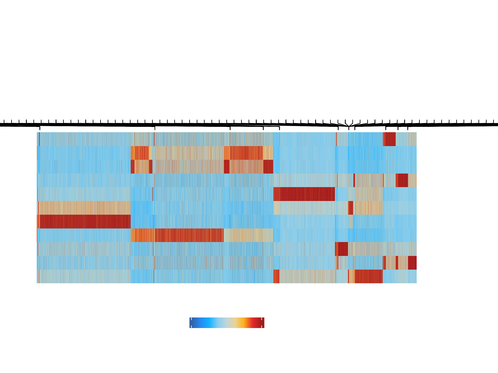
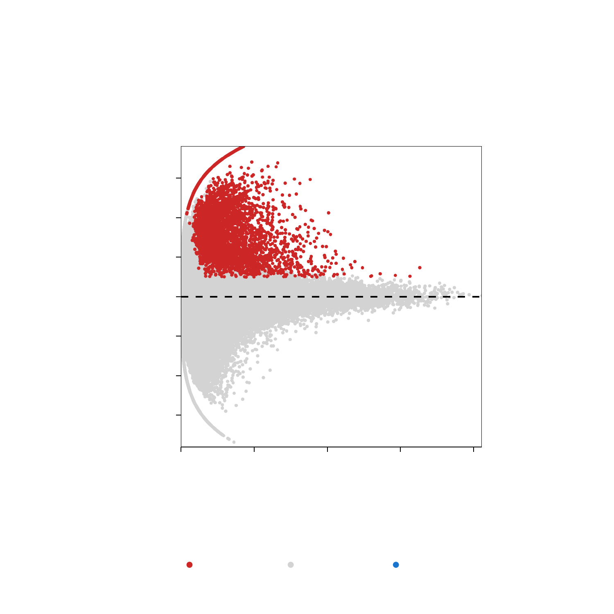
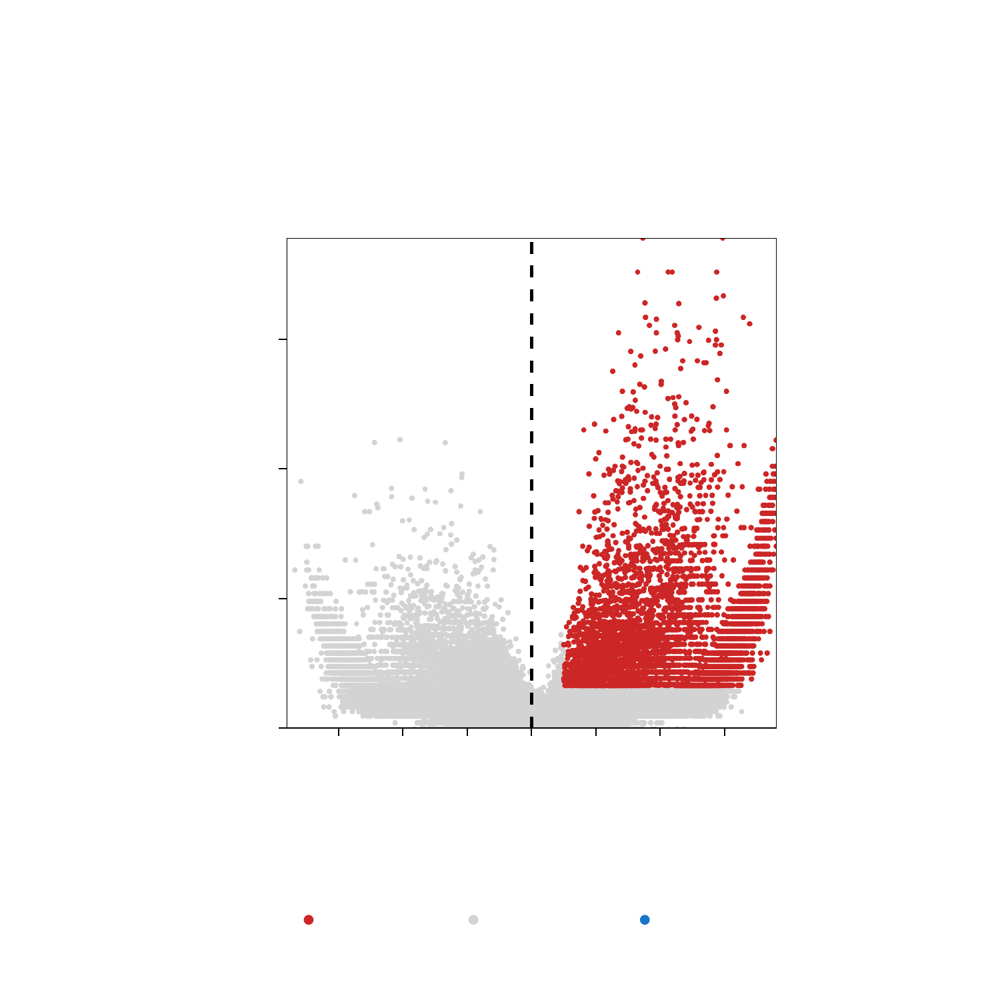
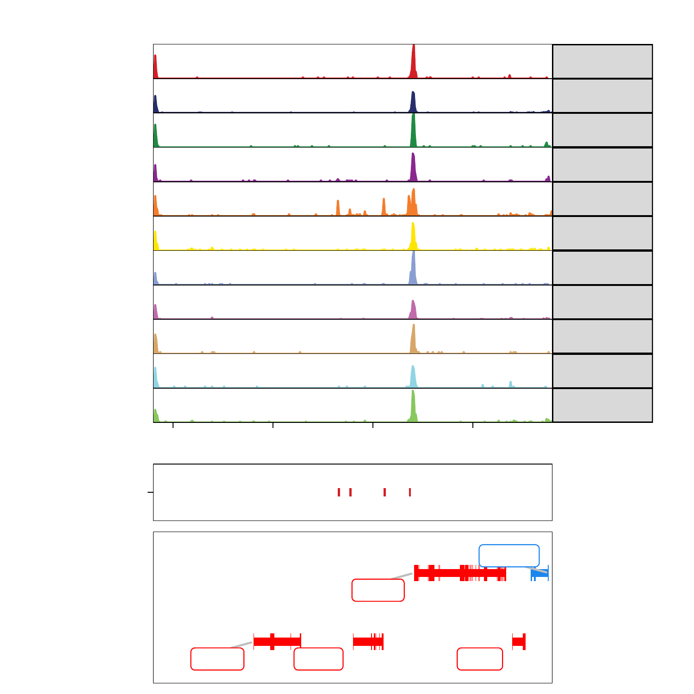
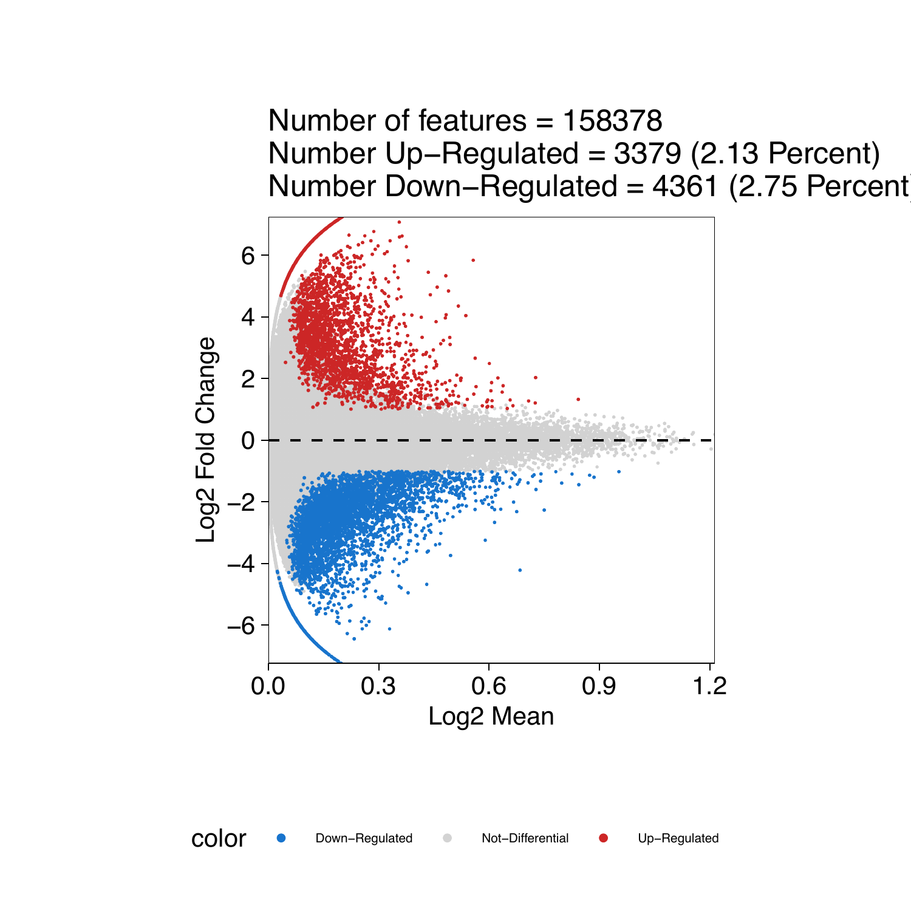
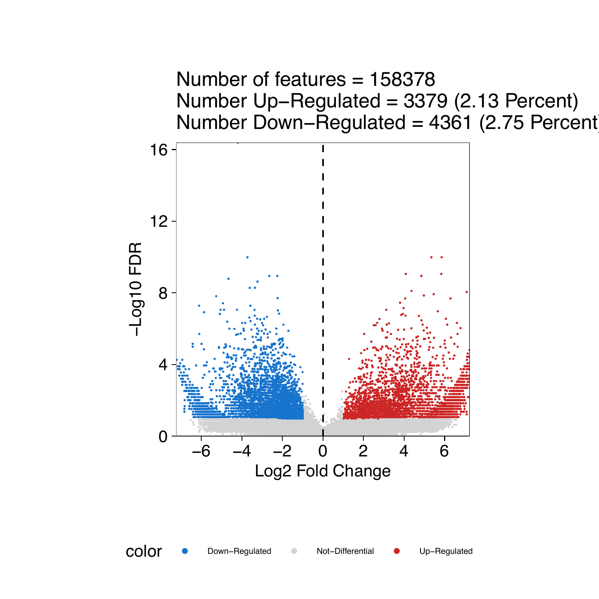
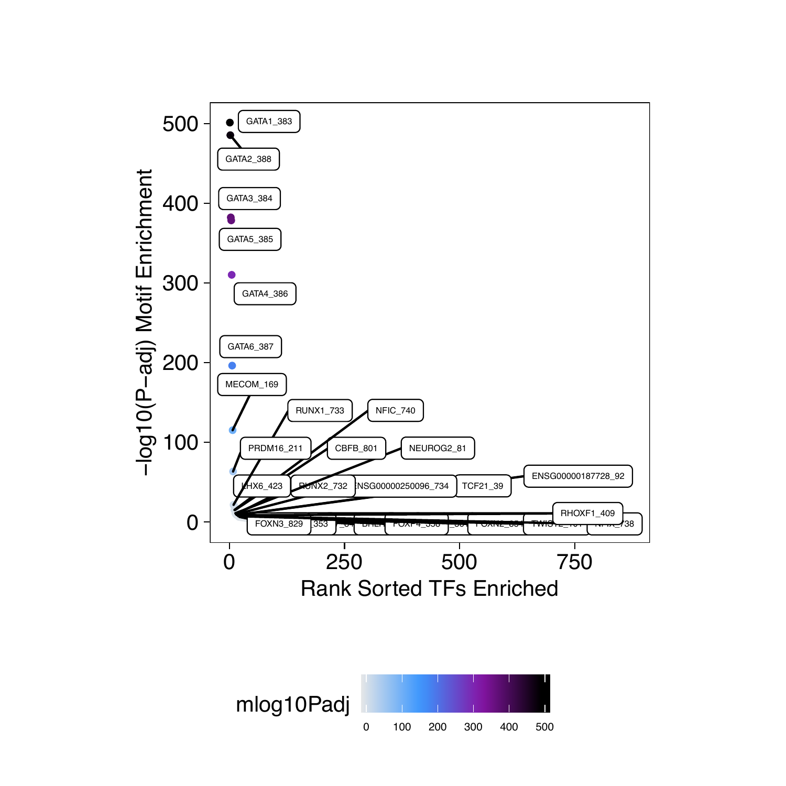
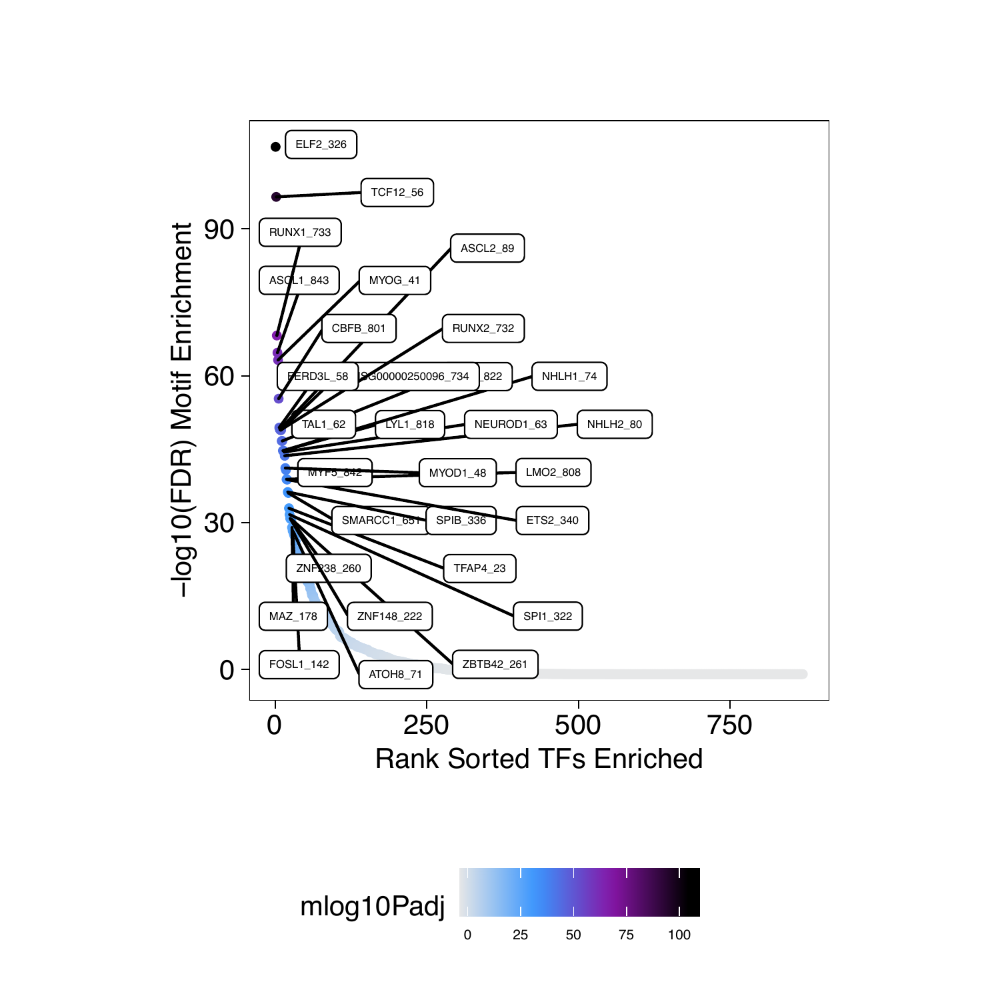

# Identifying Marker Peaks with ArchR

```{r, include=FALSE, eval=FALSE}
setwd("/Volumes/JG_SSD_2/ArchR_Walkthrough/")
#load("Save-ArchR-Walkthrough-Chapter1-Feb13.Rdata")
save.image("Save-ArchR-Walkthrough-Feb17-0254.Rdata")
```

## Identifying Marker Peaks with ArchR

Often times, we are interested to know which peaks are unique to an individual cluster or a small group of clusters. We can do this in an unsupervised fashion in ArchR:

```{r eval=FALSE}
addArchRThreads(8)

#Our scRNA labels
table(projHeme5$Clusters2)
# C1_Early.Eryth C10_CD14.Mono.2           C11_B       C12_Pre.B       C13_CLP.2 
#             28            1070             425             351             408 
#        C14_pDC       C2_CD4.N1       C3_CD4.N2           C4_NK   C5_Late.Eryth 
#            345            1330             562             901             860 
#         C6_HSC     C7_CMP.LMPP     C8_GMP.Neut  C9_CD14.Mono.1 
#           1218             974             274            1505 

#Identify Marker Peaks while controling for TSS and Depth Biases
markersPeaks <- markerFeatures(
	ArchRProj = projHeme5, 
	useMatrix = "PeakMatrix", 
	groupBy = "Clusters2",
    bias = c("TSSEnrichment", "log10(nFrags)"),
    testMethod = "wilcoxon"
)

markersPeaks
# class: SummarizedExperiment 
# dim: 158378 14 
# metadata(2): MatchInfo Params
# assays(5): Log2FC Mean FDR AUC MeanBGD
# rownames(158378): 1 2 ... 158377 158378
# rowData names(4): seqnames idx start end
# colnames(14): C1_Early.Eryth C2_CD4.N1 ... C13_CLP.2 C14_pDC
# colData names(0):

```
We can get the peak regions for each marker as `DataFrame` or `GRanges`.

```{r eval=FALSE}
#DataFrame
markerList <- getMarkers(markersPeaks, cutOff = "FDR <= 0.01 & Log2FC >= 1")
markerList
# List of length 14
# names(14): C1_Early.Eryth C2_CD4.N1 C3_CD4.N2 ... C12_Pre.B C13_CLP.2 C14_pDC

markerList$C5_Late.Eryth
# DataFrame with 2262 rows and 6 columns
#        seqnames     idx     start       end           Log2FC
#           <Rle> <array>   <array>   <array>        <numeric>
# 97705     chr22    1313  30129829  30130329 3.51592607805769
# 10135      chr1   10135 164681301 164681801 4.44617535438744
# 48828     chr15    1349  50552672  50553172 5.18141784055201
# 54061     chr16    1457  15615745  15616245 8.33999798117364
# 2928       chr1    2928  27869062  27869562 5.21444029812509
# ...         ...     ...       ...       ...              ...
# 41787     chr13    3145 112037183 112037683 3.09392983218513
# 97647     chr22    1255  29702383  29702883 2.97001510006876
# 143218     chr8    1908  37949093  37949593  2.9624832757185
# 39746     chr13    1104  41255455  41255955 1.27203148042162
# 128023     chr6    3784  41169564  41170064 2.67070386367678

#GRanges
markerList <- getMarkers(markersPeaks, cutOff = "FDR <= 0.01 & Log2FC >= 1", returnGR = TRUE)
markerList
# GenomicRangesList of length 14
# names(14): C1_Early.Eryth C2_CD4.N1 C3_CD4.N2 ... C12_Pre.B C13_CLP.2 C14_pDC

markerList$C5_Late.Eryth
# GRanges object with 2262 ranges and 2 metadata columns:
#          seqnames              ranges strand |           Log2FC
#             <Rle>           <IRanges>  <Rle> |        <numeric>
#      [1]    chr22   30129829-30130329      * | 3.51592607805769
#      [2]     chr1 164681301-164681801      * | 4.44617535438744
#      [3]    chr15   50552672-50553172      * | 5.18141784055201
#      [4]    chr16   15615745-15616245      * | 8.33999798117364
#      [5]     chr1   27869062-27869562      * | 5.21444029812509
#      ...      ...                 ...    ... .              ...
#   [2258]    chr13 112037183-112037683      * | 3.09392983218513
#   [2259]    chr22   29702383-29702883      * | 2.97001510006876
#   [2260]     chr8   37949093-37949593      * |  2.9624832757185
#   [2261]    chr13   41255455-41255955      * | 1.27203148042162
#   [2262]     chr6   41169564-41170064      * | 2.67070386367678
```

We can visualize this as a heatmap

```{r eval=FALSE}
#Visualize Markers as a heatmap
heatmapPeaks <- markerHeatmap(
  seMarker = markersPeaks, 
  cutOff = "FDR <= 0.1 & Log2FC >= 0.5",
  transpose = TRUE
)

draw(heatmapPeaks, heatmap_legend_side = "bot", annotation_legend_side = "bot")
```
{width=800 height=600}

We can then plot this 

```{r eval=FALSE}
plotPDF(heatmapPeaks, name = "Peak-Marker-Heatmap", width = 8, height = 6, ArchRProj = projHeme5, addDOC = FALSE)
```

We can also plot an MA/Volcano Plot for any individual cluster

```{r eval=FALSE}
#Marker Peaks for Erythroid
pma <- markerPlot(seMarker = markersPeaks, name = "C5_Late.Eryth", cutOff = "FDR <= 0.1 & Log2FC >= 1", plotAs = "MA")
pma
```
{width=600 height=600}

```{r eval=FALSE}
pv <- markerPlot(seMarker = markersPeaks, name = "C5_Late.Eryth", cutOff = "FDR <= 0.1 & Log2FC >= 1", plotAs = "Volcano")
pv
```
{width=600 height=600}

We can then plot this as a nice pdf

```{r eval=FALSE}
plotPDF(pma, pv, name = "Erythroid-Markers-MA-Volcano", width = 5, height = 5, ArchRProj = projHeme5, addDOC = FALSE)
```

Additionally we can see these peak regions overlayed on our browser tracks


```{r eval=FALSE}
p <- ArchRBrowserTrack(
    ArchRProj = projHeme5, 
    groupBy = "Clusters", 
    geneSymbol = c("GATA1"),
    features =  getMarkers(markersPeaks, cutOff = "FDR <= 0.1 & Log2FC >= 1", returnGR = TRUE)["C5_Late.Eryth"],
    upstream = 50000,
    downstream = 50000
)
grid::grid.newpage()
grid::grid.draw(p$GATA1)
```

{width=600 height=600}

We can then plot this as a nice pdf

```{r eval=FALSE}
plotPDF(p, name = "Plot-Tracks-With-Features", width = 5, height = 5, ArchRProj = projHeme5, addDOC = FALSE)
```

## Pairwise Testing Groups

```{r eval=FALSE}
#Pairwise Test between Erythroid Cells (Cluster5) and Early Progenitors (HSC)
markerTest <- markerFeatures(
  ArchRProj = projHeme5, 
  useMatrix = "PeakMatrix",
  groupBy = "Clusters2",
  testMethod = "wilcoxon",
  bias = c("TSSEnrichment", "log10(nFrags)"),
  useGroups = "C5_Late.Eryth",
  bgdGroups = "C6_HSC"
)
```

We can then plot an MA/Volcano Plot

```{r eval=FALSE}
#Marker Peaks for Erythroid
pma <- markerPlot(seMarker = markerTest, name = "C5_Late.Eryth", cutOff = "FDR <= 0.1 & abs(Log2FC) >= 1", plotAs = "MA")
pma
```
{width=600 height=600}

```{r eval=FALSE}
pv <- markerPlot(seMarker = markerTest, name = "C5_Late.Eryth", cutOff = "FDR <= 0.1 & abs(Log2FC) >= 1", plotAs = "Volcano")
pv
```
{width=600 height=600}

We can then plot this as a nice pdf

```{r eval=FALSE}
plotPDF(pma, pv, name = "Erythroid-vs-HSC-Markers-MA-Volcano", width = 5, height = 5, ArchRProj = projHeme5, addDOC = FALSE)
```

We can look for enriched motifs (see next chapter for more details)

```{r eval=FALSE}
#Add Motif Peak Annotations if not already added!
projHeme5 <- addMotifAnnotations(ArchRProj = projHeme5, motifSet = "cisbp", name = "Motif")

#Identify Motif Enrichments
motifsUp <- peakAnnoEnrichment(
    seMarker = markerTest,
    ArchRProj = projHeme5,
    peakAnnotation = "Motif",
    cutOff = "FDR <= 0.1 & Log2FC >= 0.5"
  )

motifsUp
# class: SummarizedExperiment 
# dim: 870 1 
# metadata(0):
# assays(10): mlog10Padj mlog10p ... CompareFrequency feature
# rownames(870): TFAP2B_1 TFAP2D_2 ... TBX18_869 TBX22_870
# rowData names(0):
# colnames(1): C5_Late.Eryth
# colData names(0):

#Create data.frame
df <- data.frame(TF = rownames(motifsUp), mlog10Padj = assay(motifsUp)[,1])
df <- df[order(df$mlog10Padj, decreasing = TRUE),]
df$rank <- seq_len(nrow(df))

head(df)
#            TF mlog10Padj rank
# 383 GATA1_383   501.1950    1
# 388 GATA2_388   485.3875    2
# 384 GATA3_384   382.2286    3
# 385 GATA5_385   378.4617    4
# 386 GATA4_386   310.1231    5
# 387 GATA6_387   196.2290    6

#Ggplot
ggUp <- ggplot(df, aes(rank, mlog10Padj, color = mlog10Padj)) + 
  geom_point(size = 1) +
  ggrepel::geom_label_repel(
        data = df[rev(seq_len(30)), ], aes(x = rank, y = mlog10Padj, label = TF), 
        size = 1.5,
        nudge_x = 2,
        color = "black"
  ) + theme_ArchR() + 
  ylab("-log10(P-adj) Motif Enrichment") + 
  xlab("Rank Sorted TFs Enriched") +
  scale_color_gradientn(colors = paletteContinuous(set = "comet"))

ggUp

```
{width=600 height=600}


```{r eval=FALSE}
#Identify Motif Enrichments
motifsDo <- peakAnnoEnrichment(
    seMarker = markerTest,
    ArchRProj = projHeme5,
    peakAnnotation = "Motif",
    cutOff = "FDR <= 0.1 & Log2FC <= -0.5"
  )

motifsDo
# class: SummarizedExperiment 
# dim: 870 1 
# metadata(0):
# assays(10): mlog10Padj mlog10p ... CompareFrequency feature
# rownames(870): TFAP2B_1 TFAP2D_2 ... TBX18_869 TBX22_870
# rowData names(0):
# colnames(1): C5_Late.Eryth
# colData names(0):

#Create data.frame
df <- data.frame(TF = rownames(motifsDo), mlog10Padj = assay(motifsDo)[,1])
df <- df[order(df$mlog10Padj, decreasing = TRUE),]
df$rank <- seq_len(nrow(df))

head(df)
#            TF mlog10Padj rank
# 326  ELF2_326  106.76416    1
# 56   TCF12_56   96.54526    2
# 733 RUNX1_733   68.21896    3
# 843 ASCL1_843   64.71306    4
# 41    MYOG_41   63.21656    5
# 801  CBFB_801   55.31786    6

#Ggplot
ggDo <- ggplot(df, aes(rank, mlog10Padj, color = mlog10Padj)) + 
  geom_point(size = 1) +
  ggrepel::geom_label_repel(
        data = df[rev(seq_len(30)), ], aes(x = rank, y = mlog10Padj, label = TF), 
        size = 1.5,
        nudge_x = 2,
        color = "black"
  ) + theme_ArchR() + 
  ylab("-log10(FDR) Motif Enrichment") +
  xlab("Rank Sorted TFs Enriched") +
  scale_color_gradientn(colors = paletteContinuous(set = "comet"))

ggDo
```
{width=600 height=600}


We can then plot this as a nice pdf

```{r eval=FALSE}
plotPDF(ggUp, ggDo, name = "Erythroid-vs-HSC-Markers-Motifs-Enriched", width = 5, height = 5, ArchRProj = projHeme5, addDOC = FALSE)
```


