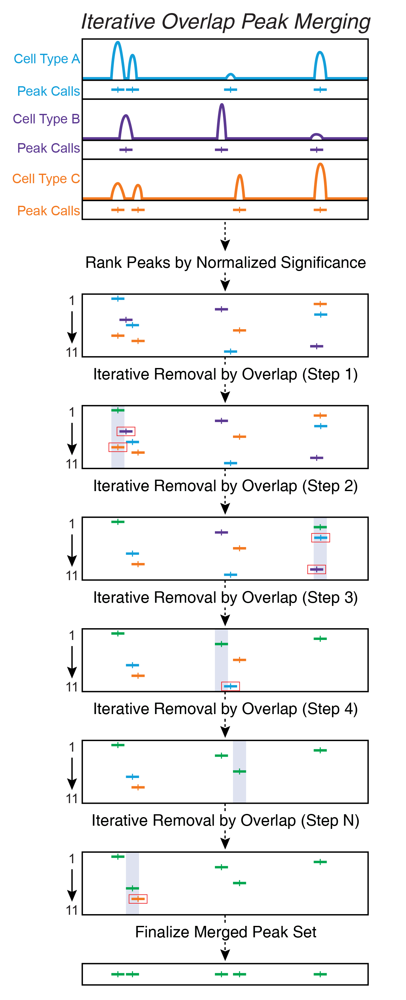

---
output:
  html_document:
    theme: yeti  # many options for theme, this one is my favorite.
params:
  threads: 20
  rdata: ""
  token: ""
  ref: ""
  out: ""
editor_options: 
  markdown: 
    wrap: 72
---

```{r, include=FALSE}
#load the data from the previous chapter as needed
current_chapter = 12
previous_chapter = current_chapter-1
load(file = paste0("./chapter_images/chapter",previous_chapter,".RData"))
```

# Calling Peaks with ArchR

Calling peaks is one of the most fundamental processes in ATAC-seq data analysis. Because per-cell scATAC-seq data is essentially binary (accessible or not accessible), we cannot call peaks on an individual cell basis. For this reason, we defined groups of cells, typically clusters, in a previous chapter. Moreover, we created pseudo-bulk replicates to allow us to assess the reproducibility of our peak calls.

## The Iterative Overlap Peak Merging Procedure

We first introduced [a strategy for iterative overlap peak merging in 2018](https://science.sciencemag.org/content/362/6413/eaav1898). Other peak merging strategies suffer from a few key issues that we outline below.

### Fixed-width vs Variable-width Peaks
We use 501-bp fixed-width peaks because they make downstream computation easier as peak length does not need to be normalized. Moreover, the vast majority of peaks in ATAC-seq are less than 501-bp wide. Using variable-width peaks also makes it difficult to merge peak calls from multiple samples. In general, we do not feel that the potential benefit derived from using variable-width peaks outweighs the costs. More broadly, most analyses are stable with respect to the peak set or peak style used.

Below, we use the same toy example of a few cell types with a few different peaks to illustrate the differences between these often used peak merging methods.

### Raw Peak Overlap Using _bedtools merge_

Raw peak overlap involves taking any peaks that overlap each other and merging these into a single larger peak. In this scheme, daisy-chaining becomes a large problem because peaks that dont directly overlap each other get included in the same larger peak because they are bridged by a shared internal peak. Another problem with this type of approach is that, if you want to keep track of peak summits, you are forced to either pick a single new summit for each new merged peak or keep track of all of the summits that apply to each new merged peak. Typically, this type of peak merging approach is implemented using the `bedtools merge` command.

{width=350px}

### Clustered Overlap Using _bedtools cluster_

Clustered overlap takes peaks that cluster together and picks a single winner. This is often done by using the `bedtools cluster` command and then keeping the most significant peak in each cluster. In our experience, this ends up under-calling peaks and misses smaller peaks located nearby.

{width=350px}

### Iterative Overlap In ArchR

Iterative overlap removal avoids the issues mentioned above. Peaks are first ranked by their significance. The most significant peak is retained and any peak that directly overlaps with the most significant peak is removed from further analysis. Then, of the remaining peaks, this process is repeated until no more peaks exist. This avoids daisy-chaining and still allows for use of fixed-width peaks.

{width=350px}

If you've come to this page looking to implement this iterative overlap peak merging procedure on bulk ATAC-seq data, this isn't possible through ArchR but we host [a separate repository](https://github.com/corceslab/ATAC_IterativeOverlapPeakMerging) that contains code to do this with bulk ATAC-seq.

### Comparison of Peak Calling Methods

Comparing the peak calls resulting from all of these methods directly shows clear differences in the final peak sets. It is our opinion that the iterative overlap peak merging process yields the best peak set with the fewest caveats.

{width=350px}

### So how does this all work in ArchR?

The iterative overlap peak merging procedure is performed in a tiered fashion to optimally preserve cell type-specific peaks.

Imagine a situation where you had 3 cell types, A, B, and C, and each cell type had 3 pseudo-bulk replicates. ArchR uses a function called `addReproduciblePeakSet()` to perform this iterative overlap peak merging procedure. First, ArchR would call peaks for each pseudo-bulk replicate individually. Then, ArchR would analyze all of the pseudo-bulk replicates from a single cell type together, performing the first iteration of iterative overlap removal. It is important to note that ArchR uses a normalized metric of significance for peaks to compare the significance of peaks called across different samples. This is because the reported MACS2 significance is proportional to the sequencing depth so peak significance is not immediately comparable across samples. After the first iteration of iterative overlap removal, ArchR checks to see the reproducibility of each peak across pseudo-bulk replicates and only keeps peaks that pass a threshold indicated by the `reproducibility` parameter. At the end of this process, we would have a single merged peak set for each of the 3 cell types, A, B, and C. 

Then, we would repeat this procedure to merge the A, B, and C peak sets. To do this, we re-normalize the peak significance across the different cell types, and perform the iterative overlap removal. The final result of this is a single merged peak set of fixed-width peaks.

### What if I don't like this iterative overlap peak merging process?

The iterative overlap peak merging process is implemented by ArchR via `addReproduciblePeakSet()` but you can always use your own peak set via `ArchRProj <- addPeakSet()`.


## Calling Peaks w/ Macs2

Prior to calling peaks in ArchR, you must run the `addGroupCoverages()` function! ArchR relies on these group coverage objects to perform peak calling.

As mentioned above, we generate a reproducible peak set in ArchR using the `addReproduciblePeakSet()` function. By default ArchR attempts to call peaks using MACS2 and this is absolutely the recommended peak caller. ArchR also implements its own native peak caller but we do not recommend using it - this alternative peak calling method is described in the next section.

To call peaks using MACS2, ArchR must be able to find the MACS2 executable. First, ArchR looks in your `PATH` environment variable. If this is unsuccessful, ArchR attempts to determine if you have installed MACS2 with either `pip` or `pip3`. If neither of these is successful, ArchR gives up and provides an error message. If you have MACS2 installed and ArchR cannot find it, you should provide the path to the `addReproduciblePeakSet()` function via the `pathToMacs2` parameter. It is important to make sure that the MACS2 executable that ArchR is using is what you expect it to use. Some users have multiple instances of MACS2 installed and ArchR may not automatically select the one that you expect.

```{r, eval=FALSE}
pathToMacs2 <- findMacs2()
```

You could, of course, manually designate the path to the MACS2 executable instead. This may be necessary on some computational environments.

<!-- We must manually define the path to macs2 because findMacs2() fails given the RStudioServer setup on our server -->
```{r, include=FALSE}
pathToMacs2 <- "/corces/home/rcorces/tools/python/p3.8.5/bin/macs2"
```

With the path to MACS2 identified, we can then create a reproducible merged peak set w/ MACS2 (5-10 minutes). To avoid bias from pseudo-bulk replicates that have very few cells, we can provide a cutoff for the upper limit of the number of peaks called per cell via the `peaksPerCell` parameter. This prevents clusters with very few cells from contributing lots of low quality peaks to the merged peak set. There are many other parameters that can be tweaked in `addReproduciblePeakSet()` - try `?addReproduciblePeakSet` or check out [the online function definition](https://www.archrproject.com/reference/addReproduciblePeakSet.html) for more information. Of particular note, the `reproducibility` parameter defines what is meant by a "reproducible peak". For example, `reproducibility = "2"` means at least 2 pseudo-bulk replicates must have a peak call at this locus and `reproducibility = "(n+1)/2"` means that the majority of pseudo-bulk replicates must have a peak call at this locus.

```{r, collapse=TRUE}
projHeme4 <- addReproduciblePeakSet(
	ArchRProj = projHeme4, 
	groupBy = "Clusters2", 
	pathToMacs2 = pathToMacs2
)
```

The iterative overlap procedure that ArchR uses to create this reproducible peak set occurs in two stages. During the first step of `addReproduciblePeakSet()`, a reproducible peak set is created for each group indicated by `groupBy`. Using the psuedobulk replicates generated by `addGroupCoverages()`, ArchR identifies peaks that are reproducible across the replicates for each group indicated by the `groupBy` argument. The score of those peak calls is stored in the `score` column and the quantile rank of that score for the individual pseudobulk replicate that it was identified in is stored in `replicateScoreQuantile`. It is this quantile normalization that accounts for differences in number of fragments per group etc. that affect peak calling. For each of these groups, ArchR saves the group-specific peak set as a `GRanges` object in the `PeakCalls` subdirectory of the `ArchRProject`. Additionally, ArchR saves a a `GRanges` object that contains the summit calls for each pseudobulk replicate within the `./PeakCalls/ReplicateCalls` directory.

<!-- Sleep for 20 seconds because it seems like the files dont finish saving before the next list.files command -->
```{r, include=FALSE}
Sys.sleep(10)
```

```{r, collapse=TRUE}
list.files(path=paste0(getOutputDirectory(ArchRProj = projHeme4),"/PeakCalls"))
```

During the second step of `addReproduciblePeakSet()`, ArchR merges these group-specific peak sets into a single union peak set. The quantile rank of the peak `score` across the group is stored in `groupScoreQuantile` and the group it comes from is stored in `GroupReplicate`. `GroupReplicate` is an annotation for the group from which each peak originated during the process of iterative overlap peak merging. It is important to note that these annotations do not inherently mean that the given peak was only called in that cell group, rather that the annotated group had the highest normalized significance for that peak call.

Each `ArchRProject` object can only contain a single peak set at a time. As such, we assign the output of `addReproduciblePeakSet()` to our desired `ArchRProject`. If you would like to experiment with different peak sets, you have two options. Option #1 - you can save multiple copies of your `ArchRProject` using `saveArchRProject()`. Option #2 - you can create multiple peak sets, store them as `GenomicRanges` objects, and change your peak set using the `addPeakSet()` function.

The `addPeakSet()` function can be used to set any arbitrary peak set as the peak set for your `ArchRProject`.

To retrieve the peak set stored in your `ArchRProject` as a `GRanges` object, we use the `getPeakSet()` function. 

```{r, collapse=TRUE}
getPeakSet(projHeme4)
```

The peak sets from `addReproduciblePeakSet()` are annotated with lots of metadata about each peak region. The `score` represents the normalized `-log10(pval)` returned by MACS2. There are other annotations such as `distToGeneStart` and `distToTSS` which are determined based on the contents of `getGeneAnnotation(ArchRProj)$genes` and `getGeneAnnotation(ArchRProj)$TSS` respectively. While it may seem like these should be identical, a single gene can have multiple TSSs and ArchR needs to deal with this multi-mapping issue, which we have done by including both annotations. For example, in ArchR's default hg38 `geneAnnotation`, there are 23,274 genes and 49,052 TSSs. One confusing piece of information annotated in the peak set is the `idx` column which does __not__ correspond to a unique peak identifier. Instead the `idx` column is actually only unique per-chromosome, so for a peak located on "chr1" with and `idx` of "5", this means that this is the 5th peak in sequential order on "chr1" (but there would also be a peak with `idx` of "5" on "chr2").


## Calling Peaks w/ TileMatrix

As mentioned previously, ArchR also implements its own native peak caller but _we do not recommend using it_. While we have benchmarked this peak caller against MACS2 and note very similar performances, we do not recommend using this native peak caller unless absolutely necessary. It is no longer actively supported in the ArchR code base.

The ArchR native peak caller calls peaks on the 500-bp `TileMatrix` and we indicate to `addReproduciblePeakSet()` that we want to use this peak caller via the `peakMethod` parameter. Note that we are not storing the output into the `projHeme4` object because we do not intend to keep this peak set and this analysis is only for illustrative purposes. Storage into the `ArchRProject` object would overwrite the previous reproducible peak set already stored in `projHeme4`.

```{r, collapse=TRUE}
projHemeTmp <- addReproduciblePeakSet(
	ArchRProj = projHeme4, 
	groupBy = "Clusters2",
	peakMethod = "Tiles",
	method = "p"
)
```

We can similarly examine this merged peak set.
```{r, collapse=TRUE}
getPeakSet(projHemeTmp)
```


### Comparing the two peak calling methods

To compare the merged peak set generated using MACS2 vs the merged peak set generated using the ArchR native `TileMatrix` peak caller, we can check the perfecent of overlapping peaks etc.

First, we check the percent of MACS2-called peaks that are overlapped by the `TileMatrix`-called peaks.

```{r, collapse=TRUE}
length(subsetByOverlaps(getPeakSet(projHeme4), getPeakSet(projHemeTmp))) / length(getPeakSet(projHeme4))
```

Then, we check the converse - the percent of `TileMatrix`-called peaks that are overlapped by MACS2-called peaks. You can see that this overlap is not as strong.

```{r, collapse=TRUE}
length(subsetByOverlaps(getPeakSet(projHemeTmp), getPeakSet(projHeme4))) / length(getPeakSet(projHemeTmp))
```

If we increase the margins of the peaks to be wider (1000-bp peaks instead of 500-bp peaks), the percent of MACS2-called peaks that are overlapped does not change much.

```{r, collapse=TRUE}
length(subsetByOverlaps(resize(getPeakSet(projHeme4), 1000, "center"), getPeakSet(projHemeTmp))) / length(getPeakSet(projHeme4))
```

But the percent of `TileMatrix`-called peaks overlapped by MACS2 does increase.
```{r, collapse=TRUE}
length(subsetByOverlaps(getPeakSet(projHemeTmp), resize(getPeakSet(projHeme4), 1000, "center"))) / length(getPeakSet(projHemeTmp))
```

## Adding a Peak Matrix

We can now save our original `projHeme4` using the `saveArchRProject()` function. This `ArchRProject` contains the MACS2-derived merged peak set. Here, we set `load = TRUE` to make sure that the `projHeme4` object tracks with the project that we just saved.

```{r, collapse=TRUE}
projHeme4 <- saveArchRProject(ArchRProj = projHeme4, outputDirectory = "Save-ProjHeme4", load = TRUE)
```

To prepare for downstream analyses, we can create a new `ArchRProject` called `projHeme5` and add a new matrix to it containing insertion counts within our new merged peak set.

```{r, collapse=TRUE}
projHeme5 <- addPeakMatrix(projHeme4)
```

One important salient point in the above operation is that the R object `projHeme5` is actually still pointing to the directory corresponding to `projHeme4`. Hopefully this illustrates the nuance of saving and loading ArchR projects and the difference between the R `ArchRProject` object and the objects saved on disk. The output directory for `projHeme5` will not be set until we save this object using `saveArchRProject()` and set the `outputDirectory`. Until then, anything that we do to `projHeme5` will update the contents in the "Save-ProjHeme4" directory.

```{r, collapse=TRUE}
getOutputDirectory(ArchRProj = projHeme5)
```

Within `projHeme5`, we can now see that a new matrix has been added called "PeakMatrix". This is another reserved-name matrix similar to `GeneScoreMatrix` and `TileMatrix`. As mentioned previously, each `ArchRProject` object can only have one peak set and one `PeakMatrix`. You can, of course, create an unlimited number of custom feature matrices of different names but `PeakMatrix` is reserved for the matrix of insertion counts derived from the peak set stored in the `ArchRProject`.

```{r, collapse=TRUE}
getAvailableMatrices(projHeme5)
```

```{r saveImage, include=FALSE}
filename <- paste0("./chapter_images/chapter",current_chapter,".RData")
remove(current_chapter)
remove(previous_chapter)
save.image(file =  filename)
```
