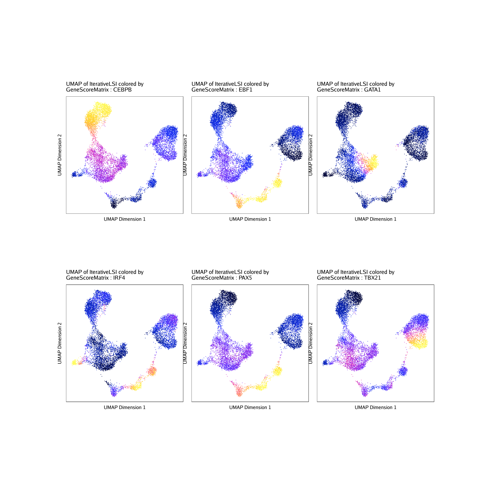
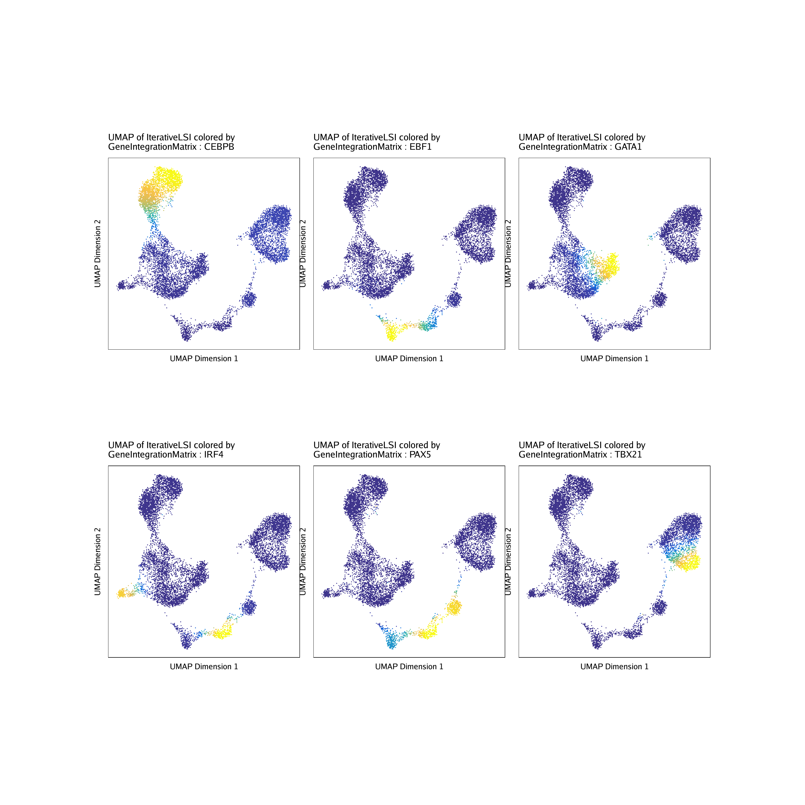

# ChromVAR Deviatons Enrichment with ArchR

```{r, include=FALSE}
setwd("/Volumes/JG_SSD_2/ArchR_Walkthrough/")
#load("Save-ArchR-Walkthrough-Chapter1-Feb13.Rdata")
save.image("Save-ArchR-Walkthrough-Feb17-0254.Rdata")
```

## Motif Deviations

If you have not added motif annotations

```{r eval=FALSE}
projHeme5 <- addMotifAnnotations(ArchRProj = projHeme5, motifSet = "cisbp", name = "Motif")
```

If you have not added background peaks

```{r eval=FALSE}
projHeme5 <- addBgdPeaks(projHeme5)
```

Add ChromVAR Deviations for Motifs

```{r eval=FALSE}
addArchRThreads(8)

projHeme5 <- addDeviationsMatrix(
  ArchRProj = projHeme5, 
  peakAnnotation = "Motif"
)
```

Plot Variable Motif Annotations

```{r eval=FALSE}
plotVarDev <- getVarDeviations(projHeme5, plot = TRUE)
# DataFrame with 6 rows and 6 columns
#      seqnames     idx      name     combinedVars       combinedMeans      rank
#         <Rle> <array>   <array>        <numeric>           <numeric> <integer>
# f383        z     383 GATA1_383 12.5587654919393 -0.0467737461797836         1
# f388        z     388 GATA2_388 12.5232684663532 -0.0437582624045581         2
# f336        z     336  SPIB_336 11.1449104702032 -0.0563199587385128         3
# f385        z     385 GATA5_385 10.9268531272974 -0.0433659077435513         4
# f155        z     155 CEBPA_155 10.6045910511329   -0.14514233730257         5
# f384        z     384 GATA3_384 10.4460730802746 -0.0428770420598439         6
plotVarDev
```

{width=500 height=500}

We can then plot this as a nice PDF

```{r eval=FALSE}
plotPDF(plotVarDev, name = "Variable-Motif-Deviation-Scores", width = 5, height = 5, ArchRProj = projHeme5, addDOC = FALSE)
```

If we want to get motif feature names for downstream plotting

```{r eval=FALSE}
motifs <- c("GATA1", "CEBPA", "EBF1", "IRF4", "TBX21", "PAX5")
getFeatures(projHeme5, select = paste(motifs, collapse="|"), useMatrix = "MotifMatrix")
#  [1] "z:TBX21_780"          "z:PAX5_709"           "z:IRF4_632"          
#  [4] "z:GATA1_383"          "z:CEBPA_155"          "z:EBF1_67"           
#  [7] "z:SREBF1_22"          "deviations:TBX21_780" "deviations:PAX5_709" 
# [10] "deviations:IRF4_632"  "deviations:GATA1_383" "deviations:CEBPA_155"
# [13] "deviations:EBF1_67"   "deviations:SREBF1_22"
```

To get deviation z-scores

```{r eval=FALSE}
markerMotifs <- getFeatures(projHeme5, select = paste(motifs, collapse="|"), useMatrix = "MotifMatrix")
markerMotifs <- grep("z:", markerMotifs, value = TRUE)
markerMotifs <- markerMotifs[markerMotifs %ni% "z:SREBF1_22"]
markerMotifs
# [1] "z:TBX21_780" "z:PAX5_709"  "z:IRF4_632"  "z:GATA1_383" "z:CEBPA_155"
# [6] "z:EBF1_67"  
```

We can also now plot the distribution of chromVAR deviation scores for each cluster

```{r eval=FALSE}
p <- plotGroups(ArchRProj = projHeme5, 
  groupBy = "Clusters2", 
  colorBy = "MotifMatrix", 
  name = markerMotifs,
  imputeWeights = getImputeWeights(projHeme5)
)
```

To plot all genes we can use cowplot

```{r, eval = FALSE}
#Rearrange for grid plotting
p2 <- lapply(seq_along(p), function(x){
  if(x != 1){
    p[[x]] + guides(color = FALSE, fill = FALSE) + 
    theme_ArchR(baseSize = 6) +
    theme(plot.margin = unit(c(0.1, 0.1, 0.1, 0.1), "cm")) +
    theme(
        axis.text.y=element_blank(), 
        axis.ticks.y=element_blank(),
        axis.title.y=element_blank()
    ) + ylab("")
  }else{
    p[[x]] + guides(color = FALSE, fill = FALSE) + 
    theme_ArchR(baseSize = 6) +
    theme(plot.margin = unit(c(0.1, 0.1, 0.1, 0.1), "cm")) +
    theme(
        axis.ticks.y=element_blank(),
        axis.title.y=element_blank()
    ) + ylab("")
  }
})
do.call(cowplot::plot_grid, c(list(nrow = 1, rel_widths = c(2, rep(1, length(p2) - 1))),p2))
```

{width=800 height=800}

```{r, include=FALSE, eval = FALSE}
plotPDF(
    do.call(cowplot::plot_grid, c(list(nrow = 1, rel_widths = c(2.1, rep(1, length(p2) - 1))),p2)), 
    name = "Plot-Groups-Deviations-w-Imputation-Cowplot.pdf", 
    ArchRProj = projHeme5,
    addDOC = FALSE,
    width = 6, 
    height = 6
)
```

We can then plot this as a nice PDF

```{r eval=FALSE}
plotPDF(p, name = "Plot-Groups-Deviations-w-Imputation", width = 5, height = 5, ArchRProj = projHeme5, addDOC = FALSE)
```

We can now overlay these motif deviation scores on the UMAP embedding


```{r eval=FALSE}
p <- plotEmbedding(
    ArchRProj = projHeme5, 
    colorBy = "MotifMatrix", 
    name = sort(markerMotifs), 
    embedding = "UMAP",
    imputeWeights = getImputeWeights(projHeme5)
)
```

To plot all motifs we can use cowplot

```{r, eval = FALSE}
#Rearrange for grid plotting
p2 <- lapply(p, function(x){
    x + guides(color = FALSE, fill = FALSE) + 
    theme_ArchR(baseSize = 6.5) +
    theme(plot.margin = unit(c(0, 0, 0, 0), "cm")) +
    theme(
        axis.text.x=element_blank(), 
        axis.ticks.x=element_blank(), 
        axis.text.y=element_blank(), 
        axis.ticks.y=element_blank()
    )
})
do.call(cowplot::plot_grid, c(list(ncol = 3),p2))
```

{width=800 height=800}

```{r, include=FALSE, eval = FALSE}
plotPDF(
    do.call(cowplot::plot_grid, c(list(ncol = 3),p2)), 
    name = "Plot-UMAP-MarkerMotifs-W-Imputation.pdf", 
    ArchRProj = projHeme5,
    addDOC = FALSE,
    width = 10, 
    height = 10
)
```

We can also plot the gene expression profiles for each of these TFs

```{r eval=FALSE}
markerRNA <- getFeatures(projHeme5, select = paste(motifs, collapse="|"), useMatrix = "GeneScoreMatrix")
markerRNA <- markerRNA[markerRNA %ni% c("SREBF1","CEBPA-DT")]
markerRNA
#[1] "TBX21" "CEBPA" "EBF1"  "IRF4"  "PAX5"  "GATA1"

p <- plotEmbedding(
    ArchRProj = projHeme5, 
    colorBy = "GeneScoreMatrix", 
    name = sort(markerRNA), 
    embedding = "UMAP",
    imputeWeights = getImputeWeights(projHeme5)
)

#Rearrange for grid plotting
p2 <- lapply(p, function(x){
    x + guides(color = FALSE, fill = FALSE) + 
    theme_ArchR(baseSize = 6.5) +
    theme(plot.margin = unit(c(0, 0, 0, 0), "cm")) +
    theme(
        axis.text.x=element_blank(), 
        axis.ticks.x=element_blank(), 
        axis.text.y=element_blank(), 
        axis.ticks.y=element_blank()
    )
})
do.call(cowplot::plot_grid, c(list(ncol = 3),p2))

```

{width=800 height=800}

```{r, include=FALSE, eval = FALSE}
plotPDF(
    do.call(cowplot::plot_grid, c(list(ncol = 3),p2)), 
    name = "Plot-UMAP-MarkerMotifsGS-W-Imputation.pdf", 
    ArchRProj = projHeme5,
    addDOC = FALSE,
    width = 10, 
    height = 10
)
```

We can also plot the gene expression profiles for each of these TFs

```{r eval=FALSE}
markerRNA <- getFeatures(projHeme5, select = paste(motifs, collapse="|"), useMatrix = "GeneIntegrationMatrix")
markerRNA <- markerRNA[markerRNA %ni% c("SREBF1","CEBPA-DT")]
markerRNA
#[1] "TBX21" "CEBPA" "EBF1"  "IRF4"  "PAX5"  "GATA1"

p <- plotEmbedding(
    ArchRProj = projHeme5, 
    colorBy = "GeneIntegrationMatrix", 
    name = sort(markerRNA), 
    embedding = "UMAP",
    continuousSet = "blueYellow",
    imputeWeights = getImputeWeights(projHeme5)
)

#Rearrange for grid plotting
p2 <- lapply(p, function(x){
    x + guides(color = FALSE, fill = FALSE) + 
    theme_ArchR(baseSize = 6.5) +
    theme(plot.margin = unit(c(0, 0, 0, 0), "cm")) +
    theme(
        axis.text.x=element_blank(), 
        axis.ticks.x=element_blank(), 
        axis.text.y=element_blank(), 
        axis.ticks.y=element_blank()
    )
})
do.call(cowplot::plot_grid, c(list(ncol = 3),p2))

```

{width=800 height=800}

```{r, include=FALSE, eval = FALSE}
plotPDF(
    do.call(cowplot::plot_grid, c(list(ncol = 3),p2)), 
    name = "Plot-UMAP-MarkerMotifsRNA-W-Imputation.pdf", 
    ArchRProj = projHeme5,
    addDOC = FALSE,
    width = 10, 
    height = 10
)
```

## ArchR Deviations

### Encode TFBS

If you have not added motif annotations

```{r eval=FALSE}
projHeme5 <- addArchRAnnotations(ArchRProj = projHeme5, collection = "EncodeTFBS")
```

If you have not added background peaks

```{r eval=FALSE}
projHeme5 <- addBgdPeaks(projHeme5)
```

Add ChromVAR Deviations for Motifs

```{r eval=FALSE}
addArchRThreads(8)

projHeme5 <- addDeviationsMatrix(
  ArchRProj = projHeme5, 
  peakAnnotation = "EncodeTFBS"
)
```

Plot Variable Motif Annotations

```{r eval=FALSE}
plotVarDev <- getVarDeviations(projHeme5, plot = TRUE, name = "EncodeTFBSMatrix")
# DataFrame with 6 rows and 6 columns
#      seqnames     idx                    name     combinedVars
#         <Rle> <array>                 <array>        <numeric>
# f222        z     222     222.GATA2_S-K562... 13.3776606277002
# f41         z      41      41.EZH2_39-NHEK... 12.9568688227648
# f542        z     542     542.TAL1_SC-K562... 11.3037382536044
# f498        z     498      498.GATA_2-K562... 10.2006515402356
# f584        z     584 584.GATA_1-PBDEFetal... 10.0732825204346
# f44         z      44      44.EZH2_39-NHLF... 9.67400298749933
plotVarDev
```

{width=500 height=500}

We can then plot this as a nice PDF

```{r eval=FALSE}
plotPDF(plotVarDev, name = "Variable-EncodeTFBS-Deviation-Scores", width = 5, height = 5, ArchRProj = projHeme5, addDOC = FALSE)
```

If we want to get TF feature names for downstream plotting

```{r eval=FALSE}
tfs <- c("GATA_1", "CEBPB", "EBF1", "IRF4", "TBX21", "PAX5")
getFeatures(projHeme5, select = paste(tfs, collapse="|"), useMatrix = "EncodeTFBSMatrix")
#  [1] "z:584.GATA_1-PBDEFetal..."          "z:582.GATA_1-PBDE..."              
#  [3] "z:497.GATA_1-K562..."               "z:477.CEBPB-K562..."               
#  [5] "z:462.CEBPB-IMR90..."               "z:427.CEBPB-HepG2..."              
#  [7] "z:426.CEBPB-HepG2..."               "z:379.CEBPB-HeLa_S3..."            
#  [9] "z:344.CEBPB-H1_hESC..."             "z:293.EBF1_SC-GM12878..."          
# [11] "z:278.CEBPB-A549..."                "z:213.CEBPB_S-K562..."             
# [13] "z:173.CEBPB_S-HepG2..."             "z:130.PAX5_C2-GM12892..."          
# [15] "z:123.PAX5_C2-GM12891..."           "z:102.PAX5_N1-GM12878..."          
# [17] "z:101.PAX5_C2-GM12878..."           "z:93.IRF4_SC-GM12878..."           
# [19] "z:87.EBF1_SC-GM12878..."            "z:86.CEBPB_S-GM12878..."           
# [21] "deviations:584.GATA_1-PBDEFetal..." "deviations:582.GATA_1-PBDE..."     
# [23] "deviations:497.GATA_1-K562..."      "deviations:477.CEBPB-K562..."      
# [25] "deviations:462.CEBPB-IMR90..."      "deviations:427.CEBPB-HepG2..."     
# [27] "deviations:426.CEBPB-HepG2..."      "deviations:379.CEBPB-HeLa_S3..."   
# [29] "deviations:344.CEBPB-H1_hESC..."    "deviations:293.EBF1_SC-GM12878..." 
# [31] "deviations:278.CEBPB-A549..."       "deviations:213.CEBPB_S-K562..."    
# [33] "deviations:173.CEBPB_S-HepG2..."    "deviations:130.PAX5_C2-GM12892..." 
# [35] "deviations:123.PAX5_C2-GM12891..."  "deviations:102.PAX5_N1-GM12878..." 
# [37] "deviations:101.PAX5_C2-GM12878..."  "deviations:93.IRF4_SC-GM12878..."  
# [39] "deviations:87.EBF1_SC-GM12878..."   "deviations:86.CEBPB_S-GM12878..."
```

To get deviation z-scores

```{r eval=FALSE}
markerTFs <- getFeatures(projHeme5, select = paste(tfs, collapse="|"), useMatrix = "EncodeTFBSMatrix")
markerTFs <- sort(grep("z:", markerTFs, value = TRUE))
TFnames <- stringr::str_split(stringr::str_split(markerTFs, pattern = "\\.", simplify=TRUE)[,2], pattern = "-", simplify = TRUE)[,1]
markerTFs <- markerTFs[!duplicated(TFnames)]
markerTFs
# [1] "z:101.PAX5_C2-GM12878..." "z:102.PAX5_N1-GM12878..."
# [3] "z:173.CEBPB_S-HepG2..."   "z:278.CEBPB-A549..."     
# [5] "z:293.EBF1_SC-GM12878..." "z:497.GATA_1-K562..."    
# [7] "z:93.IRF4_SC-GM12878..." 
```

```{r eval=FALSE}
p <- plotEmbedding(
    ArchRProj = projHeme5, 
    colorBy = "EncodeTFBSMatrix", 
    name = markerTFs, 
    embedding = "UMAP",
    imputeWeights = getImputeWeights(projHeme5)
)
```

To plot all motifs we can use cowplot

```{r, eval = FALSE}
#Rearrange for grid plotting
p2 <- lapply(p, function(x){
    x + guides(color = FALSE, fill = FALSE) + 
    theme_ArchR(baseSize = 6.5) +
    theme(plot.margin = unit(c(0, 0, 0, 0), "cm")) +
    theme(
        axis.text.x=element_blank(), 
        axis.ticks.x=element_blank(), 
        axis.text.y=element_blank(), 
        axis.ticks.y=element_blank()
    )
})
do.call(cowplot::plot_grid, c(list(ncol = 3),p2))
```

{width=800 height=800}

```{r, include=FALSE, eval = FALSE}
plotPDF(
    do.call(cowplot::plot_grid, c(list(ncol = 3),p2)), 
    name = "Plot-UMAP-EncodeTFBS-W-Imputation.pdf", 
    ArchRProj = projHeme5,
    addDOC = FALSE,
    width = 10, 
    height = 10
)
```

We can also plot the gene expression profiles for each of these TFs

```{r eval=FALSE}
markerRNA <- getFeatures(projHeme5, select = paste(gsub("_","",tfs), collapse="|"), useMatrix = "GeneScoreMatrix")
markerRNA <- markerRNA[markerRNA %ni% c("SREBF1")]
markerRNA
#[1] "TBX21" "CEBPA" "EBF1"  "IRF4"  "PAX5"  "GATA1"

p <- plotEmbedding(
    ArchRProj = projHeme5, 
    colorBy = "GeneScoreMatrix", 
    name = sort(markerRNA), 
    embedding = "UMAP",
    imputeWeights = getImputeWeights(projHeme5)
)

#Rearrange for grid plotting
p2 <- lapply(p, function(x){
    x + guides(color = FALSE, fill = FALSE) + 
    theme_ArchR(baseSize = 6.5) +
    theme(plot.margin = unit(c(0, 0, 0, 0), "cm")) +
    theme(
        axis.text.x=element_blank(), 
        axis.ticks.x=element_blank(), 
        axis.text.y=element_blank(), 
        axis.ticks.y=element_blank()
    )
})
do.call(cowplot::plot_grid, c(list(ncol = 3),p2))

```

{width=800 height=800}

```{r, include=FALSE, eval = FALSE}
plotPDF(
    do.call(cowplot::plot_grid, c(list(ncol = 3),p2)), 
    name = "Plot-UMAP-EncodeTFBSGS-W-Imputation.pdf", 
    ArchRProj = projHeme5,
    addDOC = FALSE,
    width = 10, 
    height = 10
)
```

We can also plot the gene expression profiles for each of these TFs

```{r eval=FALSE}
markerRNA <- getFeatures(projHeme5, select = paste(gsub("_","",tfs), collapse="|"), useMatrix = "GeneIntegrationMatrix")
markerRNA <- markerRNA[markerRNA %ni% c("SREBF1","CEBPA-DT")]
markerRNA
#[1] "TBX21" "CEBPA" "EBF1"  "IRF4"  "PAX5"  "GATA1"

p <- plotEmbedding(
    ArchRProj = projHeme5, 
    colorBy = "GeneIntegrationMatrix", 
    name = sort(markerRNA), 
    embedding = "UMAP",
    continuousSet = "blueYellow",
    imputeWeights = getImputeWeights(projHeme5)
)

#Rearrange for grid plotting
p2 <- lapply(p, function(x){
    x + guides(color = FALSE, fill = FALSE) + 
    theme_ArchR(baseSize = 6.5) +
    theme(plot.margin = unit(c(0, 0, 0, 0), "cm")) +
    theme(
        axis.text.x=element_blank(), 
        axis.ticks.x=element_blank(), 
        axis.text.y=element_blank(), 
        axis.ticks.y=element_blank()
    )
})
do.call(cowplot::plot_grid, c(list(ncol = 3),p2))

```

{width=800 height=800}

```{r, include=FALSE, eval = FALSE}
plotPDF(
    do.call(cowplot::plot_grid, c(list(ncol = 3),p2)), 
    name = "Plot-UMAP-EncodeTFBSRNA-W-Imputation.pdf", 
    ArchRProj = projHeme5,
    addDOC = FALSE,
    width = 10, 
    height = 10
)
```

### Bulk ATAC-seq

If you have not added motif annotations

```{r eval=FALSE}
projHeme5 <- addArchRAnnotations(ArchRProj = projHeme5, collection = "ATAC")
```

If you have not added background peaks

```{r eval=FALSE}
projHeme5 <- addBgdPeaks(projHeme5)
```

Add ChromVAR Deviations for Motifs

```{r eval=FALSE}
addArchRThreads(8)

projHeme5 <- addDeviationsMatrix(
  ArchRProj = projHeme5, 
  peakAnnotation = "ATAC"
)
```

Plot Variable Motif Annotations

```{r eval=FALSE}
plotVarDev <- getVarDeviations(projHeme5, plot = TRUE, name = "ATACMatrix")
# DataFrame with 6 rows and 6 columns
#     seqnames     idx                    name     combinedVars
#        <Rle> <array>                 <array>        <numeric>
# f22        z      22   IAtlas_T_CD8posCenMem 12.0581125421541
# f86        z      86                Heme_CD8 11.6532963605177
# f85        z      85                Heme_CD4 11.5670776340581
# f23        z      23   IAtlas_T_CD8posEffMem 11.4627247478874
# f33        z      33   IAtlas_T_Th1Precursor 11.4097813814495
# f19        z      19 IAtlas_T_CD4posEffector  11.398315976261
plotVarDev
```

{width=500 height=500}

We can then plot this as a nice PDF

```{r eval=FALSE}
plotPDF(plotVarDev, name = "Variable-ATAC-Deviation-Scores", width = 5, height = 5, ArchRProj = projHeme5, addDOC = FALSE)
```

If we want to get TF feature names for downstream plotting

```{r eval=FALSE}
ATACPeaks <- c("Heme_HSC", "Heme_LMPP", "Heme_Ery", "Heme_Mono", "Heme_CD4", "Heme_CD8", "Heme_B", "Heme_NK", "IAtlas_DC_Plasmacytoid")
getFeatures(projHeme5, select = paste(ATACPeaks, collapse="|"), useMatrix = "ATACMatrix")
#  [1] "z:Heme_NK"                         "z:Heme_Mono"                      
#  [3] "z:Heme_MEP"                        "z:Heme_LMPP"                      
#  [5] "z:Heme_HSC"                        "z:Heme_CD8"                       
#  [7] "z:Heme_CD4"                        "z:Heme_B"                         
#  [9] "z:IAtlas_DC_Plasmacytoid"          "deviations:Heme_NK"               
# [11] "deviations:Heme_Mono"              "deviations:Heme_MEP"              
# [13] "deviations:Heme_LMPP"              "deviations:Heme_HSC"              
# [15] "deviations:Heme_CD8"               "deviations:Heme_CD4"              
# [17] "deviations:Heme_B"                 "deviations:IAtlas_DC_Plasmacytoid"
```

To get deviation z-scores

```{r eval=FALSE}
markerATAC <- getFeatures(projHeme5, select = paste(ATACPeaks, collapse="|"), useMatrix = "ATACMatrix")
markerATAC <- sort(grep("z:", markerATAC, value = TRUE))
markerATAC
# [1] "z:Heme_B"                 "z:Heme_CD4"              
# [3] "z:Heme_CD8"               "z:Heme_HSC"              
# [5] "z:Heme_MEP"               "z:Heme_Mono"             
# [7] "z:Heme_NK"                "z:IAtlas_DC_Plasmacytoid"
```

```{r eval=FALSE}
p <- plotEmbedding(
    ArchRProj = projHeme5, 
    colorBy = "ATACMatrix", 
    name = markerATAC, 
    embedding = "UMAP",
    imputeWeights = getImputeWeights(projHeme5)
)
```

To plot all motifs we can use cowplot

```{r, eval = FALSE}
#Rearrange for grid plotting
p2 <- lapply(p, function(x){
    x + guides(color = FALSE, fill = FALSE) + 
    theme_ArchR(baseSize = 6.5) +
    theme(plot.margin = unit(c(0, 0, 0, 0), "cm")) +
    theme(
        axis.text.x=element_blank(), 
        axis.ticks.x=element_blank(), 
        axis.text.y=element_blank(), 
        axis.ticks.y=element_blank()
    )
})
do.call(cowplot::plot_grid, c(list(ncol = 3),p2))
```

{width=800 height=800}

```{r, include=FALSE, eval = FALSE}
plotPDF(
    do.call(cowplot::plot_grid, c(list(ncol = 3),p2)), 
    name = "Plot-UMAP-MarkerATAC-W-Imputation.pdf", 
    ArchRProj = projHeme5,
    addDOC = FALSE,
    width = 10, 
    height = 10
)
```


## Custom Deviations

If you have not added motif annotations

```{r eval=FALSE}
#Custom Peak Annotations
EncodePeaks <- c(
  Encode_K562_GATA1 = "https://www.encodeproject.org/files/ENCFF632NQI/@@download/ENCFF632NQI.bed.gz",
  Encode_GM12878_CEBPB = "https://www.encodeproject.org/files/ENCFF761MGJ/@@download/ENCFF761MGJ.bed.gz",
  Encode_K562_Ebf1 = "https://www.encodeproject.org/files/ENCFF868VSY/@@download/ENCFF868VSY.bed.gz",
  Encode_K562_Pax5 = "https://www.encodeproject.org/files/ENCFF339KUO/@@download/ENCFF339KUO.bed.gz"
)
projHeme5 <- addPeakAnnotations(ArchRProj = projHeme5, regions = EncodePeaks, name = "ChIP")
```

If you have not added background peaks

```{r eval=FALSE}
projHeme5 <- addBgdPeaks(projHeme5)
```

Add ChromVAR Deviations for Motifs

```{r eval=FALSE}
addArchRThreads(8)

projHeme5 <- addDeviationsMatrix(
  ArchRProj = projHeme5, 
  peakAnnotation = "ChIP"
)
```

Plot Variable Motif Annotations

```{r eval=FALSE}
plotVarDev <- getVarDeviations(projHeme5, plot = TRUE, name = "ChIPMatrix")
# DataFrame with 4 rows and 6 columns
#    seqnames     idx                 name      combinedVars        combinedMeans
#       <Rle> <array>              <array>         <numeric>            <numeric>
# f1        z       1    Encode_K562_GATA1  6.19256551652079  -0.0229048763845575
# f3        z       3     Encode_K562_Ebf1  3.31156290837234   0.0394899516880888
# f4        z       4     Encode_K562_Pax5  2.93016136274537 -0.00867706262058369
# f2        z       2 Encode_GM12878_CEBPB 0.779863387389073  0.00919359271019273
plotVarDev
```

{width=500 height=500}

We can then plot this as a nice PDF

```{r eval=FALSE}
plotPDF(plotVarDev, name = "Variable-ChIP-Deviation-Scores", width = 5, height = 5, ArchRProj = projHeme5, addDOC = FALSE)
```

To get deviation z-scores

```{r eval=FALSE}
markerChIP <- getFeatures(projHeme5, useMatrix = "ChIPMatrix")
markerChIP <- sort(grep("z:", markerChIP, value = TRUE))
markerChIP
# [1] "z:Encode_GM12878_CEBPB" "z:Encode_K562_Ebf1"     "z:Encode_K562_GATA1"   
# [4] "z:Encode_K562_Pax5"    
```

```{r eval=FALSE}
p <- plotEmbedding(
    ArchRProj = projHeme5, 
    colorBy = "ChIPMatrix", 
    name = markerChIP, 
    embedding = "UMAP",
    imputeWeights = getImputeWeights(projHeme5)
)
```

To plot all motifs we can use cowplot

```{r, eval = FALSE}
#Rearrange for grid plotting
p2 <- lapply(p, function(x){
    x + guides(color = FALSE, fill = FALSE) + 
    theme_ArchR(baseSize = 6.5) +
    theme(plot.margin = unit(c(0, 0, 0, 0), "cm")) +
    theme(
        axis.text.x=element_blank(), 
        axis.ticks.x=element_blank(), 
        axis.text.y=element_blank(), 
        axis.ticks.y=element_blank()
    )
})
do.call(cowplot::plot_grid, c(list(ncol = 2),p2))
```

{width=800 height=800}

```{r, include=FALSE, eval = FALSE}
plotPDF(
    do.call(cowplot::plot_grid, c(list(ncol = 2),p2)), 
    name = "Plot-UMAP-MarkerChIP-W-Imputation.pdf", 
    ArchRProj = projHeme5,
    addDOC = FALSE,
    width = 10, 
    height = 10
)
```


