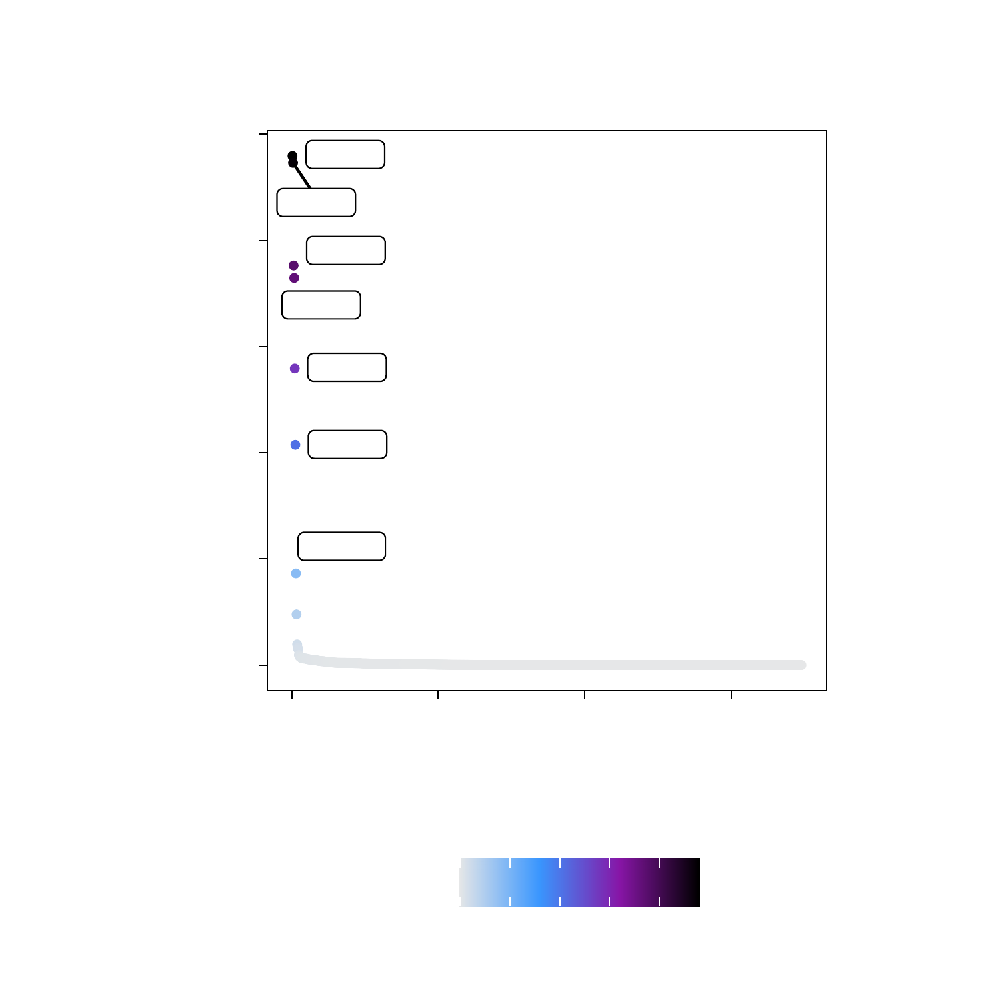
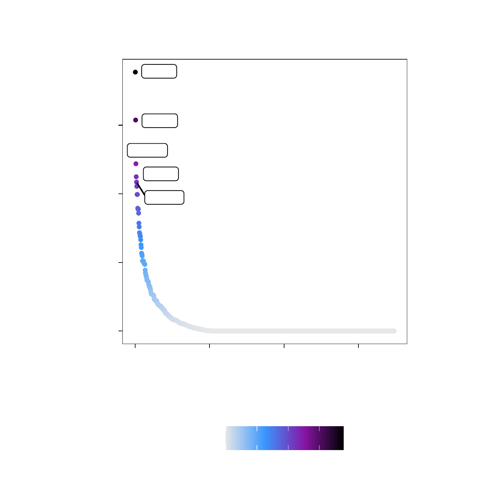
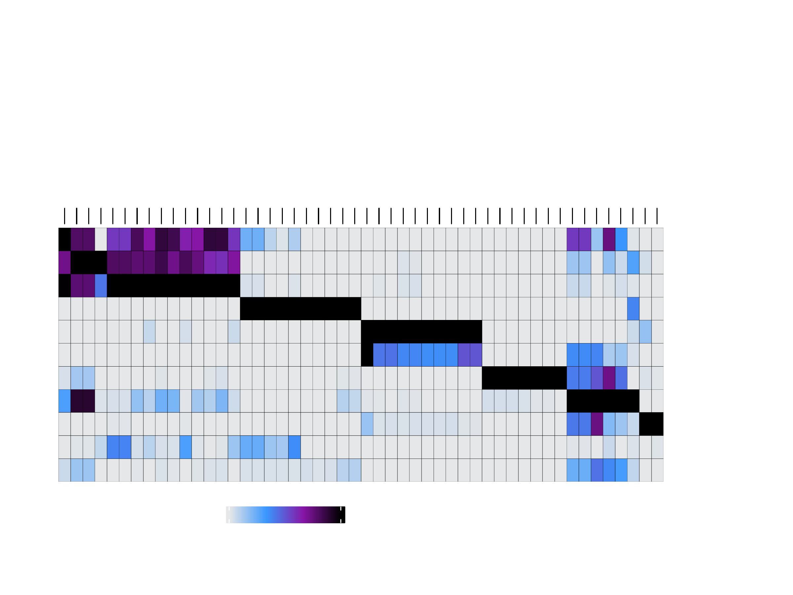
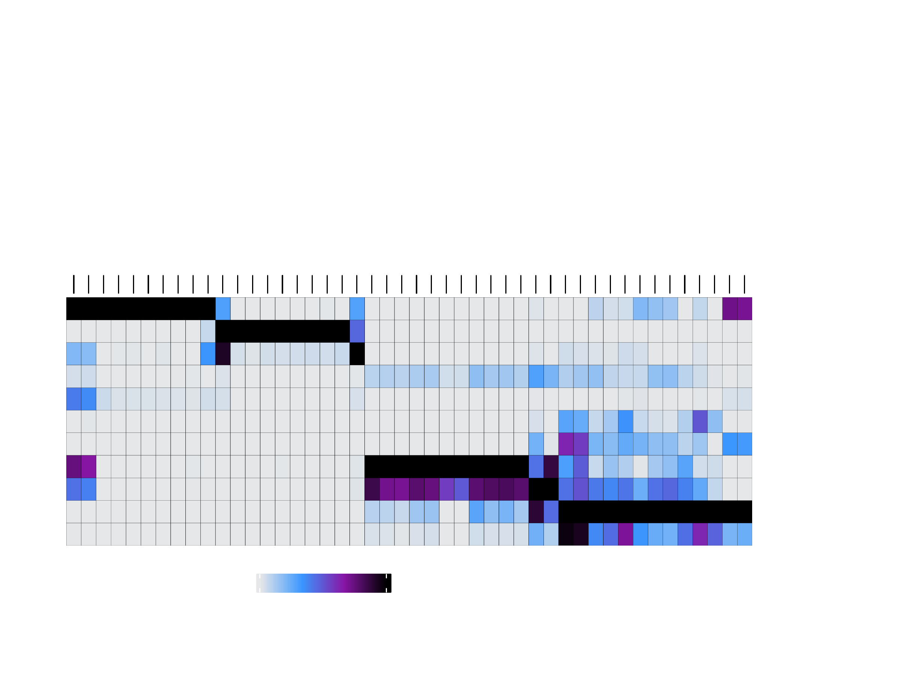
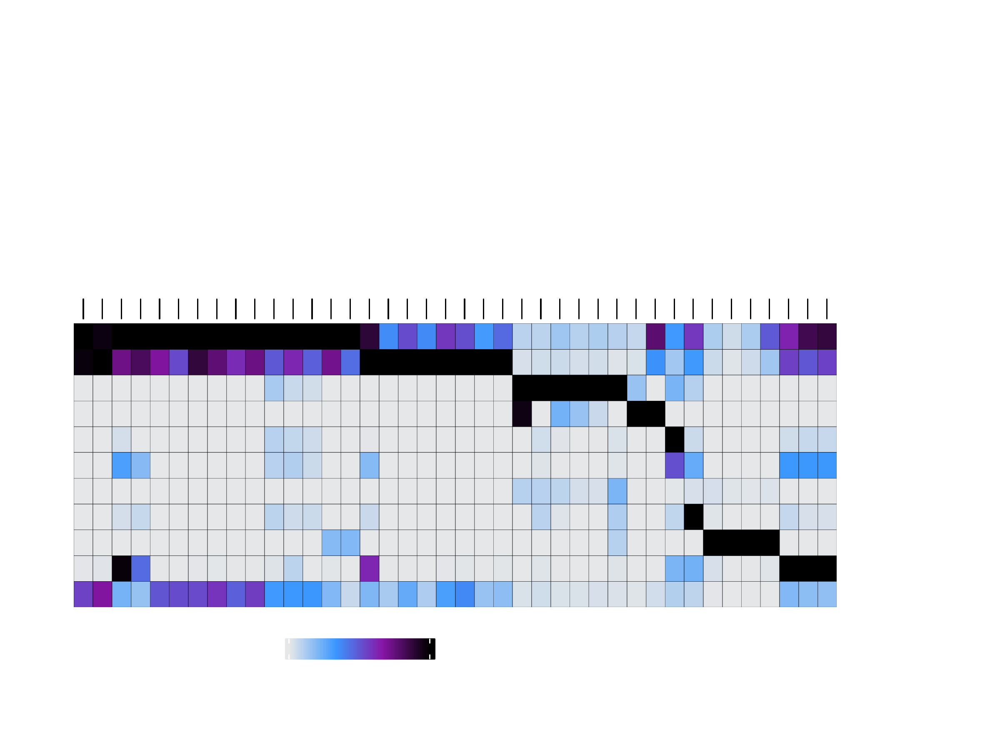
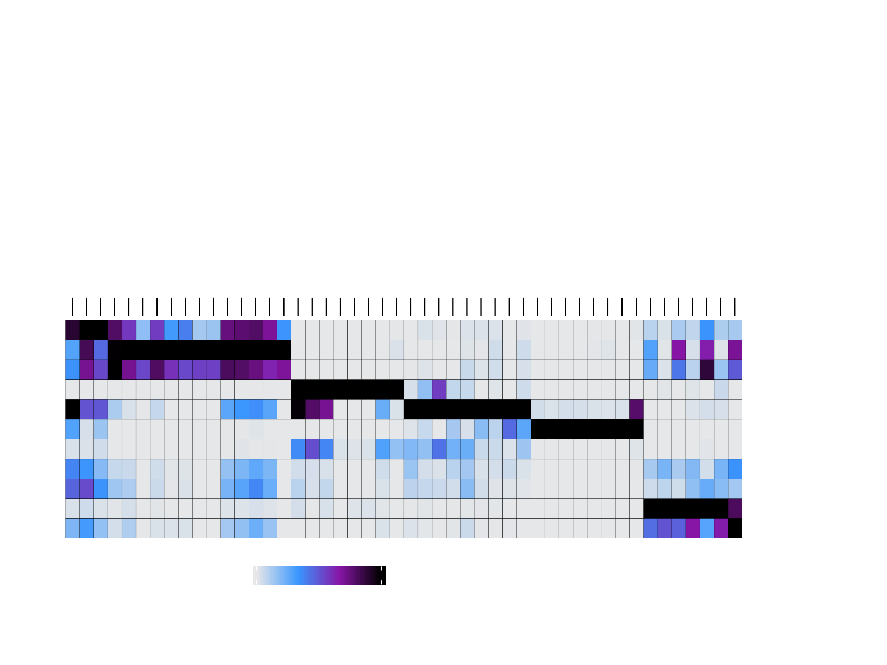
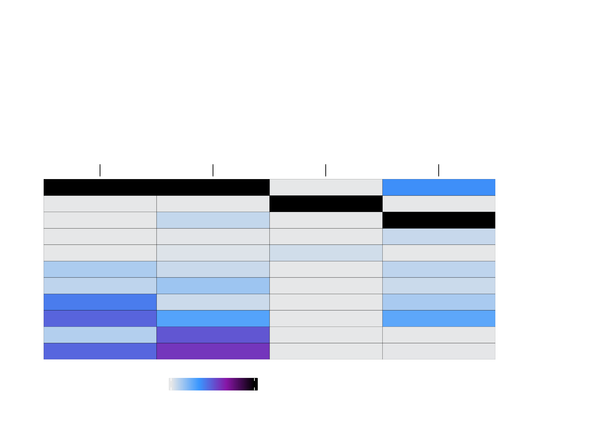

---
output:
  html_document:
    theme: yeti  # many options for theme, this one is my favorite.
params:
  threads: 20
  rdata: ""
  token: ""
  ref: ""
  out: ""
---
```{r, include=FALSE}
load("ch11.RData")
```

# Motif and Feature Enrichment with ArchR

After identification of a robust peak set, we often want to predict what transcription factors may be mediating the binding events that create those accessible chromatin sites. This can be helpful in assessing marker peaks or differential peaks to understand if these groups of peaks are enriched for binding sites of specific transcription factors. For example, we often find enrichment of key lineage-defining TFs in cell type-specific accessible chromatin regions. In a similar fashion, we might want to test various groups of peaks for enrichment of other known features. For example, we might want to know if cell type-specific ATAC-seq peaks for cell type A are enriched for another set of genomic regions such as ChIP-seq peaks. This chapter details how these enrichments are performed in ArchR.

## Motif Enrichment

Continuing our analysis of differential peaks from the previous chapter, we can look for motifs that are enriched in peaks that are up or down in various cell types. To do this, we must first add these motif annotations to our `ArchRProject`, which we do using the `motifmatchr` package. This effectively creates a binary matrix where the presence of a motif in each peak is indicated numerically. We do this using the `addMotifAnnotations()` function which determines motif presence in the peak set stored in the `ArchRProject`.

```{r}
projHeme5 <- addMotifAnnotations(ArchRProj = projHeme5, motifSet = "cisbp", name = "Motif")
```

The `motifSet` used should be chosen carefully because annotations may not be available for your species. 

### Which motifs are found in a given peak?

Before diving into how to perform various motif enrichment analyses, we'll take a slight detour to discuss how to figure out which motifs are present in a given peak. Lets say we are interested in understanding which TF motifs are present within the promoter peak of the CEBPA gene, located at `chr19:33792929-33794030`. First, we extract the peak set from our `ArchRProject` and create names for each peak based on the chromosome, start, and end positions.

```{r, collapse=TRUE}
pSet <- getPeakSet(ArchRProj = projHeme5)
pSet$name <- paste(seqnames(pSet), start(pSet), end(pSet), sep = "_")
```

Then, we extract a `RangedSummarizedExperiment` object containing the per-peak motif matches, create analogous names for that object, and then sort the matches object to ensure that the peaks are listed in the same order as the peaks from the peak set.

```{r, collapse=TRUE}
matches <- getMatches(ArchRProj = projHeme5, name = "Motif")
rownames(matches) <- paste(seqnames(matches), start(matches), end(matches), sep = "_")
matches <- matches[pSet$name]
```

Now, we just need to find the index of the CEBPA promoter peak of interest and find which motifs are present in that peak. Note that the below code only works when a single peak is being analyzed.

```{r, collapse=TRUE}
#first, we make a GRanges object corresponding to the CEBPA promoter
gr <- GRanges(seqnames = c("chr19"), ranges = IRanges(start = c(33792929), end = c(33794030)))
#then we find peaks from our peak set that overlap this region
queryHits <- queryHits(findOverlaps(query = pSet, subject = gr, type = "within"))
#then we get the TFs that have motif matches in that peak
colnames(matches)[which(assay(matches[queryHits,]))]
```

The same type of workflow could be used in conjunction with peak-to-gene links or co-accessibility, which will come up in later chapters, to identify TF motifs present in other sets of peaks. The key is matching peaks based on the chromosome, start and end positions as shown above.

### Motif Enrichment in Differential Peaks

We can then use the differential testing `SummarizedExperiment` object `markerTest` which was generated in the previous chapter to define the set of significantly differential peaks that we are interested in testing for motif enrichment. In this case, we are looking for peaks that have an `FDR <= 0.1` and a `Log2FC >= 0.5`. In the context of the differential comparison made in `markerTest`, these represnt peaks that are more accessible in "Erythroid" cells than "Progenitor" cells. We can test these differentially accessible peaks for enrichment of various motifs using the `peakAnnoEnrichment()` function. This function is a generalizable function that can be used for many different enrichment tests as we will demonstrate throughout this chapter.
```{r}
motifsUp <- peakAnnoEnrichment(
    seMarker = markerTest,
    ArchRProj = projHeme5,
    peakAnnotation = "Motif",
    cutOff = "FDR <= 0.1 & Log2FC >= 0.5"
  )
```

The output of `peakAnnoEnrichment()` is a `SummarizedExperiment` object containing multiple `assays` that store the results of enrichment testing with the hypergeometric test.
```{r}
motifsUp
```

To prepare this data for plotting with `ggplot` we can create a simplified `data.frame` object containing the motif names, the corrected p-values, and the significance rank.
```{r}
df <- data.frame(TF = rownames(motifsUp), mlog10Padj = assay(motifsUp)[,1])
df <- df[order(df$mlog10Padj, decreasing = TRUE),]
df$rank <- seq_len(nrow(df))
```

As expected, the most enriched motifs in the peaks that are more accessible in "Erythroid" cells correspond to GATA transcription factors, consistent with the well-studied role of GATA1 in erythroid differentiation.
```{r}
head(df)
```

```{r include=FALSE,  ,echo=FALSE}
# JJJ Would have been nice in these next two plots to limit the points labeled by ggrepel. currently you cant see many of the points because they are obscured by the labels
```

Using `ggplot` we can plot the rank-sorted TF motifs and color them by the significance of their enrichment. Here we use `ggrepel` to label each TF motif.
```{r}
ggUp <- ggplot(df, aes(rank, mlog10Padj, color = mlog10Padj)) + 
  geom_point(size = 1) +
  ggrepel::geom_label_repel(
        data = df[rev(seq_len(30)), ], aes(x = rank, y = mlog10Padj, label = TF), 
        size = 1.5,
        nudge_x = 2,
        color = "black"
  ) + theme_ArchR() + 
  ylab("-log10(P-adj) Motif Enrichment") + 
  xlab("Rank Sorted TFs Enriched") +
  scale_color_gradientn(colors = paletteContinuous(set = "comet"))

ggUp
```

```{r, include=FALSE}
plotPDF(ggUp, name = "Erythroid-vs-Progenitor-Markers-Motifs-Enriched", width = 5, height = 5, ArchRProj = projHeme5, addDOC = FALSE)
ArchR:::.convertToPNG(ArchRProj = projHeme5)
system("cp Figures/*.png images/HemeWalkthrough/PNG/")
system("cp Figures/*.pdf images/HemeWalkthrough/PDF/")
```

{width=600 height=600}

We can perform the same analyses for the peaks that are more accessible in the "Progenitor" cells by using peaks with `Log2FC <= -0.5`.
```{r}
motifsDo <- peakAnnoEnrichment(
    seMarker = markerTest,
    ArchRProj = projHeme5,
    peakAnnotation = "Motif",
    cutOff = "FDR <= 0.1 & Log2FC <= -0.5"
  )
```

```{r}
motifsDo
```

```{r}
df <- data.frame(TF = rownames(motifsDo), mlog10Padj = assay(motifsDo)[,1])
df <- df[order(df$mlog10Padj, decreasing = TRUE),]
df$rank <- seq_len(nrow(df))
```

In this case, the most enriched motifs in the peaks that are more accessible in "Progenitor" cells correspond to RUNX, ELF, and CBFB motifs.
```{r}
head(df)
```

```{r}
ggDo <- ggplot(df, aes(rank, mlog10Padj, color = mlog10Padj)) + 
  geom_point(size = 1) +
  ggrepel::geom_label_repel(
        data = df[rev(seq_len(30)), ], aes(x = rank, y = mlog10Padj, label = TF), 
        size = 1.5,
        nudge_x = 2,
        color = "black"
  ) + theme_ArchR() + 
  ylab("-log10(FDR) Motif Enrichment") +
  xlab("Rank Sorted TFs Enriched") +
  scale_color_gradientn(colors = paletteContinuous(set = "comet"))

ggDo
```

```{r, include=FALSE}
plotPDF(ggUp, ggDo, name = "Erythroid-vs-Progenitor-Markers-Motifs-Enriched", width = 5, height = 5, ArchRProj = projHeme5, addDOC = FALSE)
ArchR:::.convertToPNG(ArchRProj = projHeme5)
system("cp Figures/*.png images/HemeWalkthrough/PNG/")
system("cp Figures/*.pdf images/HemeWalkthrough/PDF/")
```

{width=600 height=600}

To save an editable vectorized version of these plots, we use the `plotPDF()` function.

```{r}
plotPDF(ggUp, ggDo, name = "Erythroid-vs-Progenitor-Markers-Motifs-Enriched", width = 5, height = 5, ArchRProj = projHeme5, addDOC = FALSE)
```

### Motif Enrichment in Marker Peaks

Similar to the motif enrichment analyses performed on the differential peaks in the previous section, we can also perform motif enrichment on our marker peaks identified using `getMarkerFeatures()`.

To do this, we pass our marker peak `SummarizedExperiment` (`markersPeaks`) to the `peakAnnotationEnrichment()` function.
```{r}
enrichMotifs <- peakAnnoEnrichment(
    seMarker = markersPeaks,
    ArchRProj = projHeme5,
    peakAnnotation = "Motif",
    cutOff = "FDR <= 0.1 & Log2FC >= 0.5"
  )
```
The output of `peakAnnoEnrichment()` is a `SummarizedExperiment` object containing multiple `assays` that store the results of enrichment testing with the hypergeometric test.
```{r}
enrichMotifs
```
We can directly plot these motif enrichments across all cell groups using the `plotEnrichHeatmap()` function. In this function, we limit the total number of motifs shown per cell group using the `n` parameter.
```{r}
heatmapEM <- plotEnrichHeatmap(enrichMotifs, n = 7, transpose = TRUE)
```
We can diplay this plot using `ComplexHeatmap::draw()`.
```{r}
ComplexHeatmap::draw(heatmapEM, heatmap_legend_side = "bot", annotation_legend_side = "bot")
```

```{r, include=FALSE}
plotPDF(heatmapEM, name = "Motifs-Enriched-Marker-Heatmap", width = 8, height = 6, ArchRProj = projHeme5, addDOC = FALSE)
ArchR:::.convertToPNG(ArchRProj = projHeme5)
system("cp Figures/*.png images/HemeWalkthrough/PNG/")
system("cp Figures/*.pdf images/HemeWalkthrough/PDF/")
```

{width=800 height=600}

To save an editable vectorized version of this plot, we use the `plotPDF()` function.

```{r}
plotPDF(heatmapEM, name = "Motifs-Enriched-Marker-Heatmap", width = 8, height = 6, ArchRProj = projHeme5, addDOC = FALSE)
```

### Motif enrichment in arbitrary regions

It is also possible to perform the same motif enrichment analyses using the hypergeometric test in an arbitrary user-defined set of regions. To do this, we would use the `customEnrichment()` function. The most important things to note about this custom enrichment is that the user-defined set of regions must overlap with the peakset of the project and a `peakAnnotation` matches object must already have been added to the `ArchRProject` via `addMotifAnnotations()`, `addArchRAnnotations()`, or `addPeakAnnotations()`.

### Plotting motif logos

Because different motif annotations will use different position weight matrices (PWMs), it's often useful to plot the sequence logo of the exact motif being used. Multiple tools exist to do this but the one we prefer is [ggseqlogo](https://omarwagih.github.io/ggseqlogo/)

To do this, we must first extract the relevant motif information as a `PWMatrix` object.

```{r, collapse = TRUE}
pwm <- getPeakAnnotation(projHeme5, "Motif")$motifs[["SOX6_868"]]
pwm
```

Then, we convert that object to a position probability matrix. We do this with a function, which could be used in an `lapply` statement if you wanted to do this for many `PWMatrix` objects or a `PWMatrixList`.

```{r, collapse = TRUE}
PWMatrixToProbMatrix <- function(x){
  if (class(x) != "PWMatrix") stop("x must be a TFBSTools::PWMatrix object")
  m <- (exp(as(x, "matrix"))) * TFBSTools::bg(x)/sum(TFBSTools::bg(x))
  m <- t(t(m)/colSums(m))
  m
}

ppm <- PWMatrixToProbMatrix(pwm)
ppm
```

This Position Probability Matrix (PPM), has column sums that add to 1.

```{r, collapse = TRUE}
colSums(ppm) %>% range
```

We can then pass this PPM to the `ggseqlogo()` function for plotting. We can plot as a PWM using `method = "bits"`. Note that you need to have the `ggseqlogo` package installed for this to work.

```{r, collapse = TRUE}
library(ggseqlogo)
ggseqlogo(probMat, method = "bits")
```

Or we can plot as a PPM using `method = "prob"`.

```{r, collapse = TRUE}
ggseqlogo(probMat, method = "prob")
```

## ArchR Enrichment

In addition to testing peaks for enrichment of motifs, ArchR also enables the determination of more customizable enrichments. To facilitate this level of data exploration, we have curated a few different feature sets that can be easily tested for enrichment in your peak regions of interest. We describe each of those curated feature sets below. This type of analysis was originally inspired by [LOLA](http://code.databio.org/LOLA/).

### Encode TF Binding Sites
The ENCODE consortium has mapped TF binding sites (TFBSs) across a wide array of cell types and factors. We can use these TFBS collections to better understand our clusters. For example, in the context of truly unknown cell types, these enrichments could help to elucidate cell identity. To enable analyses with these ENCODE TFBS feature sets, we simply call the `addArchRAnnotations()` function with `collection = "EncodeTFBS"`. Similar to what happens when using `addPeakAnnotations()`, this creates a binarized representation of the overlap between all marker peaks and all ENCODE TFBS.

```{r}
projHeme5 <- addArchRAnnotations(ArchRProj = projHeme5, collection = "EncodeTFBS")
```

We can then test for enrichment of these ENCODE TFBSs with our peak set using the `peakAnnoEnrichment()` function.
```{r}
enrichEncode <- peakAnnoEnrichment(
    seMarker = markersPeaks,
    ArchRProj = projHeme5,
    peakAnnotation = "EncodeTFBS",
    cutOff = "FDR <= 0.1 & Log2FC >= 0.5"
  )
```

As previously, this function returns a `SummarizedExperiment` object.
```{r}
enrichEncode
```

We can create a heatmap from these enrichment results using the `plotEnrichHeatmap()` function.
```{r}
heatmapEncode <- plotEnrichHeatmap(enrichEncode, n = 7, transpose = TRUE)
```
And then plot this heatmap using `ComplexHeatmap::draw()`.
```{r}
ComplexHeatmap::draw(heatmapEncode, heatmap_legend_side = "bot", annotation_legend_side = "bot")
```

```{r, include=FALSE,  }
plotPDF(heatmapEncode, name = "EncodeTFBS-Enriched-Marker-Heatmap", width = 8, height = 6, ArchRProj = projHeme5, addDOC = FALSE)
ArchR:::.convertToPNG(ArchRProj = projHeme5)
system("cp Figures/*.png images/HemeWalkthrough/PNG/")
system("cp Figures/*.pdf images/HemeWalkthrough/PDF/")
```

{width=800 height=600}

To save an editable vectorized version of this plot, we use the `plotPDF()` function.

```{r  }
plotPDF(heatmapEncode, name = "EncodeTFBS-Enriched-Marker-Heatmap", width = 8, height = 6, ArchRProj = projHeme5, addDOC = FALSE)
```

### Bulk ATAC-seq

Similar to the curated set of ENCODE TF binding sites, we have also curated peak calls from bulk ATAC-seq experiments that can be used for overlap enrichment testing. We access these bulk ATAC-seq peak sets by setting `collection = "ATAC"`.

```{r}
projHeme5 <- addArchRAnnotations(ArchRProj = projHeme5, collection = "ATAC")
```

We then test our marker peaks for enrichment of these bulk ATAC-seq peaks by setting `peakAnnotation = "ATAC"`.
```{r}
enrichATAC <- peakAnnoEnrichment(
    seMarker = markersPeaks,
    ArchRProj = projHeme5,
    peakAnnotation = "ATAC",
    cutOff = "FDR <= 0.1 & Log2FC >= 0.5"
  )
```

As before, the output of this is a `SummarizedExperiment` object with information on the enrichment results.
```{r}
enrichATAC
```

We can create an enrichment heatmap from this `SummarizedExperiment` using `plotEnrichHeatmap()`.
```{r  }
heatmapATAC <- plotEnrichHeatmap(enrichATAC, n = 7, transpose = TRUE)
```
And plot this heatmap using `ComplexHeatmap::draw()`
```{r }
ComplexHeatmap::draw(heatmapATAC, heatmap_legend_side = "bot", annotation_legend_side = "bot")
```

```{r, include=FALSE,  }
plotPDF(heatmapATAC, name = "ATAC-Enriched-Marker-Heatmap", width = 8, height = 6, ArchRProj = projHeme5, addDOC = FALSE)
ArchR:::.convertToPNG(ArchRProj = projHeme5)
system("cp Figures/*.png images/HemeWalkthrough/PNG/")
system("cp Figures/*.pdf images/HemeWalkthrough/PDF/")
```

{width=800 height=600}

To save an editable vectorized version of this plot, we use the `plotPDF()` function.

```{r  }
plotPDF(heatmapATAC, name = "ATAC-Enriched-Marker-Heatmap", width = 8, height = 6, ArchRProj = projHeme5, addDOC = FALSE)
```
> \## [1] 0

### Codex TFBS

The same type of analyses can be performed for [CODEX](http://codex.stemcells.cam.ac.uk/) TFBSs by setting `collection = "Codex"`.

```{r}
projHeme5 <- addArchRAnnotations(ArchRProj = projHeme5, collection = "Codex")
```

```{r}
enrichCodex <- peakAnnoEnrichment(
    seMarker = markersPeaks,
    ArchRProj = projHeme5,
    peakAnnotation = "Codex",
    cutOff = "FDR <= 0.1 & Log2FC >= 0.5"
  )
```

```{r}
enrichCodex
```  

```{r}
heatmapCodex <- plotEnrichHeatmap(enrichCodex, n = 7, transpose = TRUE)
```

```{r  }
ComplexHeatmap::draw(heatmapCodex, heatmap_legend_side = "bot", annotation_legend_side = "bot")
```

```{r, include=FALSE,  }
plotPDF(heatmapCodex, name = "Codex-Enriched-Marker-Heatmap", width = 8, height = 6, ArchRProj = projHeme5, addDOC = FALSE)
ArchR:::.convertToPNG(ArchRProj = projHeme5)
system("cp Figures/*.png images/HemeWalkthrough/PNG/")
system("cp Figures/*.pdf images/HemeWalkthrough/PDF/")
```

{width=800 height=600}

We can then plot this 

```{r  }
plotPDF(heatmapCodex, name = "Codex-Enriched-Marker-Heatmap", width = 8, height = 6, ArchRProj = projHeme5, addDOC = FALSE)
```
> \## [1] 0

## Custom Enrichment

In addition to all of these curated annotation sets, ArchR is also capable of accepting user-defined annotations to perform custom enrichments. In the below example, we illustrate how to create a custom annotation based on select ENCODE ChIP-seq experiments.

First, we will define the datasets that will be used and provide links for their download. Local files could be used in the same way.
```{r  }
EncodePeaks <- c(
  Encode_K562_GATA1 = "https://www.encodeproject.org/files/ENCFF632NQI/@@download/ENCFF632NQI.bed.gz",
  Encode_GM12878_CEBPB = "https://www.encodeproject.org/files/ENCFF761MGJ/@@download/ENCFF761MGJ.bed.gz",
  Encode_K562_Ebf1 = "https://www.encodeproject.org/files/ENCFF868VSY/@@download/ENCFF868VSY.bed.gz",
  Encode_K562_Pax5 = "https://www.encodeproject.org/files/ENCFF339KUO/@@download/ENCFF339KUO.bed.gz"
)
```

We then add a custom annotation to our `ArchRProject` using the `addPeakAnnotation()` function. Here, we call our custom annotation "ChIP".
```{r}
projHeme5 <- addPeakAnnotations(ArchRProj = projHeme5, regions = EncodePeaks, name = "ChIP")
```

As before, we use this custom annotation to perform the peak annotation enrichment using `peakAnnoEnrichment()` and follow the same steps to create our annotation heatmap.
```{r}
enrichRegions <- peakAnnoEnrichment(
    seMarker = markersPeaks,
    ArchRProj = projHeme5,
    peakAnnotation = "ChIP",
    cutOff = "FDR <= 0.1 & Log2FC >= 0.5"
  )
```

```{r}
enrichRegions
```

```{r  }
heatmapRegions <- plotEnrichHeatmap(enrichRegions, n = 7, transpose = TRUE)
```

```{r  }
ComplexHeatmap::draw(heatmapRegions, heatmap_legend_side = "bot", annotation_legend_side = "bot")
```

```{r, include=FALSE,  }
plotPDF(heatmapRegions, name = "Regions-Enriched-Marker-Heatmap", width = 8, height = 6, ArchRProj = projHeme5, addDOC = FALSE)
ArchR:::.convertToPNG(ArchRProj = projHeme5)
system("cp Figures/*.png images/HemeWalkthrough/PNG/")
system("cp Figures/*.pdf images/HemeWalkthrough/PDF/")
```

{width=800 height=600}

To save an editable vectorized version of this plot, we use the `plotPDF()` function.

```{r  }
plotPDF(heatmapRegions, name = "Regions-Enriched-Marker-Heatmap", width = 8, height = 6, ArchRProj = projHeme5, addDOC = FALSE)
```

```{r, include=FALSE,  eval=FALSE}
save.image(params$out, compress = FALSE)
```

```{r, include=FALSE}
save.image("ch12.RData")
```
