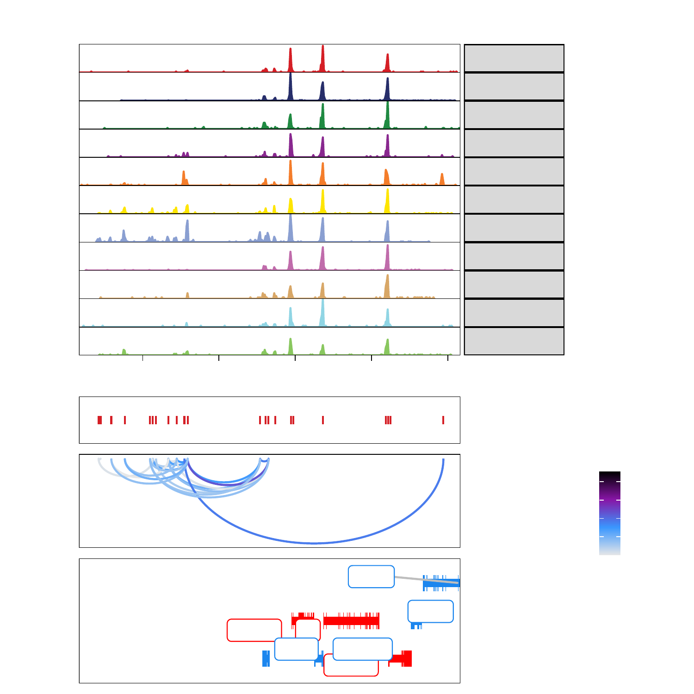
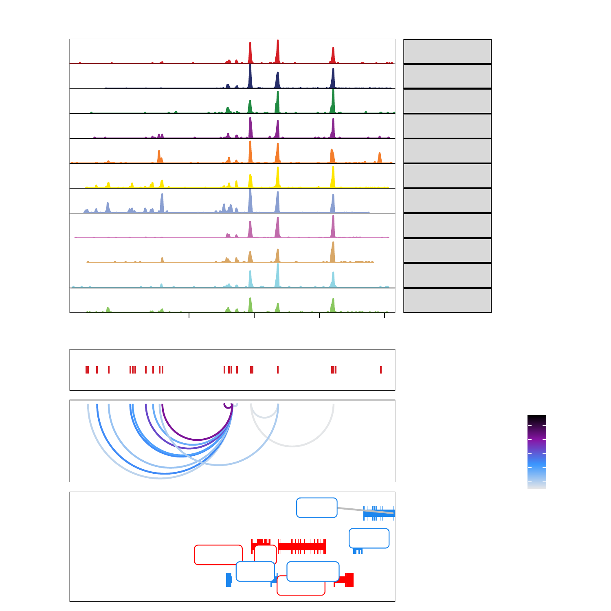
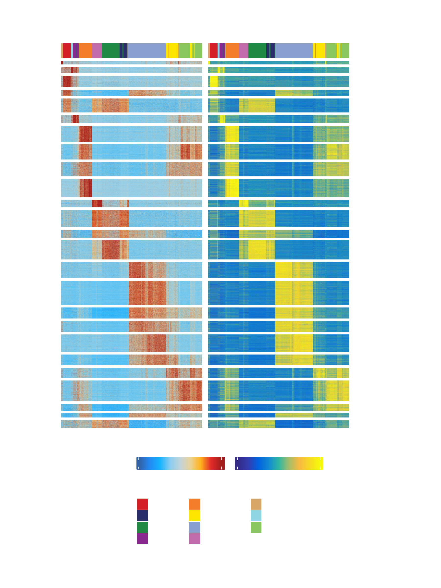
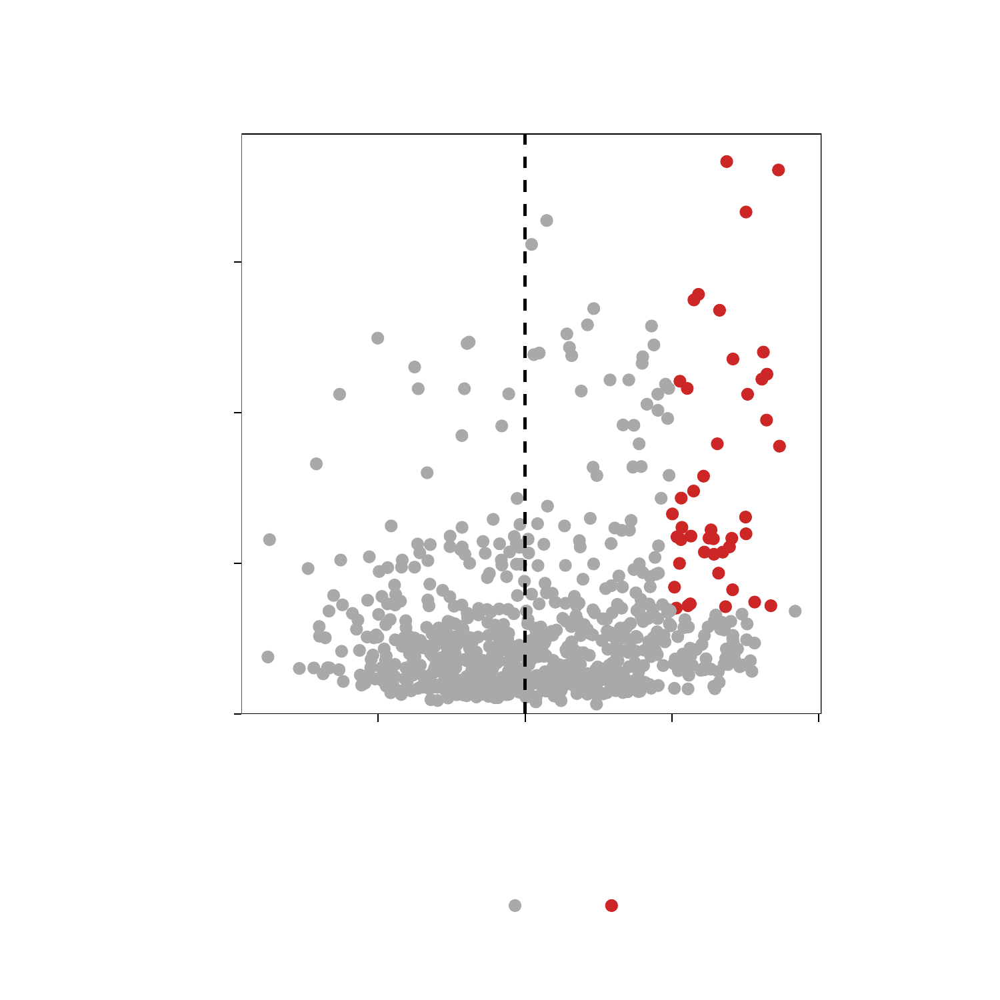
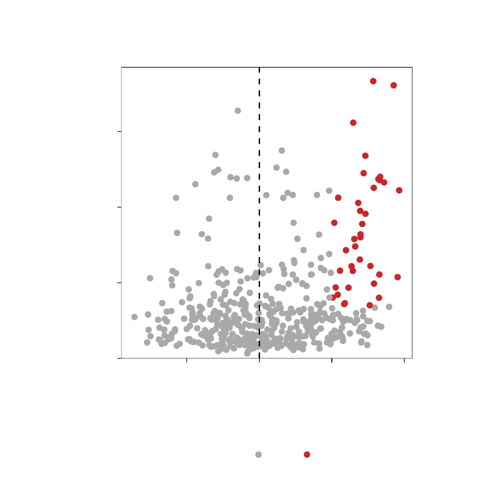

---
output:
  html_document:
    theme: yeti  # many options for theme, this one is my favorite.
params:
  threads: 20
  rdata: ""
  token: ""
  ref: ""
  out: ""
---

```{r, include=FALSE, eval=FALSE}
params2 <- params
unlockBinding("params", env = .GlobalEnv)
#load("Chapter-13-Footprints.Rdata")
load(params$rdata)
params <- params2
rm(params2)
devtools::install_github("GreenleafLab/ArchR", 
  auth_token = params$token, 
  ref = params$ref,
  repos = BiocManager::repositories(),
  dependencies = FALSE
)
library(ArchR)
fn <- unclass(lsf.str(envir = asNamespace("ArchR"), all = TRUE))
fn <- fn[!grepl("\\.", fn)]
fn <- fn[fn!="ArchRProj"]
for (i in seq_along(fn)){
    tryCatch({
        eval(parse(text = paste0(fn[i], "<-ArchR::", fn[i])))
    }, error = function(x) {
    })
}
addArchRThreads(threads = params$threads)
addArchRGenome("hg19")
# fn <- unclass(lsf.str(envir = asNamespace("ArchR"), all = TRUE))
# fn <- fn[fn!="ArchRProj"]
# for (i in seq_along(fn)) {
#     tryCatch({
#         eval(parse(text = paste0(fn[i], "<-ArchR:::", fn[i])))
#     }, error = function(x) {
#     })
# }
set.seed(1)
```

# Integrative Analysis with ArchR

## Co-accessibility with ArchR


```{r eval=FALSE}
projHeme5 <- addCoAccessibility(
	ArchRProj = projHeme5,
	reducedDims = "IterativeLSI"
)
```
> \## ArchR logging to : ArchRLogs/ArchR-addCoAccessibility-11a706a1e44aa-Date-2020-04-15_Time-11-54-46.log  
## If there is an issue, please report to github with logFile!  
## 2020-04-15 11:54:46 : Computing KNN, 0.009 mins elapsed.  
## 2020-04-15 11:54:48 : Identifying Non-Overlapping KNN pairs, 0.032 mins elapsed.  
## 2020-04-15 11:54:51 : Identified 491 Groupings!, 0.084 mins elapsed.  
## 2020-04-15 11:54:54 : Computing Co-Accessibility chr1 (1 of 23), 0.134 mins elapsed.  
## 2020-04-15 11:55:00 : Computing Co-Accessibility chr2 (2 of 23), 0.245 mins elapsed.  
## 2020-04-15 11:55:05 : Computing Co-Accessibility chr3 (3 of 23), 0.325 mins elapsed.  
## 2020-04-15 11:55:09 : Computing Co-Accessibility chr4 (4 of 23), 0.386 mins elapsed.  
## 2020-04-15 11:55:12 : Computing Co-Accessibility chr5 (5 of 23), 0.438 mins elapsed.  
## 2020-04-15 11:55:15 : Computing Co-Accessibility chr6 (6 of 23), 0.493 mins elapsed.  
## 2020-04-15 11:55:20 : Computing Co-Accessibility chr7 (7 of 23), 0.564 mins elapsed.  
## 2020-04-15 11:55:24 : Computing Co-Accessibility chr8 (8 of 23), 0.634 mins elapsed.  
## 2020-04-15 11:55:27 : Computing Co-Accessibility chr9 (9 of 23), 0.685 mins elapsed.  
## 2020-04-15 11:55:30 : Computing Co-Accessibility chr10 (10 of 23), 0.737 mins elapsed.  
## 2020-04-15 11:55:34 : Computing Co-Accessibility chr11 (11 of 23), 0.805 mins elapsed.  
## 2020-04-15 11:55:38 : Computing Co-Accessibility chr12 (12 of 23), 0.874 mins elapsed.  
## 2020-04-15 11:55:42 : Computing Co-Accessibility chr13 (13 of 23), 0.937 mins elapsed.  
## 2020-04-15 11:55:44 : Computing Co-Accessibility chr14 (14 of 23), 0.979 mins elapsed.  
## 2020-04-15 11:55:47 : Computing Co-Accessibility chr15 (15 of 23), 1.028 mins elapsed.  
## 2020-04-15 11:55:51 : Computing Co-Accessibility chr16 (16 of 23), 1.085 mins elapsed.  
## 2020-04-15 11:55:55 : Computing Co-Accessibility chr17 (17 of 23), 1.146 mins elapsed.  
## 2020-04-15 11:55:58 : Computing Co-Accessibility chr18 (18 of 23), 1.206 mins elapsed.  
## 2020-04-15 11:56:01 : Computing Co-Accessibility chr19 (19 of 23), 1.251 mins elapsed.  
## 2020-04-15 11:56:05 : Computing Co-Accessibility chr20 (20 of 23), 1.327 mins elapsed.  
## 2020-04-15 11:56:09 : Computing Co-Accessibility chr21 (21 of 23), 1.384 mins elapsed.  
## 2020-04-15 11:56:11 : Computing Co-Accessibility chr22 (22 of 23), 1.424 mins elapsed.  
## 2020-04-15 11:56:14 : Computing Co-Accessibility chrX (23 of 23), 1.468 mins elapsed.  
## ArchR logging successful to : ArchRLogs/ArchR-addCoAccessibility-11a706a1e44aa-Date-2020-04-15_Time-11-54-46.log  

```{r eval=FALSE}
cA <- getCoAccessibility(
	ArchRProj = projHeme5,
	corCutOff = 0.5,
	resolution = 1,
	returnLoops = FALSE
)

cA
```
> \## DataFrame with 64824 rows and 4 columns  
##       queryHits subjectHits seqnames       correlation  
##       <integer>   <integer>    <Rle>         <numeric>  
## 1             5          10     chr1  0.63855416236086  
## 2            10           5     chr1  0.63855416236086  
## 3            21          22     chr1 0.551520040138677  
## 4            22          21     chr1 0.551520040138677  
## 5            25          37     chr1 0.535392737290744  
## ...         ...         ...      ...               ...  
## 64820    143907      143906     chrX 0.510896735395573  
## 64821    143932      143936     chrX 0.501021498357938  
## 64822    143936      143932     chrX 0.501021498357938  
## 64823    143977      143978     chrX 0.550319862774772  
## 64824    143978      143977     chrX 0.550319862774772  

```{r eval=FALSE}
metadata(cA)[[1]]
```
> \## GRanges object with 144009 ranges and 0 metadata columns:  
##             seqnames              ranges strand  
##                <Rle>           <IRanges>  <Rle>  
##        Mono     chr1       752499-752999      *  
##          NK     chr1       762651-763151      *  
##           B     chr1       801006-801506      *  
##           B     chr1       805039-805539      *  
##         CLP     chr1       845325-845825      *  
##         ...      ...                 ...    ...  
##   Erythroid     chrX 154664540-154665040      *    
##          NK     chrX 154807324-154807824      *  
##        PreB     chrX 154840785-154841285      *  
##        PreB     chrX 154842404-154842904      *  
##          NK     chrX 154862017-154862517      *  
##   -------  
##   seqinfo: 23 sequences from an unspecified genome; no seqlengths  

```{r eval=FALSE}
cA <- getCoAccessibility(
	ArchRProj = projHeme5,
	corCutOff = 0.5,
	resolution = 1,
	returnLoops = TRUE
)

cA[[1]]
```
> \## GRanges object with 32412 ranges and 1 metadata column:  
##           seqnames              ranges strand |             value  
##              <Rle>           <IRanges>  <Rle> |         <numeric>  
##       [1]     chr1       845575-856640      * |  0.63855416236086  
##       [2]     chr1       894704-895233      * | 0.551520040138677  
##       [3]     chr1       901499-940519      * | 0.535392737290744  
##       [4]     chr1      968584-1004206      * | 0.541750176412625  
##       [5]     chr1       974287-975116      * | 0.614286275264492  
##       ...      ...                 ...    ... .               ...  
##   [32408]     chrX 153306085-153342739      * |  0.54575277183448  
##   [32409]     chrX 153523581-153529374      * | 0.539921104229481  
##   [32410]     chrX 153582820-153583471      * | 0.510896735395573  
##   [32411]     chrX 153637615-153656023      * | 0.501021498357938  
##   [32412]     chrX 153980218-153990364      * | 0.550319862774772  
##   -------  
##   seqinfo: 23 sequences from an unspecified genome; no seqlengths  

```{r eval=FALSE}
cA <- getCoAccessibility(
	ArchRProj = projHeme5,
	corCutOff = 0.5,
	resolution = 1000,
	returnLoops = TRUE
)

cA[[1]]
```
> \## GRanges object with 30997 ranges and 1 metadata column:  
##           seqnames              ranges strand |             value  
##              <Rle>           <IRanges>  <Rle> |         <numeric>  
##       [1]     chr1       845500-856500      * |  0.63855416236086  
##       [2]     chr1       894500-895500      * | 0.551520040138677  
##       [3]     chr1       901500-940500      * | 0.535392737290744  
##       [4]     chr1      968500-1004500      * | 0.541750176412625  
##       [5]     chr1       974500-975500      * | 0.614286275264492  
##       ...      ...                 ...    ... .               ...  
##   [30993]     chrX 153306500-153342500      * |  0.54575277183448  
##   [30994]     chrX 153523500-153529500      * | 0.539921104229481  
##   [30995]     chrX 153582500-153583500      * | 0.510896735395573  
##   [30996]     chrX 153637500-153656500      * | 0.501021498357938  
##   [30997]     chrX 153980500-153990500      * | 0.550319862774772  
##   -------  
##   seqinfo: 23 sequences from an unspecified genome; no seqlengths  

```{r eval=FALSE}
cA <- getCoAccessibility(
	ArchRProj = projHeme5,
	corCutOff = 0.5,
	resolution = 10000,
	returnLoops = TRUE
)

cA[[1]]
```
> \## GRanges object with 21142 ranges and 1 metadata column:  
##           seqnames              ranges strand |             value  
##              <Rle>           <IRanges>  <Rle> |         <numeric>  
##       [1]     chr1       845000-855000      * |  0.63855416236086  
##       [2]     chr1              895000      * | 0.551520040138677  
##       [3]     chr1       905000-945000      * | 0.535392737290744  
##       [4]     chr1      965000-1005000      * | 0.541750176412625  
##       [5]     chr1              975000      * | 0.614286275264492  
##       ...      ...                 ...    ... .               ...  
##   [21138]     chrX 153305000-153345000      * |  0.54575277183448  
##   [21139]     chrX           153525000      * | 0.539921104229481  
##   [21140]     chrX           153585000      * | 0.510896735395573  
##   [21141]     chrX 153635000-153655000      * | 0.501021498357938  
##   [21142]     chrX 153985000-153995000      * | 0.550319862774772  
##   -------  
##   seqinfo: 23 sequences from an unspecified genome; no seqlengths  

Plotting browser tracks with CoAccessibility

```{r eval=FALSE}
markerGenes  <- c(
    "CD34", #Early Progenitor
    "GATA1", #Erythroid
    "PAX5", "MS4A1", #B-Cell Trajectory
    "CD14", #Monocytes
    "CD3D", "CD8A", "TBX21", "IL7R" #TCells
  )

p <- ArchRBrowserTrack(
    ArchRProj = projHeme5, 
    groupBy = "Clusters2", 
    geneSymbol = markerGenes, 
    upstream = 50000,
    downstream = 50000,
    loops = getCoAccessibility(projHeme5)
)
```
> \## ArchR logging to : ArchRLogs/ArchR-ArchRBrowserTrack-11a703dda2936-Date-2020-04-15_Time-11-56-18.log  
## If there is an issue, please report to github with logFile!  
## 2020-04-15 11:56:18 : Validating Region, 0.007 mins elapsed.  
## GRanges object with 9 ranges and 2 metadata columns:  
##       seqnames              ranges strand |     gene_id      symbol  
##          <Rle>           <IRanges>  <Rle> | <character> <character>  
##   [1]     chr1 208059883-208084683      - |         947        CD34  
##   [2]     chrX   48644982-48652717      + |        2623       GATA1  
##   [3]     chr9   36838531-37034476      - |        5079        PAX5  
##   [4]    chr11   60223282-60238225      + |         931       MS4A1  
##   [5]     chr5 140011313-140013286      - |         929        CD14  
##   [6]    chr11 118209789-118213459      - |         915        CD3D  
##   [7]     chr2   87011728-87035519      - |         925        CD8A  
##   [8]    chr17   45810610-45823485      + |       30009       TBX21  
##   [9]     chr5   35856977-35879705      + |        3575        IL7R  
##   -------  
##   seqinfo: 24 sequences from hg19 genome 
## 2020-04-15 11:56:18 : Adding Bulk Tracks (1 of 9), 0.01 mins elapsed.  
## 2020-04-15 11:56:21 : Adding Feature Tracks (1 of 9), 0.053 mins elapsed.  
## 2020-04-15 11:56:21 : Adding Loop Tracks (1 of 9), 0.056 mins elapsed.  
## 2020-04-15 11:56:21 : Adding Gene Tracks (1 of 9), 0.059 mins elapsed.  
## 2020-04-15 11:56:21 : Plotting, 0.065 mins elapsed.  
## 2020-04-15 11:56:24 : Adding Bulk Tracks (2 of 9), 0.1 mins elapsed.  
## 2020-04-15 11:56:26 : Adding Feature Tracks (2 of 9), 0.137 mins elapsed.  
## 2020-04-15 11:56:26 : Adding Loop Tracks (2 of 9), 0.139 mins elapsed.  
## 2020-04-15 11:56:26 : Adding Gene Tracks (2 of 9), 0.144 mins elapsed.  
## 2020-04-15 11:56:27 : Plotting, 0.151 mins elapsed.  
## 2020-04-15 11:56:28 : Adding Bulk Tracks (3 of 9), 0.181 mins elapsed.  
## 2020-04-15 11:56:30 : Adding Feature Tracks (3 of 9), 0.202 mins elapsed.  
## 2020-04-15 11:56:30 : Adding Loop Tracks (3 of 9), 0.205 mins elapsed.  
## 2020-04-15 11:56:31 : Adding Gene Tracks (3 of 9), 0.217 mins elapsed.  
## 2020-04-15 11:56:31 : Plotting, 0.223 mins elapsed.  
## 2020-04-15 11:56:33 : Adding Bulk Tracks (4 of 9), 0.257 mins elapsed.  
## 2020-04-15 11:56:34 : Adding Feature Tracks (4 of 9), 0.272 mins elapsed.  
## 2020-04-15 11:56:34 : Adding Loop Tracks (4 of 9), 0.275 mins elapsed.  
## 2020-04-15 11:56:34 : Adding Gene Tracks (4 of 9), 0.281 mins elapsed.  
## 2020-04-15 11:56:35 : Plotting, 0.287 mins elapsed.  
## 2020-04-15 11:56:36 : Adding Bulk Tracks (5 of 9), 0.31 mins elapsed.  
## 2020-04-15 11:56:37 : Adding Feature Tracks (5 of 9), 0.327 mins elapsed.  
## 2020-04-15 11:56:37 : Adding Loop Tracks (5 of 9), 0.329 mins elapsed.  
## 2020-04-15 11:56:38 : Adding Gene Tracks (5 of 9), 0.335 mins elapsed.  
## 2020-04-15 11:56:38 : Plotting, 0.339 mins elapsed.  
## 2020-04-15 11:56:40 : Adding Bulk Tracks (6 of 9), 0.367 mins elapsed.  
## 2020-04-15 11:56:41 : Adding Feature Tracks (6 of 9), 0.384 mins elapsed.  
## 2020-04-15 11:56:41 : Adding Loop Tracks (6 of 9), 0.385 mins elapsed.  
## 2020-04-15 11:56:41 : Adding Gene Tracks (6 of 9), 0.391 mins elapsed.  
## 2020-04-15 11:56:41 : Plotting, 0.395 mins elapsed.  
## 2020-04-15 11:56:43 : Adding Bulk Tracks (7 of 9), 0.422 mins elapsed.   
## 2020-04-15 11:56:44 : Adding Feature Tracks (7 of 9), 0.443 mins elapsed.  
## 2020-04-15 11:56:44 : Adding Loop Tracks (7 of 9), 0.447 mins elapsed.  
## 2020-04-15 11:56:45 : Adding Gene Tracks (7 of 9), 0.455 mins elapsed.  
## 2020-04-15 11:56:45 : Plotting, 0.459 mins elapsed.  
## 2020-04-15 11:56:47 : Adding Bulk Tracks (8 of 9), 0.489 mins elapsed.  
## 2020-04-15 11:56:48 : Adding Feature Tracks (8 of 9), 0.506 mins elapsed.  
## 2020-04-15 11:56:48 : Adding Loop Tracks (8 of 9), 0.51 mins elapsed.  
## 2020-04-15 11:56:49 : Adding Gene Tracks (8 of 9), 0.522 mins elapsed.  
## 2020-04-15 11:56:49 : Plotting, 0.526 mins elapsed.  
## 2020-04-15 11:56:51 : Adding Bulk Tracks (9 of 9), 0.562 mins elapsed.  
## 2020-04-15 11:56:52 : Adding Feature Tracks (9 of 9), 0.578 mins elapsed.  
## 2020-04-15 11:56:52 : Adding Loop Tracks (9 of 9), 0.58 mins elapsed.  
## 2020-04-15 11:56:53 : Adding Gene Tracks (9 of 9), 0.589 mins elapsed.  
## 2020-04-15 11:56:53 : Plotting, 0.594 mins elapsed.  
## ArchR logging successful to : ArchRLogs/ArchR-ArchRBrowserTrack-11a703dda2936-Date-2020-04-15_Time-11-56-18.log  

To plot a track we can simply print one from the list

```{r eval=FALSE}
grid::grid.newpage()
grid::grid.draw(p$CD14)
```

```{r, include=FALSE, eval=FALSE}
plotPDF(plotList = p, 
    name = "Plot-Tracks-Marker-Genes-with-CoAccessibility.pdf", 
    ArchRProj = projHeme5, 
    addDOC = FALSE, width = 5, height = 5)
ArchR:::.convertToPNG(ArchRProj = projHeme5)
system("cp Figures/*.png images/HemeWalkthrough/PNG/")
system("cp Figures/*.pdf images/HemeWalkthrough/PDF/")
```

{width=500 height=500}

```{r eval=FALSE}
plotPDF(plotList = p, 
    name = "Plot-Tracks-Marker-Genes-with-CoAccessibility.pdf", 
    ArchRProj = projHeme5, 
    addDOC = FALSE, width = 5, height = 5)
```
> \## NULL  
## NULL   
## NULL  
## NULL  
## NULL  
## NULL  
## NULL  
## NULL  
## NULL  
## [1] 0  

[Download PDF : Plot-Tracks-Marker-Genes.pdf](images/HemeWalkthrough/PDF/Plot-Tracks-Marker-Genes-with-CoAccessibility.pdf)


## Peak2GeneLinkage with ArchR


```{r eval=FALSE}
projHeme5 <- addPeak2GeneLinks(
	ArchRProj = projHeme5,
	reducedDims = "IterativeLSI"
)
```
> \## ArchR logging to : ArchRLogs/ArchR-addPeak2GeneLinks-11a7017ae41d-Date-2020-04-15_Time-11-57-10.log  
## If there is an issue, please report to github with logFile!  
## 2020-04-15 11:57:11 : Getting Available Matrices, 0.006 mins elapsed.  
## 2020-04-15 11:57:11 : Filtered Low Prediction Score Cells (1049 of 10251, 0.102), 0.004 mins elapsed.  
## 2020-04-15 11:57:12 : Computing KNN, 0.009 mins elapsed.  
## 2020-04-15 11:57:12 : Identifying Non-Overlapping KNN pairs, 0.016 mins elapsed.  
## 2020-04-15 11:57:15 : Identified 491 Groupings!, 0.07 mins elapsed.  
## 2020-04-15 11:57:15 : Getting Group RNA Matrix, 0.071 mins elapsed.  
## 2020-04-15 11:57:43 : Getting Group ATAC Matrix, 0.536 mins elapsed.  
## 2020-04-15 11:58:18 : Normalizing Group Matrices, 1.112 mins elapsed.  
## 2020-04-15 11:58:24 : Finding Peak Gene Pairings, 1.218 mins elapsed.  
## 2020-04-15 11:58:25 : Computing Correlations, 1.227 mins elapsed.  
## 2020-04-15 11:58:34 : Completed Peak2Gene Correlations!, 1.382 mins elapsed.  
## ArchR logging successful to : ArchRLogs/ArchR-addPeak2GeneLinks-11a7017ae41d-Date-2020-04-15_Time-11-57-10.log  

```{r eval=FALSE}
p2g <- getPeak2GeneLinks(
	ArchRProj = projHeme5,
	corCutOff = 0.45,
	resolution = 1,
	returnLoops = FALSE
)

p2g
```
> \## DataFrame with 43754 rows and 6 columns  
##         idxATAC    idxRNA       Correlation                   FDR  
##       <integer> <integer>         <numeric>             <numeric>  
## 1            47         5 0.549552663393716  1.34094093110629e-38  
## 2             3         6 0.487418258348982   2.1460798658766e-29  
## 3             3         7 0.821369314290254 1.70141157082175e-118  
## 4            47         7 0.569899085935183  4.61958766180263e-42  
## 5            59         7 0.549954043409585  1.15152278593831e-38  
## ...         ...       ...               ...                   ...  
## 43750    143964     18590 0.520703047216992  4.37554114264876e-34  
## 43751    143977     18590 0.546301068655939  4.54936701954597e-38  
## 43752    144004     18594  0.47934214168793  2.47516776950818e-28  
## 43753    143999     18598  0.49092225993235  7.28579053551407e-30  
## 43754    144005     18598 0.493389088498317  3.37643947034054e-30  
##                 VarQATAC           VarQRNA  
##                <numeric>         <numeric>  
## 1      0.948753202924817 0.793290683296597  
## 2      0.253206396822421 0.445890005913661  
## 3      0.253206396822421  0.42728885543788  
## 4      0.948753202924817  0.42728885543788  
## 5      0.916137185870328  0.42728885543788  
## ...                  ...               ...  
## 43750  0.629044018082203 0.960701037578625  
## 43751  0.701518655084057 0.960701037578625  
## 43752  0.814587977140318 0.802537497983979  
## 43753 0.0392197709865356 0.901295629267244  
## 43754  0.158948399058392 0.901295629267244  

```{r eval=FALSE}
metadata(p2g)[[1]]
```
> \## GRanges object with 144009 ranges and 0 metadata columns: 
##            seqnames              ranges strand  
##               <Rle>           <IRanges>  <Rle>  
##        [1]     chr1       752499-752999      *  
##        [2]     chr1       762651-763151      *  
##        [3]     chr1       801006-801506      *  
##        [4]     chr1       805039-805539      *  
##        [5]     chr1       845325-845825      *  
##        ...      ...                 ...    ...  
##   [144005]     chrX 154664540-154665040      *  
##   [144006]     chrX 154807324-154807824      *  
##   [144007]     chrX 154840785-154841285      *  
##   [144008]     chrX 154842404-154842904      *  
##   [144009]     chrX 154862017-154862517      *  
##   -------  
##   seqinfo: 23 sequences from an unspecified genome; no seqlengths  

```{r eval=FALSE}
p2g <- getPeak2GeneLinks(
	ArchRProj = projHeme5,
	corCutOff = 0.45,
	resolution = 1,
	returnLoops = TRUE
)

p2g[[1]]
```
> \## GRanges object with 43695 ranges and 2 metadata columns: 
##           seqnames              ranges strand |             value  
##              <Rle>           <IRanges>  <Rle> |         <numeric>  
##       [1]     chr1       762901-948847      * | 0.533350285896763  
##       [2]     chr1       801256-895967      * | 0.487418258348982  
##       [3]     chr1       801256-901877      * | 0.821369314290254  
##       [4]     chr1       852367-955503      * | 0.487693663181145  
##       [5]     chr1       894679-968584      * | 0.549552663393716  
##       ...      ...                 ...    ... .               ...  
##   [43691]     chrX 153962451-153979858      * | 0.453720046871409  
##   [43692]     chrX 153980218-153991031      * | 0.546301068655939  
##   [43693]     chrX 154255064-154493795      * |  0.47934214168793  
##   [43694]     chrX 154356425-154444701      * |  0.49092225993235  
##   [43695]     chrX 154444701-154664790      * | 0.493389088498317  
##                             FDR  
##                       <numeric>  
##       [1]  5.20045729958651e-36  
##       [2]   2.1460798658766e-29  
##       [3] 1.70141157082175e-118  
##       [4]  1.97244775926907e-29  
##       [5]  1.34094093110629e-38  
##       ...                   ...  
##   [43691]  3.78754241443136e-25  
##   [43692]  4.54936701954597e-38  
##   [43693]  2.47516776950818e-28  
##   [43694]  7.28579053551407e-30  
##   [43695]  3.37643947034054e-30  
##   -------  
##   seqinfo: 23 sequences from an unspecified genome; no seqlengths  

```{r eval=FALSE}
p2g <- getPeak2GeneLinks(
	ArchRProj = projHeme5,
	corCutOff = 0.45,
	resolution = 1000,
	returnLoops = TRUE
)

p2g[[1]]
```
> \## GRanges object with 42126 ranges and 2 metadata columns:  
##           seqnames              ranges strand |             value  
##              <Rle>           <IRanges>  <Rle> |         <numeric>  
##       [1]     chr1       762500-948500      * | 0.533350285896763  
##       [2]     chr1       801500-895500      * | 0.487418258348982  
##       [3]     chr1       801500-901500      * | 0.821369314290254  
##       [4]     chr1       852500-955500      * | 0.487693663181145  
##       [5]     chr1       894500-968500      * | 0.549552663393716  
##       ...      ...                 ...    ... .               ...  
##   [42122]     chrX 153962500-153979500      * | 0.453720046871409  
##   [42123]     chrX 153980500-153991500      * | 0.546301068655939  
##   [42124]     chrX 154255500-154493500      * |  0.47934214168793  
##   [42125]     chrX 154356500-154444500      * |  0.49092225993235  
##   [42126]     chrX 154444500-154664500      * | 0.493389088498317  
##                             FDR  
##                       <numeric>  
##       [1]  5.20045729958651e-36  
##       [2]   2.1460798658766e-29  
##       [3] 1.70141157082175e-118  
##       [4]  1.97244775926907e-29  
##       [5]  1.34094093110629e-38  
##       ...                   ...  
##   [42122]  3.78754241443136e-25  
##   [42123]  4.54936701954597e-38  
##   [42124]  2.47516776950818e-28  
##   [42125]  7.28579053551407e-30  
##   [42126]  3.37643947034054e-30  
##   -------  
##   seqinfo: 23 sequences from an unspecified genome; no seqlengths  

```{r eval=FALSE}
p2g <- getPeak2GeneLinks(
	ArchRProj = projHeme5,
	corCutOff = 0.45,
	resolution = 10000,
	returnLoops = TRUE
)

p2g[[1]]
```
> \## GRanges object with 33645 ranges and 2 metadata columns:  
##           seqnames              ranges strand |             value  
##              <Rle>           <IRanges>  <Rle> |         <numeric>  
##       [1]     chr1       765000-945000      * | 0.533350285896763  
##       [2]     chr1       805000-895000      * | 0.487418258348982  
##       [3]     chr1       805000-905000      * | 0.821369314290254  
##       [4]     chr1       855000-955000      * | 0.487693663181145  
##       [5]     chr1       895000-965000      * | 0.549552663393716  
##       ...      ...                 ...    ... .               ...  
##   [33641]     chrX 153965000-153975000      * | 0.453720046871409  
##   [33642]     chrX 153985000-153995000      * | 0.546301068655939  
##   [33643]     chrX 154255000-154495000      * |  0.47934214168793  
##   [33644]     chrX 154355000-154445000      * |  0.49092225993235  
##   [33645]     chrX 154445000-154665000      * | 0.493389088498317  
##                             FDR  
##                       <numeric>  
##       [1]  5.20045729958651e-36  
##       [2]   2.1460798658766e-29  
##       [3] 1.70141157082175e-118  
##       [4]  1.97244775926907e-29  
##       [5]  1.34094093110629e-38  
##       ...                   ...  
##   [33641]  3.78754241443136e-25  
##   [33642]  4.54936701954597e-38  
##   [33643]  2.47516776950818e-28  
##   [33644]  7.28579053551407e-30  
##   [33645]  3.37643947034054e-30  
##   -------  
##   seqinfo: 23 sequences from an unspecified genome; no seqlengths  

Plotting browser tracks with Peak2Gene Links

```{r eval=FALSE}
markerGenes  <- c(
    "CD34", #Early Progenitor
    "GATA1", #Erythroid
    "PAX5", "MS4A1", #B-Cell Trajectory
    "CD14", #Monocytes
    "CD3D", "CD8A", "TBX21", "IL7R" #TCells
  )

p <- ArchRBrowserTrack(
    ArchRProj = projHeme5, 
    groupBy = "Clusters2", 
    geneSymbol = markerGenes, 
    upstream = 50000,
    downstream = 50000,
    loops = getPeak2GeneLinks(projHeme5)
)
```
> \## ArchR logging to : ArchRLogs/ArchR-ArchRBrowserTrack-11a7048fa912a-Date-2020-04-15_Time-11-58-35.log  
## If there is an issue, please report to github with logFile!  
## 2020-04-15 11:58:36 : Validating Region, 0.012 mins elapsed.  
## GRanges object with 9 ranges and 2 metadata columns:  
##       seqnames              ranges strand |     gene_id      symbol  
##          <Rle>           <IRanges>  <Rle> | <character> <character>  
##   [1]     chr1 208059883-208084683      - |         947        CD34  
##   [2]     chrX   48644982-48652717      + |        2623       GATA1  
##   [3]     chr9   36838531-37034476      - |        5079        PAX5  
##   [4]    chr11   60223282-60238225      + |         931       MS4A1  
##   [5]     chr5 140011313-140013286      - |         929        CD14  
##   [6]    chr11 118209789-118213459      - |         915        CD3D  
##   [7]     chr2   87011728-87035519      - |         925        CD8A  
##   [8]    chr17   45810610-45823485      + |       30009       TBX21  
##   [9]     chr5   35856977-35879705      + |        3575        IL7R  
##   -------  
##   seqinfo: 24 sequences from hg19 genome  
## 2020-04-15 11:58:36 : Adding Bulk Tracks (1 of 9), 0.015 mins elapsed.  
## 2020-04-15 11:58:37 : Adding Feature Tracks (1 of 9), 0.038 mins elapsed.  
## 2020-04-15 11:58:37 : Adding Loop Tracks (1 of 9), 0.039 mins elapsed.  
## 2020-04-15 11:58:37 : Adding Gene Tracks (1 of 9), 0.041 mins elapsed.  
## 2020-04-15 11:58:38 : Plotting, 0.045 mins elapsed.  
## 2020-04-15 11:58:39 : Adding Bulk Tracks (2 of 9), 0.076 mins elapsed.  
## 2020-04-15 11:58:40 : Adding Feature Tracks (2 of 9), 0.091 mins elapsed.  
## 2020-04-15 11:58:41 : Adding Loop Tracks (2 of 9), 0.095 mins elapsed.  
## 2020-04-15 11:58:41 : Adding Gene Tracks (2 of 9), 0.098 mins elapsed.  
## 2020-04-15 11:58:41 : Plotting, 0.104 mins elapsed.  
## 2020-04-15 11:58:43 : Adding Bulk Tracks (3 of 9), 0.134 mins elapsed.  
## 2020-04-15 11:58:44 : Adding Feature Tracks (3 of 9), 0.151 mins elapsed.  
## 2020-04-15 11:58:44 : Adding Loop Tracks (3 of 9), 0.153 mins elapsed.  
## 2020-04-15 11:58:44 : Adding Gene Tracks (3 of 9), 0.157 mins elapsed.  
## 2020-04-15 11:58:45 : Plotting, 0.162 mins elapsed.  
## 2020-04-15 11:58:47 : Adding Bulk Tracks (4 of 9), 0.196 mins elapsed.  
## 2020-04-15 11:58:48 : Adding Feature Tracks (4 of 9), 0.212 mins elapsed.  
## 2020-04-15 11:58:48 : Adding Loop Tracks (4 of 9), 0.213 mins elapsed.  
## 2020-04-15 11:58:48 : Adding Gene Tracks (4 of 9), 0.216 mins elapsed.  
## 2020-04-15 11:58:48 : Plotting, 0.22 mins elapsed.  
## 2020-04-15 11:58:49 : Adding Bulk Tracks (5 of 9), 0.242 mins elapsed.  
## 2020-04-15 11:58:50 : Adding Feature Tracks (5 of 9), 0.258 mins elapsed.  
## 2020-04-15 11:58:51 : Adding Loop Tracks (5 of 9), 0.26 mins elapsed.  
## 2020-04-15 11:58:51 : Adding Gene Tracks (5 of 9), 0.268 mins elapsed.  
## 2020-04-15 11:58:51 : Plotting, 0.273 mins elapsed.  
## 2020-04-15 11:58:53 : Adding Bulk Tracks (6 of 9), 0.307 mins elapsed.  
## 2020-04-15 11:58:54 : Adding Feature Tracks (6 of 9), 0.323 mins elapsed.  
## 2020-04-15 11:58:54 : Adding Loop Tracks (6 of 9), 0.325 mins elapsed.  
## 2020-04-15 11:58:55 : Adding Gene Tracks (6 of 9), 0.333 mins elapsed.  
## 2020-04-15 11:58:55 : Plotting, 0.338 mins elapsed.  
## 2020-04-15 11:58:57 : Adding Bulk Tracks (7 of 9), 0.369 mins elapsed.  
## 2020-04-15 11:58:58 : Adding Feature Tracks (7 of 9), 0.389 mins elapsed.  
## 2020-04-15 11:58:58 : Adding Loop Tracks (7 of 9), 0.391 mins elapsed.  
## 2020-04-15 11:58:59 : Adding Gene Tracks (7 of 9), 0.397 mins elapsed.  
## 2020-04-15 11:58:59 : Plotting, 0.403 mins elapsed.  
## 2020-04-15 11:59:01 : Adding Bulk Tracks (8 of 9), 0.443 mins elapsed.  
## 2020-04-15 11:59:03 : Adding Feature Tracks (8 of 9), 0.462 mins elapsed.  
## 2020-04-15 11:59:03 : Adding Loop Tracks (8 of 9), 0.464 mins elapsed.  
## 2020-04-15 11:59:03 : Adding Gene Tracks (8 of 9), 0.468 mins elapsed.  
## 2020-04-15 11:59:03 : Plotting, 0.473 mins elapsed.  
## 2020-04-15 11:59:06 : Adding Bulk Tracks (9 of 9), 0.515 mins elapsed.  
## 2020-04-15 11:59:07 : Adding Feature Tracks (9 of 9), 0.533 mins elapsed.  
## 2020-04-15 11:59:07 : Adding Loop Tracks (9 of 9), 0.536 mins elapsed.  
## 2020-04-15 11:59:07 : Adding Gene Tracks (9 of 9), 0.543 mins elapsed.  
## 2020-04-15 11:59:08 : Plotting, 0.549 mins elapsed.  
## ArchR logging successful to : ArchRLogs/ArchR-ArchRBrowserTrack-11a7048fa912a-Date-2020-04-15_Time-11-58-35.log  

To plot a track we can simply print one from the list

```{r eval=FALSE}
grid::grid.newpage()
grid::grid.draw(p$CD14)
```

```{r, include=FALSE, eval=FALSE}
plotPDF(plotList = p, 
    name = "Plot-Tracks-Marker-Genes-with-Peak2GeneLinks.pdf", 
    ArchRProj = projHeme5, 
    addDOC = FALSE, width = 5, height = 5)
ArchR:::.convertToPNG(ArchRProj = projHeme5)
system("cp Figures/*.png images/HemeWalkthrough/PNG/")
system("cp Figures/*.pdf images/HemeWalkthrough/PDF/")
```

{width=500 height=500}

```{r eval=FALSE}
plotPDF(plotList = p, 
    name = "Plot-Tracks-Marker-Genes-with-Peak2GeneLinks.pdf", 
    ArchRProj = projHeme5, 
    addDOC = FALSE, width = 5, height = 5)
```
> \## NULL  
## NULL  
## NULL  
## NULL  
## NULL  
## NULL  
## NULL  
## NULL  
## NULL  
## [1] 0   

[Download PDF : Plot-Tracks-Marker-Genes.pdf](images/HemeWalkthrough/PDF/Plot-Tracks-Marker-Genes-with-Peak2GeneLinks.pdf)

Lastly we can make a peak2gene heatmap

```{r eval=FALSE}
p <- peak2GeneHeatmap(ArchRProj = projHeme5, groupBy = "Clusters2")
```
> \## ArchR logging to : ArchRLogs/ArchR-peak2GeneHeatmap-11a707e40d64f-Date-2020-04-15_Time-11-59-30.log  
## If there is an issue, please report to github with logFile!  
## 2020-04-15 11:59:34 : Determining KNN Groups!, 0.071 mins elapsed.  
## 2020-04-15 11:59:39 : Ordering Peak2Gene Links!, 0.15 mins elapsed.  
## 2020-04-15 11:59:48 : Constructing ATAC Heatmap!, 0.309 mins elapsed.  
## Adding Annotations..  
## Preparing Main Heatmap..  
## 2020-04-15 11:59:49 : Constructing RNA Heatmap!, 0.32 mins elapsed.  
## Adding Annotations..  
## Preparing Main Heatmap..  
## ArchR logging successful to : ArchRLogs/ArchR-peak2GeneHeatmap-11a707e40d64f-Date-2020-04-15_Time-11-59-30.log  

```{r eval=FALSE}
p
```

```{r, include=FALSE, eval=FALSE}
plotPDF(p, name = "Peak2GeneHeatmap", width = 6, height = 8, ArchRProj = projHeme5, addDOC = FALSE)
ArchR:::.convertToPNG(ArchRProj = projHeme5)
system("cp Figures/*.png images/HemeWalkthrough/PNG/")
system("cp Figures/*.pdf images/HemeWalkthrough/PDF/")
```

{width=600 height=800}


## Identification of Positive TF-Regulators

Step 1. Identify Deviant TF Motifs

```{r eval=FALSE}
seGroupMotif <- exportGroupSE(ArchRProj = projHeme5, useMatrix = "MotifMatrix", groupBy = "Clusters2")
```
> \## 2020-04-15 12:03:08 : Successfully Created Group Matrix, 0.133 mins elapsed.

```{r eval=FALSE}
seGroupMotif
```
> \## class: SummarizedExperiment   
## dim: 1740 11   
## metadata(0):  
## assays(1): MotifMatrix   
## rownames(1740): f1 f2 ... f1739 f1740   
## rowData names(3): seqnames idx name  
## colnames(11): B CD4.M ... PreB Progenitor  
## colData names(16): TSSEnrichment ReadsInTSS ... FRIP nCells  

```{r eval=FALSE}
#Get Deviation Z-Scores
seZ <- seGroupMotif[rowData(seGroupMotif)$seqnames=="z",]

#Max Delta
rowData(seZ)$maxDelta <- lapply(seq_len(ncol(seZ)), function(x){
  rowMaxs(assay(seZ) - assay(seZ)[,x])
}) %>% Reduce("cbind", .) %>% rowMaxs

```

Step 2. Identify Correlated TF Motifs and TF Gene Score/Expression

```{r eval=FALSE}
corGSM_MM <- correlateMatrices(
	ArchRProj = projHeme5,
	useMatrix1 = "GeneScoreMatrix",
	useMatrix2 = "MotifMatrix",
	reducedDims = "IterativeLSI"
)
```
> \## ArchR logging to : ArchRLogs/ArchR-correlateMatrices-11a7038ad0163-Date-2020-04-15_Time-12-03-11.log  
## If there is an issue, please report to github with logFile!  
## When accessing features from a matrix of class Sparse.Assays.Matrix it requires 1 seqname!  
## Continuing with first seqname 'z'!  
## If confused, try getFeatures(ArchRProj, 'MotifMatrix') to list out available seqnames for input!  
## 2020-04-15 12:03:16 : Testing 825 Mappings!, 0.091 mins elapsed.  
## 2020-04-15 12:03:16 : Computing KNN, 0.091 mins elapsed.  
## 2020-04-15 12:03:16 : Identifying Non-Overlapping KNN pairs, 0.095 mins elapsed.  
## 2020-04-15 12:03:19 : Identified 491 Groupings!, 0.138 mins elapsed.  
## 2020-04-15 12:03:21 : Getting Group Matrix 1, 0.17 mins elapsed.  
## 2020-04-15 12:03:33 : Getting Group Matrix 2, 0.365 mins elapsed.  
## Some entries in groupMat2 are less than 0, continuing without Log2 Normalization.  
## Most likely this assay is a deviations matrix.  
## Getting Correlations...  
## 2020-04-15 12:03:40 :  
## Computing Correlation (250 of 825)  
## Computing Correlation (500 of 825)  
## Computing Correlation (750 of 825)  
## ArchR logging successful to : ArchRLogs/ArchR-correlateMatrices-11a7038ad0163-Date-2020-04-15_Time-12-03-11.log  

```{r eval=FALSE}
corGSM_MM
```
> \## DataFrame with 825 rows and 14 columns  
##     GeneScoreMatrix_name MotifMatrix_name                 cor  
##                  <array>          <array>           <numeric>  
## 1                   HES4          HES4_95   0.154455056755803  
## 2                   HES5          HES5_98   0.337473683281965  
## 3                 PRDM16       PRDM16_211   0.491297659378326  
## 4                   TP73         TP73_705   0.528916107713827  
## 5               TP73-AS1         TP73_705 -0.0522225826610403  
## ...                  ...              ...                 ...  
## 821                TFDP3        TFDP3_309 -0.0747374184980152  
## 822               ZNF75D       ZNF75D_272 -0.0515391773083338  
## 823                 ZIC3         ZIC3_215     0.3158469818621  
## 824                 SOX3         SOX3_759  -0.016068246967503  
## 825                MECP2        MECP2_645  0.0629645419544807  
##                     padj                 pval GeneScoreMatrix_seqnames  
##                <numeric>            <numeric>                    <Rle>  
## 1       0.48577773775473 0.000593860315103582                     chr1  
## 2   1.24697036872354e-11 1.52441365369626e-14                     chr1  
## 3   2.77075935285262e-28 3.38723637268047e-31                     chr1  
## 4   7.91605921989722e-34  9.6773340096543e-37                     chr1  
## 5                      1    0.248084710011419                     chr1  
## ...                  ...                  ...                      ...  
## 821                    1   0.0980942700648066                     chrX  
## 822                    1    0.254336826019648                     chrX  
## 823 6.35887872390377e-10 7.77369037152051e-13                     chrX  
## 824                    1    0.722466734136741                     chrX  
## 825                    1    0.163611488297825                     chrX  
##     GeneScoreMatrix_start GeneScoreMatrix_end GeneScoreMatrix_strand  
##                   <array>             <array>                <array>  
## 1                  935552              934342                      2  
## 2                 2461684             2460184                      2  
## 3                 2985742             3355185                      1  
## 4                 3569129             3652765                      1  
## 5                 3663937             3652548                      2  
## ...                   ...                 ...                    ...  
## 821             132352376           132350697                      2  
## 822             134429965           134419723                      2  
## 823             136648346           136654259                      1  
## 824             139587225           139585152                      2  
## 825             153363188           153287264                      2  
##     GeneScoreMatrix_idx GeneScoreMatrix_matchName MotifMatrix_seqnames  
##                 <array>                   <array>                <Rle>  
## 1                    15                      HES4                    z  
## 2                    74                      HES5                    z  
## 3                    82                    PRDM16                    z  
## 4                    89                      TP73                    z  
## 5                    90                      TP73                    z  
## ...                 ...                       ...                  ...  
## 821                 697                     TFDP3                    z  
## 822                 728                    ZNF75D                    z  
## 823                 753                      ZIC3                    z  
## 824                 765                      SOX3                    z  
## 825                 874                     MECP2                    z  
##     MotifMatrix_idx MotifMatrix_matchName  
##             <array>               <array>  
## 1                95                  HES4  
## 2                98                  HES5  
## 3               211                PRDM16  
## 4               705                  TP73  
## 5               705                  TP73  
## ...             ...                   ...  
## 821             309                 TFDP3  
## 822             272                ZNF75D  
## 823             215                  ZIC3  
## 824             759                  SOX3  
## 825             645                 MECP2  

```{r eval=FALSE}
corGIM_MM <- correlateMatrices(
	ArchRProj = projHeme5,
	useMatrix1 = "GeneIntegrationMatrix",
	useMatrix2 = "MotifMatrix",
	reducedDims = "IterativeLSI"
)
```
> \## ArchR logging to : ArchRLogs/ArchR-correlateMatrices-11a70642ae62f-Date-2020-04-15_Time-12-03-41.log  
## If there is an issue, please report to github with logFile!  
## When accessing features from a matrix of class Sparse.Assays.Matrix it requires 1 seqname!  
## Continuing with first seqname 'z'!  
## If confused, try getFeatures(ArchRProj, 'MotifMatrix') to list out available seqnames for input!  
## 2020-04-15 12:03:44 : Testing 798 Mappings!, 0.062 mins elapsed.  
## 2020-04-15 12:03:44 : Computing KNN, 0.062 mins elapsed.    
## 2020-04-15 12:03:45 : Identifying Non-Overlapping KNN pairs, 0.066 mins elapsed.  
## 2020-04-15 12:03:47 : Identified 491 Groupings!, 0.108 mins elapsed.  
## 2020-04-15 12:03:50 : Getting Group Matrix 1, 0.147 mins elapsed.  
## 2020-04-15 12:04:03 : Getting Group Matrix 2, 0.368 mins elapsed.  
## Some entries in groupMat2 are less than 0, continuing without Log2 Normalization.  
## Most likely this assay is a deviations matrix.  
## Getting Correlations...  
## 2020-04-15 12:04:10 :  
## Computing Correlation (250 of 798)  
## Computing Correlation (500 of 798)   
## Computing Correlation (750 of 798)  
## ArchR logging successful to : ArchRLogs/ArchR-correlateMatrices-11a70642ae62f-Date-2020-04-15_Time-12-03-41.log  

```{r eval=FALSE}
corGIM_MM
```
> \## DataFrame with 798 rows and 14 columns  
##     GeneIntegrationMatrix_name MotifMatrix_name                 cor  
##                        <array>          <array>           <numeric>  
## 1                         HES4          HES4_95 -0.0623909761741224  
## 2                         HES5          HES5_98  -0.130794628882194  
## 3                       PRDM16       PRDM16_211   0.526453624653558  
## 4                         TP73         TP73_705                  NA  
## 5                         HES2          HES2_19  -0.267296043452788  
## ...                        ...              ...                 ...  
## 794                      TFDP3        TFDP3_309                  NA  
## 795                     ZNF75D       ZNF75D_272  -0.253529703381296  
## 796                       ZIC3         ZIC3_215                  NA  
## 797                       SOX3         SOX3_759                  NA  
## 798                      MECP2        MECP2_645   0.150328680116803  
##                     padj                 pval GeneIntegrationMatrix_seqnames  
##                <numeric>            <numeric>                          <Rle>  
## 1                      1    0.167490297051793                           chr1  
## 2                      1  0.00369241031157534                           chr1  
## 3   1.23364764777334e-33 2.34533773340939e-36                           chr1  
## 4                     NA                   NA                           chr1  
## 5   9.31006760220939e-07 1.76997482931738e-09                           chr1  
## ...                  ...                  ...                            ...  
## 794                   NA                   NA                           chrX  
## 795 6.41888945797785e-06 1.22032118972963e-08                           chrX  
## 796                   NA                   NA                           chrX  
## 797                   NA                   NA                           chrX  
## 798    0.438175655348636 0.000833033565301589                           chrX  
##     GeneIntegrationMatrix_start GeneIntegrationMatrix_end  
##                         <array>                   <array>  
## 1                        935552                    934342  
## 2                       2461684                   2460184  
## 3                       2985742                   3355185  
## 4                       3569129                   3652765  
## 5                       6484730                   6472498  
## ...                         ...                       ...  
## 794                   132352376                 132350697  
## 795                   134429965                 134419723  
## 796                   136648346                 136654259  
## 797                   139587225                 139585152  
## 798                   153363188                 153287264  
##     GeneIntegrationMatrix_strand GeneIntegrationMatrix_idx  
##                          <array>                   <array>  
## 1                              2                         8  
## 2                              2                        53  
## 3                              1                        59  
## 4                              1                        64  
## 5                              2                        81  
## ...                          ...                       ...  
## 794                            2                       562  
## 795                            2                       576  
## 796                            1                       595  
## 797                            2                       602  
## 798                            2                       680  
##     GeneIntegrationMatrix_matchName MotifMatrix_seqnames MotifMatrix_idx  
##                             <array>                <Rle>         <array>  
## 1                              HES4                    z              95  
## 2                              HES5                    z              98  
## 3                            PRDM16                    z             211  
## 4                              TP73                    z             705  
## 5                              HES2                    z              19  
## ...                             ...                  ...             ...  
## 794                           TFDP3                    z             309  
## 795                          ZNF75D                    z             272  
## 796                            ZIC3                    z             215  
## 797                            SOX3                    z             759  
## 798                           MECP2                    z             645  
##     MotifMatrix_matchName  
##                   <array>  
## 1                    HES4  
## 2                    HES5  
## 3                  PRDM16  
## 4                    TP73  
## 5                    HES2  
## ...                   ...  
## 794                 TFDP3  
## 795                ZNF75D  
## 796                  ZIC3  
## 797                  SOX3  
## 798                 MECP2  

Step 3. Add Maximum Delta Deviation to the Correlation Data Frame

```{r eval=FALSE}
corGSM_MM$maxDelta <- rowData(seZ)[match(corGSM_MM$MotifMatrix_name, rowData(seZ)$name), "maxDelta"]
corGIM_MM$maxDelta <- rowData(seZ)[match(corGIM_MM$MotifMatrix_name, rowData(seZ)$name), "maxDelta"]
```

Step 4. Identify Positive TF Regulators </br> </br>

For Gene Scores 

```{r eval=FALSE}
corGSM_MM <- corGSM_MM[order(abs(corGSM_MM$cor), decreasing = TRUE), ]
corGSM_MM <- corGSM_MM[which(!duplicated(gsub("\\-.*","",corGSM_MM[,"MotifMatrix_name"]))), ]
corGSM_MM$TFRegulator <- "NO"
corGSM_MM$TFRegulator[which(corGSM_MM$cor > 0.5 & corGSM_MM$padj < 0.01 & corGSM_MM$maxDelta > quantile(corGSM_MM$maxDelta, 0.75))] <- "YES"
sort(corGSM_MM[corGSM_MM$TFRegulator=="YES",1])
```
> \##  [1] "ATOH1"    "BCL11A"   "CEBPA-DT" "CEBPB"    "CEBPD"    "CREB1"   
##  [7] "CREB3L4"  "EBF1"     "EGR2"     "EOMES"    "ERF"      "ESR1"    
## [13] "ETS1"     "ETV3"     "FUBP1"    "GATA1"    "GATA2"    "GATA5"   
## [19] "GATA6"    "IRF1"     "JDP2"     "KLF11"    "KLF2"     "LYL1"    
## [25] "MECOM"    "MITF"     "NFE2"     "NFIA"     "NFIB"     "NFIC"    
## [31] "NFIX"     "NHLH1"    "POU2F1"   "RUNX2"    "SIX5"     "SMAD1"   
## [37] "SMAD9"    "SP4"      "SPI1"     "SPIB"     "TAL1"     "TCF15"   
## [43] "TCF23"    "TCF4"     "TFAP2C"   "TWIST1"   "TWIST2"   "YY1"     
## [49] "ZEB1-AS1"  

```{r eval=FALSE}
p <- ggplot(data.frame(corGSM_MM), aes(cor, maxDelta, color = TFRegulator)) +
  geom_point() + 
  theme_ArchR() +
  geom_vline(xintercept = 0, lty = "dashed") + 
  scale_color_manual(values = c("NO"="darkgrey", "YES"="firebrick3")) +
  xlab("Correlation To Gene Expression") +
  ylab("Max TF Motif Delta") +
  scale_y_continuous(
  	expand = c(0,0), 
  	limits = c(0, max(corGSM_MM$maxDelta)*1.05)
  )

p
```
> \## Warning: Removed 7 rows containing missing values (geom_point).

```{r, include=FALSE, eval=FALSE}
plotPDF(p, name = "TF-Regulators-GeneScores", width = 5, height = 5, ArchRProj = projHeme5, addDOC = FALSE)
ArchR:::.convertToPNG(ArchRProj = projHeme5)
system("cp Figures/*.png images/HemeWalkthrough/PNG/")
system("cp Figures/*.pdf images/HemeWalkthrough/PDF/")
```

{width=500 height=500}

For Gene Expression 

```{r eval=FALSE}
corGIM_MM <- corGIM_MM[order(abs(corGIM_MM$cor), decreasing = TRUE), ]
corGIM_MM <- corGIM_MM[which(!duplicated(gsub("\\-.*","",corGIM_MM[,"MotifMatrix_name"]))), ]
corGIM_MM$TFRegulator <- "NO"
corGIM_MM$TFRegulator[which(corGIM_MM$cor > 0.5 & corGIM_MM$padj < 0.01 & corGIM_MM$maxDelta > quantile(corGIM_MM$maxDelta, 0.75))] <- "YES"
sort(corGIM_MM[corGIM_MM$TFRegulator=="YES",1])
```
> \##  [1] "ATF1"   "BACH1"  "CEBPA"  "CEBPB"  "CEBPD"  "CEBPE"  "CEBPG"  "CTCF"    
##  [9] "EBF1"   "ELK1"   "EOMES"  "ETS1"   "FOS"    "FOSB"   "FOSL2"  "GATA1"  
## [17] "GATA2"  "IRF1"   "IRF2"   "IRF9"   "JDP2"   "KLF2"   "MECOM"  "MITF"  
## [25] "NFE2"   "NFIA"   "NFIB"   "NFIC"   "NFIX"   "NR4A1"  "POU2F2" "PRDM16"  
## [33] "RUNX1"  "SMAD1"  "SPI1"   "STAT2"  "TCF3"   "TCF4"   "UBP1"  

```{r eval=FALSE}
p <- ggplot(data.frame(corGIM_MM), aes(cor, maxDelta, color = TFRegulator)) +
  geom_point() + 
  theme_ArchR() +
  geom_vline(xintercept = 0, lty = "dashed") + 
  scale_color_manual(values = c("NO"="darkgrey", "YES"="firebrick3")) +
  xlab("Correlation To Gene Expression") +
  ylab("Max TF Motif Delta") +
  scale_y_continuous(
  	expand = c(0,0), 
  	limits = c(0, max(corGIM_MM$maxDelta)*1.05)
  )

p
```
> \## Warning: Removed 255 rows containing missing values (geom_point).

```{r, include=FALSE, eval=FALSE}
plotPDF(p, name = "TF-Regulators-GeneExpression", width = 5, height = 5, ArchRProj = projHeme5, addDOC = FALSE)
ArchR:::.convertToPNG(ArchRProj = projHeme5)
system("cp Figures/*.png images/HemeWalkthrough/PNG/")
system("cp Figures/*.pdf images/HemeWalkthrough/PDF/")
```

{width=500 height=500}

## Session Information

```{r eval=FALSE}
Sys.Date()
```
> \## [1] "2020-04-15"

```{r eval=FALSE}
sessionInfo()
```

```{r, include=FALSE, eval=FALSE}
save.image(params$out, compress = FALSE)
```

```{r, include=FALSE, eval=FALSE}
ArchR:::.convertToPNG(ArchRProj = projHeme5)
system("cp Figures/*.png images/HemeWalkthrough/PNG/")
system("cp Figures/*.pdf images/HemeWalkthrough/PDF/")
```


