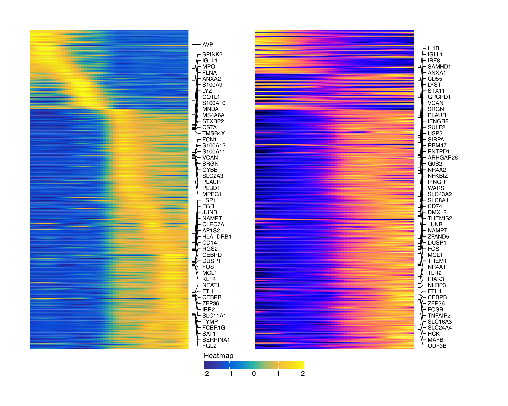
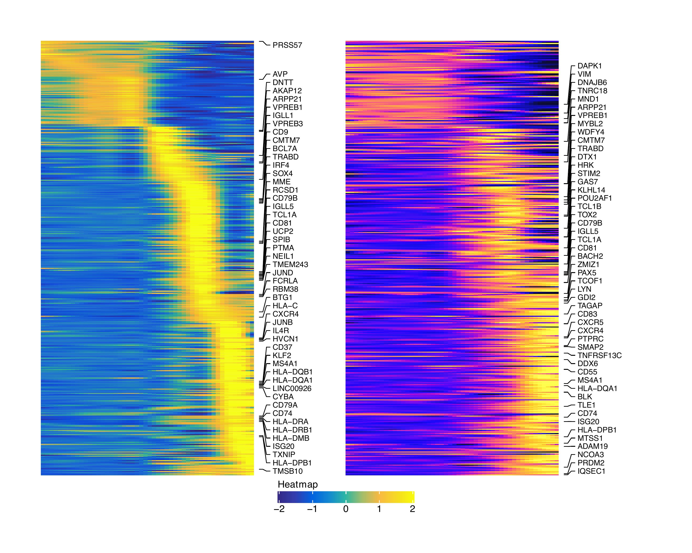

# Trajectory Analysis with ArchR

```{r, include=FALSE, eval=FALSE}
setwd("/Volumes/JG_SSD_2/ArchR_Walkthrough/")
#load("Save-ArchR-Walkthrough-Chapter1-Feb13.Rdata")
save.image("Save-10.Rdata")
```

## Myeloid Trajectory

```{r eval=FALSE}
p1 <- plotEmbedding(ArchRProj = projHeme5, colorBy = "cellColData", name = "Clusters", embedding = "UMAP")
p2 <- plotEmbedding(ArchRProj = projHeme5, colorBy = "cellColData", name = "Clusters2", embedding = "UMAP")
ggAlignPlots(p1, p2, type = "h")
```

{width=800 height=400}

```{r, include=FALSE, eval = FALSE}
plotPDF(
    ggAlignPlots(p1, p2, type = "h", draw=FALSE), 
    name = "Plot-UMAP-Clusters12-Combined.pdf", 
    ArchRProj = projHeme5,
    addDOC = FALSE,
    width = 10, 
    height = 5
)
```

```{r eval=FALSE}
#Trajectory to add
trajectory <- c(paste0("Cluster", c(6, 7, 8, 9, 10)))
trajectory
# [1] "Cluster6"  "Cluster7"  "Cluster8"  "Cluster9"  "Cluster10"

#First we need to create a Trajectory and add it to ArchRProj cellColData
projHeme5 <- addTrajectory(ArchRProj = projHeme5, name = "MyeloidU", trajectory = trajectory, embedding = "UMAP", force = TRUE)

head(projHeme5$MyeloidU)
# [1] 24.56879 44.02464 35.80082 38.66530 24.44559 38.37782
```

```{r eval=FALSE}
p <- plotTrajectory(projHeme5, trajectory = "MyeloidU", colorBy = "colData", name = "MyeloidU")
p
```

{width=500 height=500}

To save a nice looking pdf we use plotPDF which removes white pages and tries to make the plots
nice looking.

```{r eval=FALSE}
plotPDF(p, name = "Plot-MyeloidU-Traj-UMAP.pdf", ArchRProj = projHeme5, addDOC = FALSE, width = 5, height = 5)
```

We can overlay other features on the UMAP

```{r eval=FALSE}
p1 <- plotTrajectory(projHeme5, trajectory = "MyeloidU", colorBy = "GeneScoreMatrix", name = "CEBPB", continuousSet = "horizonExtra")
p2 <- plotTrajectory(projHeme5, trajectory = "MyeloidU", colorBy = "GeneIntegrationMatrix", name = "CEBPB", continuousSet = "blueYellow")
ggAlignPlots(p1[[1]], p2[[1]], type = "h")
```

{width=800 height=400}


```{r eval=FALSE}
ggAlignPlots(p1[[2]], p2[[2]], type = "h")
```

{width=800 height=400}


```{r, include=FALSE, eval = FALSE}
plotPDF(
    ggAlignPlots(p1[[1]], p2[[1]], type = "h", draw = FALSE), 
    name = "Plot-UMAP-CEBPB-Combined.pdf", 
    ArchRProj = projHeme5,
    addDOC = FALSE,
    width = 10, 
    height = 5
)

plotPDF(
    ggAlignPlots(p1[[2]], p2[[2]], type = "h", draw = FALSE), 
    name = "Plot-UMAP-CEBPB-Combined2.pdf", 
    ArchRProj = projHeme5,
    addDOC = FALSE,
    width = 10, 
    height = 5
)
```

We can then make a heatmap for

```{r eval=FALSE}
trajMM  <- getTrajectory(ArchRProj = projHeme5, name = "MyeloidU", useMatrix = "MotifMatrix", log2Norm = FALSE)
p1 <- trajectoryHeatmap(trajMM, pal = paletteContinuous(set = "solarExtra"))
```

{width=600 height=800}

```{r eval=FALSE}
trajGSM <- getTrajectory(ArchRProj = projHeme5, name = "MyeloidU", useMatrix = "GeneScoreMatrix", log2Norm = TRUE)
p2 <- trajectoryHeatmap(trajGSM,  pal = paletteContinuous(set = "horizonExtra"))
```

{width=600 height=800}


```{r eval=FALSE}
trajGIM <- getTrajectory(ArchRProj = projHeme5, name = "MyeloidU", useMatrix = "GeneIntegrationMatrix", log2Norm = FALSE)
p3 <- trajectoryHeatmap(trajGIM,  pal = paletteContinuous(set = "blueYellow"))
```

{width=600 height=800}

```{r eval=FALSE}
trajPM  <- getTrajectory(ArchRProj = projHeme5, name = "MyeloidU", useMatrix = "PeakMatrix", log2Norm = TRUE)
p4 <- trajectoryHeatmap(trajPM, pal = paletteContinuous(set = "solarExtra"))
```

{width=600 height=800}

To save a nice looking pdf we use plotPDF which removes white pages and tries to make the plots
nice looking.

```{r eval=FALSE}
plotPDF(p1, p2, p3, p4, name = "Plot-MyeloidU-Traj-Heatmaps.pdf", ArchRProj = projHeme5, addDOC = FALSE, width = 6, height = 8)
```

We can also try integrating our gene scores with the RNA

```{r eval=FALSE}
trajGSM2 <- trajGSM[which(rowData(trajGSM)$name %in% rowData(trajGIM)$name), ]
trajGIM2 <- trajGIM[which(rowData(trajGIM)$name %in% rowData(trajGSM)$name), ]
rowOrder <- trajectoryHeatmap(trajGIM2,  pal = paletteContinuous(set = "blueYellow"), returnMat = TRUE)
plotPDF( 
	trajectoryHeatmap(trajGIM2,  pal = paletteContinuous(set = "blueYellow"), rowOrder = rownames(rowOrder)) +
	trajectoryHeatmap(trajGSM2,  pal = paletteContinuous(set = "horizonExtra"), rowOrder = rownames(rowOrder)),
	name = "Plot-MyeloidU-RNA-GS.pdf", ArchRProj = projHeme5, addDOC = FALSE, width = 10, height = 8)
```

{width=700 height=500}

## Lymphoid Trajectory


```{r eval=FALSE}
p1 <- plotEmbedding(ArchRProj = projHeme5, colorBy = "cellColData", name = "Clusters", embedding = "UMAP")
p2 <- plotEmbedding(ArchRProj = projHeme5, colorBy = "cellColData", name = "Clusters2", embedding = "UMAP")
ggAlignPlots(p1, p2, type = "h")
```

{width=800 height=400}

```{r, include=FALSE, eval = FALSE}
plotPDF(
    ggAlignPlots(p1, p2, type = "h", draw=FALSE), 
    name = "Plot-UMAP-Clusters12-Combined.pdf", 
    ArchRProj = projHeme5,
    addDOC = FALSE,
    width = 10, 
    height = 5
)
```

```{r eval=FALSE}
#Trajectory to add
trajectory <- c(paste0("Cluster", c(6, 13, 12, 11)))
trajectory
# [1] "Cluster6"  "Cluster13" "Cluster12" "Cluster11"

#First we need to create a Trajectory and add it to ArchRProj cellColData
projHeme5 <- addTrajectory(ArchRProj = projHeme5, name = "LymphoidU", trajectory = trajectory, embedding = "UMAP", force = TRUE)

head(projHeme5$LymphoidU)
# [1]       NA       NA 80.56020       NA 79.47324       NA
```

```{r eval=FALSE}
p <- plotTrajectory(projHeme5, trajectory = "LymphoidU", colorBy = "colData", name = "LymphoidU")
p
```

{width=500 height=500}

To save a nice looking pdf we use plotPDF which removes white pages and tries to make the plots
nice looking.

```{r eval=FALSE}
plotPDF(p, name = "Plot-LymphoidU-Traj-UMAP.pdf", ArchRProj = projHeme5, addDOC = FALSE, width = 5, height = 5)
```

We can overlay other features on the UMAP

```{r eval=FALSE}
p1 <- plotTrajectory(projHeme5, trajectory = "LymphoidU", colorBy = "GeneScoreMatrix", name = "PAX5", continuousSet = "horizonExtra")
p2 <- plotTrajectory(projHeme5, trajectory = "LymphoidU", colorBy = "GeneIntegrationMatrix", name = "PAX5", continuousSet = "blueYellow")
ggAlignPlots(p1[[1]], p2[[1]], type = "h")
```

{width=800 height=400}


```{r eval=FALSE}
ggAlignPlots(p1[[2]], p2[[2]], type = "h")
```

{width=800 height=400}


```{r, include=FALSE, eval = FALSE}
plotPDF(
    ggAlignPlots(p1[[1]], p2[[1]], type = "h", draw = FALSE), 
    name = "Plot-UMAP-PAX5-Combined.pdf", 
    ArchRProj = projHeme5,
    addDOC = FALSE,
    width = 10, 
    height = 5
)

plotPDF(
    ggAlignPlots(p1[[2]], p2[[2]], type = "h", draw = FALSE), 
    name = "Plot-UMAP-PAX5-Combined2.pdf", 
    ArchRProj = projHeme5,
    addDOC = FALSE,
    width = 10, 
    height = 5
)
```

We can then make a heatmap for

```{r eval=FALSE}
trajMM  <- getTrajectory(ArchRProj = projHeme5, name = "LymphoidU", useMatrix = "MotifMatrix", log2Norm = FALSE)
p1 <- trajectoryHeatmap(trajMM, pal = paletteContinuous(set = "solarExtra"))
```

{width=600 height=800}

```{r eval=FALSE}
trajGSM <- getTrajectory(ArchRProj = projHeme5, name = "LymphoidU", useMatrix = "GeneScoreMatrix", log2Norm = TRUE)
p2 <- trajectoryHeatmap(trajGSM,  pal = paletteContinuous(set = "horizonExtra"))
```

{width=600 height=800}


```{r eval=FALSE}
trajGIM <- getTrajectory(ArchRProj = projHeme5, name = "LymphoidU", useMatrix = "GeneIntegrationMatrix", log2Norm = FALSE)
p3 <- trajectoryHeatmap(trajGIM,  pal = paletteContinuous(set = "blueYellow"))
```

{width=600 height=800}

```{r eval=FALSE}
trajPM  <- getTrajectory(ArchRProj = projHeme5, name = "LymphoidU", useMatrix = "PeakMatrix", log2Norm = TRUE)
p4 <- trajectoryHeatmap(trajPM, pal = paletteContinuous(set = "solarExtra"))
```

{width=600 height=800}

To save a nice looking pdf we use plotPDF which removes white pages and tries to make the plots
nice looking.

```{r eval=FALSE}
plotPDF(p1, p2, p3, p4, name = "Plot-LymphoidU-Traj-Heatmaps.pdf", ArchRProj = projHeme5, addDOC = FALSE, width = 6, height = 8)
```

We can also try integrating our gene scores with the RNA

```{r eval=FALSE}
trajGSM2 <- trajGSM[which(rowData(trajGSM)$name %in% rowData(trajGIM)$name), ]
trajGIM2 <- trajGIM[which(rowData(trajGIM)$name %in% rowData(trajGSM)$name), ]
rowOrder <- trajectoryHeatmap(trajGIM2,  pal = paletteContinuous(set = "blueYellow"), returnMat = TRUE)
plotPDF( 
	trajectoryHeatmap(trajGIM2,  pal = paletteContinuous(set = "blueYellow"), rowOrder = rownames(rowOrder)) +
	trajectoryHeatmap(trajGSM2,  pal = paletteContinuous(set = "horizonExtra"), rowOrder = rownames(rowOrder)),
	name = "Plot-LymphoidU-RNA-GS.pdf", ArchRProj = projHeme5, addDOC = FALSE, width = 10, height = 8)
```

{width=700 height=500}


