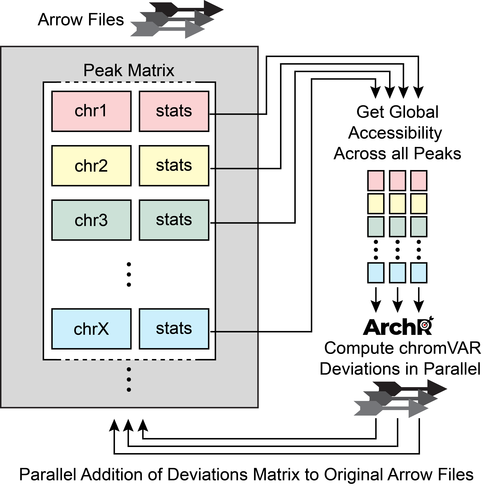
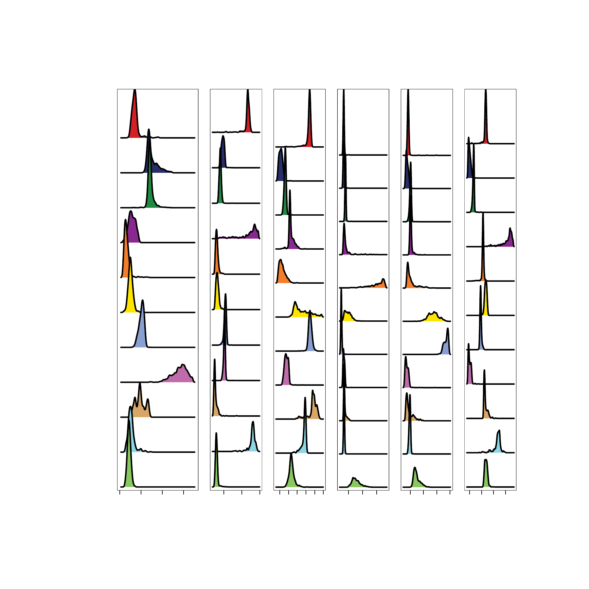
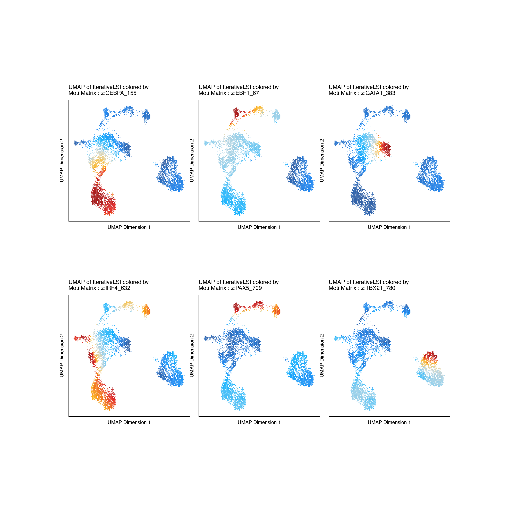
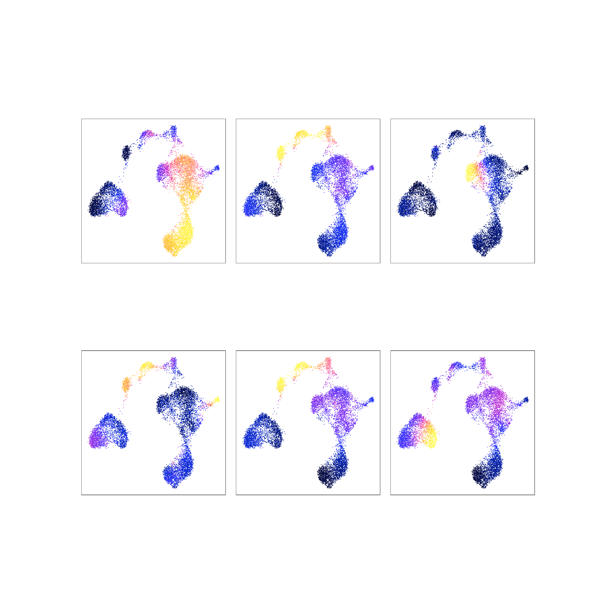
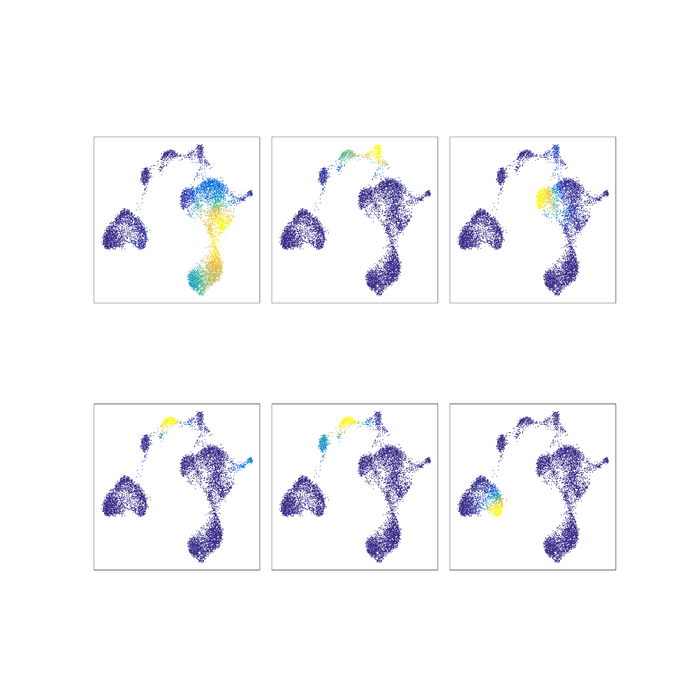
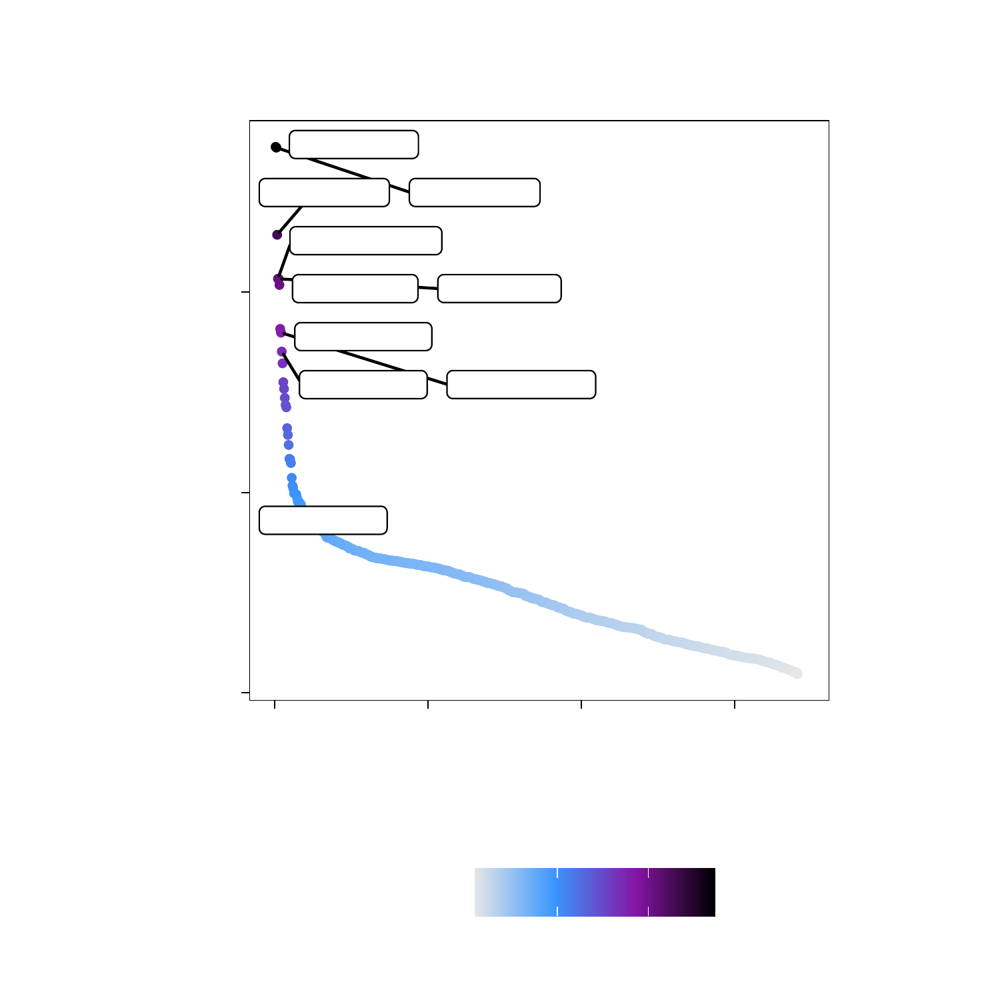
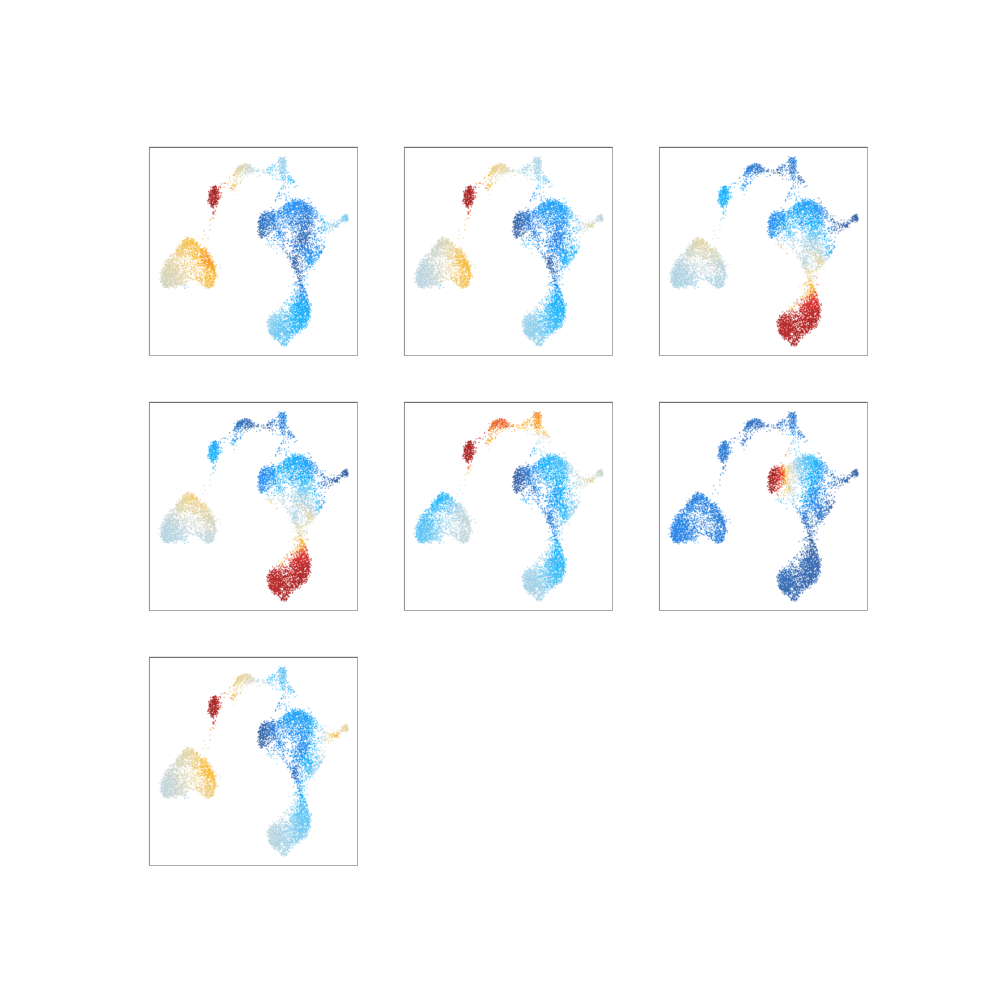
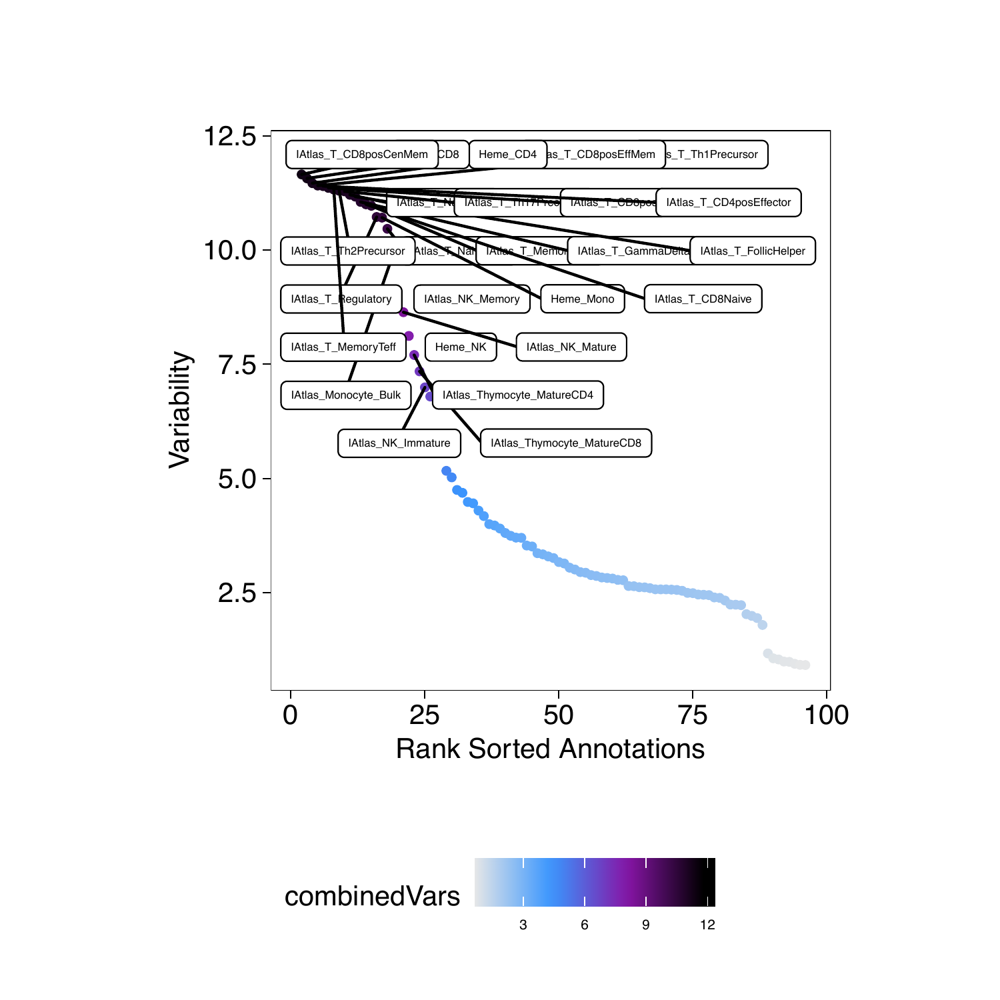
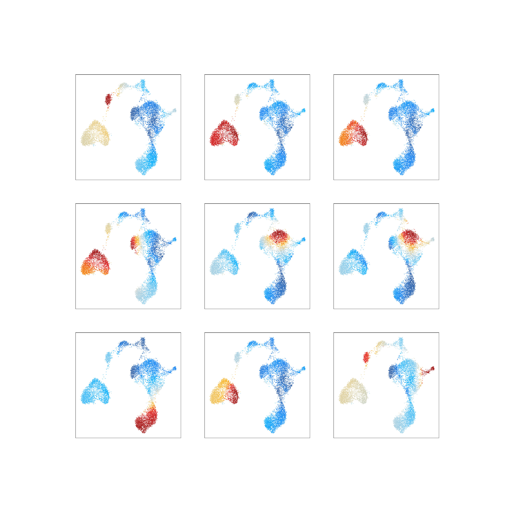
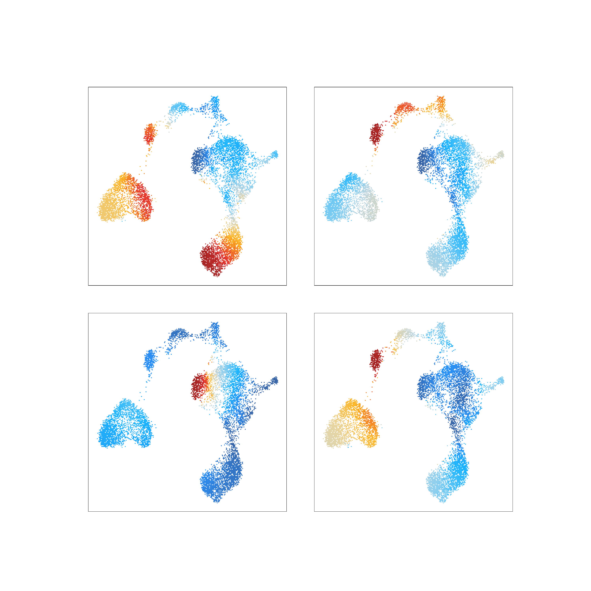

---
output:
  html_document:
    theme: yeti  # many options for theme, this one is my favorite.
params:
  threads: 20
  rdata: ""
  token: ""
  ref: ""
  out: ""
---
```{r, include=FALSE}
load("ch12.RData")
```

# ChromVAR Deviatons Enrichment with ArchR

As shown in previous chapters, TF motif enrichments can help us predict which regulatory factors are most active in our cell type of interest. These enrichments, however, are not calculated on a per-cell basis and they do not take into account the insertion sequence bias of the Tn5 transposase. [chromVAR](https://greenleaflab.github.io/chromVAR/index.html), an R package from the Greenleaf Lab, was created to account for these issues. chromVAR is designed for predicting enrichment of TF activity on a per-cell basis from sparse chromatin accessibility data. The two primary outputs of chromVAR are:

```{r include=FALSE, eval=FALSE,echo=FALSE}
# JJJ I would prefer to have more clear descriptions about deviations vs z scores for chromVAR. I've always found this very nuanced and it was never clear which metric should be used in which scenarios.
```

1. "deviations" - A deviation is a bias-corrected measurement of how far the per-cell accessibility of a given feature (i.e motif) deviates from the expected accessibility based on the average of all cells or samples. Deviations are computed per-cell and independent of the sample.
2. "z-score" - The z-score, also confusingly known as a "deviation score" is the z-score for each bias-corrected deviation across all cells. The absolute value of the deviation score is correlated with the per-cell read depth. This is because, with more reads, you have higher confidence that the difference in per-cell accessibility of the given feature (i.e. motif) from the expectation is greater than would occur by chance.

One of the primary limitations of chromVAR is that it was designed during the early era of scATAC-seq data generation when an experiment consisted of a few hundred of cells. At this experimental scale, chromVAR could easily read the entire cell-by-peak matrix into memory to quickly compute TF deviations. However, current experimental approaches use tens to hundreds of thousands of cells, generating cell-by-peak matrices that are much more difficult to read into memory. This leads to dramatic increases in run time and memory usage for even moderately sized datasets of 50,000 cells.

To circumvent these limitations, ArchR implements the same chromVAR analysis workflow by analyzing sample sub-matrices independently. Additionally, as of `release_1.0.3` ArchR also includes a re-implementation of some of the core chromVAR functionality in C++ using `Rcpp`. Together, this enables application of chromVAR to very large datasets. 

<center>
{width=500px}
</center>

```{r include=FALSE, eval=FALSE,echo=FALSE}
# JJJ This description below is from the paper but could be improved. How does ArchR choose which cells go together in each of the sub samples?
```

First, ArchR reads in the global accessibility per peak across all cells in each sub-sample. Second, for each peak, ArchR identifies a set of background peaks that are matched by GC-content and accessibility. Third, ArchR uses this background set of peaks and global accessibility to compute bias-corrected deviations with chromVAR for each sample independently. This implementation requires data from only 5,000-10,000 cells to be loaded into memory at any given time, minimizing the memory requirements, enabling scalable analysis with chromVAR, and improving run-time performance.

## Motif Deviations

First, lets make sure we have added motif annotations to our `ArchRProject`.

```{r  }
if("Motif" %ni% names(projHeme5@peakAnnotation)){
    projHeme5 <- addMotifAnnotations(ArchRProj = projHeme5, motifSet = "cisbp", name = "Motif")
}
```

```{r include=FALSE, eval=FALSE,echo=FALSE}
# JJJ add a description of where the background peaks come from. I dont understand this. If you take the total peak set, are you trying to identify a subset of the those peaks that can be used as the background set? 
```

We also need to add a set of background peaks which are used in computing deviations. Background peaks are chosen using the `chromVAR::getBackgroundPeaks()` function which samples peaks based on similarity in GC-content and number of fragments across all samples using the Mahalanobis distance.

```{r}
projHeme5 <- addBgdPeaks(projHeme5)
```

```{r include=FALSE, eval=FALSE,echo=FALSE}
# JJJ odd IRanges message above 
```

We are now ready to compute per-cell deviations accross all of our motif annotations using the `addDeviationsMatrix()` function. This function has an optional parameter called `matrixName` that allows us to define the name of the deviations matrix that will be stored in the Arrow files. If we do not provide a value to this parameter, as in the example below, this function creates a matrix name by adding the word "Matrix" to the name of the `peakAnnotation`. The example below creates a deviations matrix in each of our Arrow files called "MotifMatrix".

```{r}
projHeme5 <- addDeviationsMatrix(
  ArchRProj = projHeme5, 
  peakAnnotation = "Motif",
  force = TRUE
)
```
To access these deviations, we use the `getVarDeviations()` function. If we want this function to return a `ggplot` object, we set `plot = TRUE` otherwise, this function would return the `DataFrame` object. The `head` of that `DataFrame` object is displayed by default when the function is run.

```{r}
plotVarDev <- getVarDeviations(projHeme5, name = "MotifMatrix", plot = TRUE)
```

From the above snapshot of the `DataFrame`, you can see that the `seqnames` of the `MotifMatrix` are not chromosomes. Typically, in matrices like the `TileMatrix`, `PeakMatrix`, and `GeneScoreMatrix`, we store the chromosome information in `seqnames`. The `MotifMatrix` does not have any corresponding position information but, instead, stores both the "devations" and "z-scores" from chromVAR into the same matrix using two different seqnames - `deviations` and `z`. This becomes important later on if you try to use the `MotifMatrix` (which is of class `Sparse.Assays.Matrix`) in functions such as `getMarkerFeatures()`. In these types of operations, ArchR will expect you to subset `MotifMatrix` to one of the two `seqnames` (i.e. select either z-scores or deviations to perform calculations).

We can then plot these variable deviations.
```{r}
plotVarDev
```

```{r, include=FALSE}
plotPDF(plotVarDev, name = "Variable-Motif-Deviation-Scores", width = 5, height = 5, ArchRProj = projHeme5, addDOC = FALSE)
ArchR:::.convertToPNG(ArchRProj = projHeme5)
system("cp Figures/*.png images/HemeWalkthrough/PNG/")
system("cp Figures/*.pdf images/HemeWalkthrough/PDF/")
```

{width=500 height=500}

To save an editable vectorized version of this plot, we use the `plotPDF()` function.

```{r}
plotPDF(plotVarDev, name = "Variable-Motif-Deviation-Scores", width = 5, height = 5, ArchRProj = projHeme5, addDOC = FALSE)
```
What if we want to extract a subset of motifs for downstream analysis? We can do this using the `getFeatures()` function. The `paste(motifs, collapse="|")` statement below creates a concatenated `or` statement that enables selection of all of the motifs.
```{r}
motifs <- c("GATA1", "CEBPA", "EBF1", "IRF4", "TBX21", "PAX5")
markerMotifs <- getFeatures(projHeme5, select = paste(motifs, collapse="|"), useMatrix = "MotifMatrix")
markerMotifs
```
As mentioned above, `MotifMatrix` contains `seqnames` for both z-scores and deviations, shown above by "z:" and "deviations:". To get just the features corresponding to z-scores, we can use `grep`. Unfortunately, in the example motifs shown above, you can see that in addition to "EBF1", we also selected "SREBF1" which we do not want to analyze. Because of this, we remove it below using the `%ni%` expression which is an ArchR helper function that provides the opposite of `%in%` from base R.

```{r}
markerMotifs <- grep("z:", markerMotifs, value = TRUE)
markerMotifs <- markerMotifs[markerMotifs %ni% "z:SREBF1_22"]
markerMotifs
```
Now that we have the names of the features that we are interested in, we can plot the distribution of chromVAR deviation scores for each cluster. Notice that we supply the impute weights that we calculated previously during our gene score analyses. As a reminder, these impute weights allow us to smooth the signal across nearby cells which is helpful in the context of our sparse scATAC-seq data.

```{r}
p <- plotGroups(ArchRProj = projHeme5, 
  groupBy = "Clusters2", 
  colorBy = "MotifMatrix", 
  name = markerMotifs,
  imputeWeights = getImputeWeights(projHeme5)
)
```
We can use `cowplot` to plot the distributions of all of these motifs in a single plot.

```{r}
p2 <- lapply(seq_along(p), function(x){
  if(x != 1){
    p[[x]] + guides(color = FALSE, fill = FALSE) + 
    theme_ArchR(baseSize = 6) +
    theme(plot.margin = unit(c(0.1, 0.1, 0.1, 0.1), "cm")) +
    theme(
        axis.text.y=element_blank(), 
        axis.ticks.y=element_blank(),
        axis.title.y=element_blank()
    ) + ylab("")
  }else{
    p[[x]] + guides(color = FALSE, fill = FALSE) + 
    theme_ArchR(baseSize = 6) +
    theme(plot.margin = unit(c(0.1, 0.1, 0.1, 0.1), "cm")) +
    theme(
        axis.ticks.y=element_blank(),
        axis.title.y=element_blank()
    ) + ylab("")
  }
})
do.call(cowplot::plot_grid, c(list(nrow = 1, rel_widths = c(2, rep(1, length(p2) - 1))),p2))
```

```{r, include=FALSE}
plotPDF(
    do.call(cowplot::plot_grid, c(list(nrow = 1, rel_widths = c(2.1, rep(1, length(p2) - 1))),p2)), 
    name = "Plot-Groups-Deviations-w-Imputation-Cowplot.pdf", 
    ArchRProj = projHeme5,
    addDOC = FALSE,
    width = 6, 
    height = 6
)
ArchR:::.convertToPNG(ArchRProj = projHeme2)
system("cp Figures/*.png images/HemeWalkthrough/PNG/")
system("cp Figures/*.pdf images/HemeWalkthrough/PDF/")
```

{width=800 height=800}

To save an editable vectorized version of this plot, we use the `plotPDF()` function.

```{r}
plotPDF(p, name = "Plot-Groups-Deviations-w-Imputation", width = 5, height = 5, ArchRProj = projHeme5, addDOC = FALSE)
```

Instead of looking at the distributions of these z-scores, we can overlay the z-scores on our UMAP embedding as we've done previously for gene scores.
```{r}
p <- plotEmbedding(
    ArchRProj = projHeme5, 
    colorBy = "MotifMatrix", 
    name = sort(markerMotifs), 
    embedding = "UMAP",
    imputeWeights = getImputeWeights(projHeme5)
)
```

We can plot all of these motif UMAPs using `cowplot`.

```{r}
p2 <- lapply(p, function(x){
    x + guides(color = FALSE, fill = FALSE) + 
    theme_ArchR(baseSize = 6.5) +
    theme(plot.margin = unit(c(0, 0, 0, 0), "cm")) +
    theme(
        axis.text.x=element_blank(), 
        axis.ticks.x=element_blank(), 
        axis.text.y=element_blank(), 
        axis.ticks.y=element_blank()
    )
})
do.call(cowplot::plot_grid, c(list(ncol = 3),p2))
```

```{r, include=FALSE}
plotPDF(
    do.call(cowplot::plot_grid, c(list(ncol = 3),p2)), 
    name = "Plot-UMAP-MarkerMotifs-W-Imputation.pdf", 
    ArchRProj = projHeme5,
    addDOC = FALSE,
    width = 10, 
    height = 10
)
ArchR:::.convertToPNG(ArchRProj = projHeme2)
system("cp Figures/*.png images/HemeWalkthrough/PNG/")
system("cp Figures/*.pdf images/HemeWalkthrough/PDF/")
```

{width=800 height=800}


```{r include=FALSE, eval=FALSE,echo=FALSE}
#JJJ This has two sections that say "gene expression" and use "markerRNA" but one is for gene score and the other for RNA
```

To see how these TF deviation z-scores compare to the inferred gene expression via gene scores of the corresponding TF genes, we can overlay the gene scores for each of these TFs on the UMAP embedding.

```{r}
markerRNA <- getFeatures(projHeme5, select = paste(motifs, collapse="|"), useMatrix = "GeneScoreMatrix")
markerRNA <- markerRNA[markerRNA %ni% c("SREBF1","CEBPA-DT")]
markerRNA
```

```{r}
p <- plotEmbedding(
    ArchRProj = projHeme5, 
    colorBy = "GeneScoreMatrix", 
    name = sort(markerRNA), 
    embedding = "UMAP",
    imputeWeights = getImputeWeights(projHeme5)
)
```

```{r}
p2 <- lapply(p, function(x){
    x + guides(color = FALSE, fill = FALSE) + 
    theme_ArchR(baseSize = 6.5) +
    theme(plot.margin = unit(c(0, 0, 0, 0), "cm")) +
    theme(
        axis.text.x=element_blank(), 
        axis.ticks.x=element_blank(), 
        axis.text.y=element_blank(), 
        axis.ticks.y=element_blank()
    )
})
do.call(cowplot::plot_grid, c(list(ncol = 3),p2))

```

```{r, include=FALSE}
plotPDF(
    do.call(cowplot::plot_grid, c(list(ncol = 3),p2)), 
    name = "Plot-UMAP-MarkerMotifsGS-W-Imputation.pdf", 
    ArchRProj = projHeme5,
    addDOC = FALSE,
    width = 10, 
    height = 10
)
ArchR:::.convertToPNG(ArchRProj = projHeme2)
system("cp Figures/*.png images/HemeWalkthrough/PNG/")
system("cp Figures/*.pdf images/HemeWalkthrough/PDF/")
```

{width=800 height=800}


Similarly, because we previously linked our scATAC-seq data with corresponding scRNA-seq data, we can plot the linked gene expression for each of these TFs on the UMAP embedding.

```{r, collapse=TRUE}
markerRNA <- getFeatures(projHeme5, select = paste(motifs, collapse="|"), useMatrix = "GeneIntegrationMatrix")
markerRNA <- markerRNA[markerRNA %ni% c("SREBF1","CEBPA-DT")]
markerRNA
```

```{r}

p <- plotEmbedding(
    ArchRProj = projHeme5, 
    colorBy = "GeneIntegrationMatrix", 
    name = sort(markerRNA), 
    embedding = "UMAP",
    continuousSet = "blueYellow",
    imputeWeights = getImputeWeights(projHeme5)
)
```

```{r, collapse=TRUE}
p2 <- lapply(p, function(x){
    x + guides(color = FALSE, fill = FALSE) + 
    theme_ArchR(baseSize = 6.5) +
    theme(plot.margin = unit(c(0, 0, 0, 0), "cm")) +
    theme(
        axis.text.x=element_blank(), 
        axis.ticks.x=element_blank(), 
        axis.text.y=element_blank(), 
        axis.ticks.y=element_blank()
    )
})
do.call(cowplot::plot_grid, c(list(ncol = 3),p2))

```

```{r, include=FALSE}
plotPDF(
    do.call(cowplot::plot_grid, c(list(ncol = 3),p2)), 
    name = "Plot-UMAP-MarkerMotifsRNA-W-Imputation.pdf", 
    ArchRProj = projHeme5,
    addDOC = FALSE,
    width = 10, 
    height = 10
)
ArchR:::.convertToPNG(ArchRProj = projHeme2)
system("cp Figures/*.png images/HemeWalkthrough/PNG/")
system("cp Figures/*.pdf images/HemeWalkthrough/PDF/")
```

{width=800 height=800}

In addition to the analyses shown above, you may want to plot heatmaps of motif deviations, for example using the `plotMarkerHeatmap()` function based on the output of `getMarkerFeatures()`. It is important to remember not to filter for marker features (via `cutoff`) using the the log2(fold change) of deviations on these heatmaps because this is not relevant for deviations which are not a counts-based measure. Instead, marker features can be identified using `MeanDiff` (for ex. `MeanDiff >= 0.1`). Similarly, `plotLog2FC` should be `FALSE`.

## ArchR and Custom Deviations

In the chapter on Peak Annotation Enrichment, we introduced how to create peak annotations for any set of genomic regions. This encluded (i) ArchR-supported region sets such as curated TF binding sites from ENCODE and peak sets from bulk ATAC-seq and (ii) custom user-supplied region sets. If you have not read this section, we recommend doing so to better understand how peak annotations work.

These peak annotations can be used in deviation calculations in the same way as motifs. Here we provide examples of how to run these analyses but note that the downstream analyses are identical to what was shown in the previous section for motifs and thus we do not provide extensive details on each step of the code. Once you create a deviations matrix in your Arrow files, the rest is the same.

### Encode TFBS

In case you have not added an annotations matrix for the "EncodeTFBS" region set, lets do that now.

```{r}
if("EncodeTFBS" %ni% names(projHeme5@peakAnnotation)){
    projHeme5 <- addArchRAnnotations(ArchRProj = projHeme5, collection = "EncodeTFBS")
}
```

Then, we create a deviations matrix, providing this peak annotation to the `peakAnnotation` parameter.

```{r, collapse=TRUE}
projHeme5 <- addDeviationsMatrix(
  ArchRProj = projHeme5, 
  peakAnnotation = "EncodeTFBS",
  force = TRUE
)
```

We can create a dot plot of the ranked deviations.
```{r}
plotVarDev <- getVarDeviations(projHeme5, plot = TRUE, name = "EncodeTFBSMatrix")
```

```{r eval=FALSE}
plotVarDev
```
> \## Warning: Removed 7 rows containing missing values (geom_point).

```{r, include=FALSE}
plotPDF(plotVarDev, name = "Variable-EncodeTFBS-Deviation-Scores", width = 5, height = 5, ArchRProj = projHeme5, addDOC = FALSE)
ArchR:::.convertToPNG(ArchRProj = projHeme2)
system("cp Figures/*.png images/HemeWalkthrough/PNG/")
system("cp Figures/*.pdf images/HemeWalkthrough/PDF/")
```

{width=500 height=500}

```{r}
plotPDF(plotVarDev, name = "Variable-EncodeTFBS-Deviation-Scores", width = 5, height = 5, ArchRProj = projHeme5, addDOC = FALSE)
```

Or we can subset these TF binding sites to particular motifs we are interested in and then plot their deviation z-scores per-cell on our UMAP embedding.

```{r, collapse=TRUE}
tfs <- c("GATA_1", "CEBPB", "EBF1", "IRF4", "TBX21", "PAX5")
getFeatures(projHeme5, select = paste(tfs, collapse="|"), useMatrix = "EncodeTFBSMatrix")
```

```{r, collapse=TRUE}
markerTFs <- getFeatures(projHeme5, select = paste(tfs, collapse="|"), useMatrix = "EncodeTFBSMatrix")
markerTFs <- sort(grep("z:", markerTFs, value = TRUE))
TFnames <- stringr::str_split(stringr::str_split(markerTFs, pattern = "\\.", simplify=TRUE)[,2], pattern = "-", simplify = TRUE)[,1]
markerTFs <- markerTFs[!duplicated(TFnames)]
markerTFs
```

```{r, collapse=TRUE}
p <- plotEmbedding(
    ArchRProj = projHeme5, 
    colorBy = "EncodeTFBSMatrix", 
    name = markerTFs, 
    embedding = "UMAP",
    imputeWeights = getImputeWeights(projHeme5)
)
```

```{r, collapse=TRUE}
p2 <- lapply(p, function(x){
    x + guides(color = FALSE, fill = FALSE) + 
    theme_ArchR(baseSize = 6.5) +
    theme(plot.margin = unit(c(0, 0, 0, 0), "cm")) +
    theme(
        axis.text.x=element_blank(), 
        axis.ticks.x=element_blank(), 
        axis.text.y=element_blank(), 
        axis.ticks.y=element_blank()
    )
})
do.call(cowplot::plot_grid, c(list(ncol = 3),p2))
```

```{r, include=FALSE, collapse=TRUE}
plotPDF(
    do.call(cowplot::plot_grid, c(list(ncol = 3),p2)), 
    name = "Plot-UMAP-EncodeTFBS-W-Imputation.pdf", 
    ArchRProj = projHeme5,
    addDOC = FALSE,
    width = 10, 
    height = 10
)
ArchR:::.convertToPNG(ArchRProj = projHeme2)
system("cp Figures/*.png images/HemeWalkthrough/PNG/")
system("cp Figures/*.pdf images/HemeWalkthrough/PDF/")
```

{width=800 height=800}

### Bulk ATAC-seq

Similarly, we can use ArchR-curated bulk ATAC-seq peak sets for our motif deviation calculations.If you have not added motif annotations

In case you have not added an annotations matrix for the "EncodeTFBS" region set, lets do that now.

```{r}
if("ATAC" %ni% names(projHeme5@peakAnnotation)){
    projHeme5 <- addArchRAnnotations(ArchRProj = projHeme5, collection = "ATAC")
}
```

Then, we create a deviations matrix, providing this peak annotation to the `peakAnnotation` parameter.

```{r, collapse=TRUE}
projHeme5 <- addDeviationsMatrix(
  ArchRProj = projHeme5, 
  peakAnnotation = "ATAC",
  force = TRUE
)
```

We can create a dot plot of the ranked deviations.

```{r, collapse=TRUE}
plotVarDev <- getVarDeviations(projHeme5, plot = TRUE, name = "ATACMatrix")
```

```{r eval=FALSE}
plotVarDev
```

```{r, include=FALSE, eval=FALSE}
plotPDF(plotVarDev, name = "Variable-ATAC-Deviation-Scores", width = 5, height = 5, ArchRProj = projHeme5, addDOC = FALSE)
ArchR:::.convertToPNG(ArchRProj = projHeme2)
system("cp Figures/*.png images/HemeWalkthrough/PNG/")
system("cp Figures/*.pdf images/HemeWalkthrough/PDF/")
```

{width=500 height=500}

```{r eval=FALSE}
plotPDF(plotVarDev, name = "Variable-ATAC-Deviation-Scores", width = 5, height = 5, ArchRProj = projHeme5, addDOC = FALSE)
```
> \## [1] "plotting ggplot!"  
## [1] 0

Or we can plot the deviation z-scores for each of these peak sets per-cell on our UMAP embedding.

```{r, collapse=TRUE}
ATACPeaks <- c("Heme_HSC", "Heme_LMPP", "Heme_Ery", "Heme_Mono", "Heme_CD4", "Heme_CD8", "Heme_B", "Heme_NK", "IAtlas_DC_Plasmacytoid")
getFeatures(projHeme5, select = paste(ATACPeaks, collapse="|"), useMatrix = "ATACMatrix")
```

```{r}
markerATAC <- getFeatures(projHeme5, select = paste(ATACPeaks, collapse="|"), useMatrix = "ATACMatrix")
markerATAC <- sort(grep("z:", markerATAC, value = TRUE))
markerATAC
```

```{r}
p <- plotEmbedding(
    ArchRProj = projHeme5, 
    colorBy = "ATACMatrix", 
    name = markerATAC, 
    embedding = "UMAP",
    imputeWeights = getImputeWeights(projHeme5)
)
```

```{r}
p2 <- lapply(p, function(x){
    x + guides(color = FALSE, fill = FALSE) + 
    theme_ArchR(baseSize = 6.5) +
    theme(plot.margin = unit(c(0, 0, 0, 0), "cm")) +
    theme(
        axis.text.x=element_blank(), 
        axis.ticks.x=element_blank(), 
        axis.text.y=element_blank(), 
        axis.ticks.y=element_blank()
    )
})
do.call(cowplot::plot_grid, c(list(ncol = 3),p2))
```

```{r, include=FALSE}
plotPDF(
    do.call(cowplot::plot_grid, c(list(ncol = 3),p2)), 
    name = "Plot-UMAP-MarkerATAC-W-Imputation.pdf", 
    ArchRProj = projHeme5,
    addDOC = FALSE,
    width = 10, 
    height = 10
)
ArchR:::.convertToPNG(ArchRProj = projHeme2)
system("cp Figures/*.png images/HemeWalkthrough/PNG/")
system("cp Figures/*.pdf images/HemeWalkthrough/PDF/")
```

{width=800 height=800}

### Custom Deviations

Instead of using the ArchR-curated region sets described above, we can provide our own custom region sets as a peak annotation. These custom annotations can be used in exactly the same way as the ArchR-curated annotations.

First, in case you haven't already created this "EncodePeaks" annotation in a previous chapter, lets create it by downloading some ENCODE peak sets and calling `addPeakAnnotations()`.
```{r}
EncodePeaks <- c(
  Encode_K562_GATA1 = "https://www.encodeproject.org/files/ENCFF632NQI/@@download/ENCFF632NQI.bed.gz",
  Encode_GM12878_CEBPB = "https://www.encodeproject.org/files/ENCFF761MGJ/@@download/ENCFF761MGJ.bed.gz",
  Encode_K562_Ebf1 = "https://www.encodeproject.org/files/ENCFF868VSY/@@download/ENCFF868VSY.bed.gz",
  Encode_K562_Pax5 = "https://www.encodeproject.org/files/ENCFF339KUO/@@download/ENCFF339KUO.bed.gz"
)
if("ChIP" %ni% names(projHeme5@peakAnnotation)){
    projHeme5 <- addPeakAnnotations(ArchRProj = projHeme5, regions = EncodePeaks, name = "ChIP")
}
```

Then, we make a deviations matrix from this peak annotation.
```{r}
projHeme5 <- addDeviationsMatrix(
  ArchRProj = projHeme5, 
  peakAnnotation = "ChIP",
  force = TRUE
)
```

The rest of the analysis workflow is the same as what has now been presented multiple times above.

We can plot the ranked deviations.
```{r}
plotVarDev <- getVarDeviations(projHeme5, plot = TRUE, name = "ChIPMatrix")
```

```{r eval=FALSE}
plotVarDev
```
> \## Warning: Removed 21 rows containing missing values (geom_label_repel).

```{r, include=FALSE}
plotPDF(plotVarDev, name = "Variable-ChIP-Deviation-Scores", width = 5, height = 5, ArchRProj = projHeme5, addDOC = FALSE)
ArchR:::.convertToPNG(ArchRProj = projHeme2)
system("cp Figures/*.png images/HemeWalkthrough/PNG/")
system("cp Figures/*.pdf images/HemeWalkthrough/PDF/")
```

{width=500 height=500}

```{r}
plotPDF(plotVarDev, name = "Variable-ChIP-Deviation-Scores", width = 5, height = 5, ArchRProj = projHeme5, addDOC = FALSE)
```

And we can plot the deviation z-scores overlayed on our UMAP embedding.

```{r}
markerChIP <- getFeatures(projHeme5, useMatrix = "ChIPMatrix")
markerChIP <- sort(grep("z:", markerChIP, value = TRUE))
markerChIP
```

```{r}
p <- plotEmbedding(
    ArchRProj = projHeme5, 
    colorBy = "ChIPMatrix", 
    name = markerChIP, 
    embedding = "UMAP",
    imputeWeights = getImputeWeights(projHeme5)
)
```

```{r}
p2 <- lapply(p, function(x){
    x + guides(color = FALSE, fill = FALSE) + 
    theme_ArchR(baseSize = 6.5) +
    theme(plot.margin = unit(c(0, 0, 0, 0), "cm")) +
    theme(
        axis.text.x=element_blank(), 
        axis.ticks.x=element_blank(), 
        axis.text.y=element_blank(), 
        axis.ticks.y=element_blank()
    )
})
do.call(cowplot::plot_grid, c(list(ncol = 2),p2))
```

```{r, include=FALSE}
plotPDF(
    do.call(cowplot::plot_grid, c(list(ncol = 2),p2)), 
    name = "Plot-UMAP-MarkerChIP-W-Imputation.pdf", 
    ArchRProj = projHeme5,
    addDOC = FALSE,
    width = 10, 
    height = 10
)
ArchR:::.convertToPNG(ArchRProj = projHeme2)
system("cp Figures/*.png images/HemeWalkthrough/PNG/")
system("cp Figures/*.pdf images/HemeWalkthrough/PDF/")
```

{width=800 height=800}

```{r, include=FALSE, eval=FALSE}
save.image(params$out, compress = FALSE)
```

```{r, include=FALSE}
save.image("ch13.RData")
```


