---
output:
  html_document:
params:
  threads: 20
  rdata: ""
  token: ""
  ref: ""
  out: ""
---

```{r, include=FALSE, eval=FALSE}
params2 <- params
unlockBinding("params", env = .GlobalEnv)
#load("Chapter-13-Footprints.Rdata")
load(params$rdata)
params <- params2
rm(params2)
devtools::install_github("GreenleafLab/ArchR", 
  auth_token = params$token, 
  ref = params$ref,
  repos = BiocManager::repositories(),
  dependencies = FALSE
)
library(ArchR)
fn <- unclass(lsf.str(envir = asNamespace("ArchR"), all = TRUE))
fn <- fn[!grepl("\\.", fn)]
fn <- fn[fn!="ArchRProj"]
for (i in seq_along(fn)){
    tryCatch({
        eval(parse(text = paste0(fn[i], "<-ArchR::", fn[i])))
    }, error = function(x) {
    })
}
addArchRThreads(threads = params$threads)
addArchRGenome("hg19")
# fn <- unclass(lsf.str(envir = asNamespace("ArchR"), all = TRUE))
# fn <- fn[fn!="ArchRProj"]
# for (i in seq_along(fn)) {
#     tryCatch({
#         eval(parse(text = paste0(fn[i], "<-ArchR:::", fn[i])))
#     }, error = function(x) {
#     })
# }
set.seed(1)
```

# Trajectory Analysis with ArchR

## Myeloid Trajectory

```{r eval=FALSE}
p1 <- plotEmbedding(ArchRProj = projHeme5, colorBy = "cellColData", name = "Clusters", embedding = "UMAP")
```
> \## ArchR logging to : ArchRLogs/ArchR-plotEmbedding-15e1326ab29a8-Date-2020-04-15_Time-14-59-47.log  
## If there is an issue, please report to github with logFile!  
## Getting UMAP Embedding  
## ColorBy = cellColData  
## Plotting Embedding  
## 1   
## ArchR logging successful to : ArchRLogs/ArchR-plotEmbedding-15e1326ab29a8-Date-2020-04-15_Time-14-59-47.log  

```{r eval=FALSE}
p2 <- plotEmbedding(ArchRProj = projHeme5, colorBy = "cellColData", name = "Clusters2", embedding = "UMAP")
```
> \## ArchR logging to : ArchRLogs/ArchR-plotEmbedding-15e1339bfbfcf-Date-2020-04-15_Time-14-59-49.log  
## If there is an issue, please report to github with logFile!  
## Getting UMAP Embedding  
## ColorBy = cellColData  
## Plotting Embedding  
## 1   
## ArchR logging successful to : ArchRLogs/ArchR-plotEmbedding-15e1339bfbfcf-Date-2020-04-15_Time-14-59-49.log  

```{r eval=FALSE}
ggAlignPlots(p1, p2, type = "h")
```

```{r, include=FALSE, eval=FALSE}
plotPDF(
    ggAlignPlots(p1, p2, type = "h", draw=FALSE), 
    name = "Plot-UMAP-Clusters12-Combined.pdf", 
    ArchRProj = projHeme5,
    addDOC = FALSE,
    width = 10, 
    height = 5
)
ArchR:::.convertToPNG(ArchRProj = projHeme5)
system("cp Figures/*.png images/HemeWalkthrough/PNG/")
system("cp Figures/*.pdf images/HemeWalkthrough/PDF/")
```

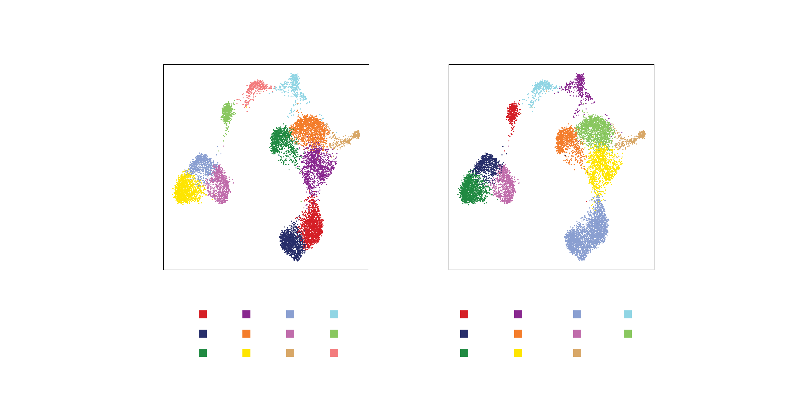{width=800 height=400}

```{r eval=FALSE}
#Trajectory to add
trajectory <- c("Progenitor", "GMP", "Mono")
trajectory
```
> \## [1] "Progenitor" "GMP"        "Mono"

```{r eval=FALSE}
#First we need to create a Trajectory and add it to ArchRProj cellColData
projHeme5 <- addTrajectory(
    ArchRProj = projHeme5, 
    name = "MyeloidU", 
    groupBy = "Clusters2",
    trajectory = trajectory, 
    embedding = "UMAP", 
    force = TRUE
)
```
> \## ArchR logging to : ArchRLogs/ArchR-addTrajectory-15e132f14b12b-Date-2020-04-15_Time-15-00-01.log  
## If there is an issue, please report to github with logFile!  
## Filtering outliers  
## Initial Alignment Before Spline Fit  
## Spline Fit  
## KNN to Spline  
## Aligning cells not in trajectory  
## ArchR logging successful to : ArchRLogs/ArchR-addTrajectory-15e132f14b12b-Date-2020-04-15_Time-15-00-01.log  

```{r eval=FALSE}
head(projHeme5$MyeloidU[!is.na(projHeme5$MyeloidU)]) #NA means not in trajectory
```
> \## [1] 46.07479 53.75027 44.82834 43.18828 47.49617 43.21015

```{r eval=FALSE}
p <- plotTrajectory(projHeme5, trajectory = "MyeloidU", colorBy = "colData", name = "MyeloidU")
```
> \## ArchR logging to : ArchRLogs/ArchR-plotTrajectory-15e136ad2f619-Date-2020-04-15_Time-15-00-03.log  
## If there is an issue, please report to github with logFile!  
## Plotting  
## Warning: Removed 5678 rows containing non-finite values (stat_summary_hex).  
## Plotting Trajectory  
## Adding Inferred Arrow Trajectory to Plot  
## ArchR logging successful to : ArchRLogs/ArchR-plotTrajectory-15e136ad2f619-Date-2020-04-15_Time-15-00-03.log  

```{r eval=FALSE}
p[[1]]
```
> \## Warning: Removed 5678 rows containing non-finite values (stat_summary_hex).

```{r, include=FALSE, eval=FALSE}
plotPDF(p, name = "Plot-MyeloidU-Traj-UMAP.pdf", ArchRProj = projHeme5, addDOC = FALSE, width = 5, height = 5)
ArchR:::.convertToPNG(ArchRProj = projHeme5)
system("cp Figures/*.png images/HemeWalkthrough/PNG/")
system("cp Figures/*.pdf images/HemeWalkthrough/PDF/")
```

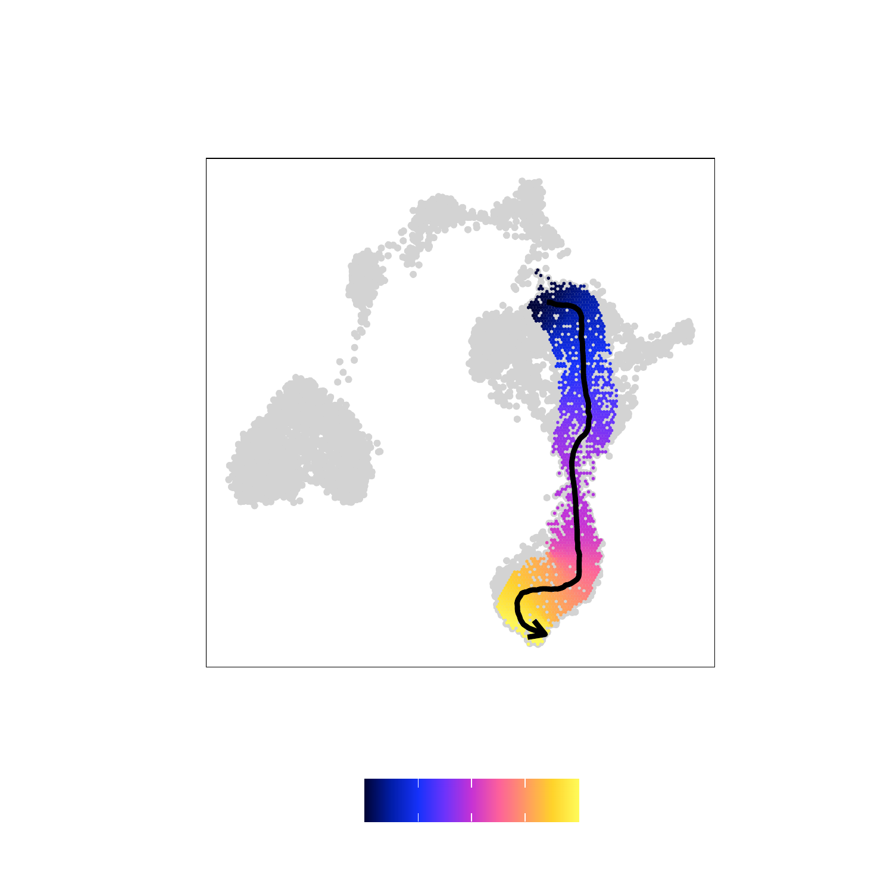{width=500 height=500}

To save a nice looking pdf we use plotPDF which removes white pages and tries to make the plots
nice looking.

```{r eval=FALSE}
plotPDF(p, name = "Plot-MyeloidU-Traj-UMAP.pdf", ArchRProj = projHeme5, addDOC = FALSE, width = 5, height = 5)
```
> \## [1] "plotting ggplot!"  
## Warning: Removed 5678 rows containing non-finite values (stat_summary_hex).  
## Warning: Removed 5678 rows containing non-finite values (stat_summary_hex).  
## [1] "plotting ggplot!"  
## `geom_smooth()` using method = 'gam' and formula 'y ~ s(x, bs = "cs")'  
## `geom_smooth()` using method = 'gam' and formula 'y ~ s(x, bs = "cs")'  
## [1] 0  

We can overlay other features on the UMAP

```{r eval=FALSE}
projHeme5 <- addImputeWeights(projHeme5)
```
> \## 2020-04-15 15:00:28 : Computing Impute Weights Using Magic (Cell 2018), 0 mins elapsed.  
## 2020-04-15 15:00:40 : Completed Getting Magic Weights!, 0.206 mins elapsed.

```{r eval=FALSE}
p1 <- plotTrajectory(projHeme5, trajectory = "MyeloidU", colorBy = "GeneScoreMatrix", name = "CEBPB", continuousSet = "horizonExtra")
```
> \## Getting ImputeWeights  
## ArchR logging to : ArchRLogs/ArchR-plotTrajectory-15e13179524ae-Date-2020-04-15_Time-15-00-40.log  
## If there is an issue, please report to github with logFile!  
## Getting Matrix Values...  
## Getting Matrix Values...  
##   
## Imputing Matrix  
## Using weights on disk  
## Using weights on disk  
## Plotting  
## Warning: Removed 5678 rows containing non-finite values (stat_summary_hex).  
## Plotting Trajectory  
## Adding Inferred Arrow Trajectory to Plot  
## ArchR logging successful to : ArchRLogs/ArchR-plotTrajectory-15e13179524ae-Date-2020-04-15_Time-15-00-40.log  

```{r eval=FALSE}
p2 <- plotTrajectory(projHeme5, trajectory = "MyeloidU", colorBy = "GeneIntegrationMatrix", name = "CEBPB", continuousSet = "blueYellow")
```
> \## Getting ImputeWeights  
## ArchR logging to : ArchRLogs/ArchR-plotTrajectory-15e133644196a-Date-2020-04-15_Time-15-00-47.log  
## If there is an issue, please report to github with logFile!  
## Getting Matrix Values...  
## Getting Matrix Values...  
##   
## Imputing Matrix  
## Using weights on disk  
## Using weights on disk  
## Plotting  
## Warning: Removed 5678 rows containing non-finite values (stat_summary_hex).  
## Plotting Trajectory   
## Adding Inferred Arrow Trajectory to Plot  
## ArchR logging successful to : ArchRLogs/ArchR-plotTrajectory-15e133644196a-Date-2020-04-15_Time-15-00-47.log  

```{r eval=FALSE}
ggAlignPlots(p1[[1]], p2[[1]], type = "h")
```
> \## Warning: Removed 5678 rows containing non-finite values (stat_summary_hex).  
## Warning: Removed 5678 rows containing non-finite values (stat_summary_hex).

```{r, include=FALSE, eval=FALSE}
plotPDF(
    ggAlignPlots(p1[[1]], p2[[1]], type = "h", draw = FALSE), 
    name = "Plot-UMAP-CEBPB-Combined.pdf", 
    ArchRProj = projHeme5,
    addDOC = FALSE,
    width = 10, 
    height = 5
)

plotPDF(
    ggAlignPlots(p1[[2]], p2[[2]], type = "h", draw = FALSE), 
    name = "Plot-UMAP-CEBPB-Combined2.pdf", 
    ArchRProj = projHeme5,
    addDOC = FALSE,
    width = 10, 
    height = 5
)
ArchR:::.convertToPNG(ArchRProj = projHeme2)
system("cp Figures/*.png images/HemeWalkthrough/PNG/")
system("cp Figures/*.pdf images/HemeWalkthrough/PDF/")
```

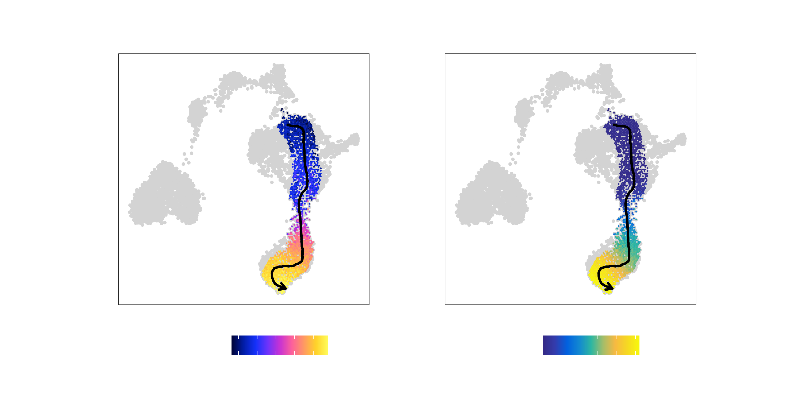{width=800 height=400}

```{r eval=FALSE}
ggAlignPlots(p1[[2]], p2[[2]], type = "h")
```
> \## `geom_smooth()` using method = 'gam' and formula 'y ~ s(x, bs = "cs")'  
## `geom_smooth()` using method = 'gam' and formula 'y ~ s(x, bs = "cs")'

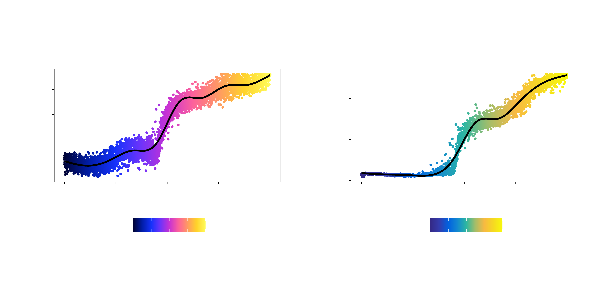{width=800 height=400}


We can then make a heatmap for

```{r eval=FALSE}
trajMM  <- getTrajectory(ArchRProj = projHeme5, name = "MyeloidU", useMatrix = "MotifMatrix", log2Norm = FALSE)
```
> \## Creating Trajectory Group Matrix..  
## Some values are below 0, this could be a DeviationsMatrix in which scaleTo should be set = NULL.  
## Continuing without depth normalization!  
## Smoothing...

```{r eval=FALSE}
p1 <- trajectoryHeatmap(trajMM, pal = paletteContinuous(set = "solarExtra"))
```
> \## ArchR logging to : ArchRLogs/ArchR-trajectoryHeatmap-15e131c8ea2de-Date-2020-04-15_Time-15-01-31.log  
## If there is an issue, please report to github with logFile!  
## useSeqnames is NULL or greater than 1 with a Sparse.Assays.Matrix trajectory input.  
## 2020-04-15 15:01:31 :  
## force=FALSE thus continuing with subsetting useSeqnames = z  
## 2020-04-15 15:01:31 :  
## Removing rows with NA values...  
## 2020-04-15 15:01:31 :  
## Preparing Main Heatmap..  
## ArchR logging successful to : ArchRLogs/ArchR-trajectoryHeatmap-15e131c8ea2de-Date-2020-04-15_Time-15-01-31.log  

```{r, include=FALSE, eval=FALSE}
plotPDF(p1, name = "Plot-MyeloidU-Traj-Heatmaps.pdf", ArchRProj = projHeme5, addDOC = FALSE, width = 6, height = 8)
ArchR:::.convertToPNG(ArchRProj = projHeme2)
system("cp Figures/*.png images/HemeWalkthrough/PNG/")
system("cp Figures/*.pdf images/HemeWalkthrough/PDF/")
```

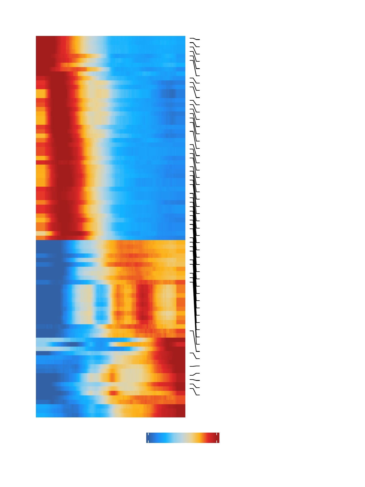{width=600 height=800}

```{r eval=FALSE}
trajGSM <- getTrajectory(ArchRProj = projHeme5, name = "MyeloidU", useMatrix = "GeneScoreMatrix", log2Norm = TRUE)
```
> \## Creating Trajectory Group Matrix..  
## Smoothing...

```{r eval=FALSE}
p2 <- trajectoryHeatmap(trajGSM,  pal = paletteContinuous(set = "horizonExtra"))
```
> \## ArchR logging to : ArchRLogs/ArchR-trajectoryHeatmap-15e132f1f4173-Date-2020-04-15_Time-15-01-51.log  
## If there is an issue, please report to github with logFile!  
## Preparing Main Heatmap..  
## ArchR logging successful to : ArchRLogs/ArchR-trajectoryHeatmap-15e132f1f4173-Date-2020-04-15_Time-15-01-51.log  

```{r, include=FALSE, eval=FALSE}
plotPDF(p1, p2, name = "Plot-MyeloidU-Traj-Heatmaps.pdf", ArchRProj = projHeme5, addDOC = FALSE, width = 6, height = 8)
ArchR:::.convertToPNG(ArchRProj = projHeme2)
system("cp Figures/*.png images/HemeWalkthrough/PNG/")
system("cp Figures/*.pdf images/HemeWalkthrough/PDF/")
```

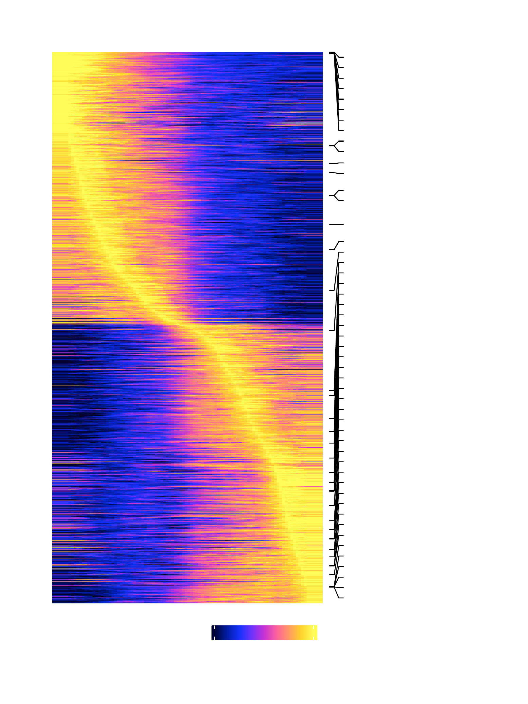{width=600 height=800}


```{r eval=FALSE}
trajGIM <- getTrajectory(ArchRProj = projHeme5, name = "MyeloidU", useMatrix = "GeneIntegrationMatrix", log2Norm = FALSE)
```
> \## Creating Trajectory Group Matrix..  
## Smoothing...

```{r eval=FALSE}
p3 <- trajectoryHeatmap(trajGIM,  pal = paletteContinuous(set = "blueYellow"))
```
> \## ArchR logging to : ArchRLogs/ArchR-trajectoryHeatmap-15e1333158a4-Date-2020-04-15_Time-15-02-18.log  
## If there is an issue, please report to github with logFile!  
## Preparing Main Heatmap..  
## ArchR logging successful to : ArchRLogs/ArchR-trajectoryHeatmap-15e1333158a4-Date-2020-04-15_Time-15-02-18.log  

```{r, include=FALSE, eval=FALSE}
plotPDF(p1, p2, p3, name = "Plot-MyeloidU-Traj-Heatmaps.pdf", ArchRProj = projHeme5, addDOC = FALSE, width = 6, height = 8)
ArchR:::.convertToPNG(ArchRProj = projHeme2)
system("cp Figures/*.png images/HemeWalkthrough/PNG/")
system("cp Figures/*.pdf images/HemeWalkthrough/PDF/")
```

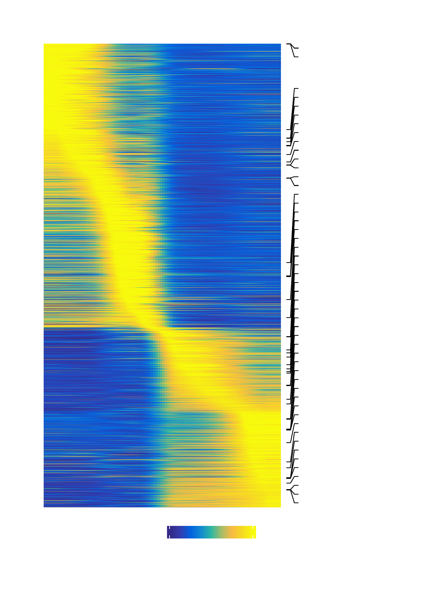{width=600 height=800}

```{r eval=FALSE}
trajPM  <- getTrajectory(ArchRProj = projHeme5, name = "MyeloidU", useMatrix = "PeakMatrix", log2Norm = TRUE)
```
> \## Creating Trajectory Group Matrix..  
## Smoothing...

```{r eval=FALSE}
p4 <- trajectoryHeatmap(trajPM, pal = paletteContinuous(set = "solarExtra"))
```
> \## ArchR logging to : ArchRLogs/ArchR-trajectoryHeatmap-15e131ecfb872-Date-2020-04-15_Time-15-03-01.log  
## If there is an issue, please report to github with logFile!  
## Preparing Main Heatmap..  
## ArchR logging successful to : ArchRLogs/ArchR-trajectoryHeatmap-15e131ecfb872-Date-2020-04-15_Time-15-03-01.log  

```{r, include=FALSE, eval=FALSE}
plotPDF(p1, p2, p3, p4, name = "Plot-MyeloidU-Traj-Heatmaps.pdf", ArchRProj = projHeme5, addDOC = FALSE, width = 6, height = 8)
ArchR:::.convertToPNG(ArchRProj = projHeme2)
system("cp Figures/*.png images/HemeWalkthrough/PNG/")
system("cp Figures/*.pdf images/HemeWalkthrough/PDF/")
```

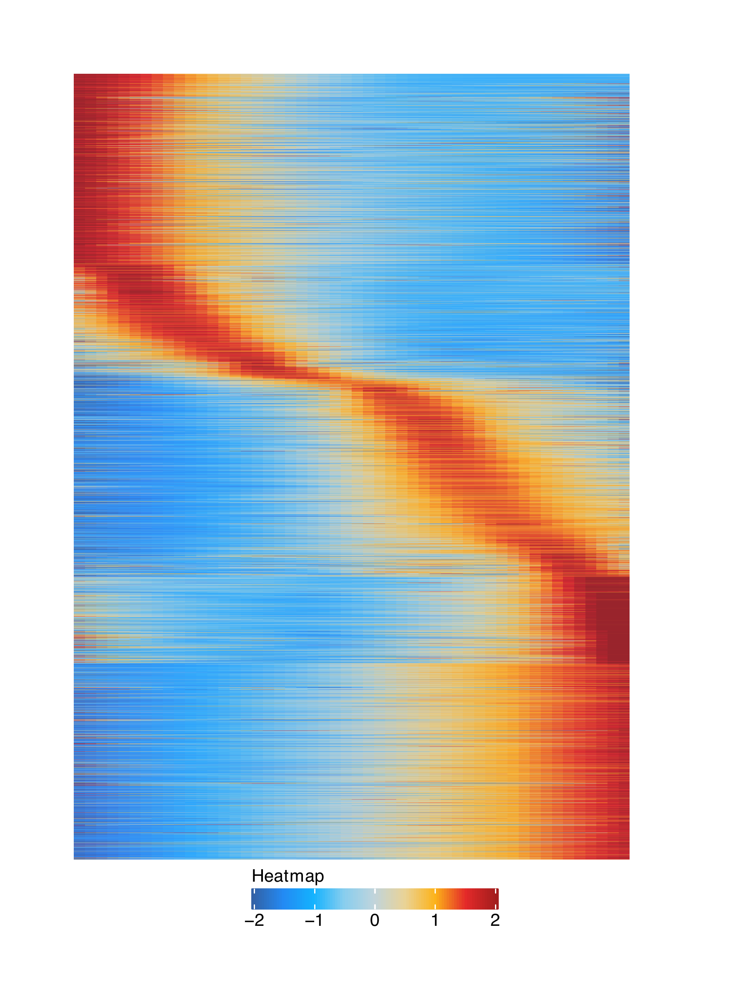{width=600 height=800}

To save a nice looking pdf we use plotPDF which removes white pages and tries to make the plots
nice looking.

```{r eval=FALSE}
plotPDF(p1, p2, p3, p4, name = "Plot-MyeloidU-Traj-Heatmaps.pdf", ArchRProj = projHeme5, addDOC = FALSE, width = 6, height = 8)
```
> \## [1] 0

We can also perform integrative analyses such as identifying positive regulators with RNA

```{r eval=FALSE}
#Gene Scores
corGSM_MM <- correlateTrajectories(trajGSM, trajMM)
```
> \## ArchR logging to : ArchRLogs/ArchR-correlateTrajectories-15e13b9ca02a-Date-2020-04-15_Time-15-03-37.log  
## If there is an issue, please report to github with logFile!  
## Found 36 Correlated Pairings!  
## 2020-04-15 15:03:56 :  

```{r eval=FALSE}
corGSM_MM[[1]]$matchname1
```
> \##  [1] "PRDM16" "TAL1"   "JUN"    "ATF3"   "GATA3"  "GATA3"  "ZEB1"   "NFKB2"   
##  [9] "IRF7"   "KLF12"  "FOS"    "MEF2A"  "IRF8"   "NR1D1"  "HOXB1"  "JUNB"    
## [17] "NFIX"   "LYL1"   "KLF2"   "FOSB"   "NR1H2"  "KLF11"  "GLI2"   "NR4A2"   
## [25] "TCF15"  "CEBPB"  "ETS2"   "XBP1"   "GATA2"  "MECOM"  "IRF1"   "CEBPD"   
## [33] "SNAI2"  "NFIL3"  "KLF4"   "RXRA"  

```{r eval=FALSE}
corGSM_MM[[1]]
```
> \## DataFrame with 36 rows and 12 columns  
##          idx1      idx2 matchname1 matchname2       name1        name2  
##     <integer> <integer>    <array>    <array> <character>  <character>  
## 1          82      1081     PRDM16     PRDM16 chr1:PRDM16 z:PRDM16_211  
## 2         731       932       TAL1       TAL1   chr1:TAL1    z:TAL1_62  
## 3         818      1013        JUN        JUN    chr1:JUN    z:JUN_143  
## 4        2034      1002       ATF3       ATF3   chr1:ATF3   z:ATF3_132  
## 5        2369      1254      GATA3      GATA3 chr10:GATA3  z:GATA3_384  
## ...       ...       ...        ...        ...         ...          ...  
## 32      20775      1022      CEBPD      CEBPD  chr8:CEBPD  z:CEBPD_152  
## 33      20780      1031      SNAI2      SNAI2  chr8:SNAI2  z:SNAI2_161  
## 34      21658      1003      NFIL3      NFIL3  chr9:NFIL3  z:NFIL3_133  
## 35      21793      1078       KLF4       KLF4   chr9:KLF4   z:KLF4_208  
## 36      22097      1565       RXRA       RXRA   chr9:RXRA   z:RXRA_695  
##           Correlation         VarAssay1         VarAssay2            TStat  
##             <numeric>         <numeric>         <numeric>        <numeric>  
## 1   0.859588836579798 0.999783802481948 0.860344827586207 16.6530781620713  
## 2   0.687938524545333 0.866735849872443 0.987931034482759 9.38348743943718  
## 3   0.530335586469274 0.993989708998141 0.963218390804598 6.19265152142139  
## 4   0.776280918431044 0.985168850261599 0.936781609195402 12.1905867620732  
## 5   0.714559116657296 0.801573917931422 0.989655172413793  10.111530171907  
## ...               ...               ...               ...              ...  
## 32   0.73809434207349 0.993816750983699 0.998275862068966 10.8296844080467  
## 33  0.643337129188769  0.87252994335625 0.983333333333333 8.31877485229719  
## 34  0.833740261914099 0.992303368357331 0.893103448275862 14.9479403447508  
## 35   0.82265894955927 0.998702814891685 0.905747126436782 14.3243696597426  
## 36   0.59509316489084  0.88640982401522 0.890229885057471 7.33039570155334  
##                     Pval                  FDR  
##                <numeric>            <numeric>  
## 1   2.47466579579935e-30 4.04855324192774e-27  
## 2   2.63756432350363e-15 1.00350121703533e-13  
## 3   1.38781951660218e-08 1.55511830764464e-07  
## 4   2.36537648993666e-21 3.22479661461365e-19  
## 5    6.9322610846337e-17 3.78039304482025e-15  
## ...                  ...                  ...  
## 32  1.93304822797782e-18 1.31769454207155e-16  
## 33  5.27319420246801e-13  1.3914428572964e-11  
## 34  5.06319064599113e-27 2.70186610322912e-24  
## 35   8.9984663184347e-26 2.45358181615986e-23  
## 36  6.60626612679289e-11 1.25672690505037e-09  

```{r eval=FALSE}
#We can plot these identified regulators
trajGSM2 <- trajGSM[corGSM_MM[[1]]$name1, ]
trajMM2 <- trajMM[corGSM_MM[[1]]$name2, ]

#To Order We Can Create a Trajectory of these assays Multiplied
trajCombined <- trajGSM2
assay(trajCombined) <- t(apply(assay(trajGSM2), 1, scale)) + t(apply(assay(trajMM2), 1, scale))

#We can get the row order from the heatmap function
combinedMat <- trajectoryHeatmap(trajCombined, returnMat = TRUE, varCutOff = 0)
```
> \## ArchR logging to : ArchRLogs/ArchR-trajectoryHeatmap-15e136ff55add-Date-2020-04-15_Time-15-03-56.log  
## If there is an issue, please report to github with logFile!  
## Preparing Main Heatmap..  
## ArchR logging successful to : ArchRLogs/ArchR-trajectoryHeatmap-15e136ff55add-Date-2020-04-15_Time-15-03-56.log  

```{r eval=FALSE}
rowOrder <- match(rownames(combinedMat), rownames(trajGSM2))

#Now we can plot the heatmaps
ht1 <- trajectoryHeatmap(trajGSM2,  pal = paletteContinuous(set = "horizonExtra"),  varCutOff = 0, rowOrder = rowOrder)
```
> \## ArchR logging to : ArchRLogs/ArchR-trajectoryHeatmap-15e13aac5f3b-Date-2020-04-15_Time-15-03-57.log  
## If there is an issue, please report to github with logFile!  
## Preparing Main Heatmap..  
## ArchR logging successful to : ArchRLogs/ArchR-trajectoryHeatmap-15e13aac5f3b-Date-2020-04-15_Time-15-03-57.log  

```{r eval=FALSE}
ht2 <- trajectoryHeatmap(trajMM2, pal = paletteContinuous(set = "solarExtra"), varCutOff = 0, rowOrder = rowOrder)
```
> \## ArchR logging to : ArchRLogs/ArchR-trajectoryHeatmap-15e1323caf784-Date-2020-04-15_Time-15-03-57.log  
## If there is an issue, please report to github with logFile!  
## useSeqnames is NULL or greater than 1 with a Sparse.Assays.Matrix trajectory input.  
## 2020-04-15 15:03:58 :  
## force=FALSE thus continuing with subsetting useSeqnames = z  
## 2020-04-15 15:03:58 :  
## Preparing Main Heatmap..  
## ArchR logging successful to : ArchRLogs/ArchR-trajectoryHeatmap-15e1323caf784-Date-2020-04-15_Time-15-03-57.log  

```{r eval=FALSE}
ht1 + ht2
```

```{r, include=FALSE, eval=FALSE}
plotPDF(ht1 + ht2, name = "Plot-MyeloidU-GS-TF.pdf", ArchRProj = projHeme5, addDOC = FALSE, width = 8, height = 6)
ArchR:::.convertToPNG(ArchRProj = projHeme2)
system("cp Figures/*.png images/HemeWalkthrough/PNG/")
system("cp Figures/*.pdf images/HemeWalkthrough/PDF/")
```

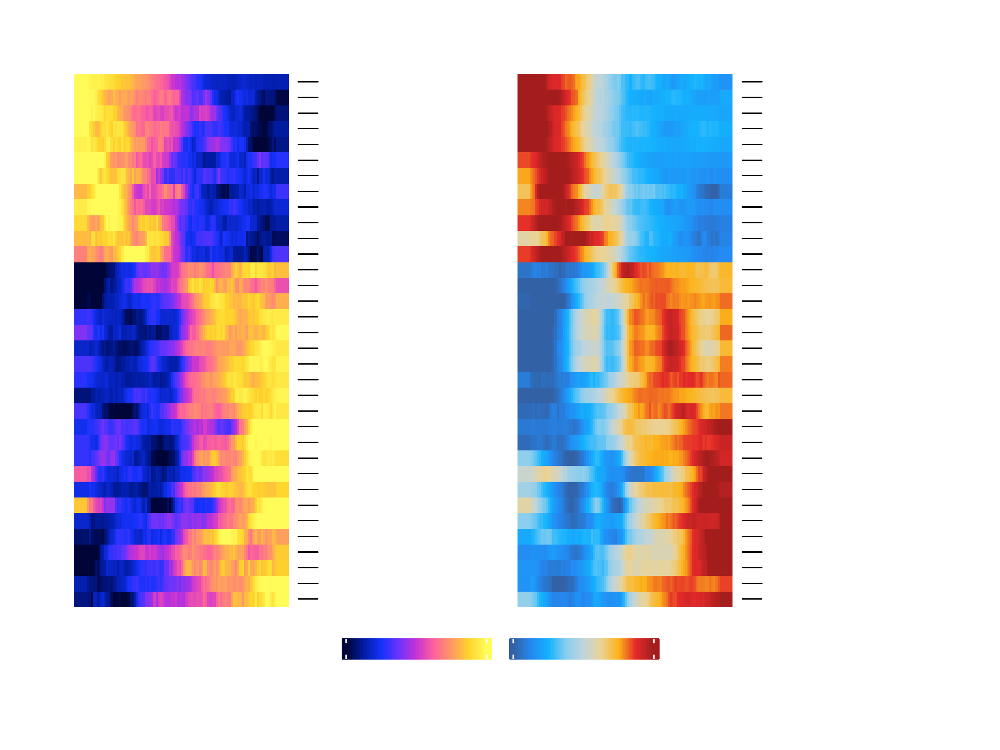{width=800 height=600}

```{r eval=FALSE}
#Gene Expression
corGIM_MM <- correlateTrajectories(trajGIM, trajMM)
```
> \## ArchR logging to : ArchRLogs/ArchR-correlateTrajectories-15e13f7dfd04-Date-2020-04-15_Time-15-04-14.log  
## If there is an issue, please report to github with logFile!  
## Found 54 Correlated Pairings!  
## 2020-04-15 15:04:30 :  

```{r eval=FALSE}
corGIM_MM[[1]]$matchname1
```
> \##  [1] "RUNX3"   "NFIA"    "MEF2D"   "USF1"    "ATF3"    "ZEB1"    "NFKB2"    
##  [8] "IRF7"    "SPI1"    "ESRRA"   "STAT2"   "FOS"     "JDP2"    "KLF13"   
## [15] "CTCF"    "IRF8"    "RARA"    "MLX"     "MBD2"    "TCF4"    "HMG20B"   
## [22] "JUNB"    "LYL1"    "KLF2"    "JUND"    "CEBPA"   "USF2"    "FOSB"   
## [29] "FOSL2"   "REL"     "NR4A2"   "SP3"     "NFE2L2"  "STAT1"   "KLF7"   
## [36] "TGIF2"   "CEBPB"   "BACH1"   "RUNX1"   "BHLHE40" "GATA2"   "HLTF"   
## [43] "REST"    "MEF2C"   "RREB1"   "TFEB"    "PLAGL1"  "CREB5"   "CEBPD"   
## [50] "KLF10"   "NFIL3"   "KLF4"    "RXRA"    "TFE3"  

```{r eval=FALSE}
corGIM_MM[[1]]
```
> \## DataFrame with 54 rows and 12 columns  
##          idx1      idx2 matchname1 matchname2       name1       name2  
##     <integer> <integer>    <array>    <array> <character> <character>  
## 1         295      1601      RUNX3      RUNX3  chr1:RUNX3 z:RUNX3_731  
## 2         680      1612       NFIA       NFIA   chr1:NFIA  z:NFIA_742  
## 3        1227      1512      MEF2D      MEF2D  chr1:MEF2D z:MEF2D_642  
## 4        1317       930       USF1       USF1   chr1:USF1   z:USF1_60  
## 5        1664      1002       ATF3       ATF3   chr1:ATF3  z:ATF3_132  
## ...       ...       ...        ...        ...         ...         ...  
## 50      16981      1696      KLF10      KLF10  chr8:KLF10 z:KLF10_826  
## 51      17463      1003      NFIL3      NFIL3  chr9:NFIL3 z:NFIL3_133  
## 52      17560      1078       KLF4       KLF4   chr9:KLF4  z:KLF4_208  
## 53      17803      1565       RXRA       RXRA   chr9:RXRA  z:RXRA_695  
## 54      18090       888       TFE3       TFE3   chrX:TFE3   z:TFE3_18  
##           Correlation         VarAssay1         VarAssay2            TStat  
##             <numeric>         <numeric>         <numeric>        <numeric>  
## 1   0.506721180509532 0.871189720982743  0.98448275862069 5.81861222342308  
## 2   0.899884055575892 0.878017310897264 0.919540229885057 20.4260514493749  
## 3   0.787682536829653 0.815493790656416 0.841379310344828  12.656866457322  
## 4   0.653303634000368 0.804204075049728 0.875287356321839 8.54234597517229  
## 5   0.847460093565636 0.813020805333047 0.936781609195402 15.8034906427774  
## ...               ...               ...               ...              ...  
## 50   0.57964654735637 0.953335842159024 0.864367816091954 7.04188649257934  
## 51  0.849563937747037 0.933928283425622 0.893103448275862 15.9440428922802  
## 52  0.820699669277503  0.98876404494382 0.905747126436782 14.2196070232556  
## 53  0.899871735441299 0.960485995376593 0.890229885057471  20.424581355724  
## 54  0.832322259515336 0.801247244771786 0.886206896551724 14.8650341763864  
##                     Pval                  FDR  
##                <numeric>            <numeric>  
## 1   7.47838268446286e-08 2.00835886256963e-07  
## 2   4.28849849649256e-37 2.40519926139511e-35  
## 3   2.45911764921563e-22  2.0096926995314e-21  
## 4    1.7427906036477e-13 7.90509804908143e-13  
## 5   1.05531067509617e-28  1.5631789374862e-27  
## ...                  ...                  ...  
## 50  2.63272438071192e-10 8.66605108651006e-10  
## 51  5.63648466586524e-29 9.05658892074619e-28  
## 52  1.46590261078753e-25  1.5687313439583e-24  
## 53  4.31312103836676e-37 2.40519926139511e-35  
## 54   7.4030081939147e-27 8.88360983269764e-26  

```{r eval=FALSE}
#We can plot these identified regulators
trajGIM2 <- trajGIM[corGIM_MM[[1]]$name1, ]
trajMM2 <- trajMM[corGIM_MM[[1]]$name2, ]

#To Order We Can Create a Trajectory of these assays Multiplied
trajCombined <- trajGIM2
assay(trajCombined) <- t(apply(assay(trajGIM2), 1, scale)) + t(apply(assay(trajMM2), 1, scale))

#We can get the row order from the heatmap function
combinedMat <- trajectoryHeatmap(trajCombined, returnMat = TRUE, varCutOff = 0)
```
> \## ArchR logging to : ArchRLogs/ArchR-trajectoryHeatmap-15e137bbcc972-Date-2020-04-15_Time-15-04-30.log  
## If there is an issue, please report to github with logFile!  
## Preparing Main Heatmap..  
## ArchR logging successful to : ArchRLogs/ArchR-trajectoryHeatmap-15e137bbcc972-Date-2020-04-15_Time-15-04-30.log  

```{r eval=FALSE}
rowOrder <- match(rownames(combinedMat), rownames(trajGIM2))

#Now we can plot the heatmaps
ht1 <- trajectoryHeatmap(trajGIM2,  pal = paletteContinuous(set = "blueYellow"),  varCutOff = 0, rowOrder = rowOrder)
```
> \## ArchR logging to : ArchRLogs/ArchR-trajectoryHeatmap-15e1331e06f29-Date-2020-04-15_Time-15-04-31.log  
## If there is an issue, please report to github with logFile!  
## Preparing Main Heatmap..  
## ArchR logging successful to : ArchRLogs/ArchR-trajectoryHeatmap-15e1331e06f29-Date-2020-04-15_Time-15-04-31.log  

```{r eval=FALSE}
ht2 <- trajectoryHeatmap(trajMM2, pal = paletteContinuous(set = "solarExtra"), varCutOff = 0, rowOrder = rowOrder)
```
> \## ArchR logging to : ArchRLogs/ArchR-trajectoryHeatmap-15e1345e2da25-Date-2020-04-15_Time-15-04-32.log  
## If there is an issue, please report to github with logFile!   
## useSeqnames is NULL or greater than 1 with a Sparse.Assays.Matrix trajectory input.  
## 2020-04-15 15:04:32 :  
## force=FALSE thus continuing with subsetting useSeqnames = z  
## 2020-04-15 15:04:32 :    
## Preparing Main Heatmap..  
## ArchR logging successful to : ArchRLogs/ArchR-trajectoryHeatmap-15e1345e2da25-Date-2020-04-15_Time-15-04-32.log  

```{r eval=FALSE}
ht1 + ht2
```

```{r, include=FALSE, eval=FALSE}
plotPDF(ht1 + ht2, name = "Plot-MyeloidU-GEx-TF.pdf", ArchRProj = projHeme5, addDOC = FALSE, width = 8, height = 6)
ArchR:::.convertToPNG(ArchRProj = projHeme2)
system("cp Figures/*.png images/HemeWalkthrough/PNG/")
system("cp Figures/*.pdf images/HemeWalkthrough/PDF/")
```

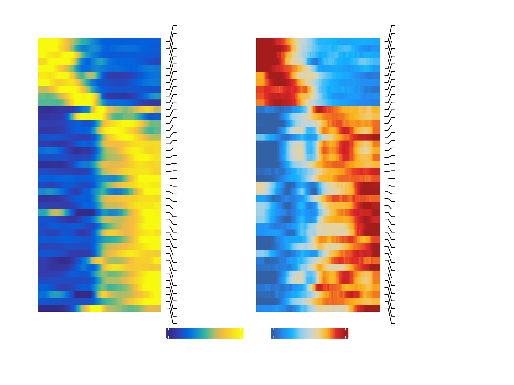{width=800 height=600}


## Lymphoid Trajectory

```{r eval=FALSE}
p1 <- plotEmbedding(ArchRProj = projHeme5, colorBy = "cellColData", name = "Clusters", embedding = "UMAP")
```
> \## ArchR logging to : ArchRLogs/ArchR-plotEmbedding-15e1340853c58-Date-2020-04-15_Time-15-04-41.log  
## If there is an issue, please report to github with logFile!  
## Getting UMAP Embedding  
## ColorBy = cellColData  
## Plotting Embedding  
## 1   
## ArchR logging successful to : ArchRLogs/ArchR-plotEmbedding-15e1340853c58-Date-2020-04-15_Time-15-04-41.log  

```{r eval=FALSE}
p2 <- plotEmbedding(ArchRProj = projHeme5, colorBy = "cellColData", name = "Clusters2", embedding = "UMAP")
```
> \## ArchR logging to : ArchRLogs/ArchR-plotEmbedding-15e1326401e05-Date-2020-04-15_Time-15-04-42.log  
## If there is an issue, please report to github with logFile!  
## Getting UMAP Embedding  
## ColorBy = cellColData  
## Plotting Embedding  
## 1   
## ArchR logging successful to : ArchRLogs/ArchR-plotEmbedding-15e1326401e05-Date-2020-04-15_Time-15-04-42.log  

```{r eval=FALSE}
ggAlignPlots(p1, p2, type = "h")
```

```{r, include=FALSE, eval=FALSE}
plotPDF(
    ggAlignPlots(p1, p2, type = "h", draw=FALSE), 
    name = "Plot-UMAP-Clusters12-Combined.pdf", 
    ArchRProj = projHeme5,
    addDOC = FALSE,
    width = 10, 
    height = 5
)
ArchR:::.convertToPNG(ArchRProj = projHeme2)
system("cp Figures/*.png images/HemeWalkthrough/PNG/")
system("cp Figures/*.pdf images/HemeWalkthrough/PDF/")
```

{width=800 height=400}

```{r eval=FALSE}
#Trajectory to add
trajectory <- c("Progenitor", "CLP", "PreB", "B")
trajectory
```
> \## [1] "Progenitor" "CLP"        "PreB"       "B"

```{r eval=FALSE}
#First we need to create a Trajectory and add it to ArchRProj cellColData
projHeme5 <- addTrajectory(
    ArchRProj = projHeme5, 
    name = "LymphoidU", 
    groupBy = "Clusters2",
    trajectory = trajectory, 
    embedding = "UMAP", 
    force = TRUE
)
```
> \## ArchR logging to : ArchRLogs/ArchR-addTrajectory-15e1351d16b68-Date-2020-04-15_Time-15-04-55.log  
## If there is an issue, please report to github with logFile!  
## Filtering outliers  
## Initial Alignment Before Spline Fit  
## Spline Fit   
## KNN to Spline  
## Aligning cells not in trajectory  
## ArchR logging successful to : ArchRLogs/ArchR-addTrajectory-15e1351d16b68-Date-2020-04-15_Time-15-04-55.log  

```{r eval=FALSE}
head(projHeme5$LymphoidU[!is.na(projHeme5$LymphoidU)]) #NA means not in trajectory
```
> \## [1] 87.630792 81.913303 84.342302 81.763827 83.632287  4.073244

```{r eval=FALSE}
p <- plotTrajectory(projHeme5, trajectory = "LymphoidU", colorBy = "colData", name = "LymphoidU")
```
> \## ArchR logging to : ArchRLogs/ArchR-plotTrajectory-15e1377b52455-Date-2020-04-15_Time-15-04-56.log  
## If there is an issue, please report to github with logFile!  
## Plotting  
## Warning: Removed 7575 rows containing non-finite values (stat_summary_hex).  
## Plotting Trajectory  
## Adding Inferred Arrow Trajectory to Plot  
## ArchR logging successful to : ArchRLogs/ArchR-plotTrajectory-15e1377b52455-Date-2020-04-15_Time-15-04-56.log  

```{r eval=FALSE}
p[[1]]
```
> \## Warning: Removed 7575 rows containing non-finite values (stat_summary_hex).

```{r, include=FALSE, eval=FALSE}
plotPDF(p, name = "Plot-LymphoidU-Traj-UMAP.pdf", ArchRProj = projHeme5, addDOC = FALSE, width = 5, height = 5)
ArchR:::.convertToPNG(ArchRProj = projHeme2)
system("cp Figures/*.png images/HemeWalkthrough/PNG/")
system("cp Figures/*.pdf images/HemeWalkthrough/PDF/")
```

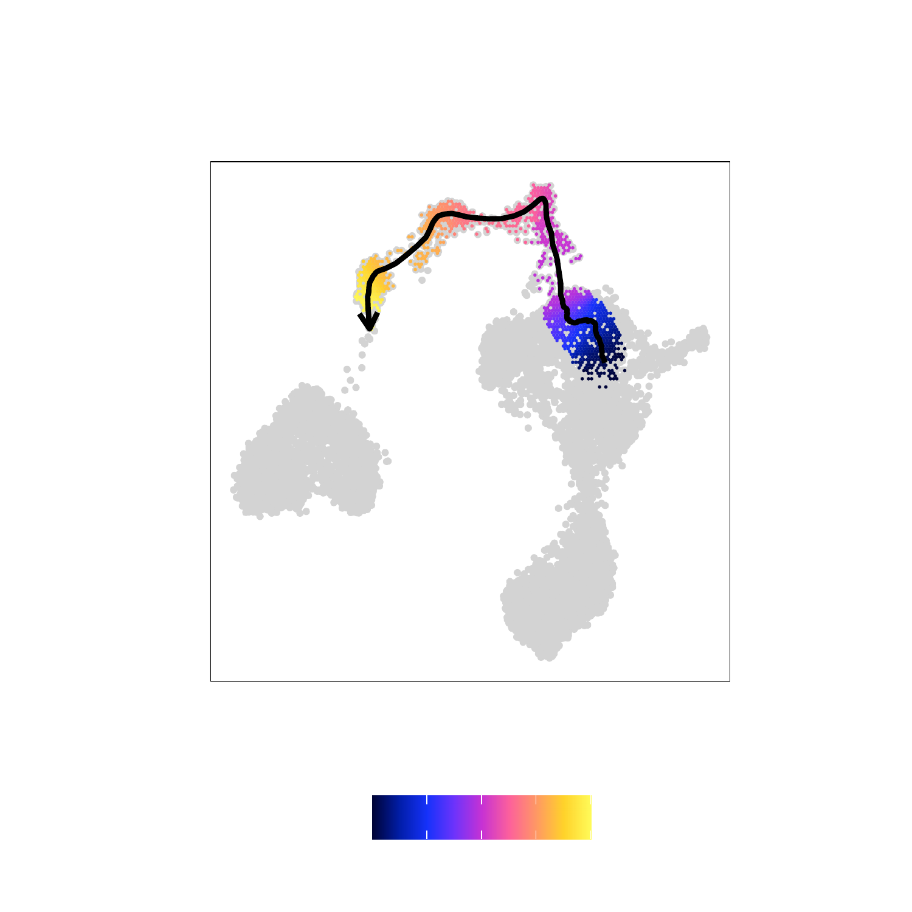{width=500 height=500}

To save a nice looking pdf we use plotPDF which removes white pages and tries to make the plots
nice looking.

```{r eval=FALSE}
plotPDF(p, name = "Plot-LymphoidU-Traj-UMAP.pdf", ArchRProj = projHeme5, addDOC = FALSE, width = 5, height = 5)
```
> \## [1] "plotting ggplot!"  
## Warning: Removed 7575 rows containing non-finite values (stat_summary_hex).  
## Warning: Removed 7575 rows containing non-finite values (stat_summary_hex).  
## [1] "plotting ggplot!"  
## `geom_smooth()` using method = 'gam' and formula 'y ~ s(x, bs = "cs")'  
## `geom_smooth()` using method = 'gam' and formula 'y ~ s(x, bs = "cs")'  
## [1] 0  

We can overlay other features on the UMAP

```{r eval=FALSE}
p1 <- plotTrajectory(projHeme5, trajectory = "LymphoidU", colorBy = "GeneScoreMatrix", name = "PAX5", continuousSet = "horizonExtra")
```
> \## Getting ImputeWeights  
## ArchR logging to : ArchRLogs/ArchR-plotTrajectory-15e13576dc585-Date-2020-04-15_Time-15-05-20.log  
## If there is an issue, please report to github with logFile!  
## Getting Matrix Values...  
## Getting Matrix Values...  
##   
## Imputing Matrix  
## Using weights on disk  
## Using weights on disk  
## Plotting  
## Warning: Removed 7575 rows containing non-finite values (stat_summary_hex).  
## Plotting Trajectory  
## Adding Inferred Arrow Trajectory to Plot  
## ArchR logging successful to : ArchRLogs/ArchR-plotTrajectory-15e13576dc585-Date-2020-04-15_Time-15-05-20.log  

```{r eval=FALSE}
p2 <- plotTrajectory(projHeme5, trajectory = "LymphoidU", colorBy = "GeneIntegrationMatrix", name = "PAX5", continuousSet = "blueYellow")
```
> \## Getting ImputeWeights  
## ArchR logging to : ArchRLogs/ArchR-plotTrajectory-15e13ed9c20a-Date-2020-04-15_Time-15-05-27.log  
## If there is an issue, please report to github with logFile!  
## Getting Matrix Values...  
## Getting Matrix Values...  
##   
## Imputing Matrix  
## Using weights on disk  
## Using weights on disk  
## Plotting  
## Warning: Removed 7575 rows containing non-finite values (stat_summary_hex).  
## Plotting Trajectory  
## Adding Inferred Arrow Trajectory to Plot   
## ArchR logging successful to : ArchRLogs/ArchR-plotTrajectory-15e13ed9c20a-Date-2020-04-15_Time-15-05-27.log  

```{r eval=FALSE}
ggAlignPlots(p1[[1]], p2[[1]], type = "h")
```
> \## Warning: Removed 7575 rows containing non-finite values (stat_summary_hex).  
## Warning: Removed 7575 rows containing non-finite values (stat_summary_hex).

```{r, include=FALSE, eval=FALSE}
plotPDF(
    ggAlignPlots(p1[[1]], p2[[1]], type = "h", draw = FALSE), 
    name = "Plot-UMAP-PAX5-Combined.pdf", 
    ArchRProj = projHeme5,
    addDOC = FALSE,
    width = 10, 
    height = 5
)

plotPDF(
    ggAlignPlots(p1[[2]], p2[[2]], type = "h", draw = FALSE), 
    name = "Plot-UMAP-PAX5-Combined2.pdf", 
    ArchRProj = projHeme5,
    addDOC = FALSE,
    width = 10, 
    height = 5
)
ArchR:::.convertToPNG(ArchRProj = projHeme2)
system("cp Figures/*.png images/HemeWalkthrough/PNG/")
system("cp Figures/*.pdf images/HemeWalkthrough/PDF/")
```

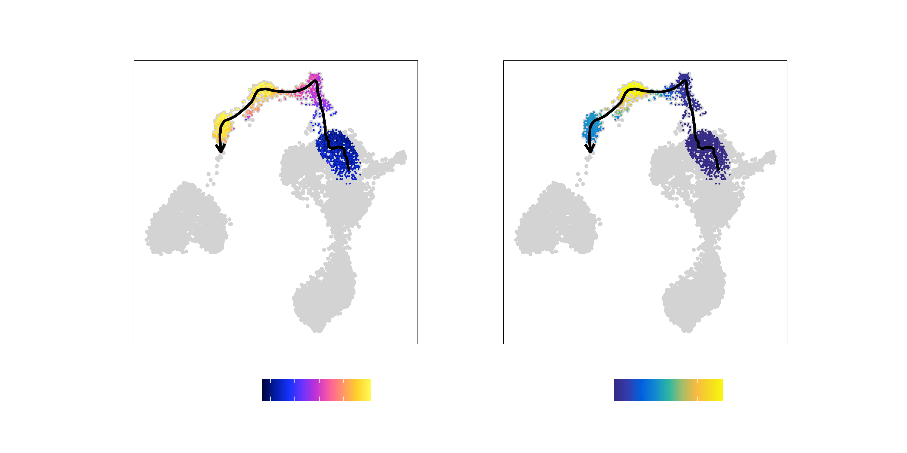{width=800 height=400}

```{r eval=FALSE}
ggAlignPlots(p1[[2]], p2[[2]], type = "h")
```
> \## `geom_smooth()` using method = 'gam' and formula 'y ~ s(x, bs = "cs")'  
## `geom_smooth()` using method = 'gam' and formula 'y ~ s(x, bs = "cs")'

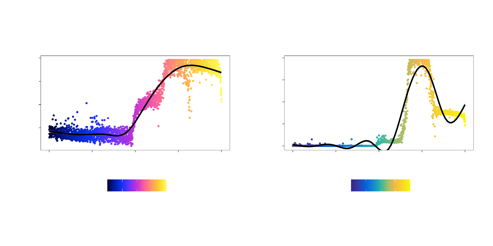{width=800 height=400}

We can then make a heatmap for

```{r eval=FALSE}
trajMM  <- getTrajectory(ArchRProj = projHeme5, name = "LymphoidU", useMatrix = "MotifMatrix", log2Norm = FALSE)
```
> \## Creating Trajectory Group Matrix..  
## Some values are below 0, this could be a DeviationsMatrix in which scaleTo should be set = NULL.  
## Continuing without depth normalization!  
## Smoothing...  

```{r eval=FALSE}
p1 <- trajectoryHeatmap(trajMM, pal = paletteContinuous(set = "solarExtra"))
```
> \## ArchR logging to : ArchRLogs/ArchR-trajectoryHeatmap-15e133830d097-Date-2020-04-15_Time-15-06-14.log  
## If there is an issue, please report to github with logFile!  
## useSeqnames is NULL or greater than 1 with a Sparse.Assays.Matrix trajectory input.  
## 2020-04-15 15:06:15 :  
## force=FALSE thus continuing with subsetting useSeqnames = z  
## 2020-04-15 15:06:15 :  
## Removing rows with NA values...  
## 2020-04-15 15:06:15 :  
## Preparing Main Heatmap..  
## ArchR logging successful to : ArchRLogs/ArchR-trajectoryHeatmap-15e133830d097-Date-2020-04-15_Time-15-06-14.log  

```{r, include=FALSE, eval=FALSE}
plotPDF(p1, name = "Plot-LymphoidU-Traj-Heatmaps.pdf", ArchRProj = projHeme5, addDOC = FALSE, width = 6, height = 8)
ArchR:::.convertToPNG(ArchRProj = projHeme2)
system("cp Figures/*.png images/HemeWalkthrough/PNG/")
system("cp Figures/*.pdf images/HemeWalkthrough/PDF/")
```

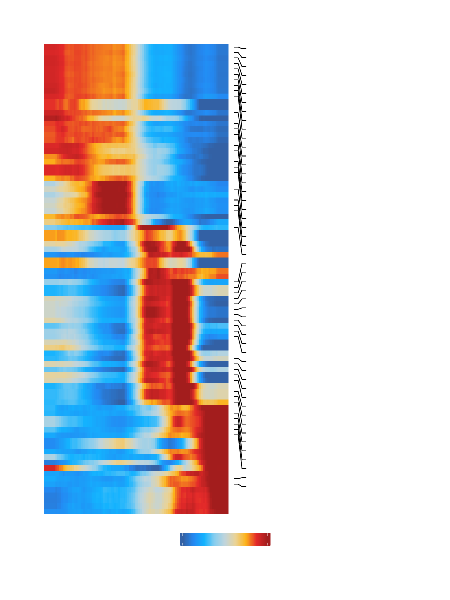{width=600 height=800}

```{r eval=FALSE}
trajGSM <- getTrajectory(ArchRProj = projHeme5, name = "LymphoidU", useMatrix = "GeneScoreMatrix", log2Norm = TRUE)
```
> \## Creating Trajectory Group Matrix..  
## Smoothing...

```{r eval=FALSE}
p2 <- trajectoryHeatmap(trajGSM,  pal = paletteContinuous(set = "horizonExtra"))
```
> \## ArchR logging to : ArchRLogs/ArchR-trajectoryHeatmap-15e13357a3282-Date-2020-04-15_Time-15-06-36.log  
## If there is an issue, please report to github with logFile!  
## Preparing Main Heatmap..  
## ArchR logging successful to : ArchRLogs/ArchR-trajectoryHeatmap-15e13357a3282-Date-2020-04-15_Time-15-06-36.log  

```{r, include=FALSE, eval=FALSE}
plotPDF(p1, p2, name = "Plot-LymphoidU-Traj-Heatmaps.pdf", ArchRProj = projHeme5, addDOC = FALSE, width = 6, height = 8)
ArchR:::.convertToPNG(ArchRProj = projHeme2)
system("cp Figures/*.png images/HemeWalkthrough/PNG/")
system("cp Figures/*.pdf images/HemeWalkthrough/PDF/")
```

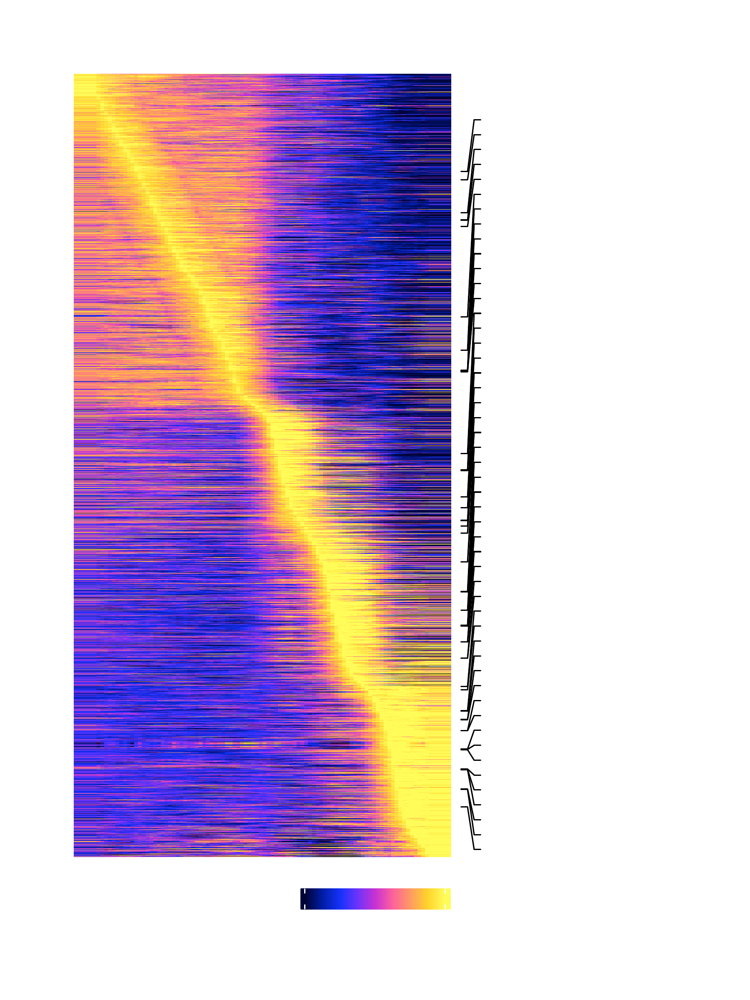{width=600 height=800}


```{r eval=FALSE}
trajGIM <- getTrajectory(ArchRProj = projHeme5, name = "LymphoidU", useMatrix = "GeneIntegrationMatrix", log2Norm = FALSE)
```
> \## Creating Trajectory Group Matrix..  
## Smoothing...

```{r eval=FALSE}
p3 <- trajectoryHeatmap(trajGIM,  pal = paletteContinuous(set = "blueYellow"))
```
> \## ArchR logging to : ArchRLogs/ArchR-trajectoryHeatmap-15e131325dad9-Date-2020-04-15_Time-15-07-06.log  
## If there is an issue, please report to github with logFile!  
## Preparing Main Heatmap..  
## ArchR logging successful to : ArchRLogs/ArchR-trajectoryHeatmap-15e131325dad9-Date-2020-04-15_Time-15-07-06.log  

```{r, include=FALSE, eval=FALSE}
plotPDF(p1, p2, p3, name = "Plot-LymphoidU-Traj-Heatmaps.pdf", ArchRProj = projHeme5, addDOC = FALSE, width = 6, height = 8)
ArchR:::.convertToPNG(ArchRProj = projHeme2)
system("cp Figures/*.png images/HemeWalkthrough/PNG/")
system("cp Figures/*.pdf images/HemeWalkthrough/PDF/")
```

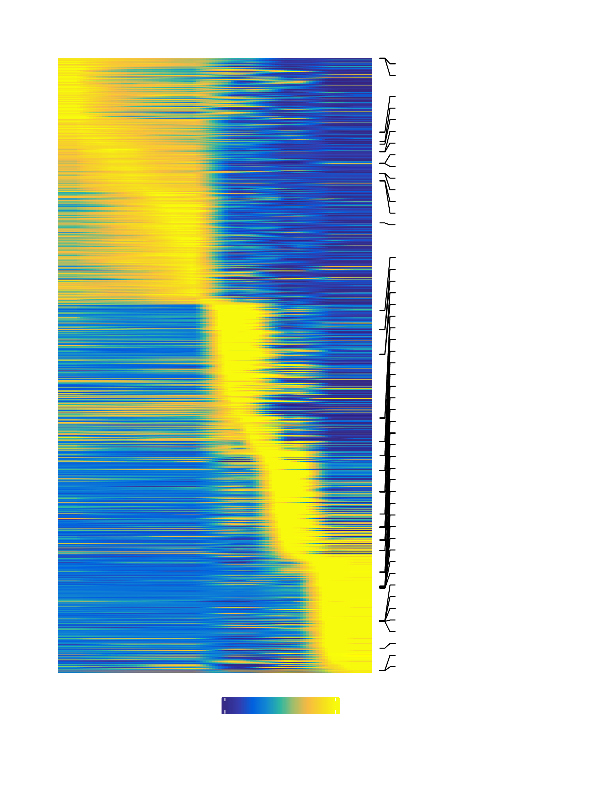{width=600 height=800}

```{r eval=FALSE}
trajPM  <- getTrajectory(ArchRProj = projHeme5, name = "LymphoidU", useMatrix = "PeakMatrix", log2Norm = TRUE)
```
> \## Creating Trajectory Group Matrix..  
## Smoothing...

```{r eval=FALSE}
p4 <- trajectoryHeatmap(trajPM, pal = paletteContinuous(set = "solarExtra"))
```
> \## ArchR logging to : ArchRLogs/ArchR-trajectoryHeatmap-15e1351d7cd4d-Date-2020-04-15_Time-15-07-48.log  
## If there is an issue, please report to github with logFile!  
## Preparing Main Heatmap..  
## ArchR logging successful to : ArchRLogs/ArchR-trajectoryHeatmap-15e1351d7cd4d-Date-2020-04-15_Time-15-07-48.log  

```{r, include=FALSE, eval=FALSE}
plotPDF(p1, p2, p3, p4, name = "Plot-LymphoidU-Traj-Heatmaps.pdf", ArchRProj = projHeme5, addDOC = FALSE, width = 6, height = 8)
ArchR:::.convertToPNG(ArchRProj = projHeme2)
system("cp Figures/*.png images/HemeWalkthrough/PNG/")
system("cp Figures/*.pdf images/HemeWalkthrough/PDF/")
```

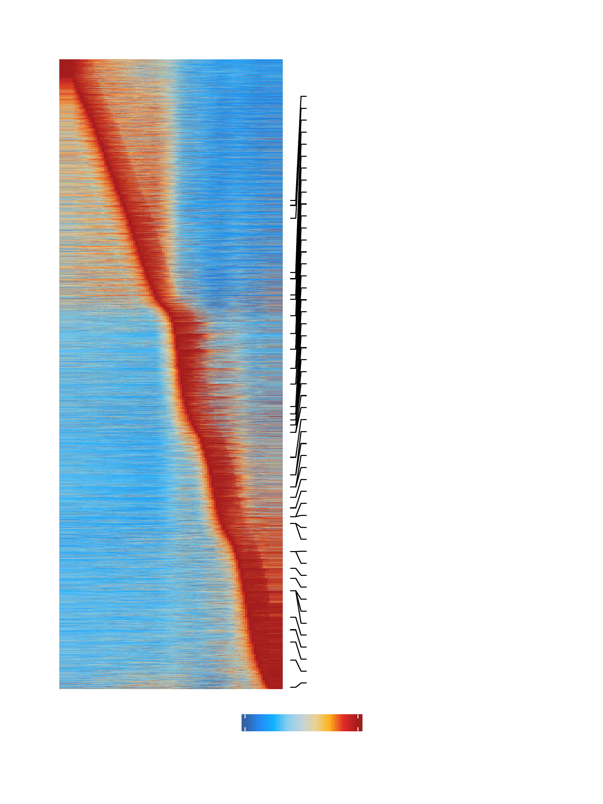{width=600 height=800}

To save a nice looking pdf we use plotPDF which removes white pages and tries to make the plots
nice looking.

```{r eval=FALSE}
plotPDF(p1, p2, p3, p4, name = "Plot-LymphoidU-Traj-Heatmaps.pdf", ArchRProj = projHeme5, addDOC = FALSE, width = 6, height = 8)
```
> \## [1] 0

We can also perform integrative analyses such as identifying positive regulators with RNA

```{r eval=FALSE}
#Gene Scores
corGSM_MM <- correlateTrajectories(trajGSM, trajMM)
```
> \## ArchR logging to : ArchRLogs/ArchR-correlateTrajectories-15e133e72f66-Date-2020-04-15_Time-15-08-26.log  
## If there is an issue, please report to github with logFile!  
## Found 16 Correlated Pairings!  
## 2020-04-15 15:08:47 :  

```{r eval=FALSE}
corGSM_MM[[1]]$matchname1
```
> \##  [1] "CREM"   "NFE2"   "FOXO1"  "JDP2"   "MAFG"   "MAFG"   "RFX2"   "KLF2"  
##  [9] "CEBPA"  "CEBPA"  "FOSL2"  "BCL11A" "GATA2"  "IRF2"   "IRF4"   "PAX5"

```{r eval=FALSE}
corGSM_MM[[1]]
```
> \## DataFrame with 16 rows and 12 columns  
##          idx1      idx2 matchname1 matchname2       name1        name2  
##     <integer> <integer>    <array>    <array> <character>  <character>  
## 1        2503       978       CREM       CREM  chr10:CREM   z:CREM_108  
## 2        5181       989       NFE2       NFE2  chr12:NFE2   z:NFE2_119  
## 3        5958      1231      FOXO1      FOXO1 chr13:FOXO1  z:FOXO1_361  
## 4        6721       995       JDP2       JDP2  chr14:JDP2   z:JDP2_125  
## 5       10077      1018       MAFG       MAFG  chr17:MAFG   z:MAFG_148  
## ...       ...       ...        ...        ...         ...          ...  
## 12      12398      1064     BCL11A     BCL11A chr2:BCL11A z:BCL11A_194  
## 13      15802      1258      GATA2      GATA2  chr3:GATA2  z:GATA2_388  
## 14      17102      1504       IRF2       IRF2   chr4:IRF2   z:IRF2_634  
## 15      18161      1502       IRF4       IRF4   chr6:IRF4   z:IRF4_632  
## 16      21499      1579       PAX5       PAX5   chr9:PAX5   z:PAX5_709  
##           Correlation         VarAssay1         VarAssay2            TStat  
##             <numeric>         <numeric>         <numeric>        <numeric>  
## 1   0.592000045415225 0.812340554330436 0.875287356321839 7.27165360687288  
## 2   0.762361661991419 0.993427595451204 0.989655172413793 11.6618731859923  
## 3   0.658467426103544 0.855580057940935 0.879310344827586 8.66119456905554  
## 4   0.649844641802372 0.819518311929779 0.991954022988506 8.46390278863183  
## 5   0.502090536187102 0.886798979547715 0.935632183908046 5.74740534991767  
## ...               ...               ...               ...              ...  
## 12  0.609993999834133 0.867557400441043 0.968965517241379 7.62062915462215  
## 13  0.549172289236984 0.945561464954382 0.986781609195402  6.5052874492361   
## 14  0.643963832332729 0.828685086695205 0.970114942528736 8.33261518735298  
## 15  0.536406221175027   0.8282526916591 0.952873563218391  6.2919464214338  
## 16  0.803092200275283 0.978942361741687 0.962068965517241 13.3425248033796  
##                     Pval                  FDR  
##                <numeric>            <numeric>  
## 1   8.76476821331047e-11  4.6198810517901e-09  
## 2   3.15171893793416e-20 1.02998174891688e-17  
## 3   9.66043618744996e-14 1.43501388457211e-11  
## 4   2.57124018372512e-13 3.50117205017237e-11  
## 5   1.02530728526766e-07 2.83957983750399e-06  
## ...                  ...                  ...  
## 12  1.62079037573397e-11 1.10348811414554e-09  
## 13  3.29134663353072e-09 1.25071172074167e-07  
## 14  4.92446003514203e-13 6.18966745955545e-11  
## 15  8.81247545774464e-09 2.93869079550097e-07  
## 16  9.15917087670499e-24 3.74152130313399e-21  

```{r eval=FALSE}
#We can plot these identified regulators
trajGSM2 <- trajGSM[corGSM_MM[[1]]$name1, ]
trajMM2 <- trajMM[corGSM_MM[[1]]$name2, ]

#To Order We Can Create a Trajectory of these assays Multiplied
trajCombined <- trajGSM2
assay(trajCombined) <- t(apply(assay(trajGSM2), 1, scale)) + t(apply(assay(trajMM2), 1, scale))

#We can get the row order from the heatmap function
combinedMat <- trajectoryHeatmap(trajCombined, returnMat = TRUE, varCutOff = 0)
```
> \## ArchR logging to : ArchRLogs/ArchR-trajectoryHeatmap-15e136c64f4ee-Date-2020-04-15_Time-15-08-47.log  
## If there is an issue, please report to github with logFile!  
## Preparing Main Heatmap..  
## ArchR logging successful to : ArchRLogs/ArchR-trajectoryHeatmap-15e136c64f4ee-Date-2020-04-15_Time-15-08-47.log  

```{r eval=FALSE}
rowOrder <- match(rownames(combinedMat), rownames(trajGSM2))

ht1 <- trajectoryHeatmap(trajGSM2,  pal = paletteContinuous(set = "horizonExtra"),  varCutOff = 0, rowOrder = rowOrder)
```
> \## ArchR logging to : ArchRLogs/ArchR-trajectoryHeatmap-15e1344a2d751-Date-2020-04-15_Time-15-08-47.log  
## If there is an issue, please report to github with logFile!  
## Preparing Main Heatmap..  
## ArchR logging successful to : ArchRLogs/ArchR-trajectoryHeatmap-15e1344a2d751-Date-2020-04-15_Time-15-08-47.log  

```{r eval=FALSE}
ht2 <- trajectoryHeatmap(trajMM2,  pal = paletteContinuous(set = "solarExtra"), varCutOff = 0, rowOrder = rowOrder)
```
> \## ArchR logging to : ArchRLogs/ArchR-trajectoryHeatmap-15e1365304b53-Date-2020-04-15_Time-15-08-48.log  
## If there is an issue, please report to github with logFile!  
## useSeqnames is NULL or greater than 1 with a Sparse.Assays.Matrix trajectory input.  
## 2020-04-15 15:08:49 :  
## force=FALSE thus continuing with subsetting useSeqnames = z  
## 2020-04-15 15:08:49 :  
## Preparing Main Heatmap..  
## ArchR logging successful to : ArchRLogs/ArchR-trajectoryHeatmap-15e1365304b53-Date-2020-04-15_Time-15-08-48.log  

```{r eval=FALSE}
ht1 + ht2
```

```{r, include=FALSE, eval=FALSE}
plotPDF(ht1 + ht2, name = "Plot-LymphoidU-GS-TF.pdf", ArchRProj = projHeme5, addDOC = FALSE, width = 8, height = 6)
ArchR:::.convertToPNG(ArchRProj = projHeme2)
system("cp Figures/*.png images/HemeWalkthrough/PNG/")
system("cp Figures/*.pdf images/HemeWalkthrough/PDF/")
```

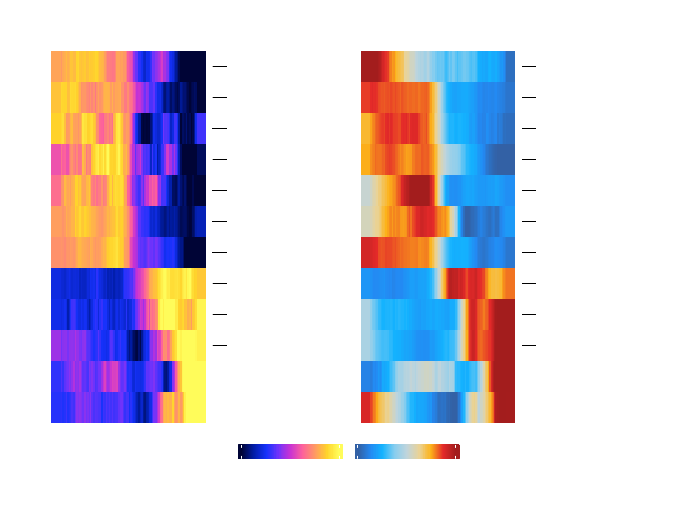{width=800 height=600}

```{r eval=FALSE}
#Gene Expression
corGIM_MM <- correlateTrajectories(trajGIM, trajMM)
```
> \## ArchR logging to : ArchRLogs/ArchR-correlateTrajectories-15e134c10b516-Date-2020-04-15_Time-15-09-05.log  
## If there is an issue, please report to github with logFile!  
## Found 37 Correlated Pairings!  
## 2020-04-15 15:09:20 :  

```{r eval=FALSE}
corGIM_MM[[1]]$matchname1
```
> \##  [1] "NFIA"    "NFKB2"   "IRF7"    "ETS1"    "NFE2"    "STAT2"   "FOXO1"  
##  [8] "IRF9"    "FOS"     "MEF2A"   "IRF8"    "MAFG"    "TCF4"    "TCF3"   
## [15] "NFIC"    "KLF2"    "CEBPA"   "POU2F2"  "FOSB"    "FOSL2"   "REL"    
## [22] "NFE2L2"  "CREB1"   "RUNX1"   "ATF4"    "SMARCC1" "FOXP1"   "GATA2"  
## [29] "HLTF"    "REST"    "LEF1"    "IRF2"    "MEF2C"   "IRF1"    "EBF1"   
## [36] "TFEB"    "PAX5"

```{r eval=FALSE}
corGIM_MM[[1]]
```
> \## DataFrame with 37 rows and 12 columns  
##          idx1      idx2 matchname1 matchname2       name1       name2  
##     <integer> <integer>    <array>    <array> <character> <character>  
## 1         680      1612       NFIA       NFIA   chr1:NFIA  z:NFIA_742  
## 2        2428      1584      NFKB2      NFKB2 chr10:NFKB2 z:NFKB2_714  
## 3        2625      1505       IRF7       IRF7  chr11:IRF7  z:IRF7_635  
## 4        3790      1202       ETS1       ETS1  chr11:ETS1  z:ETS1_332  
## 5        4287       989       NFE2       NFE2  chr12:NFE2  z:NFE2_119  
## ...       ...       ...        ...        ...         ...         ...  
## 33      14165      1510      MEF2C      MEF2C  chr5:MEF2C z:MEF2C_640  
## 34      14287      1499       IRF1       IRF1   chr5:IRF1  z:IRF1_629  
## 35      14558       937       EBF1       EBF1   chr5:EBF1   z:EBF1_67  
## 36      15164       902       TFEB       TFEB   chr6:TFEB   z:TFEB_32  
## 37      17354      1579       PAX5       PAX5   chr9:PAX5  z:PAX5_709  
##           Correlation         VarAssay1         VarAssay2            TStat  
##             <numeric>         <numeric>         <numeric>        <numeric>  
## 1   0.776554032919386 0.895435729261868 0.955747126436782 12.2013882485613  
## 2   0.842642341279197 0.893070265039514  0.88735632183908 15.4914421620131  
## 3   0.829368082571345 0.919144132035912  0.91551724137931 14.6953411117392  
## 4    0.85457028998599 0.947529702704156 0.901724137931034 16.2896821299438  
## 5   0.710070464598055 0.928874791677867 0.989655172413793 9.98300419241652  
## ...               ...               ...               ...              ...  
## 33   0.65886205886934 0.990860706413634 0.904597701149425 8.67036514488553  
## 34  0.852573236159675 0.977151766034084 0.981609195402299 16.1498641717228  
## 35  0.947958169110169 0.986344820170959 0.992528735632184 29.4737987999312  
## 36   0.71455800087286 0.934842212784259 0.842528735632184 10.1114979100535  
## 37  0.835610609654717 0.968066232998226 0.962068965517241 15.0587807907066  
##                     Pval                  FDR  
##                <numeric>            <numeric>  
## 1   2.24403341264388e-21 3.40224420626652e-20  
## 2   4.28486739529724e-28 1.38888805226876e-26  
## 3   1.61521163596779e-26 4.05409887519786e-25  
## 4   1.21844806414286e-29 5.72670590147145e-28  
## 5   1.31753444224449e-16 1.51034436062174e-15  
## ...                  ...                  ...  
## 33  9.23012667696911e-14 7.74671346102765e-13  
## 34  2.25997962853195e-29 9.23643848182623e-28  
## 35  1.65431752552523e-50 3.88764618498429e-48  
## 36  6.93337834458196e-17 8.04614277025561e-16  
## 37  3.05084830514743e-27 8.43469825540759e-26  

```{r eval=FALSE}
#We can plot these identified regulators
trajGIM2 <- trajGIM[corGIM_MM[[1]]$name1, ]
trajMM2 <- trajMM[corGIM_MM[[1]]$name2, ]

#To Order We Can Create a Trajectory of these assays Multiplied
trajCombined <- trajGIM2
assay(trajCombined) <- t(apply(assay(trajGIM2), 1, scale)) + t(apply(assay(trajMM2), 1, scale))

#We can get the row order from the heatmap function
combinedMat <- trajectoryHeatmap(trajCombined, returnMat = TRUE, varCutOff = 0)
```
> \## ArchR logging to : ArchRLogs/ArchR-trajectoryHeatmap-15e131cd6b30f-Date-2020-04-15_Time-15-09-21.log  
## If there is an issue, please report to github with logFile!  
## Preparing Main Heatmap..  
## ArchR logging successful to : ArchRLogs/ArchR-trajectoryHeatmap-15e131cd6b30f-Date-2020-04-15_Time-15-09-21.log  

```{r eval=FALSE}
rowOrder <- match(rownames(combinedMat), rownames(trajGIM2))

#Now we can plot the heatmaps
ht1 <- trajectoryHeatmap(trajGIM2,  pal = paletteContinuous(set = "blueYellow"),  varCutOff = 0, rowOrder = rowOrder)
```
> \## ArchR logging to : ArchRLogs/ArchR-trajectoryHeatmap-15e137c439868-Date-2020-04-15_Time-15-09-21.log  
## If there is an issue, please report to github with logFile!  
## Preparing Main Heatmap..  
## ArchR logging successful to : ArchRLogs/ArchR-trajectoryHeatmap-15e137c439868-Date-2020-04-15_Time-15-09-21.log  

```{r eval=FALSE}
ht2 <- trajectoryHeatmap(trajMM2, pal = paletteContinuous(set = "solarExtra"), varCutOff = 0, rowOrder = rowOrder)
```
> \## ArchR logging to : ArchRLogs/ArchR-trajectoryHeatmap-15e13755647e8-Date-2020-04-15_Time-15-09-22.log  
## If there is an issue, please report to github with logFile!  
## useSeqnames is NULL or greater than 1 with a Sparse.Assays.Matrix trajectory input.  
## 2020-04-15 15:09:23 :  
## force=FALSE thus continuing with subsetting useSeqnames = z  
## 2020-04-15 15:09:23 :  
## Preparing Main Heatmap..  
## ArchR logging successful to : ArchRLogs/ArchR-trajectoryHeatmap-15e13755647e8-Date-2020-04-15_Time-15-09-22.log  

```{r eval=FALSE}
ht1 + ht2
```

```{r, include=FALSE, eval=FALSE}
plotPDF(ht1 + ht2, name = "Plot-LymphoidU-GEx-TF.pdf", ArchRProj = projHeme5, addDOC = FALSE, width = 8, height = 6)
ArchR:::.convertToPNG(ArchRProj = projHeme2)
system("cp Figures/*.png images/HemeWalkthrough/PNG/")
system("cp Figures/*.pdf images/HemeWalkthrough/PDF/")
```

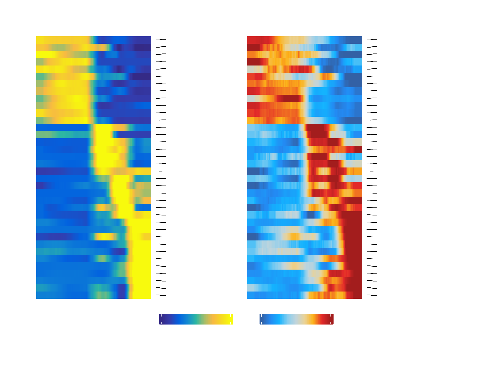{width=800 height=600}


## Session Information

```{r eval=FALSE}
Sys.Date()
```
> \## [1] "2020-04-15"

```{r eval=FALSE}
sessionInfo()
```

```{r, include=FALSE, eval=FALSE}
save.image(params$out, compress = FALSE)
```

