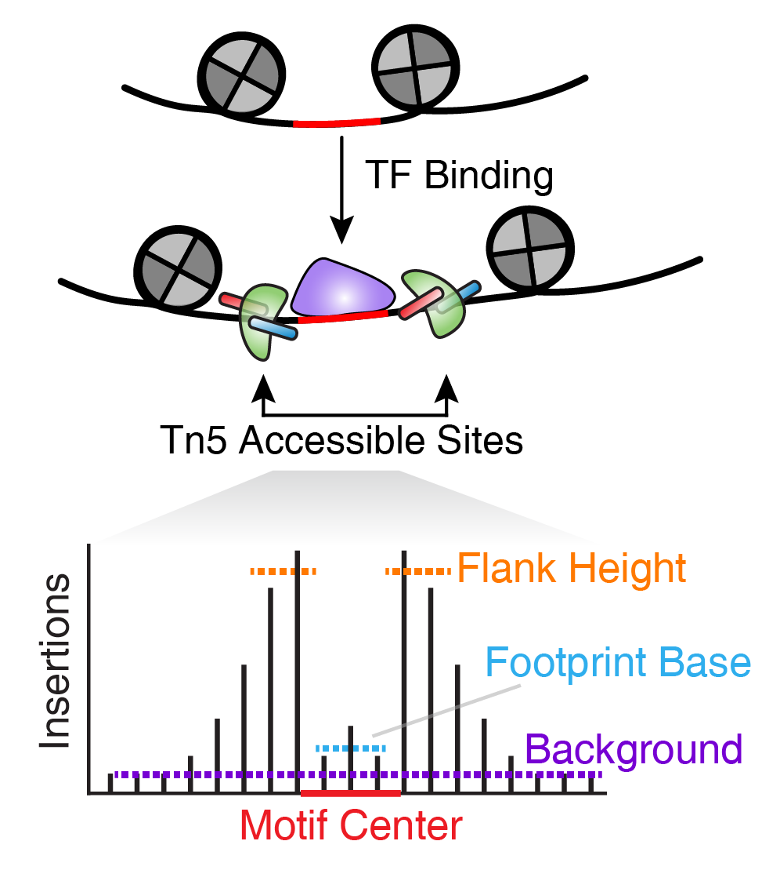
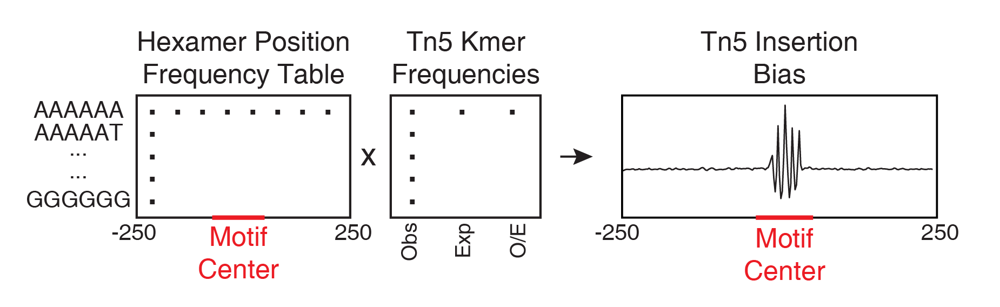

---
output:
  html_document:
    theme: yeti  # many options for theme, this one is my favorite.
params:
  threads: 20
  rdata: ""
  token: ""
  ref: ""
  out: ""
---
```{r, include=FALSE}
load("ch13.RData")
```
# Footprinting with ArchR

Transcription factor (TF) footprinting allows for the prediction of the precise binding location of a TF at a particular locus. This is because the DNA bases that are directly bound by the TF are actually protected from transposition while the DNA bases immediately adjacent to TF binding are accessible.

<center>
{width=250px}
</center>

Ideally, TF footprinting is performed at a single site to determine the precise binding location of the TF. However, in practice, this requires very high sequencing depth, often much higher depth than what most users would obtain from either bulk or single-cell ATAC-seq. To get around this problem, we can combine Tn5 insertion locations across many instances of predicted TF binding. For example, we can take all peaks that harbor a CTCF motif and make an aggregate TF footprint for CTCF across the whole genome.

The accuracy of this footprint relies on generating a reliable curated list of predicted binding sites for the TF of interest. ArchR does this in a naive way via the `addMotifAnnotations()` functions by searching the peak regions for any DNA sequence matching a motif. Depending on the degeneracy of the motif of interest, this may or may not be sufficient. These motif annotations get added to the `ArchRProject` as a binary representation on a per peak basis (0 = no motif, 1 = motif present). Once you have these motif annotations, ArchR performs footprinting using the `getFootprints()` function which takes as input an `ArchRProject` object and a `GenomicRanges` object that contains the positions of the motifs. These positions can be accessed from the `ArchRProject` via the `getPositions()` function. These footprints can then be plotted using the `plotFootprints()` function.

Perhaps most importantly, the footprinting analyses in ArchR account for known Tn5 insertion sequence bias. To do this, ArchR uses a matrix of hexamer position frequencies and a matrix of k-mer frequencies at Tn5 insertion sites:

<center>
{width=700px}
</center>

All put together, this workflow generates footprint plots that take into account Tn5 insertion bias.

ArchR supports motif footprinting and custom footprinting of user-supplied features, both of which are discussed in this chapter.

## Motif Footprinting

Importantly, the footprints generated from this tutorial data are not as clean as would be desired but this is because of the small size of the tutorial dataset. Footprints generated from larger datasets would be expected to show even less variation.

When footprinting, the first thing we need to do is obtain the positions of the relevant motifs. To do this, we call the `getPositions()` function. This function has an optional parameter called `name` which can accept the name of the `peakAnnotation` object from which we would like to obtain the positions. If `name = NULL`, then ArchR will use the first entry in the `peakAnnotation` slot. In the example shown below, we do not specify `name` and ArchR uses the first entry which is our CIS-BP motifs.

```{r }
motifPositions <- getPositions(projHeme5)
```

This creates a `GRangesList` object where each TF motif is represented by a separate `GRanges` object.
```{r}
motifPositions
```

We can subset this `GRangesList` to a few TF motifs that we are interested in. Because the SREBF1 TF comes up when we search for "EBF1", we explicitly remove it from the downstream analyses below using the `%ni%` helper function which provides the opposite functionality of `%in%` from base R.
```{r}
motifs <- c("GATA1", "CEBPA", "EBF1", "IRF4", "TBX21", "PAX5")
markerMotifs <- unlist(lapply(motifs, function(x) grep(x, names(motifPositions), value = TRUE)))
markerMotifs <- markerMotifs[markerMotifs %ni% "SREBF1_22"]
markerMotifs
```

To accurately profile TF footprints, a large number of reads are required. Therefore, cells are grouped to create pseudo-bulk ATAC-seq profiles that can be then used for TF footprinting. These pseudo-bulk profiles are stored as group coverage files which we originally created in a previous chapter to perform peak calling. If you haven't already added group coverages to your `ArchRProject`, lets do that now.
```{r }
projHeme5 <- addGroupCoverages(ArchRProj = projHeme5, groupBy = "Clusters2", force=TRUE)
```

With group coverages calculated, we can now compute footprints for the subset of marker motifs that we previously selected using the `getFootprints()` function. Even though ArchR implements a highly optimized footprinting workflow, it is recommended to perform footprinting on a subset of motifs rather than all motifs. As such, we provide the subset of motifs to footprint via the `positions` parameter.

```{r}
seFoot <- getFootprints(
  ArchRProj = projHeme5, 
  positions = motifPositions[markerMotifs], 
  groupBy = "Clusters2"
)
```

Once we have retrieved these footprints, we can plot them using the `plotFootprints()` function. This function can simultaneously normalize the footprints in various ways. This normalization and the actual plotting of the footprints is discussed in the next section.

## Normalization of Footprints for Tn5 Bias

One major challenge with TF footprinting using ATAC-seq data is the insertion sequence bias of the Tn5 transposase which can lead to misclassification of TF footprints. To account for Tn5 insertion bias, ArchR identifies the k-mer (user-defined length, default length 6) sequences surrounding each Tn5 insertion site. To do this analysis, ArchR identifies single-base resolution Tn5 insertion sites for each pseudo-bulk, resizes these 1-bp sites to k-bp windows (-k/2 and + (k/2 - 1) bp from insertion), and then creates a k-mer frequency table using the `oligonucleotidefrequency(w=k, simplify.as="collapse")` function from the `Biostrings` package. ArchR then calculates the expected k-mers genome-wide using the same function with the `BSgenome`-associated genome file. To calculate the insertion bias for a pseudo-bulk footprint, ArchR creates a k-mer frequency matrix that is represented as all possible k-mers across a window +/- N bp (user-defined, default 250 bp) from the motif center. Then, iterating over each motif site, ArchR fills in the positioned k-mers into the k-mer frequency matrix. This is then calculated for each motif position genome-wide. Using the sample’s k-mer frequency table, ArchR can then compute the expected Tn5 insertions by multiplying the k-mer position frequency table by the observed/expected Tn5 k-mer frequency.

All of this happens under the hood within the `plotFootprints()` function.

### Subtracting the Tn5 Bias 

One normalization method subtracts the Tn5 bias from the footprinting signal. This normalization is performed by setting `normMethod = "Subtract"` when calling `plotFootprints()`.

```{r }
plotFootprints(
  seFoot = seFoot,
  ArchRProj = projHeme5, 
  normMethod = "Subtract",
  plotName = "Footprints-Subtract-Bias",
  addDOC = FALSE,
  smoothWindow = 5
)
```

```{r, include=FALSE}
ArchR:::.convertToPNG(ArchRProj = projHeme2)
system("cp Figures/*.png images/HemeWalkthrough/PNG/")
system("cp Figures/*.pdf images/HemeWalkthrough/PDF/")
```

By default, these plots will be saved in the `outputDirectory` of the `ArchRProject`. If you requested to plot all motifs and returned this as a `ggplot` object, this `ggplot` object would be extremely large. An example of motif footprints from bias-subtracted analyses are shown below.

{width=250 height=400}
{width=250 height=400}
{width=250 height=400}

### Dividing by the Tn5 Bias 

A second strategy for normalization divides the footprinting signal by the Tn5 bias signal. This normalization is performed by setting `normMethod = "Divide"` when calling `plotFootprints()`.

```{r}
plotFootprints(
  seFoot = seFoot,
  ArchRProj = projHeme5, 
  normMethod = "Divide",
  plotName = "Footprints-Divide-Bias",
  addDOC = FALSE,
  smoothWindow = 5
)
```

```{r, include=FALSE, }
ArchR:::.convertToPNG(ArchRProj = projHeme2)
system("cp Figures/*.png images/HemeWalkthrough/PNG/")
system("cp Figures/*.pdf images/HemeWalkthrough/PDF/")
```

An example of motif footprints from bias-divided analyses are shown below.

{width=250 height=400}
{width=250 height=400}
{width=250 height=400}

### Footprinting Without Normalization for Tn5 Bias

While we highly recommend normalizing footprints for Tn5 sequence insertion bias, it is possible to perform footprinting without normalization by setting `normMethod = "None"` in the `plotFootprints()` function.

```{r}
plotFootprints(
  seFoot = seFoot,
  ArchRProj = projHeme5, 
  normMethod = "None",
  plotName = "Footprints-No-Normalization",
  addDOC = FALSE,
  smoothWindow = 5
)
```

```{r, include=FALSE}
ArchR:::.convertToPNG(ArchRProj = projHeme2)
system("cp Figures/*.png images/HemeWalkthrough/PNG/")
system("cp Figures/*.pdf images/HemeWalkthrough/PDF/")
```

An example of motif footprints without normalization are shown below.

{width=250 height=400}
{width=250 height=400}
{width=250 height=400}

## Feature Footprinting

In addition to footprinting motifs, ArchR enables footprinting of any user-defined feature set. To illustrate this capability, we will use the `plotFootprints()` function to create a TSS insertion profile (introduced previously during the section on data quality control). A TSS insertion profile is just a specialized sub-case of footprinting.

As discussed in the previous section, footprinting is performed using group coverage files which are derived from pseudo-bulk replicates. We originally created these in a previous chapter to perform peak calling. If you haven't already added group coverages to your `ArchRProject`, lets do that now.

```{r}
projHeme5 <- addGroupCoverages(ArchRProj = projHeme5, groupBy = "Clusters2", force=TRUE)
```

We create TSS insertion profiles without normalization for Tn5 bias. The main difference from our previous analyses is that we specify `flank = 2000` to extend these footprints 2000 bp on either side of each TSS.

```{r}
seTSS <- getFootprints(
  ArchRProj = projHeme5, 
  positions = GRangesList(TSS = getTSS(projHeme5)), 
  groupBy = "Clusters2",
  flank = 2000
)
```

We can then plot the TSS insertion profiles for each cell group using `plotFootprints()`.
```{r}
plotFootprints(
  seFoot = seTSS,
  ArchRProj = projHeme5, 
  normMethod = "None",
  plotName = "TSS-No-Normalization",
  addDOC = FALSE,
  flank = 2000,
  flankNorm = 100
)
```

```{r, include=FALSE}
ArchR:::.convertToPNG(ArchRProj = projHeme2)
system("cp Figures/*.png images/HemeWalkthrough/PNG/")
system("cp Figures/*.pdf images/HemeWalkthrough/PDF/")
```

<center>
{width=250 height=400}
</center>

```{r, include=FALSE, eval=FALSE}
save.image(params$out, compress = FALSE)
```
```{r, include=FALSE}
save.image("ch14.RData")
```

