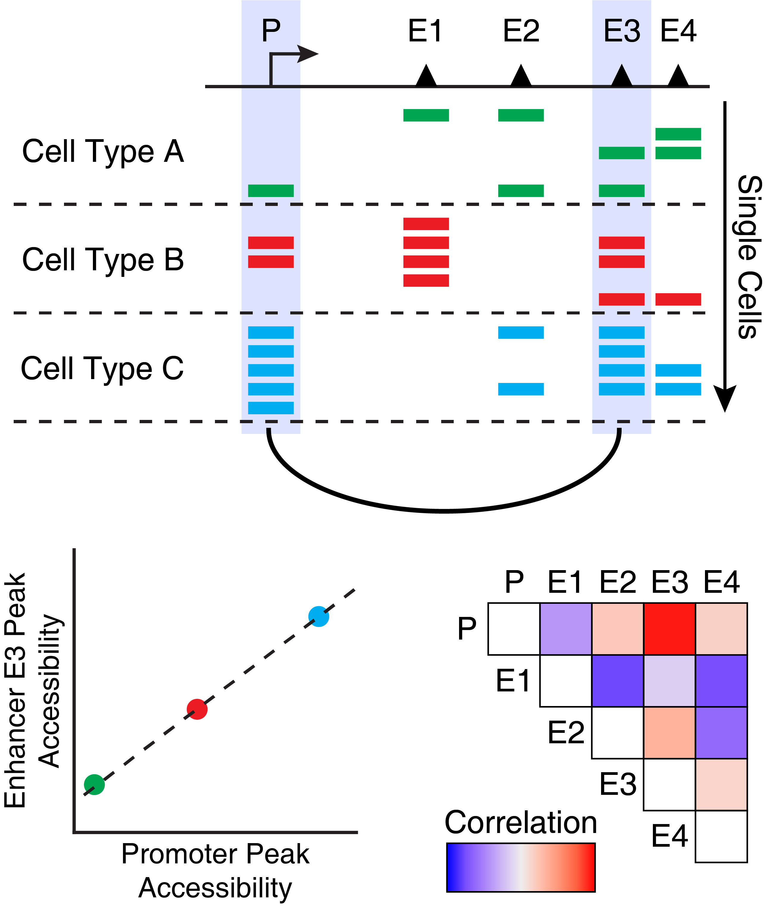

---
output:
  html_document:
    theme: yeti  # many options for theme, this one is my favorite.
params:
  threads: 20
  rdata: ""
  token: ""
  ref: ""
  out: ""
editor_options: 
  markdown: 
    wrap: 72
---

```{r, include=FALSE}
#load the data from the previous chapter as needed
current_chapter = 17
previous_chapter = current_chapter-1
load(file = paste0("./chapter_images/chapter",previous_chapter,".RData"))
```

# Integrative Analysis with ArchR

One of the main strengths of ArchR is its ability to integrate multiple levels of information to provide novel insights. This can take the form of ATAC-seq-only analyses such as identifying peak co-accessibility to predict regulatory interactions, or analyses that integrate scRNA-seq data such as prediction of enhancer activity through peak-to-gene linkage analysis. In either case, ArchR makes it easy to garner deeper insights from your scATAC-seq data.

## Creating Low-Overlapping Aggregates of Cells

ArchR facilitates many integrative analyses that involve correlation of features. Performing these calculations with sparse single-cell data can lead to substantial noise in these correlative analyses. To circumvent this challenge, we adopted an approach introduced by [Cicero](https://cole-trapnell-lab.github.io/cicero-release/) to create low-overlapping aggregates of single cells prior to these analyses. We filter aggregates with greater than 80% overlap with any other aggregate in order to reduce bias. To improve the speed of this approach, we developed an implementation of an optimized iterative overlap checking routine and a implementation of fast feature correlations in C++ using the "Rcpp" package. These optimized methods are used in ArchR for calculating peak co-accessibility, peak-to-gene linkage, and for other linkage analyses. The use of these low-overlapping aggregates happens under the hood but we mention it here for clarity.

## Co-accessibility with ArchR

Co-accessibility is a correlation in accessibility between two peaks across many single cells. Said another way, when Peak A is accessible in a single cell, Peak B is often also accessible. We illustrate this concept visually below, showing that Enhancer E3 is often co-accessible with Promoter P.

<center>
{width=400px}
</center>

One thing to note about co-accessibility analysis is that it often identified cell type-specific peaks as being co-accessibile. This is because these peaks are often all accessible together within a single cell type and often all not accessible in all other cell types. This drives a strong correlation but does not necessarily mean that there is a regulatory relationship between these peaks. 

To calculate co-accessibility in ArchR, we use the `addCoAccessibility()` function which stores peak co-accessibility information in the `ArchRProject`.

```{r addCoaccessibility, collapse=TRUE}
projHeme5 <- addCoAccessibility(
	ArchRProj = projHeme5,
	reducedDims = "IterativeLSI"
)
```

If you aim to only perform co-accessibility analyses on a subset of cells in your project, you can specify which cells should be analyzed using the `cellsToUse` parameter. There are other important parameters to keep in mind depending on the precise composition of your own data. For example, the `k` parameter designates how many cells should be included in the low-overlapping cell groups for correlation analysis. If your dataset is very small, you may need to adjust this parameter accordingly (and other parameters like `overlapCutoff`) to ensure that you do not have high duplication rates with the same cells participating in many of the cell groupings. These same considerations apply to the `getPeak2GeneLinks()` function described below.

We can retrieve this co-accessibility information from the `ArchRProject` via the `getCoAccessibility()` function which returns a `DataFrame` object if `returnLoops = FALSE`.

```{r getCoAccessibility, collapse=TRUE}
cA <- getCoAccessibility(
	ArchRProj = projHeme5,
	corCutOff = 0.5,
	resolution = 1,
	returnLoops = FALSE
)
```

The `DataFrame` contains a few important pieces of information. The `queryHits` and `subjectHits` columns denote the index of the two peaks that were found to be correlated. The `correlation` column gives the numeric correlation of the accessibility between those two peaks.
```{r, collapse=TRUE}
cA
```


This co-accessibility `DataFrame` also has a metadata component containing a `GRanges` object of the relevant peaks. The indexes of `queryHits` and `subjectHits` mentioned above apply to this `GRanges` object. 
```{r, collapse=TRUE}
metadata(cA)[[1]]
```

If we set `returnLoops = TRUE`, then `getCoAccessibility()` will instead return the co-accessibility information in the form a loop track. In this `GRanges` object, the start and end of the `IRanges` map to the two different co-accessible peaks for each interaction. The `resolution` parameter sets the base-pair resolution of these loops. When `resolution = 1`, this creates loops that connect the center of each peak. 
```{r, collapse=TRUE}
cA <- getCoAccessibility(
	ArchRProj = projHeme5,
	corCutOff = 0.5,
	resolution = 1,
	returnLoops = TRUE
)
```

We can compare this `GRanges` object to the `DataFrame` object generated above.
```{r, collapse=TRUE}
cA[[1]]
```

This object contains a lot of information that can be helpful in further filtering the returned loops. In addition to filtering based on the correlation between peaks (via the `corCutOff` parameter), we have found it helpful to limit these analyses to stronger peaks (based on `FDR`) or loops that show more variability (i.e. higher values for `VarQuantile1` and `VarQuantile2`). For example:


```{r, collapse=TRUE}
cALoops <- cA[[1]]
cALoops <- cALoops[cALoops$FDR < 10^-10]
cALoops <- cALoops[rowMins(cbind(cALoops$VarQuantile1,cALoops$VarQuantile2)) > 0.35]
cALoops
```

<!--
#JJJ Can you better describe what decreasing the resolution does here? How does this work? would it group two peaks that are nearby each other?
-->

To help with over-plotting of co-accessibility interactions we can decrease the resolution of our loops to `resolution = 1000`. Below, we see that there are fewer total entries in our `GRanges` object than above.
```{r, collapse=TRUE}
cA <- getCoAccessibility(
	ArchRProj = projHeme5,
	corCutOff = 0.5,
	resolution = 1000,
	returnLoops = TRUE
)

cA[[1]]
```

Similarly, if we decrease the resolution even further with `resolution = 10000`, we identify even fewer co-accessibility interactions.
```{r, collapse=TRUE}
cA <- getCoAccessibility(
	ArchRProj = projHeme5,
	corCutOff = 0.5,
	resolution = 10000,
	returnLoops = TRUE
)

cA[[1]]
```

### Plotting browser tracks of Co-accessibility

Once we have added co-accessibility informtation to our `ArchRProject` we can use this as a loop track when plotting browser tracks. We do this via the `loops` parameter to the `plotBrowserTrack()` function. Here, we are using the default parameters for `getCoAccessibility()` which include `corCutOff = 0.5`, `resolution = 1000`, and `returnLoops = TRUE`.
```{r, collapse=TRUE}
markerGenes  <- c(
    "CD34", #Early Progenitor
    "GATA1", #Erythroid
    "PAX5", "MS4A1", #B-Cell Trajectory
    "CD14", #Monocytes
    "CD3D", "CD8A", "TBX21", "IL7R" #TCells
  )

p <- plotBrowserTrack(
    ArchRProj = projHeme5, 
    groupBy = "Clusters2", 
    geneSymbol = markerGenes, 
    upstream = 50000,
    downstream = 50000,
    loops = getCoAccessibility(projHeme5)
)
```


To plot our browser track we use the `grid.draw` function and select a specific marker gene by name using the `$` accessor.

```{r, collapse=TRUE}
grid::grid.newpage()
grid::grid.draw(p$CD14)
```


To save an editable vectorized version of this plot, we use `plotPDF()`.

```{r, collapse=TRUE}
plotPDF(plotList = p, 
    name = "Plot-Tracks-Marker-Genes-with-CoAccessibility.pdf", 
    ArchRProj = projHeme5, 
    addDOC = FALSE, width = 5, height = 5)
```


## Peak2GeneLinkage with ArchR

Similar to co-accessibility, ArchR can also identify so-called "peak-to-gene links". The primary differences between peak-to-gene links and co-accessibility is that co-accessibility is an ATAC-seq-only analysis that looks for correlations in accessibility between two peaks while peak-to-gene linkage leverages integrated scRNA-seq data to look for correlations between peak accessibility and gene expression. These represent orthogonal approaches to a similar problem. However, because peak-to-gene linkage correlates scATAC-seq and scRNA-seq data, we often think of these links as more relevant to gene regulatory interactions.

To identify peak-to-gene links in ArchR, we use the `addPeak2GeneLinks()` function.
```{r, collapse=TRUE}
projHeme5 <- addPeak2GeneLinks(
	ArchRProj = projHeme5,
	reducedDims = "IterativeLSI"
)
```


We can then retrieve these peak-to-gene links in a similar fashion to how we retrieved co-accessibility interactions by using the `getPeak2GeneLinks()` function. As we saw previously, this function allows for a user-specified cutoff for correlation and resolution for linkages.
```{r, collapse=TRUE}
p2g <- getPeak2GeneLinks(
	ArchRProj = projHeme5,
	corCutOff = 0.45,
	resolution = 1,
	returnLoops = FALSE
)
```

When `returnLoops` is set to false, this function returns a `DataFrame` object anaolgous to the `DataFrame` object returned by `getCoAccessibility()`. The primary difference is that the indexes for the scATAC-seq peaks are stored in a column called `idxATAC` and the indexes for the scRNA-seq gene are stored in a column called `idxRNA`. 
```{r, collapse=TRUE}
p2g
```

Here, `idxATAC` and `idxRNA` refer to the __row indices__ of the peak or gene in the corresponding `geneSet` or `peakSet` which can be accessed via the metadata component of the `p2g` object. 
```{r, collapse=TRUE}
metadata(p2g)
```

It is important not to confuse `idxRNA` with the value in the `idx` column of the `geneSet`. Within the `geneSet`, `idx` corresponds to the chronological position of the given gene across each chromosome. As such, `idx` is only unique across an individual chromosome and is not relevant for mapping `idxRNA` to a gene name.

So, if we wanted to add the gene name and peak coordinates to our `p2g` `DataFrame` object, we would do the following:
```{r, collapse=TRUE}
p2g$geneName <- mcols(metadata(p2g)$geneSet)$name[p2g$idxRNA]
p2g$peakName <- (metadata(p2g)$peakSet %>% {paste0(seqnames(.), "_", start(.), "_", end(.))})[p2g$idxATAC]
p2g
```

You may also notice that there is other information stored within the `metadata()` of `p2g` including pointers to files called `seATAC` and `seRNA` which represent `SummarizedExperiment` objects for the ATAC-seq and RNA-seq data used to identify peak-to-gene linkages and these each include both the raw and normalized data matrices used in the analysis.

```{r, collapse=TRUE}
metadata(p2g)$seATAC
metadata(p2g)$seRNA
```

If we set `returnLoops = TRUE`, then `getPeak2GeneLinks()` will return a loop track `GRanges` object that connects the peak and gene. As for co-accessibility, the start and end of the `IRanges` object represent the position of the peak and gene being linked. When `resolution = 1`, this links the center of the peak to the single-base TSS of the gene.
```{r, collapse=TRUE}
p2g <- getPeak2GeneLinks(
	ArchRProj = projHeme5,
	corCutOff = 0.45,
	resolution = 1,
	returnLoops = TRUE
)

p2g[[1]]
```


We can alternatively decrease the resolution of these links by setting `resolution = 1000`. This is primarily useful for plotting the links as a browser tracks because there are instances where many nearby peaks all link to the same gene and this can be difficult to visualize. 
```{r, collapse=TRUE}
p2g <- getPeak2GeneLinks(
	ArchRProj = projHeme5,
	corCutOff = 0.45,
	resolution = 1000,
	returnLoops = TRUE
)

p2g[[1]]
```

Decreasing the resolution even further also decreases the total number of peak-to-gene links identified.
```{r, collapse=TRUE}
p2g <- getPeak2GeneLinks(
	ArchRProj = projHeme5,
	corCutOff = 0.45,
	resolution = 10000,
	returnLoops = TRUE
)

p2g[[1]]
```

You may find that you would like to use a statistical approach to evaluate peak-to-gene associations. Such an approach was developed in [Regner et al. 2021](https://doi.org/10.1016/j.molcel.2021.10.013) and involves using permutation testing to empirically derive an FDR. This approach is quite computationally expensive but has been implemented as an option in `addPeak2GeneLinks()` via the `addPermutedPval` parameter. For more information on this approach, see [this discussion post](https://github.com/GreenleafLab/ArchR/discussions/1149).

### Plotting browser tracks with peak-to-gene links

To plot these peak-to-gene links as a browser track, we use the same workflow shown for co-accessibility in the previous section. Here we use the `plotBrowserTrack()` function
```{r, collapse=TRUE}
markerGenes  <- c(
    "CD34", #Early Progenitor
    "GATA1", #Erythroid
    "PAX5", "MS4A1", #B-Cell Trajectory
    "CD14", #Monocytes
    "CD3D", "CD8A", "TBX21", "IL7R" #TCells
  )

p <- plotBrowserTrack(
    ArchRProj = projHeme5, 
    groupBy = "Clusters2", 
    geneSymbol = markerGenes, 
    upstream = 50000,
    downstream = 50000,
    loops = getPeak2GeneLinks(projHeme5)
)
```

To plot our browser track we use the `grid.draw` function and select a specific marker gene by name using the `$` accessor.

```{r, collapse=TRUE}
grid::grid.newpage()
grid::grid.draw(p$CD14)
```

To save an editable vectorized version of this plot, we use `plotPDF()`.

```{r, collapse=TRUE}
plotPDF(plotList = p, 
    name = "Plot-Tracks-Marker-Genes-with-Peak2GeneLinks.pdf", 
    ArchRProj = projHeme5, 
    addDOC = FALSE, width = 5, height = 5)
```


### Plotting a heatmap of peak-to-gene links

To visualize the correspondence of all of our peak-to-gene links, we can plot a peak-to-gene heatmap which contains two side-by-side heatmaps, one for our scATAC-seq data and one for our scRNA-seq data. To do this, we use the `plotPeak2GeneHeatmap()`

```{r, collapse=TRUE}
p <- plotPeak2GeneHeatmap(ArchRProj = projHeme5, groupBy = "Clusters2")
```

The heatmap rows are clustered using k-means clustering based on the value passed to the parameter `k`, which defaults to 25 as shown below.
```{r, collapse=TRUE}
p
```


## Identification of Positive TF-Regulators

ATAC-seq allows for the unbiased identification of TFs that exhibit large changes in chromatin accessibility at sites containing their DNA binding motifs. However, families of TFs (for ex. GATA factors) share similar features in their binding motifs when looking in aggregate through position weight matrices (PWMs).

<center>
{width=500px}
</center>

This motif similarity makes it challenging to identify the specific TFs that might be driving observed changes in chromatin accessibility at their predicted binding sites. To circumvent this challenge, we have previously ATAC-seq and RNA-seq to identify TFs whose gene expression is positively correlated to changes in the accessibility of their corresponding motif. We term these TFs “positive regulators”. However, this analysis relies on matched gene expression data which may not be readily available in all experiments. To overcome this dependency, ArchR can identify TFs whose inferred gene scores are correlated to their chromVAR TF deviation z-scores. To achieve this, ArchR correlates chromVAR deviation z-scores of TF motifs with gene activity scores of TF genes from the low-overlapping cell aggregates. When using scRNA-seq integration with ArchR, gene expression of the TF can be used instead of inferred gene activity score.

### Step 1. Identify Deviant TF Motifs

The first part of identifying positive TF regulators is identification of deviant TF motifs. We performed this analysis in a previous chapter, creating a `MotifMatrix` of chromVAR deviations and deviation z-scores for all motifs. We can obtain this data, aggregated by clusters, by using the `getGroupSE()` function which returns a `SummarizedExperiment`. 

```{r, collapse=TRUE}
seGroupMotif <- getGroupSE(ArchRProj = projHeme5, useMatrix = "MotifMatrix", groupBy = "Clusters2")
```

Because this `SummarizedExperiment` object comes from the `MotifMatrix` is has two seqnames - "deviations" and "z" - corresponding to the raw deviations and deviation z-scores from chromVAR.
```{r, collapse=TRUE}
seGroupMotif
```

We can subset this `SummarizedExperiment` to just the deviation z-scores.
```{r, collapse=TRUE}
seZ <- seGroupMotif[rowData(seGroupMotif)$seqnames=="z",]
```

Then we can identify the maximum delta in z-score between all clusters. This will be helpful in stratifying motifs based on the degree of variation observed across clusters.
```{r, collapse=TRUE}
rowData(seZ)$maxDelta <- lapply(seq_len(ncol(seZ)), function(x){
  rowMaxs(assay(seZ) - assay(seZ)[,x])
}) %>% Reduce("cbind", .) %>% rowMaxs

```

### Step 2. Identify Correlated TF Motifs and TF Gene Score/Expression

To identify TFs whose motif accessibility is correlated with with their own gene activity (either by gene score or gene expression), we use the `correlateMatrices()` function and provide the two matrices that we are interested in, in this case the `GeneScoreMatrix` and the `MotifMatrix`. As mentioned previously, these correlations are determined across many low-overlapping cell aggregates determined in the lower dimension space specified in the `reducedDims` parameter.

```{r, collapse=TRUE}
corGSM_MM <- correlateMatrices(
	ArchRProj = projHeme5,
	useMatrix1 = "GeneScoreMatrix",
	useMatrix2 = "MotifMatrix",
	reducedDims = "IterativeLSI"
)
```


This function returns a `DataFrame` object that that contains the elements from each matrix and the correlation across the low-overlapping cell aggregates.
```{r, collapse=TRUE}
corGSM_MM
```


We can perform the same analysis using the `GeneIntegrationMatrix` instead of the `GeneScoreMatrix`.

```{r, collapse=TRUE}
corGIM_MM <- correlateMatrices(
	ArchRProj = projHeme5,
	useMatrix1 = "GeneIntegrationMatrix",
	useMatrix2 = "MotifMatrix",
	reducedDims = "IterativeLSI"
)
```

```{r, collapse=TRUE}
corGIM_MM
```


Step 3. Add Maximum Delta Deviation to the Correlation Data Frame

For each of these correlation analyses, we can annotate each motif with the maximum delta observed between clusters which we calculated in Step 1.

```{r, collapse=TRUE}
corGSM_MM$maxDelta <- rowData(seZ)[match(corGSM_MM$MotifMatrix_name, rowData(seZ)$name), "maxDelta"]
corGIM_MM$maxDelta <- rowData(seZ)[match(corGIM_MM$MotifMatrix_name, rowData(seZ)$name), "maxDelta"]
```

Step 4. Identify Positive TF Regulators

We can use all of this information to identify positive TF regulators. In the examples below, we consider positive regulators as those TFs whose correlation between motif and gene score (or gene expression) is greater than 0.5 with an adjusted p-value less than 0.01 and a maximum inter-cluster difference in deviation z-score that is in the top quartile.

We apply these selection criteria and do a little text juggling to isolate the TF names.
```{r, collapse=TRUE}
corGSM_MM <- corGSM_MM[order(abs(corGSM_MM$cor), decreasing = TRUE), ]
corGSM_MM <- corGSM_MM[which(!duplicated(gsub("\\-.*","",corGSM_MM[,"MotifMatrix_name"]))), ]
corGSM_MM$TFRegulator <- "NO"
corGSM_MM$TFRegulator[which(corGSM_MM$cor > 0.5 & corGSM_MM$padj < 0.01 & corGSM_MM$maxDelta > quantile(corGSM_MM$maxDelta, 0.75))] <- "YES"
sort(corGSM_MM[corGSM_MM$TFRegulator=="YES",1])
```

Having identified these positive TF regulators from gene scores and motif deviation z-scores, we can highlight them in a dot plot.
```{r, collapse=TRUE}
p <- ggplot(data.frame(corGSM_MM), aes(cor, maxDelta, color = TFRegulator)) +
  geom_point() + 
  theme_ArchR() +
  geom_vline(xintercept = 0, lty = "dashed") + 
  scale_color_manual(values = c("NO"="darkgrey", "YES"="firebrick3")) +
  xlab("Correlation To Gene Score") +
  ylab("Max TF Motif Delta") +
  scale_y_continuous(
  	expand = c(0,0), 
  	limits = c(0, max(corGSM_MM$maxDelta)*1.05)
  )

p
```


We can perform the same analysis for the correlations derived from our `GeneIntegrationMatrix`.

```{r, collapse=TRUE}
corGIM_MM <- corGIM_MM[order(abs(corGIM_MM$cor), decreasing = TRUE), ]
corGIM_MM <- corGIM_MM[which(!duplicated(gsub("\\-.*","",corGIM_MM[,"MotifMatrix_name"]))), ]
corGIM_MM$TFRegulator <- "NO"
corGIM_MM$TFRegulator[which(corGIM_MM$cor > 0.5 & corGIM_MM$padj < 0.01 & corGIM_MM$maxDelta > quantile(corGIM_MM$maxDelta, 0.75))] <- "YES"
sort(corGIM_MM[corGIM_MM$TFRegulator=="YES",1])
```
 

```{r, collapse=TRUE}
p <- ggplot(data.frame(corGIM_MM), aes(cor, maxDelta, color = TFRegulator)) +
  geom_point() + 
  theme_ArchR() +
  geom_vline(xintercept = 0, lty = "dashed") + 
  scale_color_manual(values = c("NO"="darkgrey", "YES"="firebrick3")) +
  xlab("Correlation To Gene Expression") +
  ylab("Max TF Motif Delta") +
  scale_y_continuous(
  	expand = c(0,0), 
  	limits = c(0, max(corGIM_MM$maxDelta)*1.05)
  )

p
```


```{r saveImage, include=FALSE}
filename <- paste0("./chapter_images/chapter",current_chapter,".RData")
remove(current_chapter)
remove(previous_chapter)
save.image(file =  filename)
```


