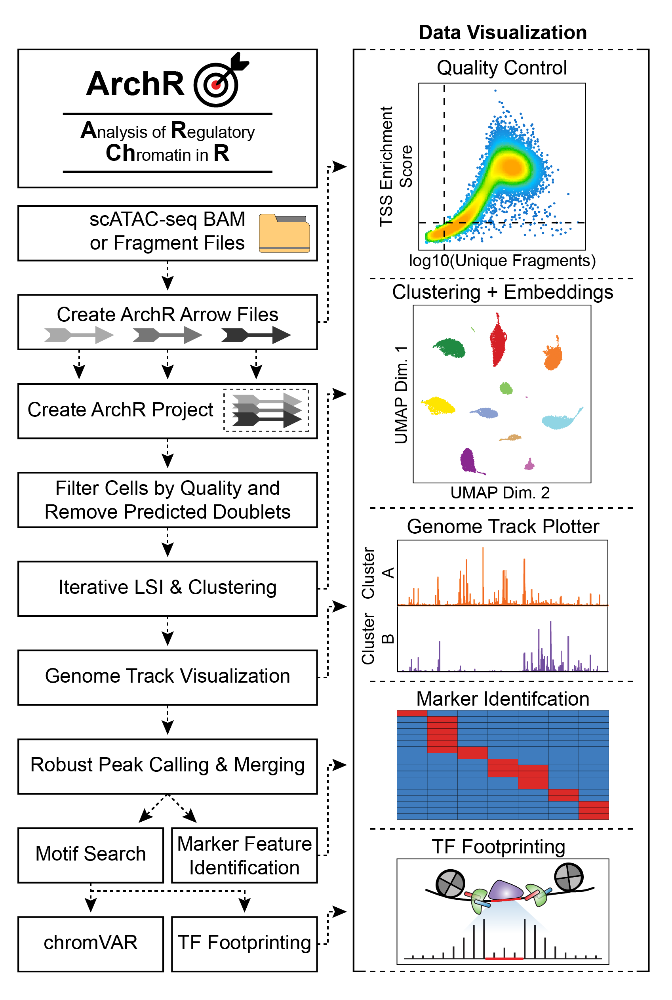

# 

[](https://www.tidyverse.org/lifecycle/#experimental)

ArchR is a full-featured R package for processing and analyzing single-cell ATAC-seq data. Its strength is speed and resource usage, making it possible to analyze 1 million cells in __QQQ__ hours on a macbook pro laptop. It provides facile tools to do just about anything you would want to do with single-cell ATAC-seq data.

To get started, we recommend running through [the brief ArchR tutorial](articles/Articles/tutorial.html). For a more detailed description of all of the features of ArchR, please see the searchable [full manual](bookdown/index.html). If you havent already done so, we also recommend reading [the publication](https://greenleaf.stanford.edu/assets/pdf/) to get a better idea of what ArchR can do.

<hr>

# Installation of ArchR

ArchR installation currently requires devtools. The following commands will use the Bioconductor BiocManager to install the required dependences:

```{r}
if (!requireNamespace("devtools", quietly = TRUE)) install.packages("devtools")
if (!requireNamespace("BiocManager", quietly = TRUE)) install.packages("BiocManager")

devtools::install_github("GreenleafLab/ArchR",
	auth_token = token, #Need a token to download (see personalized access tokens)
	repos = BiocManager::repositories()
)
```

### Additional packages that are used from github
To complete installation, you also must maually install the following packages using these devtools commands:

```{r}
# ggrastr is a package for plotting ggplots with rastr'd points which is super helpful for large UMAPs etc
# # You need to have Cairo installed for ggrastr to work
# # On Mac OSx you need to have XQuartz (https://www.xquartz.org/)
devtools::install_github('VPetukhov/ggrastr')

# harmony is a package that can correct batch effects
devtools::install_github("immunogenomics/harmony")

# presto is a package that has efficient tools for wilcoxon tests on sparseMatrices
devtools::install_github('immunogenomics/presto')
```

### Additional things to install on macOS
If you are installing on macOS, you will need a current version of GNU Fortran (gfortran). You can download and install the `.dmg` file from [the gfortran github page](https://github.com/fxcoudert/gfortran-for-macOS/releases).

<hr>

# The ArchR Workflow



<hr>

# Issues using ArchR?
If you find a bug, please report it as an issue on [Github](https://github.com/GreenleafLab/ArchR/issues). If you think the documentation on this website or in the function annotations is unclear, please submit this as an issue on [Github](https://github.com/GreenleafLab/ArchR/issues) with the _documentation_ tag. If you have questions about ArchR usage, please refer to the [the tutorial](articles/Articles/tutorial.html), [the full manual](bookdown/index.html), [the FAQ section](articles/faq.html), and the [publication](https://greenleaf.stanford.edu/assets/pdf/). If none of these options help, [send us an email](mailto:archr.devs@gmail.com). We will do our best to respond to questions that are not otherwise answered in the documentation.


