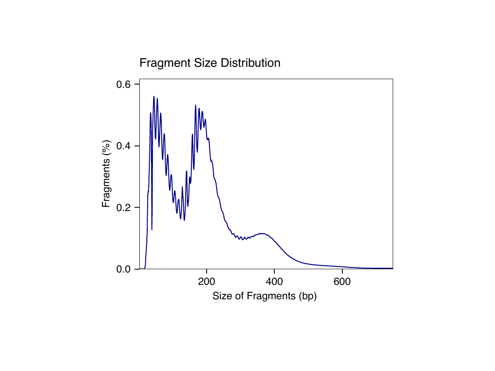
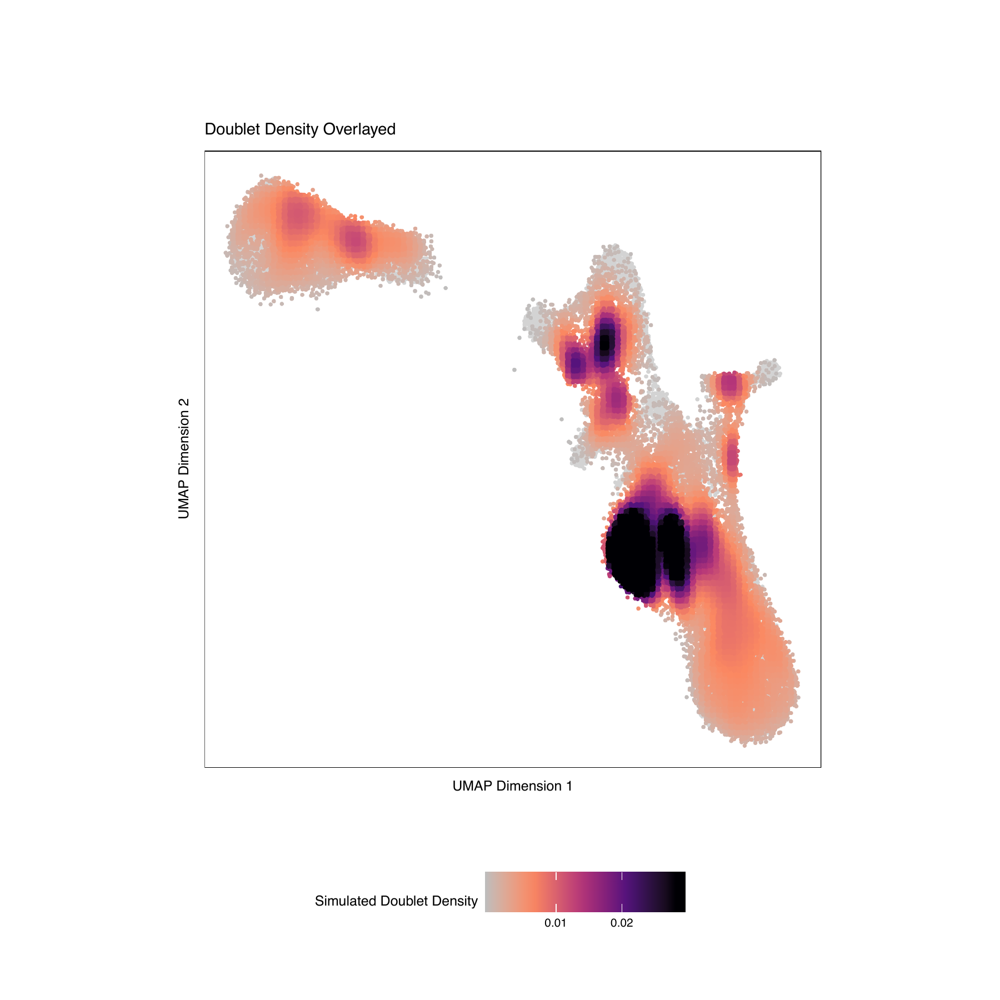
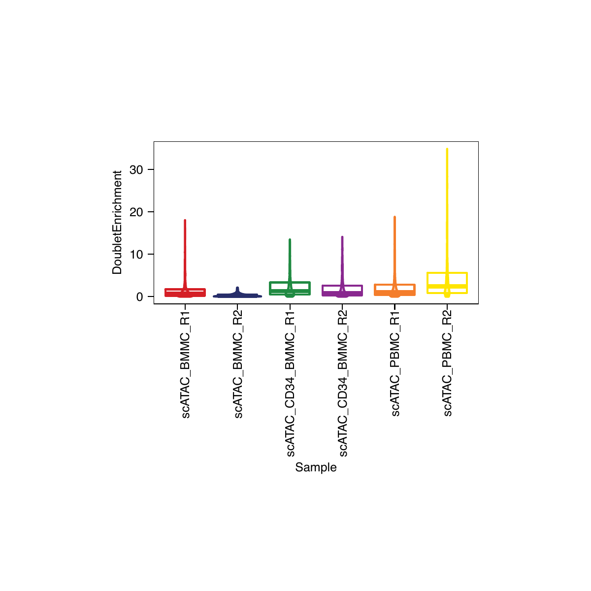

```{r image, include=FALSE}
knitr::include_graphics(
  c()
  )
```

# 1. Getting Set Up

The first thing we do is set up our working directory, load our gene and genome annotations, and set the number of threads we would like to use. Depending on the configuration of your local environment, you may need to modify the number of `threads` used below in `addArchRThreads()`. By default ArchR uses half of the total number of `threads` available but you can adjust this manually as you see fit. If you are using windows, the usable `threads` will automatically be set to 1 because the parallel processing in ArchR is build for Unix-based operating systems.

For the purposes of this tutorial, we provide the gene and genome annotations but you can create your own using the `createGeneAnnotation()` and `createGenomeAnnotation()` functions. See the [Gene and Genome Annotations vignette](articles/Articles/annotations.html) for more information.

```{r eval=FALSE}
#Load R Libraries
library(ArchR)

#Create a new folder and set this as the working directory for tutorial analyses
wd <- "ArchR_tutorial"
dir.create(wd, showWarnings = FALSE, recursive = TRUE)
setwd(wd)

#Load genome annotations. Available annotations are for "Hg19", "Hg38", "Mm9", or "Mm10". QQQ THIS DOESNT MAKE SENSE. THE DATA IS HUMAN, NOT MOUSE, AND IS ONLY AVAILABLE FOR ONE GENOME FOR THE TUTORIAL? WOULD REMOVE.
data("geneAnnoHg19")
data("genomeAnnoHg19")
geneAnno <- geneAnnoHg19
genomeAnno <- genomeAnnoHg19

#Set Default Threads for ArchR Functions
addArchRThreads(threads = floor(parallel::detectCores()/2)) #QQQ I favor including default values to make it clear what happens. Open to suggestions though.
```

# 2. Creating Arrow Files

For this tutorial, we will download a collection of fragment files. Fragment files are one of the base file types of the 10x Genomics analytical platform (and other platforms) and can be easily created from any BAM file. See [the ArchR input file types vignette](articles/Articles/inputFiles.html) for information on making your own fragment files for input to ArchR. Once we have our fragment files, we provide their paths as a character vector to `createArrowFiles()`. During creation, some basic metadata and matrices are added to each `ArrowFile` including a "TileMatrix" containing insertion counts across genome-wide 500-bp bins (see `addTileMatrix()`) and a "GeneScoreMatrix" that is determined based on weighting insertion counts in tiles nearby a gene promoter (see `addGeneScoreMatrix()`). These gene activity scores are described in more depth in the [Gene Activity Score vignette](articles/Articles/geneScores.html).

```{r eval=FALSE}
#Get Tutorial Data ~2.2GB To Download (if downloaded already ArchR will bypass downloading).
inputFiles <- getTutorialData("Hematopoiesis")

#Create Arrow Files (~10-15 minutes) w/ helpful messages displaying progress.
#For each sample, this step will:
# 1. Read accessible fragments.
# 2. Calculate QC Information for each cell (TSS Enrichment, Nucleosome info).
# 3. Filter cells based on QC parameters.
# 4. Create a genome-wide TileMatrix using 500-bp bins.
# 5. Create a GeneScoreMatrix using the provided geneAnnotation.
ArrowFiles <- createArrowFiles(
  inputFiles = inputFiles,
  sampleNames = names(inputFiles),
  geneAnnotation = geneAnno,
  genomeAnnotation = genomeAnno,
  filterTSS = 4,
  filterFrags = 1000,
  addTileMat = TRUE,
  addGeneScoreMat = TRUE
  )
```
***
## QC TSS Scores by Unique Fragments
Since this was plotted prior to creation of an ArchRProject we go to QualityControl/scATAC_BMMC_R2/scATAC_BMMC_R2-TSS_by_Unique_Frags.pdf for the plot below.

{width=600 height=600}

## QC Fragment Size Distribution
Since this was plotted prior to creation of an ArchRProject we go to QualityControl/scATAC_BMMC_R2/scATAC_BMMC_R2-Fragment_Size_Distribution.pdf for the plot below.

{width=600 height=400}

# 4. Tidying up our data and creating an `ArchRProject`

One major source of trouble in single-cell data is the contribution of "doublets" to the analysis. A doublet refers to a single droplet that received a single barcoded bead and more than one nucleus. This causes the reads from more than one cell to appear as a single cell. We remove these computationally and describe this doublet removal process in more depth in the [doublet removal vignette](articles/Articles/doubletRemoval.html).

```{r eval=FALSE}
#Add Infered Doublet Scores to each Arrow File (~2-5 min per sample)
doubScores <- addDoubletScores(ArrowFiles)

#Create ArchRProject
#The outputDirectory here describes where all downstream analyses and plots go.
proj <- ArchRProject(
  ArrowFiles = ArrowFiles, 
  geneAnnotation = geneAnno,
  genomeAnnotation = genomeAnno,
  outputDirectory = "Heme_Tutorial2"
)

#To see information about ArchR Project created simply input
proj

#We can now visualize numeric metadata per grouping with a violin plot now that we have created an ArchR Project.
#For example we will plot TSS / Doublet Enrichment Scores per sample.
plotList <- list()
plotList[[1]] <- plotGroups(ArchRProj = proj, 
  groupBy = "Sample", 
  colorBy = "colData", 
  name = "TSSEnrichment",
)
plotList[[2]] <- plotGroups(ArchRProj = proj, 
  groupBy = "Sample", 
  colorBy = "colData", 
  name = "DoubletEnrichment",
)
plotPDF(plotList = plotList, name = "TSS-Doublet-Enrichment", width = 4, height = 4,  ArchRProj = proj, addDOC = FALSE)

#Filter Doublets
#The automatic filtering rate will be based on how many cells are in the sample, if there
#are 5,000 cells ArchR will remove up to 250 (~5%) of the cells. If you believe more cells
#should be excluded change the filterRatio argument apropriately.
proj <- filterDoublets(proj)
```
***

## Example Doublet Results
Since this was plotted prior to creation of an ArchRProject we go to QualityControl/scATAC_BMMC_R2/scATAC_BMMC_R2-Doublet-Summary.pdf
for the plot below.

### 1
{width=600 height=600}

### 2
{width=600 height=600}

### 3
{width=600 height=600}


## TSS / Doublet Enrichment

### 1
{width=600 height=600}

### 2
{width=600 height=600}

