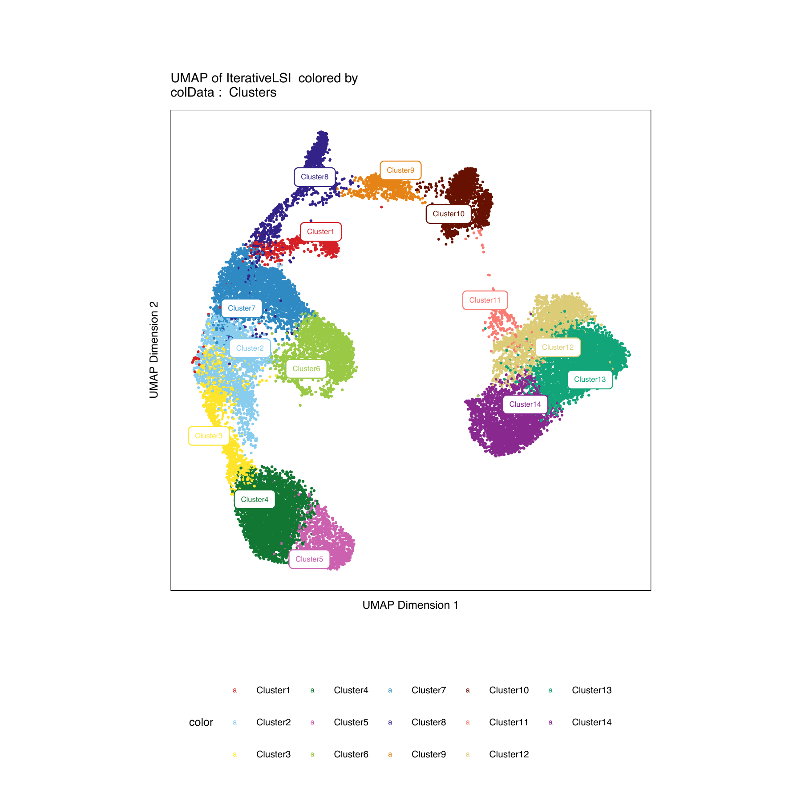
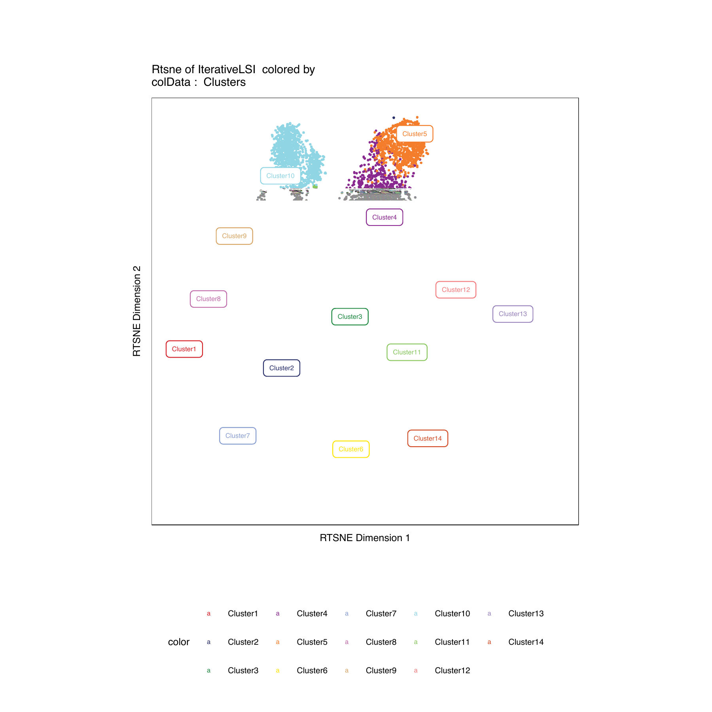
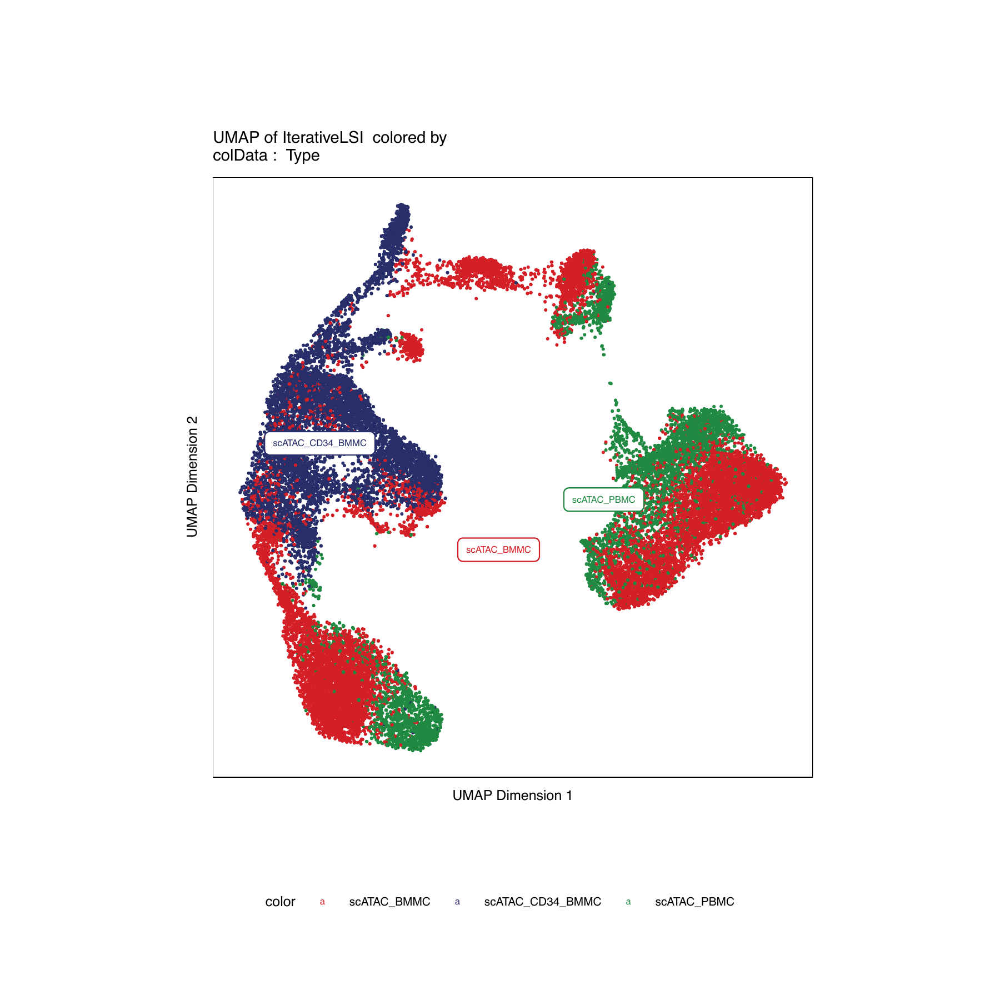
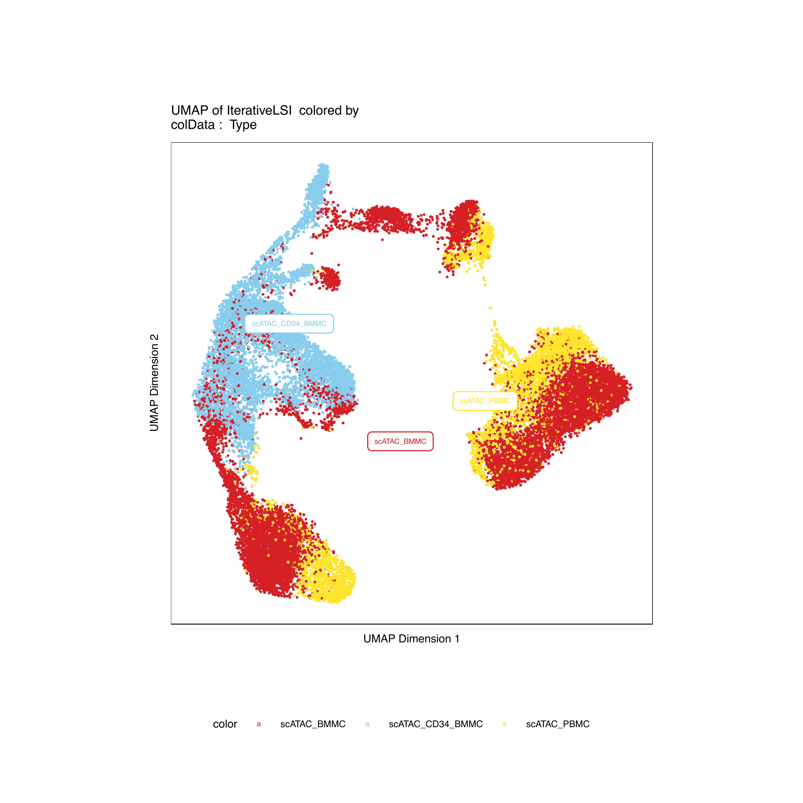

```{r image, include=FALSE}
knitr::include_graphics(
  c()
  )
```

# 1. Dimensionality Reduction {.tabset .tabset-fade .tabset-pills}

At this point, we have an ArchR project that is ready to be used in downstream visualizations and analyses. The first thing we will do is use an iterative latent semantic indexing (LSI) approach to define clusters in our data. Once we have identified clusters in our data, we can plot a UMAP embedding. For more details, see the [dimensionality reduction vignette](articles/Articles/dimReduction.html).

```{r eval=FALSE}
#Reduce Dimensions with Iterative LSI (~5-10 minutes)
proj <- addIterativeLSI(
  ArchRProj = proj, 
  useMatrix = "TileMatrix", 
  reducedDimsOut = "IterativeLSI"
)

#Identify Clusters from Iterative LSI
#By default ArchR uses Seurat's FindClusters function because it is fast/robust producing reasonable clustering.
#The larger the resolution the more clusters will be called. The lower the resolution hte less clusters will be called.
#It is recommended to compare the results from your clusters and your embeddings and find params that best agree across
#both analyses for clarity.
proj <- addClusters(input = proj, reducedDims = "IterativeLSI", resolution = 0.6)

#Compute a UMAP embedding to visualize our tiled accessibility matrix in a 2-d setting.
proj <- addEmbedding(
  ArchRProj = proj, 
  reducedDims = "IterativeLSI", 
  embedding = "UMAP", 
  embeddingParams = list(min_dist = 0.4) #see uwot::umap for alternative params
)

#Plot the UMAP Embedding with Metadata Overlayed such as Experimental Sample and Clusters.
#To change plotting aesthetics see ?plotEmbedding parameters.
plotList <- list()
plotList[[1]] <- plotEmbedding(ArchRProj = proj, colorBy = "colData", name = "Sample")
plotList[[2]] <- plotEmbedding(ArchRProj = proj, colorBy = "colData", name = "Clusters", plotParams = list(labelMeans=TRUE))
#Different ArchRPalette "circus"
plotList[[3]] <- plotEmbedding(ArchRProj = proj, colorBy = "colData", name = "Clusters", discreteSet = "circus", plotParams = list(labelMeans=TRUE))
plotPDF(plotList = plotList, name = "UMAP-Samples-Clusters", width = 6, height = 6, ArchRProj = proj, addDOC = FALSE)
```

***
## UMAP w/ Clusters {.tabset .tabset-fade .tabset-pills}
This [plot](../../images/Tutorial/UMAP-Samples-Clusters.pdf) shows gene experimental samples and clusters described above overlayed onto the UMAP embedding. (Note if you see a blank space below try firefox or safari)

### 1
{width=600 height=600}

### 2
{width=600 height=600}

### 3
{width=600 height=600}

## TSNE w/ Clusters {.tabset .tabset-fade .tabset-pills}
```{r eval=FALSE}
#Compute a TSNE embedding to visualize our tiled accessibility matrix in a 2-d setting.
proj <- addEmbedding(
  ArchRProj = proj, 
  reducedDims = "IterativeLSI", 
  embedding = "Rtsne", 
  embeddingParams = list(perplexity = 50)
  )

#Plot the TSNE Embedding with Metadata Overlayed such as Experimental Sample and Clusters.
#To change plotting aesthetics see ?plotEmbedding parameters.
plotList <- list()
plotList[[1]] <- plotEmbedding(ArchRProj = proj, colorBy = "colData", embedding = "Rtsne", name = "Sample")
plotList[[2]] <- plotEmbedding(ArchRProj = proj, colorBy = "colData", embedding = "Rtsne", name = "Clusters", plotParams = list(labelMeans=TRUE))
#Different ArchRPalette "circus"
plotList[[3]] <- plotEmbedding(ArchRProj = proj, colorBy = "colData", embedding = "Rtsne", name = "Clusters", discreteSet = "circus", plotParams = list(labelMeans=TRUE))
plotPDF(plotList = plotList, name = "TSNE-Samples-Clusters", width = 6, height = 6, ArchRProj = proj, addDOC = FALSE)
```

### 1
{width=600 height=600}

### 2
{width=600 height=600}

### 3
{width=600 height=600}


## UMAP w/ Custom ColData {.tabset .tabset-fade .tabset-pills}
To add your own information for plotting ontop of UMAP embedding we will show an example here.

```{r eval=FALSE}

#Get Cell Names
cellNames <- getCellNames(ArchRProj = proj)

#Get Sample names
sampleNames <- getCellColData(ArchRProj = proj, select = "Sample", drop = TRUE)

#Remove Replicate Name
sampleNames <- gsub("_R1", "", gsub("_R2", "", sampleNames))

#Add Info to cellColData
proj <- addCellColData(ArchRProj = proj, data = sampleNames, cells = cellNames, name = "Type")

#Plot the UMAP Embedding with Metadata Overlayed such as Experimental Sample and Clusters.
#To change plotting aesthetics see ?plotEmbedding parameters.
plotList <- list()
plotList[[1]] <- plotEmbedding(ArchRProj = proj, colorBy = "colData", name = "Type", plotParams = list(labelMeans=TRUE))
plotList[[2]] <- plotEmbedding(ArchRProj = proj, colorBy = "colData", name = "Type", discreteSet = "circus", plotParams = list(labelMeans=TRUE))
plotPDF(plotList = plotList, name = "UMAP-Samples-Type", width = 6, height = 6, ArchRProj = proj, addDOC = FALSE)
```

### 1
{width=600 height=600}

### 2
{width=600 height=600}